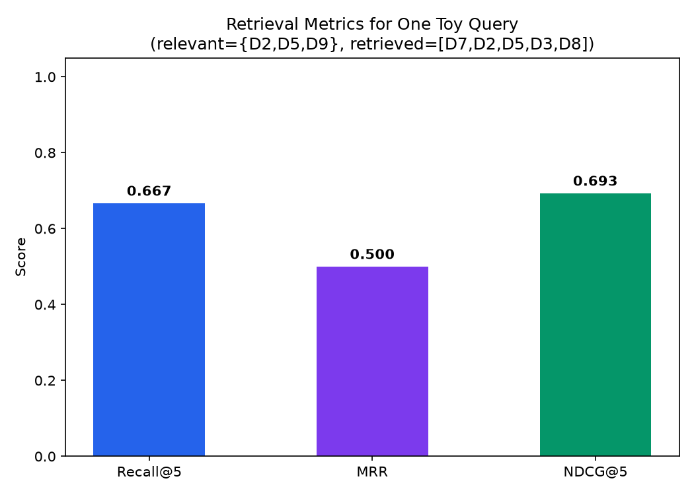

# Module 09: RAG Evaluation, Debugging & Production Hardening

## 1. Introduction & Intuition

### The Core Bottleneck
Every module in this topic so far has covered how to *build* a RAG system's individual stages well. None of that guarantees the *assembled* system actually produces good answers in production, or that when it doesn't, you can tell *why* — a bad final answer could originate from a chunking failure, an embedding mismatch, a retrieval miss, a reranking error, a context-assembly bug, or the generator simply ignoring good context it was given. Without a systematic way to measure quality and isolate which stage failed, debugging a bad production answer degenerates into guesswork across an eight-module-deep pipeline.

### High-Level Intuition
Think of the full RAG pipeline as a relay race with seven runners (query → chunking → embedding → retrieval → reranking → context → generation). When the team loses, "the team is bad" tells you nothing actionable — you need to know *which runner* dropped the baton. This module is about building exactly that: a way to check each stage's handoff independently, plus the metrics and telemetry that make those checks possible in a live system, not just a notebook. **Scope discipline:** this module stays RAG-specific — general LLM-as-judge theory, broader agent evaluation methodology, and general LLMOps observability/monitoring patterns are each owned by their own dedicated topics and are cross-referenced here, not re-taught; everything below is specifically about what's unique to a *retrieval* pipeline.

---

## 2. Core Concepts & Mathematical Formulation

### Retrieval Metrics: Recall@k, MRR, NDCG

#### Purpose & Intuition
Before evaluating the *generated answer*, evaluate *retrieval itself* — did the system find the right documents at all, independent of how well the generator used them. These three metrics are the standard, explicitly "core evaluation statistics" for ranked retrieval: Recall@k asks "did we find the relevant documents at all," MRR asks "how quickly did we find the *first* relevant one," and NDCG asks "how good is the *overall ordering*, rewarding relevant documents ranked higher more than the same documents ranked lower."

#### Mathematical Formulation
For a query with a known relevant-document set, and a ranked list of retrieved documents:
$$\text{Recall@}k = \frac{|\{\text{relevant docs}\} \cap \{\text{top-}k \text{ retrieved}\}|}{|\{\text{relevant docs}\}|}, \qquad \text{MRR} = \frac{1}{\text{rank of first relevant doc}}$$
$$\text{DCG@}k = \sum_{i=1}^{k} \frac{\text{rel}_i}{\log_2(i+1)}, \qquad \text{NDCG@}k = \frac{\text{DCG@}k}{\text{IDCG@}k}$$

### Hand Calculation: Retrieval Metrics for One Toy Query
A query has 3 known relevant documents in the corpus: $\{D_2, D_5, D_9\}$. The system retrieves, ranked: $[D_7, D_2, D_5, D_3, D_8]$ (top 5).

*   **Step 1: Recall@5.** $D_2$ and $D_5$ are in the top 5; $D_9$ is not.
    $$\text{Recall@5} = \frac{2}{3} \approx 0.667$$

*   **Step 2: MRR.** The first relevant document ($D_2$) appears at rank 2.
    $$\text{MRR} = \frac{1}{2} = 0.5$$

*   **Step 3: DCG@5.** Using binary relevance (1 = relevant, 0 = not), the ranked relevance sequence is $[0, 1, 1, 0, 0]$ (positions 1-5: $D_7{=}0, D_2{=}1, D_5{=}1, D_3{=}0, D_8{=}0$):
    $$\text{DCG@5} = \frac{0}{\log_2 2} + \frac{1}{\log_2 3} + \frac{1}{\log_2 4} + \frac{0}{\log_2 5} + \frac{0}{\log_2 6} = 0 + 0.6309 + 0.5 + 0 + 0 = 1.1309$$

*   **Step 4: IDCG@5.** The *ideal* ordering places both relevant documents first: $[1, 1, 0, 0, 0]$:
    $$\text{IDCG@5} = \frac{1}{\log_2 2} + \frac{1}{\log_2 3} = 1.0 + 0.6309 = 1.6309$$

*   **Step 5: NDCG@5.**
    $$\text{NDCG@5} = \frac{1.1309}{1.6309} \approx 0.693$$

This single query already tells a richer story than any one metric alone: recall shows two-thirds of relevant documents were found; MRR shows the first hit took an extra rank to arrive (not disastrous, but not perfect); NDCG shows the ordering is decent but meaningfully below ideal (0.693, not 1.0) — exactly the kind of triangulated signal that motivates using multiple retrieval metrics together rather than any single one.



*   **Plot Interpretation:** All three metrics land in a similar mid-range band (0.5-0.7) for this query, but for different reasons — a quick visual check that no single metric is silently telling a wildly different story than the others for the same underlying ranking.

---

### RAGAS-Style Generation Metrics

#### Intuition & Practical Use
Retrieval metrics only evaluate whether the *right documents* were found — they say nothing about whether the *generated answer* actually used them well. RAGAS-style metrics evaluate the generation side, typically via LLM-as-judge scoring: **faithfulness** (is every claim in the answer actually supported by the retrieved context, or did the model add unsupported claims), **answer relevancy** (does the answer actually address the question asked, not just discuss related content), and **context precision/recall** (of the context that was retrieved, how much was actually relevant/used vs. wasted space). These have no closed-form formula — they're judged by an LLM scoring the (question, context, answer) triple against a rubric, carrying the same LLM-as-judge pitfalls (prompt sensitivity, judge bias) that apply to any LLM-based evaluation, regardless of domain.

---

### RAG Debugging Methodology: Stage Isolation

#### Intuition & Practical Use
When a production answer is wrong, the single highest-leverage question is: **which stage actually failed?** The seven-stage pipeline gives seven distinct, checkable failure points, each with its own diagnostic:

| Stage | Diagnostic check | If this stage failed |
|---|---|---|
| **Query** | Was the query itself ambiguous, malformed, or missing necessary context? | Check raw user input before assuming a downstream stage is at fault |
| **Chunking** | Is the fact that should answer this question even *inside* one chunk, intact (not split across a boundary)? | Manually search the raw corpus for the answer — if it's split across chunks, this is a Module 02 problem |
| **Embedding** | Does the correct chunk's embedding actually land *close* to the query's embedding in vector space? | Directly compute the cosine similarity (Module 03) between the query and the known-correct chunk — if it's low despite obvious relevance, this is an embedding-model/domain-mismatch problem |
| **Retrieval** | Is the right chunk *in the index* and was it retrieved into the Top-K candidate set at all? | If the correct chunk exists and embeds well but still isn't retrieved, check ANN parameters (Module 04 — `efSearch`/`nprobe` set too low) |
| **Reranking** | Was the right chunk retrieved into Top-K, but ranked too low to survive into Top-N/Top-M? | A reranker/fusion tuning problem (Module 05), not a retrieval-coverage problem |
| **Context assembly** | Did the right chunk make it into the final Top-M, but get truncated, or buried in a position the generator tends to ignore ("lost in the middle")? | A context-window/ordering problem, independent of whether retrieval itself was correct |
| **Generation** | Was the right chunk present, intact, and prominent in context — but the generator still produced a wrong or unfaithful answer? | A generation-faithfulness problem (RAGAS's faithfulness metric above), not a retrieval problem at all — the pipeline did its job and the model still got it wrong |

**The methodology's real value is the elimination order**: check each stage from query through generation, and stop at the *first* stage where the diagnostic actually fails — a "retrieval works fine but generation still hallucinated" diagnosis is a completely different fix (prompt/faithfulness tuning) from a "the answer was never even retrieved" diagnosis (chunking or embedding tuning), and conflating them wastes engineering effort fixing the wrong stage.

<div align="center" style="margin: 20px 0; max-width: 100%; overflow-x: auto;">
<svg viewBox="0 0 900 220" width="100%" height="auto" xmlns="http://www.w3.org/2000/svg" style="background-color: #f8fafc; border: 1px solid #e2e8f0; border-radius: 8px; font-family: system-ui, -apple-system, sans-serif;">
  <text x="450" y="20" text-anchor="middle" font-size="13" font-weight="bold" fill="#0f172a">RAG Debugging: Stage-Isolation Flowchart</text>

  <g font-size="9.5">
    <rect x="10" y="45" width="105" height="42" rx="5" fill="#eff6ff" stroke="#3b82f6" stroke-width="1.3"/>
    <text x="62" y="70" text-anchor="middle" fill="#1e3a8a" font-weight="600">Query</text>

    <rect x="130" y="45" width="105" height="42" rx="5" fill="#eff6ff" stroke="#3b82f6" stroke-width="1.3"/>
    <text x="182" y="70" text-anchor="middle" fill="#1e3a8a" font-weight="600">Chunking</text>

    <rect x="250" y="45" width="105" height="42" rx="5" fill="#eff6ff" stroke="#3b82f6" stroke-width="1.3"/>
    <text x="302" y="70" text-anchor="middle" fill="#1e3a8a" font-weight="600">Embedding</text>

    <rect x="370" y="45" width="105" height="42" rx="5" fill="#f5f3ff" stroke="#7c3aed" stroke-width="1.3"/>
    <text x="422" y="70" text-anchor="middle" fill="#5b21b6" font-weight="600">Retrieval</text>

    <rect x="490" y="45" width="105" height="42" rx="5" fill="#f5f3ff" stroke="#7c3aed" stroke-width="1.3"/>
    <text x="542" y="70" text-anchor="middle" fill="#5b21b6" font-weight="600">Reranking</text>

    <rect x="610" y="45" width="120" height="42" rx="5" fill="#ecfdf5" stroke="#059669" stroke-width="1.3"/>
    <text x="670" y="70" text-anchor="middle" fill="#065f46" font-weight="600">Context</text>

    <rect x="745" y="45" width="120" height="42" rx="5" fill="#ecfdf5" stroke="#059669" stroke-width="1.3"/>
    <text x="805" y="70" text-anchor="middle" fill="#065f46" font-weight="600">Generation</text>
  </g>
  <g stroke="#94a3b8" stroke-width="1.4" fill="none" marker-end="url(#arrow09a)">
    <line x1="115" y1="66" x2="128" y2="66"/>
    <line x1="235" y1="66" x2="248" y2="66"/>
    <line x1="355" y1="66" x2="368" y2="66"/>
    <line x1="475" y1="66" x2="488" y2="66"/>
    <line x1="595" y1="66" x2="608" y2="66"/>
    <line x1="730" y1="66" x2="743" y2="66"/>
  </g>
  <defs>
    <marker id="arrow09a" markerWidth="7" markerHeight="7" refX="5" refY="3.5" orient="auto">
      <path d="M0,0 L7,3.5 L0,7 Z" fill="#94a3b8"/>
    </marker>
  </defs>

  <g font-size="8" fill="#991b1b">
    <text x="62" y="110">Malformed/</text>
    <text x="62" y="121">ambiguous?</text>
    <text x="182" y="110">Fact split</text>
    <text x="182" y="121">across chunks?</text>
    <text x="302" y="110">Low cosine sim</text>
    <text x="302" y="121">to correct chunk?</text>
    <text x="422" y="110">Right chunk not</text>
    <text x="422" y="121">in top-K?</text>
    <text x="542" y="110">In top-K but</text>
    <text x="542" y="121">ranked too low?</text>
    <text x="670" y="110">Truncated or</text>
    <text x="670" y="121">"lost in middle"?</text>
    <text x="805" y="110">Present but</text>
    <text x="805" y="121">generator ignored it?</text>
  </g>
  <g stroke="#fca5a5" stroke-width="1" stroke-dasharray="3,2">
    <line x1="62" y1="87" x2="62" y2="103"/>
    <line x1="182" y1="87" x2="182" y2="103"/>
    <line x1="302" y1="87" x2="302" y2="103"/>
    <line x1="422" y1="87" x2="422" y2="103"/>
    <line x1="542" y1="87" x2="542" y2="103"/>
    <line x1="670" y1="87" x2="670" y2="103"/>
    <line x1="805" y1="87" x2="805" y2="103"/>
  </g>

  <text x="450" y="165" text-anchor="middle" font-size="9.5" fill="#334155" font-weight="600">Check stages left-to-right; stop at the FIRST stage whose diagnostic fails.</text>
  <text x="450" y="182" text-anchor="middle" font-size="9" fill="#64748b">A retrieval-stage failure needs a retrieval fix; a generation-stage failure needs a prompting/faithfulness fix -- not the reverse.</text>
</svg>
</div>

---

### Retrieval Observability

#### Intuition & Practical Use
The stage-isolation methodology above is only usable in production if the necessary telemetry is actually being logged — without it, "check whether the right chunk was retrieved" requires reproducing the query by hand after the fact, which is often impossible once user context or corpus state has moved on. Production RAG systems should log, per query:
*   **The query itself** (and any transformed/reformulated version, Module 06) — the starting point for reproducing any downstream diagnostic.
*   **Retrieved document/chunk IDs** — exactly which chunks made it into the candidate set, at every funnel stage (Module 05).
*   **Retrieval scores** and **reranker scores** — not just which documents, but how confidently the system ranked them.
*   **Top-K** (the configured funnel widths actually used for this query — useful when these are dynamically tuned).
*   **Retrieval latency** — per stage, to catch a slow ANN search or an overloaded reranker before it becomes a user-facing problem.
*   **Empty/low-quality-retrieval rate** — queries where nothing (or nothing above a confidence threshold) was retrieved at all, a direct, aggregatable signal of corpus coverage gaps.

This telemetry is what turns the debugging methodology from a manual, reactive exercise into something queryable at scale — "show me every query from the last week where retrieval returned an empty result set" is a direct, answerable question only if empty/low-quality retrieval was actually being logged.

---

### Production Hardening: Caching, Security, Multi-Tenancy & Scaling

#### Intuition & Practical Use
*   **Semantic caching** caches *retrieval results* (or full responses) keyed by semantic similarity of the query, not exact string match — so a rephrased-but-equivalent query can hit a cached result, at the cost of a cache-hit-rate-vs-staleness trade-off (an aggressively-matched cache serves faster but risks returning a stale or subtly-mismatched cached result).
*   **RAG-specific security** includes **prompt injection via retrieved content** (a malicious instruction embedded inside an indexed document, designed to hijack the generator's behavior when that document is retrieved into context — a risk unique to RAG, since the "prompt" now includes untrusted retrieved text, not just the user's own input) and **data leakage across tenants** (a shared index accidentally surfacing one tenant's private documents in another tenant's query results).
*   **Multi-tenant index isolation** is the direct mitigation for that leakage risk — either physically separate indexes per tenant, or a shared index with mandatory, unbypassable tenant-ID filtering enforced at the query layer, not just the application layer.
*   **Production scaling** (sharding a large index across nodes, read replicas for query throughput, explicit cost/latency SLOs per pipeline stage) is the same distributed-systems discipline applied specifically to the retrieval infrastructure, building on Module 04's index-scaling concerns.

---

## 3. Implementation & Reference Code

Below is a self-contained implementation of the Recall@k/MRR/NDCG hand calculation above, plus a minimal stage-isolation diagnostic runner matching the debugging table.

```python
import math
from dataclasses import dataclass
from enum import Enum


def recall_at_k(retrieved: list[str], relevant: set[str], k: int) -> float:
    top_k = set(retrieved[:k])
    return len(top_k & relevant) / len(relevant)


def mrr(retrieved: list[str], relevant: set[str]) -> float:
    for rank, doc_id in enumerate(retrieved, start=1):
        if doc_id in relevant:
            return 1.0 / rank
    return 0.0


def ndcg_at_k(retrieved: list[str], relevant: set[str], k: int) -> float:
    def dcg(ranked_relevances: list[int]) -> float:
        return sum(rel / math.log2(i + 2) for i, rel in enumerate(ranked_relevances))  # i is 0-indexed -> position i+1

    actual_rels = [1 if doc_id in relevant else 0 for doc_id in retrieved[:k]]
    ideal_rels = sorted(actual_rels, reverse=True)
    idcg = dcg(ideal_rels)
    return dcg(actual_rels) / idcg if idcg > 0 else 0.0


class PipelineStage(Enum):
    QUERY = "query"
    CHUNKING = "chunking"
    EMBEDDING = "embedding"
    RETRIEVAL = "retrieval"
    RERANKING = "reranking"
    CONTEXT = "context"
    GENERATION = "generation"


@dataclass
class StageDiagnostic:
    stage: PipelineStage
    passed: bool
    detail: str


def diagnose_pipeline(checks: dict[PipelineStage, bool]) -> StageDiagnostic:
    """Stage-isolation methodology: walk stages in order, stop at the FIRST failure."""
    order = [
        PipelineStage.QUERY, PipelineStage.CHUNKING, PipelineStage.EMBEDDING,
        PipelineStage.RETRIEVAL, PipelineStage.RERANKING, PipelineStage.CONTEXT,
        PipelineStage.GENERATION,
    ]
    for stage in order:
        if not checks.get(stage, True):
            return StageDiagnostic(stage, passed=False, detail=f"First failing stage: {stage.value}")
    return StageDiagnostic(PipelineStage.GENERATION, passed=True, detail="All stages passed")


if __name__ == "__main__":
    # Hand calc verification: relevant={D2,D5,D9}, retrieved=[D7,D2,D5,D3,D8]
    retrieved = ["D7", "D2", "D5", "D3", "D8"]
    relevant = {"D2", "D5", "D9"}

    r_at_5 = recall_at_k(retrieved, relevant, k=5)
    mrr_score = mrr(retrieved, relevant)
    ndcg_5 = ndcg_at_k(retrieved, relevant, k=5)

    print(f"Recall@5: {r_at_5:.4f}")
    print(f"MRR: {mrr_score:.4f}")
    print(f"NDCG@5: {ndcg_5:.4f}")

    assert abs(r_at_5 - 2 / 3) < 1e-6
    assert mrr_score == 0.5
    assert abs(ndcg_5 - 0.693) < 1e-3

    # Stage-isolation diagnostic: retrieval found the chunk, but reranking dropped it too low
    diagnosis = diagnose_pipeline({
        PipelineStage.QUERY: True,
        PipelineStage.CHUNKING: True,
        PipelineStage.EMBEDDING: True,
        PipelineStage.RETRIEVAL: True,
        PipelineStage.RERANKING: False,  # first failure
        PipelineStage.CONTEXT: True,
        PipelineStage.GENERATION: True,
    })
    print(f"\nDiagnosis: {diagnosis.detail}")
    assert diagnosis.stage == PipelineStage.RERANKING and not diagnosis.passed
```

---

## 4. Interview Deep-Dive & System Trade-offs

### 1. Architectural & Production Trade-offs
* **Core Problem Solved:** Measuring whether a RAG system is actually good (not just "seems to work on a few manual tests"), and — when it isn't — isolating which of the pipeline's seven stages is responsible, rather than guessing across the whole system.
* **Why Introduced over Legacy Approaches:** Evaluating only the final generated answer (no retrieval-specific metrics, no stage-level telemetry) conflates retrieval failures with generation failures, leading to fixes aimed at the wrong stage; retrieval metrics plus stage-isolation debugging directly separate the two.
* **Key Failure Modes & Limitations:** Retrieval metrics (Recall@k/MRR/NDCG) require a labeled relevant-document set, which is genuinely expensive to build and maintain at scale; RAGAS-style LLM-as-judge metrics inherit the same prompt-sensitivity and judge-bias pitfalls as any LLM-based evaluation; observability telemetry itself has a real storage/cost overhead at high query volume.

### 2. System Complexity & Scaling
* **Time Complexity (FLOPs):** Retrieval metrics are cheap, closed-form computations, $O(k)$ per query; RAGAS-style metrics require additional LLM-judge calls per evaluated (question, context, answer) triple, a real added cost for evaluation runs (though typically offline/batch, not on the production request path).
* **Space/Memory Footprint:** Retrieval observability telemetry (query, doc IDs, scores, latency per stage) accumulates proportionally to query volume — a genuine, scaling storage cost that needs its own retention/sampling policy at high traffic.
* **Primary Bottleneck Type:** Offline evaluation (Recall@k/NDCG/RAGAS runs) is compute-bound but off the critical path; production observability logging is I/O-bound and must stay cheap enough per-request to not add meaningful latency to the actual user-facing query.
* **Variable Legend:** $k$ = evaluation cutoff rank, $\text{rel}_i$ = binary or graded relevance at rank $i$, DCG/IDCG = (ideal) discounted cumulative gain.

### 3. Production & Scalability
* **Deployment Considerations:** Wire retrieval observability logging in from day one, not retrofitted after a production incident — the stage-isolation methodology is only as good as the telemetry available to run it against; treat semantic cache hit-rate and empty-retrieval-rate as first-class dashboards, not afterthoughts.
*   **Common Interviewer Follow-Up Questions:**
    1.  *Q:* A user reports a wrong answer. Walk me through how you'd debug it.
        *   *A:* Pull the logged query, retrieved doc IDs, and scores for that request (retrieval observability); check the stage-isolation table in order — was the correct chunk even in the index and chunked intact, did it embed close to the query, was it in the retrieved Top-K, did it survive reranking into the final context, and if it was present in context, did the generator actually use it faithfully — stopping at the first stage that fails, since that's the one that needs the fix.
    2.  *Q:* How would you detect a prompt-injection attack embedded in a retrieved document?
        *   *A:* Treat retrieved content as untrusted input, not just the user's own message — apply the same instruction-hijacking detection/sanitization to retrieved text before it enters context, and monitor for anomalous generation behavior (the model suddenly following instructions that don't match the user's actual query) as a runtime signal, since static filtering alone won't catch every injection variant.
