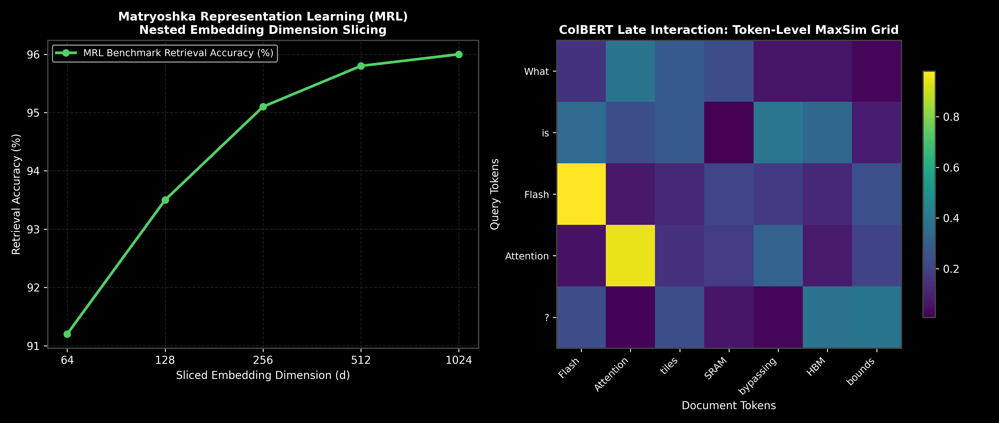

# Dense Embedding Models: InfoNCE, Matryoshka (MRL) & ColBERT

This guide details dense embedding architectures, Contrastive Learning (InfoNCE loss), Matryoshka Representation Learning (MRL), and ColBERT token-level late interaction, complete with loss formulas, step-by-step calculations, PyTorch code, and production trade-offs.

> **Notebook Companion**: [01_embedding_models_infonce_matryoshka_colbert.ipynb](file:///d:/Study/Prep/machine-learning-prep/generative-ai-and-agentic-ai/03_vector_databases_and_embeddings/01_embedding_models_infonce_matryoshka_colbert.ipynb)

---

## 1. Embedding Architecture Evolution

Embedding models project textual sequences into continuous vector spaces $\mathbb{R}^d$ where semantically similar passages sit close together.

```text
Model Architecture     Representation          Computational Bottleneck       Best Suited For
----------------------------------------------------------------------------------------------------------------------
Bi-Encoder (Standard)  Single Vector (e.g. 1536d) Low storage / O(1) lookup   High-throughput initial retrieval
Matryoshka (MRL)       Nested Vectors (64d->1024d) 8x-16x storage reduction   Adaptive multi-stage vector retrieval
ColBERT (Late Inter.)  Multi-Vector (1 per token) High storage / MaxSim grid  High precision fine-grained reranking
```



> [!NOTE]
> **Plot Interpretation & Interview Takeaways:**
> - **What is shown:** Left: Matryoshka (MRL) accuracy vs. sliced embedding dimension ($64\text{d} \to 1024\text{d}$). Right: ColBERT token-level MaxSim similarity grid.
> - **Key Systems Insight:** Standard embeddings waste storage by storing full 1536d vectors for every chunk. Matryoshka Representation Learning (MRL) trains the loss across nested slices ($64\text{d}, 128\text{d}, 256\text{d}, 512\text{d}$), retaining $95\%+$ benchmark accuracy while truncating vector dimensions by $8\text{x}$. ColBERT delays query-document interaction until the final layer by scoring token-to-token MaxSim intersections ($\sum_{i} \max_{j} s_{i,j}$).
> - **Interview Application:** When asked *"How do you reduce vector DB storage costs by 80% without retraining your embedding model?"*, cite Matryoshka (MRL) dimension slicing.

---

## 2. Mathematical Formulation & Hand Calculation (Andrew Ng Style)

- **InfoNCE Contrastive Loss:**
  $$\mathcal{L}_{\text{InfoNCE}} = -\log \frac{\exp(\text{sim}(q, k^+) / \tau)}{\exp(\text{sim}(q, k^+) / \tau) + \sum_{i=1}^{N-1} \exp(\text{sim}(q, k_i^-) / \tau)}$$

- **ColBERT Late Interaction Score:**
  $$S_{\text{ColBERT}}(Q, D) = \sum_{i \in |Q|} \max_{j \in |D|} \left( E_{q,i} \cdot E_{d,j}^T \right)$$

### Step-by-Step Hand Calculation on ColBERT MaxSim (3 Query Tokens x 3 Doc Tokens):

Let query token vectors $E_q = [q_1, q_2]$ and document token vectors $E_d = [d_1, d_2, d_3]$.
Suppose calculated dot product matrix $M = E_q \cdot E_d^T$ is:

```text
Query Token \ Doc Token    d_1        d_2        d_3
-------------------------------------------------------
q_1 ("Flash")              0.95       0.20       0.10
q_2 ("Attention")          0.15       0.92       0.30
```

1. **Find Maximum Similarity for Token $q_1$:**
   $$\max_{j} (M_{1,j}) = \max(0.95, 0.20, 0.10) = \mathbf{0.95} \ (d_1 = \text{"Flash"})$$

2. **Find Maximum Similarity for Token $q_2$:**
   $$\max_{j} (M_{2,j}) = \max(0.15, 0.92, 0.30) = \mathbf{0.92} \ (d_2 = \text{"Attention"})$$

3. **Sum Token MaxSim Scores:**
   $$S_{\text{ColBERT}}(Q, D) = 0.95 + 0.92 = \mathbf{1.87}$$

---

## 3. Production PyTorch Implementation

```python
import torch
import torch.nn as nn
import torch.nn.functional as F

class PyTorchInfoNCELoss(nn.Module):
    def __init__(self, temperature: float = 0.07):
        super().__init__()
        self.temperature = temperature

    def forward(self, q_emb: torch.Tensor, k_emb: torch.Tensor) -> torch.Tensor:
        q_norm = F.normalize(q_emb, p=2, dim=-1)
        k_norm = F.normalize(k_emb, p=2, dim=-1)
        logits = torch.matmul(q_norm, k_norm.T) / self.temperature
        labels = torch.arange(logits.size(0), device=logits.device)
        return F.cross_entropy(logits, labels)

# Execution Demonstration
q = torch.randn(4, 128)
k = q + torch.randn(4, 128) * 0.1
loss = PyTorchInfoNCELoss()(q, k)
print(f"InfoNCE Loss Value: {loss.item():.4f}")
```

---

## 4. Production Failure Modes & Trade-offs

- **ColBERT Storage Overhead**: Storing 128d vectors for *every token* in a 10M document corpus consumes $50\text{x} - 100\text{x}$ more memory than single-vector embedding models.
- **InfoNCE Temperature Hyperparameter**: Setting temperature $\tau$ too low causes gradient explosion; setting $\tau$ too high results in uniform, uninformative embedding distributions.
