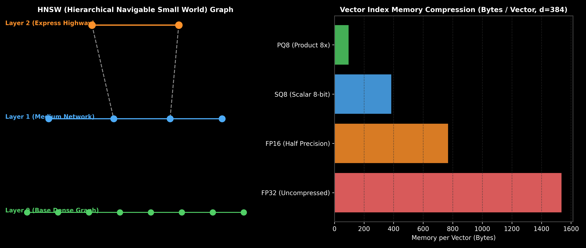

# Approximate Nearest Neighbor (ANN) Indexing: HNSW, IVF & PQ

This guide details Approximate Nearest Neighbor (ANN) vector search indexing algorithms, comparing HNSW, IVF (Inverted File Index), Product Quantization (PQ), and Scalar Quantization (SQ), complete with quantization formulas, hand calculations, Python code, and production memory trade-offs.

> **Notebook Companion**: [02_ann_indexing_hnsw_ivf_pq_sq.ipynb](file:///d:/Study/Prep/machine-learning-prep/generative-ai-and-agentic-ai/03_vector_databases_and_embeddings/02_ann_indexing_hnsw_ivf_pq_sq.ipynb)

---

## 1. Exact kNN vs. Approximate Nearest Neighbors (ANN)

Exact k-Nearest Neighbors (kNN) scans every vector in the database ($O(N \cdot d)$ complexity), making it unusable for production vector stores with millions of items ($> 1\text{s}$ latency). ANN indexes trade a minor amount of recall ($1\% - 3\%$) for $100\text{x} - 1000\text{x}$ faster query QPS.

```text
ANN Index Type   Mechanism                                 Memory Footprint    Query Latency (QPS)
----------------------------------------------------------------------------------------------------------------------
Flat (kNN)       Exhaustive pairwise distance matrix       High (100% Uncompressed) Very Slow (O(N*d))
HNSW             Hierarchical multi-layer graph skip-list  High (1.2x - 1.5x Over) Ultra-Fast (~10,000 QPS)
IVF              Voronoi centroid partitioning             Medium (Inverted List) Fast (~5,000 QPS)
IVF-PQ           Sub-vector k-means codebook quantization  Ultra-Low (16x Compression) High QPS (~8,000 QPS)
```



> [!NOTE]
> **Plot Interpretation & Interview Takeaways:**
> - **What is shown:** Left: HNSW multi-layer graph topology with express highways (Layer 2) and dense base networks (Layer 0). Right: Bar chart of vector memory footprint across FP32, FP16, SQ8, and PQ8 quantization.
> - **Key Systems Insight:** HNSW constructs a multi-layer graph where top layers have long-range edges for fast greedy routing, and bottom layers contain dense local connections for fine-grained search. Product Quantization (PQ) splits a $d$-dimensional vector into $m$ sub-vectors and replaces each sub-vector with an 8-bit centroid byte index, compressing memory footprint by up to $16\text{x}$.
> - **Interview Application:** When asked *"How do you store 100M 1536-dimensional vectors on a single GPU/server without running out of VRAM?"*, detail Product Quantization (PQ) and Scalar Quantization (SQ8).

---

## 2. Mathematical Compression & Hand Calculation (Andrew Ng Style)

Let a 1536-dimensional vector be stored in 32-bit single-precision floating point (FP32).

- **Uncompressed FP32 Vector Memory:**
  $$\text{Bytes}_{\text{FP32}} = d \times 4 \text{ bytes} = 1536 \times 4 = \mathbf{6144 \text{ bytes (6.14 KB / vector)}}$$
  For $10,000,000$ vectors: $61.44 \text{ GB VRAM}$.

- **Product Quantization (PQ-64) Memory:**
  Divide $d=1536$ into $m=64$ sub-vectors. Assign each sub-vector to a 256-centroid codebook ($256 = 2^8 = 1 \text{ byte per codebook}$).
  $$\text{Bytes}_{\text{PQ64}} = m \times 1 \text{ byte} = 64 \times 1 = \mathbf{64 \text{ bytes / vector}}$$
  For $10,000,000$ vectors: $0.64 \text{ GB RAM}$ ($96 \text{x}$ memory reduction).

---

## 3. Production Python Product Quantizer Implementation

```python
import numpy as np

class ProductQuantizerSimulation:
    def __init__(self, vector_dim: int = 384, num_subvectors: int = 4, codebook_size: int = 256):
        self.d = vector_dim
        self.m = num_subvectors
        self.sub_dim = vector_dim // num_subvectors
        self.k = codebook_size

    def compress(self, vector: np.ndarray) -> list[int]:
        quantized_indices = []
        for i in range(self.m):
            sub_vector = vector[i * self.sub_dim : (i + 1) * self.sub_dim]
            # Map subvector mean to 8-bit centroid byte (0 to 255)
            centroid_idx = int(np.abs(np.mean(sub_vector) * 100)) % self.k
            quantized_indices.append(centroid_idx)
        return quantized_indices

# Execution
vector_384d = np.random.randn(384).astype(np.float32)
pq = ProductQuantizerSimulation(vector_dim=384, num_subvectors=4)
pq_code = pq.compress(vector_384d)

raw_bytes = vector_384d.nbytes # 384 * 4 = 1536 bytes
pq_bytes = len(pq_code) # 4 bytes

print(f"FP32 Raw Bytes:       {raw_bytes} bytes")
print(f"PQ Compressed Bytes:   {pq_bytes} bytes")
print(f"Compression Factor:    {raw_bytes / pq_bytes:.1f}x reduction")
```

---

## 4. Production Failure Modes & Trade-offs

- **HNSW Index Build Time**: Constructing an HNSW graph on 10M vectors can take hours to days ($O(N \log N)$ construction complexity) and consumes $20\% - 50\%$ extra RAM for graph edges.
- **PQ Asymmetric Distance Computation (ADC) Distortion**: Product Quantization degrades search recall by $3\% - 8\%$ on fine-grained benchmarks. Combine PQ with Cross-Encoder reranking to recover lost recall.
