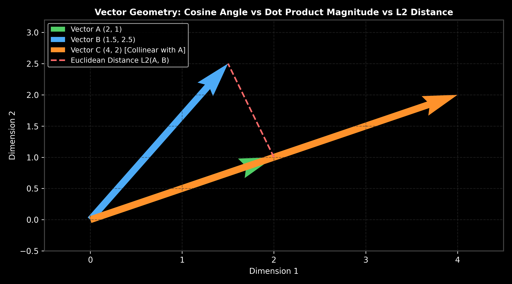

# Vector Similarity Metrics: Cosine, Dot Product & $L_2$

This guide details vector similarity metrics, comparing Cosine Similarity, Dot Product (Inner Product), and Euclidean Distance ($L_2$), proving their geometric equivalence under unit normalization, complete with hand calculations, Python code, and production selection rules.

> **Notebook Companion**: [03_similarity_metrics_cosine_dot_l2.ipynb](file:///d:/Study/Prep/machine-learning-prep/generative-ai-and-agentic-ai/03_vector_databases_and_embeddings/03_similarity_metrics_cosine_dot_l2.ipynb)

---

## 1. Vector Space Geometry Overview

Choosing the correct similarity metric is fundamental when configuring vector databases (Qdrant, Pinecone, Pgvector).

```text
Metric Name            Mathematical Range      Considers Vector Magnitude?   Unit Normalization Behavior
----------------------------------------------------------------------------------------------------------------------
Cosine Similarity      [-1.0, +1.0]            No (Angle only)              Identical to Dot Product
Dot (Inner) Product    [-inf, +inf]            Yes (Angle + Magnitude)      Fastest on hardware (no division)
Euclidean Distance L2  [0, +inf]               Yes (Geometric Distance)     Monotonic inverse of Cosine Similarity
```



> [!NOTE]
> **Plot Interpretation & Interview Takeaways:**
> - **What is shown:** Vector geometry diagram showing vectors $A$, $B$, and collinear vector $C$, along with the Euclidean $L_2(A, B)$ line segment.
> - **Key Mathematical Insight:** For normalized vectors where $\|u\| = \|v\| = 1.0$, the $L_2$ squared distance maps directly to Cosine Similarity: $\|u - v\|^2 = 2 - 2 \cos(\theta)$. Thus, under unit normalization, sorting by Cosine Similarity, Dot Product, or $L_2$ distance yields **identical document rankings**.
> - **Interview Application:** When asked *"Which similarity metric is fastest for production vector search?"*, state Dot Product on $L_2$-normalized vectors, because it eliminates division operations during inner loops.

---

## 2. Mathematical Proof & Hand Calculation (Andrew Ng Style)

Let $u, v \in \mathbb{R}^d$ be $L_2$-normalized vectors such that $\|u\|_2 = 1.0$ and $\|v\|_2 = 1.0$.

$$\|u - v\|_2^2 = (u - v) \cdot (u - v) = \|u\|^2 + \|v\|^2 - 2 (u \cdot v) = 1 + 1 - 2(u \cdot v) = 2 - 2 \cos(\theta)$$

### Step-by-Step Hand Calculation on 2D Vectors:

Let vector $A = \begin{bmatrix} 0.6 \\ 0.8 \end{bmatrix}$ and vector $B = \begin{bmatrix} 0.8 \\ 0.6 \end{bmatrix}$ (Both unit normalized: $\|A\| = \sqrt{0.36 + 0.64} = 1.0$).

1. **Calculate Dot Product:**
   $$A \cdot B = (0.6)(0.8) + (0.8)(0.6) = 0.48 + 0.48 = \mathbf{0.96}$$

2. **Calculate Cosine Similarity:**
   $$\text{cos\_sim}(A, B) = \frac{A \cdot B}{\|A\| \|B\|} = \frac{0.96}{(1.0)(1.0)} = \mathbf{0.96}$$

3. **Calculate Squared Euclidean Distance ($L_2^2$):**
   $$L_2^2(A, B) = 2 - 2(A \cdot B) = 2 - 2(0.96) = 2 - 1.92 = \mathbf{0.08}$$

4. **Verify Direct Euclidean Distance ($L_2$):**
   $$L_2(A, B) = \sqrt{(0.6 - 0.8)^2 + (0.8 - 0.6)^2} = \sqrt{(-0.2)^2 + (0.2)^2} = \sqrt{0.04 + 0.04} = \sqrt{0.08} \approx \mathbf{0.2828}$$

---

## 3. Production Python Implementation

```python
import numpy as np

def cosine_similarity(a: np.ndarray, b: np.ndarray) -> float:
    return float(np.dot(a, b) / (np.linalg.norm(a) * np.linalg.norm(b)))

def dot_product(a: np.ndarray, b: np.ndarray) -> float:
    return float(np.dot(a, b))

def euclidean_distance_l2(a: np.ndarray, b: np.ndarray) -> float:
    return float(np.linalg.norm(a - b))

# Execution
v1 = np.array([0.6, 0.8])
v2 = np.array([0.8, 0.6])

print(f"Cosine Similarity:  {cosine_similarity(v1, v2):.4f}")
print(f"Dot Product:        {dot_product(v1, v2):.4f}")
print(f"Euclidean L2 Dist:  {euclidean_distance_l2(v1, v2):.4f}")
```

---

## 4. Production Selection & Failure Modes

- **Unnormalized Embedding Trap**: If an embedding model outputs unnormalized vectors (e.g. OpenAI `text-embedding-3` vs older custom models), using Dot Product without prior $L_2$ normalization will heavily bias retrieval toward longer document chunks with higher magnitude.
