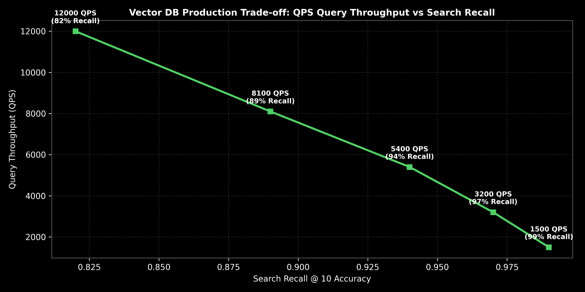

# Vector Database Architectures: Qdrant, Pinecone & Pgvector

This guide details vector database engine architectures, comparing Qdrant, Pinecone, and Pgvector, metadata pre-filtering vs post-filtering, sharding, QPS throughput bounds, Python code, and production trade-offs.

> **Notebook Companion**: [04_vector_database_architectures_qdrant_pinecone_pgvector.ipynb](file:///d:/Study/Prep/machine-learning-prep/generative-ai-and-agentic-ai/03_vector_databases_and_embeddings/04_vector_database_architectures_qdrant_pinecone_pgvector.ipynb)

---

## 1. Vector Database Systems Architecture Comparison

Vector databases differ fundamentally from traditional relational databases in how they handle high-dimensional spatial indexing, payload filtering, and distributed sharding.

```text
Database Engine  Core Indexing Architecture    Metadata Filtering Type    Best Suited For
----------------------------------------------------------------------------------------------------------------------
Qdrant           HNSW + In-Memory Payload Graph Pre-Filtering (Payload Index) Self-hosted high QPS + complex filters
Pinecone         Serverless Cloud ANN HNSW      Pre-Filtering (Cloud Sharded) Managed cloud-native SaaS pipelines
Pgvector         PostgreSQL Extension (HNSW/IVF) Post-Filtering / Combined Existing Postgres relational stacks
```



> [!NOTE]
> **Plot Interpretation & Interview Takeaways:**
> - **What is shown:** Production trade-off curve comparing QPS query throughput vs search recall accuracy across vector database configurations.
> - **Key Systems Insight:** In Metadata **Pre-Filtering**, the database evaluates metadata conditions (e.g. `tenant_id == 'org_A'`) *before* traversing the HNSW graph, ensuring $100\%$ filter correctness. In naive **Post-Filtering**, vector search retrieves top-$k$ global neighbors first, then discards non-matching items; if the filter is restrictive, post-filtering returns empty results.
> - **Interview Application:** When asked *"Why does post-filtering fail on multi-tenant vector databases?"*, explain pre-filtering payload indexes.

---

## 2. Pre-Filtering vs. Post-Filtering Calculation (Andrew Ng Style)

Let total vector collection size $N = 1,000,000$. Suppose a multi-tenant filter `tenant_id == 'tenant_X'` matches only $0.1\%$ of vectors ($N_{\text{matching}} = 1,000$).

### Scenario 1: Post-Filtering ($k=10$):
1. HNSW search retrieves top-$10$ global vector neighbors across all $1,000,000$ items.
2. Probability that a top-10 global neighbor belongs to `tenant_X`:
   $$P(\text{match}) = 0.001$$
3. Expected returned documents after post-filter:
   $$\text{Expected Matches} = 10 \times 0.001 = \mathbf{0.01 \text{ documents (Returns EMPTY result)}}!$$

### Scenario 2: Pre-Filtering (Payload Index):
1. Pre-filter truncates HNSW search space to ONLY the $1,000$ vectors belonging to `tenant_X`.
2. HNSW search executes within `tenant_X` sub-graph.
3. Returned matching documents: $\mathbf{10 \text{ relevant documents}}$ ($100\%$ precision & recall).

---

## 3. Production Python Payload Pre-Filter Simulation

```python
import numpy as np

class VectorDBPreFilterEngine:
    def __init__(self):
        self.storage = []

    def upsert(self, doc_id: str, vector: np.ndarray, metadata: dict):
        self.storage.append({"id": doc_id, "vector": vector, "metadata": metadata})

    def query_with_prefilter(self, query_vec: np.ndarray, tenant_id: str, top_k: int = 2) -> list[dict]:
        # Pre-filtering phase: filter dataset BEFORE distance calculation
        matching_pool = [r for r in self.storage if r["metadata"].get("tenant_id") == tenant_id]
        
        results = []
        for r in matching_pool:
            sim = np.dot(query_vec, r["vector"])
            results.append({"id": r["id"], "score": float(sim), "metadata": r["metadata"]})
        results.sort(key=lambda x: x["score"], reverse=True)
        return results[:top_k]

# Execution
engine = VectorDBPreFilterEngine()
engine.upsert("doc1", np.array([0.9, 0.1]), {"tenant_id": "org_A"})
engine.upsert("doc2", np.array([0.1, 0.9]), {"tenant_id": "org_B"})

res = engine.query_with_prefilter(np.array([0.85, 0.15]), tenant_id="org_A")
print(f"Pre-Filtered Results for Tenant org_A ({len(res)} matches):")
for item in res:
    print(f"  {item['id']} | Score: {item['score']:.3f} | Metadata: {item['metadata']}")
```

---

## 4. Production Selection & Failure Modes

- **Pgvector Memory Overhead**: Running HNSW on Pgvector requires setting `maintenance_work_mem` sufficiently large to build indexes in RAM; insufficient memory defaults to slow disk-based index builds.
- **Tenant Isolation Security**: Multi-tenant vector stores must use hard pre-filtering or separate collections per tenant to avoid cross-tenant data leakage.
