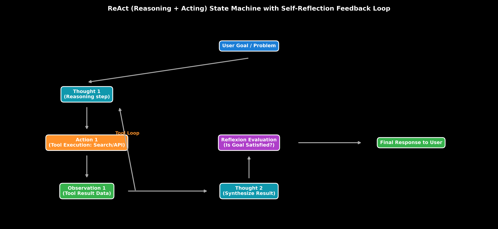

# Agentic AI Architectures: ReAct, Plan-and-Solve & Self-Reflection

This guide details Agentic AI decision architectures, comparing ReAct (Reasoning + Acting), Plan-and-Solve decomposition, and Self-Reflection (Reflexion), complete with state machine trajectories, step-by-step calculations, Python code, and production failure modes.

> **Notebook Companion**: [01_agent_architectures_react_plan_solve_reflection.ipynb](file:///d:/Study/Prep/machine-learning-prep/generative-ai-and-agentic-ai/04_agentic_ai_and_multi_agent_frameworks/01_agent_architectures_react_plan_solve_reflection.ipynb)

---

## 1. Autonomous Agent Decision Paradigms

Agentic AI extends passive LLMs into autonomous decision-making loops by interleaving reasoning steps ("Thoughts") with environmental tool execution ("Actions") and feedback evaluation ("Observations").

```text
Agent Pattern     Decision Cycle Structure                  Primary Benefit                 Best Suited For
----------------------------------------------------------------------------------------------------------------------
ReAct             Thought -> Action -> Observation Loop     Dynamic error recovery          Interactive API/Search queries
Plan-and-Solve    Plan Generation -> Sub-goal Execution     High-level goal decomposition  Complex multi-step tasks
Reflexion         Trajectory Evaluation -> Memory Reflection Prevents repeated failure loops Coding & self-debugging
```



> [!NOTE]
> **Plot Interpretation & Interview Takeaways:**
> - **What is shown:** ReAct state machine trajectory displaying the interleaving of Thought $\rightarrow$ Action $\rightarrow$ Observation steps, reinforced by a Reflexion self-evaluator feedback loop.
> - **Key Systems Insight:** Standard single-shot prompts fail when tool calls output unexpected data or errors. ReAct enables the agent to observe tool outputs dynamically and re-plan its next thought. Reflexion adds an explicit self-evaluation node ($S_{\text{eval}} \in [0, 1]$) that logs failures into working memory to prevent infinite looping.
> - **Interview Application:** When asked *"How do you build autonomous AI agents that recover from API failure errors?"*, detail the ReAct state machine loop and Reflexion memory buffer.

---

## 2. Mathematical Formulation & Hand Calculation (Andrew Ng Style)

Let a ReAct agent trajectory at step $t$ be $T_t = (m_0, a_1, o_1, m_1, a_2, o_2, \dots, m_t)$, where $m_t$ is thought/reasoning, $a_t$ is action tool call, and $o_t$ is environment observation.

The expected success probability over a $K$-step trajectory with error recovery rate $p_{\text{recover}}$ is:

$$P(\text{Success}) = 1 - (1 - p_{\text{single}})(1 - p_{\text{recover}})^K$$

### Step-by-Step Hand Calculation on a 3-Step ReAct Trajectory:

Suppose an agent is tasked with fetching financial metrics for Nvidia. Single-shot tool success rate $p_{\text{single}} = 0.60$, and error recovery rate $p_{\text{recover}} = 0.75$.

1. **Step 1 (First Action Attempt):**
   - Action 1: `search_db("NVDA revenue Q3")` $\implies$ Observation 1: *"API Timeout Error (504)"* (Failed attempt).

2. **Step 2 (ReAct Thought & Recovery Action):**
   - ReAct Thought 2: *"Action 1 timed out. I will switch fallback tool to web_search."*
   - Action 2: `web_search("NVDA revenue Q3 2026")` $\implies$ Observation 2: *"$18.1B Revenue"* (Successful recovery).

3. **Compute Overall Trajectory Success Probability:**
   $$P(\text{Success}) = 1 - (1 - 0.60)(1 - 0.75)^1 = 1 - (0.40)(0.25) = 1 - 0.10 = \mathbf{0.90 \ (90\%)}$$

**Systems Insight:** ReAct error recovery boosts task success rate from $60\%$ to $90\%$.

---

## 3. Production Python ReAct Loop Implementation

```python
class ReActAgentLoop:
    def __init__(self, tools: dict):
        self.tools = tools
        self.trajectory = []

    def run_step(self, thought: str, tool_name: str, tool_input: str) -> str:
        self.trajectory.append(f"Thought: {thought}")
        self.trajectory.append(f"Action: {tool_name}({tool_input})")
        
        if tool_name in self.tools:
            try:
                obs = self.tools[tool_name](tool_input)
            except Exception as e:
                obs = f"Execution Error: {str(e)}"
        else:
            obs = f"Error: Tool '{tool_name}' missing."
            
        self.trajectory.append(f"Observation: {obs}")
        return obs

# Execution
def mock_search(q: str) -> str:
    return "FlashAttention reduces HBM memory traffic by tiling attention matrices into SRAM."

agent = ReActAgentLoop(tools={"search": mock_search})
agent.run_step("Need FlashAttention SRAM mechanics", "search", "FlashAttention SRAM")

print("ReAct Agent Trajectory Log:")
for line in agent.trajectory:
    print(f"  {line}")
```

---

## 4. Production Failure Modes & Trade-offs

- **Infinite ReAct Loops**: If an agent gets stuck repeating the same failing tool call, it will exhaust API context limits. Enforce strict max-iteration limits ($\text{Max\_Steps} \le 8$).
- **Tool Hallucination**: Agents may invoke non-existent tools or hallucinate invalid arguments. Mandate Pydantic JSON Schema validation on all tool output schemas.
