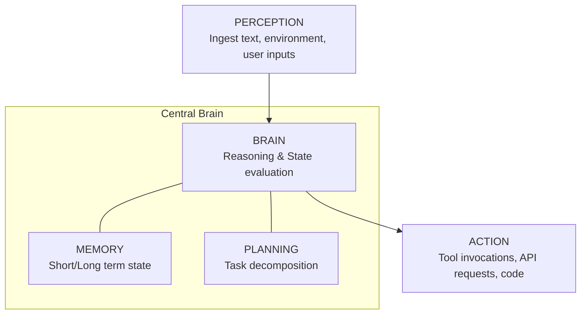
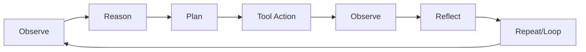

# Module 02: Agent Architecture & Execution Loop

This module details the cognitive architecture of autonomous agents and explains the core execution loop that drives environmental perception, action selection, observation parsing, and reflection.

> **Notebook Companion**: `02_agent_architecture_execution_loop.ipynb`

---

## 1. Core Agent Components

An autonomous agent architecture integrates four distinct architectural pillars:

1. **Perception (Sensors)**: Ingests external stimuli—raw user prompts, execution results, error logs, or environment signals—and formats them into LLM context tokens.
2. **Brain (LLM Reasoning Central)**: The core LLM which reads history, assesses state, and decides what to do next.
3. **Memory**: Persistence engine tracking the conversation buffer (short-term) and semantic retrievals (long-term).
4. **Planning**: Methodologies used to break a massive goal into a sequence of actionable steps.
5. **Action (Actuators)**: Calling APIs, reading/writing local files, executing database queries, or generating code.

---

## 2. The Core Execution Loop

Instead of modeling agents via complex mathematical state-transition matrices, real-world systems are built around a continuous, dynamic execution loop:

### Execution Loop Phases:
1. **Observe**: Capture current environment status (e.g. read the last tool's output or user prompt).
2. **Reason**: Synthesize the observations against the target goal.
3. **Plan**: Adjust the remaining task queue dynamically.
4. **Tool Action**: Call the chosen tool with structured JSON parameters.
5. **Observe**: Read the API return code or text stdout.
6. **Reflect**: Assess if the output successfully resolved the step, and whether the final goal is met.
7. **Repeat / Terminate**: Loop back to Step 1 or return final outputs to the user.

---

## 3. Comparison of Core Architectural Patterns

| Architectural Pattern | Decision Mechanism | Path Flexibility | Latency Profile | Best Production Use Case |
|---|---|---|---|---|
| **Linear Chain** | Pre-coded routing | Zero flexibility (static) | Low latency ($<2\text{s}$) | Data ingestion & preprocessing |
| **Router Agent** | Single classifier check | Low flexibility (branches) | Moderate latency ($2 - 4\text{s}$) | Simple intent triage & dispatch |
| **ReAct Loop** | Dynamic token iteration | Full flexibility (any path) | High latency ($5 - 20\text{s}$) | Troubleshooting & complex research |
| **Supervisor Multi-Agent** | Central dispatcher route | Maximum flexibility | Very high latency ($10 - 60\text{s}$)| Complex multi-team workflows |

---

## 4. Detailed Computational Complexity (Time & Memory)

- **Loop Execution Time**: $O(T \cdot (P \cdot d + d^2))$ operations per iteration step.
- **Active State Storage RAM**: $O(N_s + N_h)$ context bytes to preserve loop history.
- **Component Denotations**:
  - $T$: Maximum iteration steps allowed in the execution loop before runtime timeout.
  - $P$: Count of parameters defined in the agent's tool execution schema.
  - $d$: Underlying model projection vector dimension.
  - $N_s$: Number of bytes used to store the current system state fields.
  - $N_h$: Number of bytes in the historical dialogue context window.

---

## 5. Interview Questions & Production Trade-offs

### What problem does this solve?
Traditional APIs run static path code. The agent execution loop allows models to dynamically decide execution paths step-by-step, adapting to unexpected failures.

### Why was it introduced?
To allow systems to interact with non-deterministic external environments (where database structures, APIs, or user responses change dynamically at runtime).

### What are its limitations?
- **Infinite Loop Risks**: If a tool returns a silent error, the agent may call it repeatedly without progress.
- **State Drift**: As history grows, the model may forget the initial goal, drifting into unrelated loops.

### Production Use Cases:
- Web scraping bots that dynamically adapt to anti-bot challenges or schema changes.
- Automated code generators running compiles, parsing tracebacks, rewriting functions, and re-running compiler checks.

### Follow-up Questions Interviewers Ask:
1. *How do you prevent an agent execution loop from entering an infinite recurse loop when a tool returns an error?*
   - **Answer**: Enforce two system constraints: a hard loop iteration limit ($T_{max} \le 5 - 10$) and tool-specific error counters. If a tool fails 3 times consecutively, force the loop to exit and escalate to Human-in-the-Loop.
2. *Where do you store agent state in a distributed production environment?*
   - **Answer**: Store state in a fast key-value store like Redis (or a document database like PostgreSQL/MongoDB) indexed by `session_id`. Never persist state in local memory inside application server processes to allow stateless scale-out of agent worker nodes.
