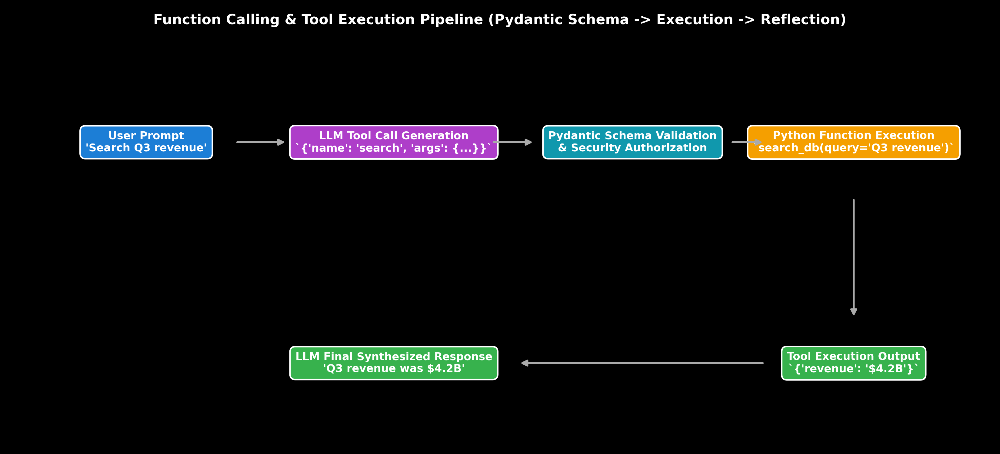

# Tool Calling & Pydantic Function Schema Binding

This guide details Tool Calling mechanisms, Pydantic Schema function binding, JSON Schema validation, security authorization sandboxing, LangChain `@tool` decorators, Python code, and production failure modes.

> **Notebook Companion**: [02_tool_calling_function_binding_schema.ipynb](file:///d:/Study/Prep/machine-learning-prep/generative-ai-and-agentic-ai/04_agentic_ai_and_multi_agent_frameworks/02_tool_calling_function_binding_schema.ipynb)

---

## 1. Function Calling & Tool Binding Pipeline

Tool Calling allows Large Language Models to interface safely with external APIs, databases, and Python code by generating structured JSON payloads that conform to explicit JSON Schemas.

```text
Pipeline Stage        Responsible Component        Action / Purpose
----------------------------------------------------------------------------------------------------------------------
1. Tool Definition    Pydantic Schema / @tool      Defines typed parameters, required fields, and docstrings
2. Schema Injection   LangChain / OpenAI SDK       Injects JSON Schema into system prompt / API tool definition
3. Tool Call Intent   LLM Generation               Outputs structured `tool_calls` JSON payload
4. Schema Validation  Pydantic Validator           Enforces type checking & catches missing required parameters
5. Function Execution Python Executor / Sandbox   Executes native function & returns observation string
```



> [!NOTE]
> **Plot Interpretation & Interview Takeaways:**
> - **What is shown:** End-to-end Tool Calling execution pipeline showing User Prompt $\rightarrow$ LLM Tool Call Generation $\rightarrow$ Pydantic Schema Validation $\rightarrow$ Function Execution $\rightarrow$ Final LLM Response.
> - **Key Systems Insight:** LLMs do not execute code directly; they generate structured JSON objects matching function signatures. Pydantic schema validation acts as a security firewall, rejecting malformed types or injected malicious parameters before python function execution.
> - **Interview Application:** When asked *"How do you prevent SQL injection or malicious code execution via LLM Tool Calling?"*, explain Pydantic Schema validation, argument sanitization, and sandboxed execution.

---

## 2. Pydantic Schema Calculation & Validation (Andrew Ng Style)

Let a tool schema require `ticker: str` and `limit: int` (where $1 \le \text{limit} \le 100$).

### Validation Cases:

1. **Valid LLM Output:** `{"ticker": "NVDA", "limit": 10}`
   - Type Check: `NVDA` $\in \text{str}$, $10 \in \text{int}$ ($1 \le 10 \le 100$) $\implies \mathbf{\text{PASS}}$

2. **Invalid Type LLM Output:** `{"ticker": "NVDA", "limit": "ten"}`
   - Type Check: `"ten"` $\notin \text{int} \implies \mathbf{\text{PYDANTIC VALIDATION ERROR}}$
   - System Action: Feed validation error back into LLM memory to auto-correct JSON format.

---

## 3. Production LangChain `@tool` Code Implementation

```python
from langchain_core.tools import tool
from pydantic import BaseModel, Field

# 1. Pydantic Schema Definition
class DatabaseQueryArgs(BaseModel):
    query_str: str = Field(description="SQL query string to execute")
    max_rows: int = Field(default=10, ge=1, le=100, description="Maximum rows returned (1-100)")

# 2. LangChain Tool Decorator
@tool(args_schema=DatabaseQueryArgs)
def execute_database_query(query_str: str, max_rows: int = 10) -> str:
    \"\"\"Safely executes read-only database queries.\"\"\"
    if "DELETE" in query_str.upper() or "DROP" in query_str.upper():
        raise ValueError("Security Error: Write/Delete operations prohibited.")
    return f"Executed '{query_str}' successfully. Returned {max_rows} rows."

# Execution Verification
print("Tool Name:", execute_database_query.name)
print("Tool JSON Schema:\n", execute_database_query.args_schema.schema_json(indent=2))
print("Execution Result:", execute_database_query.invoke({"query_str": "SELECT * FROM users", "max_rows": 5}))
```

---

## 4. Production Failure Modes & Trade-offs

- **JSON Format Truncation**: High temperature sampling ($T > 0.8$) can cause LLMs to generate malformed JSON syntax. Force $T=0.0$ for tool calling calls.
- **Unrestricted Code Execution Security Risk**: Passing LLM outputs directly to Python `exec()` or raw `db.execute()` without Pydantic parameter sanitization allows severe prompt injection exploits.
