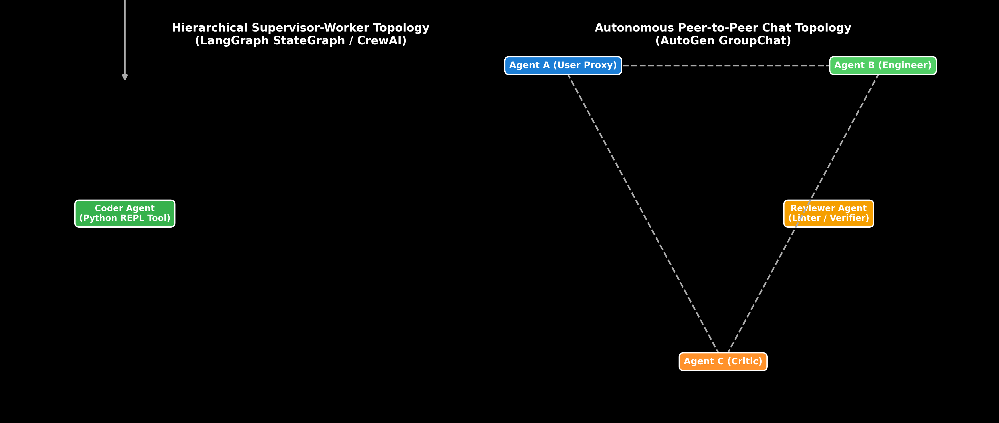

# Multi-Agent Frameworks: LangGraph StateGraph, CrewAI & AutoGen Topologies

This guide details Multi-Agent System (MAS) collaboration topologies, comparing LangGraph StateGraph state machines, CrewAI role-based worker teams, and AutoGen autonomous chat networks, complete with routing graph logic, hand calculations, Python code, and production trade-offs.

> **Notebook Companion**: [03_multi_agent_frameworks_autogen_crewai_langgraph.ipynb](file:///d:/Study/Prep/machine-learning-prep/generative-ai-and-agentic-ai/04_agentic_ai_and_multi_agent_frameworks/03_multi_agent_frameworks_autogen_crewai_langgraph.ipynb)

---

## 1. Multi-Agent System Collaboration Topologies

Single-agent systems suffer from context drift and prompt overloading when handling large, multi-disciplinary projects. Multi-Agent Systems (MAS) break complex tasks down across specialized, role-focused agents.

```text
Framework        Topology Style                State Management               Best Suited For
----------------------------------------------------------------------------------------------------------------------
LangGraph        Cyclic Directed Graph (DAG)   Explicit Typed Shared State    Deterministic production state machines
CrewAI           Hierarchical / Sequential     Role-Based Crew Task Delegator Business process automation workflows
AutoGen          Autonomous Peer-to-Peer Chat  GroupChat Conversation State   Exploratory code & multi-agent debate
```



> [!NOTE]
> **Plot Interpretation & Interview Takeaways:**
> - **What is shown:** Left: Hierarchical Supervisor-Worker topology (LangGraph / CrewAI). Right: Autonomous Peer-to-Peer GroupChat network (AutoGen).
> - **Key Systems Insight:** Hierarchical topologies rely on a Supervisor Agent to act as a centralized router, inspecting task state and delegating sub-tasks to specialized worker agents (Researcher, Coder, Reviewer). Peer-to-Peer topologies allow agents to converse autonomously, but risk infinite looping if no clear termination criteria is set.
> - **Interview Application:** When asked *"How do you choose between LangGraph, CrewAI, and AutoGen for an enterprise project?"*, select LangGraph for deterministic state control, CrewAI for role-based workflows, and AutoGen for multi-agent simulation.

---

## 2. Multi-Agent StateGraph Routing Math (Andrew Ng Style)

Let a Multi-Agent StateGraph contain a state vector $S = (\text{messages}, \text{next\_agent}, \text{retry\_count})$.
The Supervisor routing function $R(S)$ maps current state to the next active agent $A \in \{A_{\text{Research}}, A_{\text{Code}}, A_{\text{Review}}, \text{FINISH}\}$:

$$R(S) = \begin{cases} 
A_{\text{Research}} & \text{if } \text{needs\_data}(S) \land \text{retry\_count} < 3 \\
A_{\text{Code}} & \text{if } \text{has\_data}(S) \land \neg \text{code\_written}(S) \\
A_{\text{Review}} & \text{if } \text{code\_written}(S) \land \neg \text{verified}(S) \\
\text{FINISH} & \text{if } \text{verified}(S) \lor \text{retry\_count} \ge 3
\end{cases}$$

### Step-by-Step State Transition Trace:

1. **State $S_0$:** User goal = *"Research and implement FlashAttention in PyTorch"*.
   - Evaluator: $\text{needs\_data} = \text{True} \implies R(S_0) = \mathbf{A_{\text{Research}}}$

2. **State $S_1$:** Researcher completes output. $\text{has\_data} = \text{True}$.
   - Evaluator: $\text{code\_written} = \text{False} \implies R(S_1) = \mathbf{A_{\text{Code}}}$

3. **State $S_2$:** Coder outputs Python implementation.
   - Evaluator: $\text{code\_written} = \text{True}, \text{verified} = \text{False} \implies R(S_2) = \mathbf{A_{\text{Review}}}$

4. **State $S_3$:** Reviewer passes unit tests. $\text{verified} = \text{True}$.
   - Evaluator: $\implies R(S_3) = \mathbf{\text{FINISH}}$

---

## 3. Production Python State Machine Implementation

```python
class LangGraphStateGraphSimulation:
    def __init__(self):
        self.state = {
            "messages": [],
            "next_agent": "Supervisor",
            "is_verified": False
        }

    def supervisor(self, user_goal: str) -> str:
        self.state["messages"].append(f"[User Goal]: {user_goal}")
        self.state["next_agent"] = "Researcher"
        return "Researcher"

    def researcher(() -> str:
        self.state["messages"].append("[Researcher]: Retrieved FlashAttention SRAM specs.")
        self.state["next_agent"] = "Coder"
        return "Coder"

    def coder(() -> str:
        self.state["messages"].append("[Coder]: Wrote PyTorch SRAM tiling code.")
        self.state["is_verified"] = True
        self.state["next_agent"] = "FINISH"
        return "FINISH"

# Execution
graph = LangGraphStateGraphSimulation()
graph.supervisor("Implement FlashAttention")
graph.researcher()
final = graph.coder()

print(f"State Machine Finished with State: '{final}'")
print("Execution Trajectory Log:")
for msg in graph.state["messages"]:
    print(f"  {msg}")
```

---

## 4. Production Failure Modes & Trade-offs

- **Supervisor Bottleneck & Latency Overhead**: Every state transition passing through a centralized Supervisor Agent adds an extra LLM call ($500\text{ms} - 1.5\text{s}$ per turn).
- **Infinite AutoGen Ping-Pong**: Autonomous Peer-to-Peer agents can get trapped in endless praise loops (*"Great code!" -> "Thanks! Great review!"*). Implement strict `max_consecutive_auto_reply` guards.
