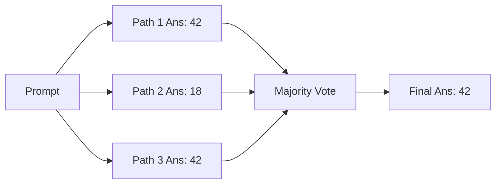
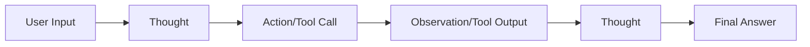

# Module 03: Reasoning Fundamentals

This module covers the core logical reasoning paradigms that enable foundation models to behave as agents: Chain of Thought (CoT), Self-Consistency, Least-to-Most prompting, and the foundational Reasoning + Acting (ReAct) loop.

> **Notebook Companion**: `03_reasoning_fundamentals.ipynb`

---

## 1. Chain of Thought (CoT) & Self-Consistency

### Chain of Thought (CoT)
- **Concept**: Prompts the LLM to output a sequence of intermediate reasoning steps before generating the final answer (`"Let's think step by step"`).
- **Mechanism**: Shifts the model from single-step pattern matching (high error rate on multi-hop logical tasks) to multi-step execution. This allows the model to allocate more tokens (and compute) to reasoning.

### Self-Consistency
- **Concept**: Generates $K$ independent reasoning paths (CoT) at temperature $T > 0$, then performs a majority vote over the final answers.
- **Why it works**: Eliminates single-path reasoning errors by selecting the consensus result over multiple sample outputs.

#### Mathematical Intuition: Majority Voting
If a model has a single-path probability $p$ of generating the correct answer (assuming a binary correct/incorrect answer space), the probability of the correct answer winning the majority vote over $K$ independent samples (where $K$ is odd) is defined by the cumulative binomial distribution:

$$P(\text{Majority Correct}) = \sum_{m=\lfloor K/2 \rfloor + 1}^{K} \binom{K}{m} p^m (1-p)^{K-m}$$

#### Step-by-Step Hand Calculation
- **Scenario**: Let $K = 3$ paths and $p = 0.60$ (60% model accuracy per reasoning path).
- **Calculation**:
  - We calculate the probability of obtaining exactly $m = 2$ and $m = 3$ correct paths.
  - For $m = 2$:
    $$\binom{3}{2} (0.6)^2 (0.4)^1 = 3 \times 0.36 \times 0.4 = 0.432$$
  - For $m = 3$:
    $$\binom{3}{3} (0.6)^3 (0.4)^0 = 1 \times 0.216 \times 1 = 0.216$$
  - Summing the terms:
    $$P(\text{Majority Correct}) = 0.432 + 0.216 = 0.648 \text{ (64.8\%)} $$
  - **Intuition**: Self-Consistency voting boosts accuracy from 60.0% to 64.8\% by marginalizing out random reasoning errors across sample paths.

---

## 2. Least-to-Most Prompting

- **Concept**: Solves complex tasks by first decomposing them into simpler sub-tasks, then solving them sequentially (building on top of the solutions from previous sub-tasks).
- **Production Advantage**: Prevents logical degradation in long reasoning chains by focusing model attention on small, manageable contexts.

---

## 3. The ReAct (Reasoning + Acting) Paradigm

Introduced to combine **Reasoning** (CoT) and **Action** (tool execution). ReAct interleaves these steps in a loop:

### Trace Walkthrough of a ReAct Loop:
- **Goal**: Find the age difference between two software engineering frameworks.
  - **Thought 1**: "I need to find the release year of Framework A first. I will use the Search tool."
  - **Action 1**: `Search[Framework A release year]`
  - **Observation 1**: "Framework A was first released in 2013."
  - **Thought 2**: "Now I need to find the release year of Framework B. I will search for it."
  - **Action 2**: `Search[Framework B release year]`
  - **Observation 2**: "Framework B was first released in 2019."
  - **Thought 3**: "Framework A is from 2013, and Framework B is from 2019. The difference is $2019 - 2013 = 6$ years. I have the final answer."
  - **Final Answer**: "The age difference is 6 years."

---

## 4. Comparison of Reasoning Paradigms

| Paradigm | Environmental Interaction | Computation Overhead | Latency | Primary Limitation |
|---|---|---|---|---|
| **Chain of Thought (CoT)** | None (static text) | Low (adds output tokens) | Low | Can hallucinate facts without tools |
| **Self-Consistency** | None (static text) | High (runs $K$ parallel paths) | Low (if run in parallel) | Does not solve facts retrieval |
| **Least-to-Most** | None (static text) | Moderate (chained steps) | Moderate | Requires rigid prompt design |
| **ReAct** | Full (interacts with tools) | Very High (loop token buildup) | High | Subject to infinite execution loops |

### Comparison: Pros & Cons of Reasoning Paradigms

| Paradigm | Pros | Cons |
|---|---|---|
| **Chain of Thought (CoT)** | - Easy to implement via system prompt. - Low computational latency overhead. | - Model can still hallucinate intermediate steps. - No real-world tool verification. |
| **Self-Consistency** | - Significantly boosts deterministic accuracy. - Marginally filters out logic errors. | - Generates $K$ paths, doubling/tripling API token cost. - Slow if paths execute sequentially. |
| **ReAct** | - Grounded in external facts and tool execution. - Real-time adaptation to observation changes. | - Prone to infinite repetition on tool error. - quadratic context bloat over long loops. |

### When to Consider Self-Consistency:
- **Best Use Case**: Strict deterministic tasks with fixed answers (e.g. math puzzles, code snippet syntax validation, SQL schema query compilation).
- **Avoid When**: Generating subjective, open-ended copy (majority voting fails to aggregate creative text styles).
- **Production Tip**: Use $T = 0.7$ for Self-Consistency paths to encourage path diversity, but drop to $T = 0.0$ for ReAct loop reasoning to guarantee strict tool parameter selections.

---

## 5. Detailed Computational Complexity (Time & Memory)

- **Self-Consistency Voting Time**: $O(K \cdot N_{len})$ generation token cost.
- **ReAct Execution Context Memory**: $O(T^2)$ quadratic context window growth as history scales with every loop turn.
- **Component Denotations**:
  - $K$: Number of parallel sample paths generated for Self-Consistency.
  - $N_{len}$: Average length in tokens of a single reasoning chain.
  - $T$: Number of turns executed in the ReAct loop.

---

## 6. Interview Questions & Production Trade-offs

### What problem does this solve?
LLMs are standard text generators that struggle with multi-hop calculations or information retrieval. Interleaving reasoning (Thought) and actions (Tools) resolves hallucination by grounding observations in external tools.

### Why was it introduced?
To merge the benefits of conversational reasoners (CoT) with task-oriented action engines (tool execution databases).

### What are its limitations?
- **Cascading Failures**: If Observation 1 is incorrect, Thought 2 and all subsequent steps will fail.
- **Token Inflation**: Chaining past prompts and tool results in a loop scales context window size quadratically.

### Production Use Cases:
- Customer billing triage agents verifying purchase history, database entries, and updating client states.
- Automated API route selectors that dynamically fetch parameters and verify routing results.

### Follow-up Questions Interviewers Ask:
1. *Why does ReAct combine reasoning (Thought) and action (Action) rather than just outputting action commands directly?*
   - **Answer**: Direct action outputting (e.g. JSON-only APIs) lacks explanation traces. The intermediate `Thought` acts as a scratchpad where the model aligns context, preventing sudden jumps in logic, stabilizing parameter choices, and allowing developers to debug the agent's inner chain of logic.
2. *How do you build a ReAct parser without external frameworks like LangChain?*
   - **Answer**: Implement a clean loop. Direct the LLM via system prompting to output text containing specific delimiters (e.g., `Thought: <reasoning>`, `Action: <tool_name>[<arguments>]`, `Observation: <results>`). In Python, use regex search patterns to capture the `Action:` block, run the local python function matching that action name, and append `Observation: <tool_output>` to the dialogue history for the next iteration.
