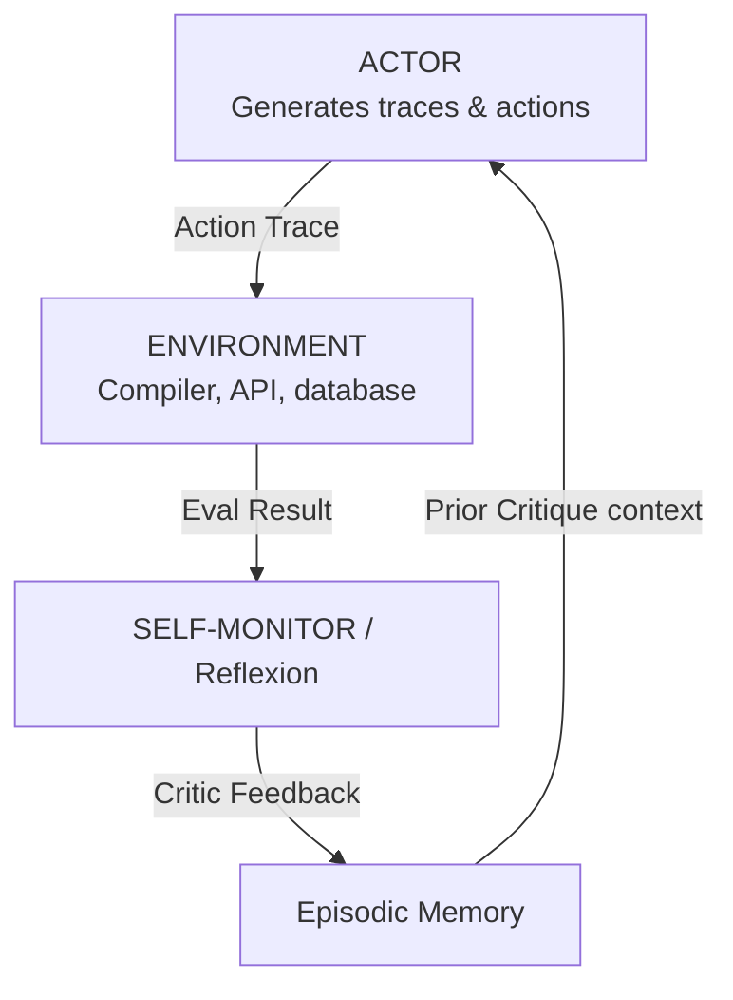

# Module 04: Advanced Reasoning

This module explores advanced cognitive search paradigms that exceed simple sequential loops: Reflexion (actor-critic correction), Tree of Thoughts (ToT), Graph of Thoughts (GoT), and Language Agent Tree Search (LATS).

> **Notebook Companion**: `04_advanced_reasoning.ipynb`

---

## 1. Reflexion (Self-Correction Loop)

**Reflexion** introduces an explicit self-correction loop where the agent evaluates its performance using a Critic/Evaluator node, stores error diagnostics in a memory buffer, and updates its strategy for subsequent attempts.

---

## 2. Tree of Thoughts (ToT) & Graph of Thoughts (GoT)

### Tree of Thoughts (ToT)
- **Concept**: Models problem solving as searching over a tree, where each node represents a "thought" (a coherent text step).
- **Mechanism**: Generates multiple candidate thoughts at each node, evaluates their value/heuristics ($v \in [0, 1]$ or class classifications `[Keep, Stop, Solved]`), and executes search algorithms (Breadth-First Search or Depth-First Search) to navigate paths.

### Graph of Thoughts (GoT)
- **Concept**: Extends ToT by structuring thoughts as a Directed Acyclic Graph (DAG).
- **Advantage**: Allows thoughts to be merged (e.g. summarizing multiple solutions into a consensus), split (decomposing a step), and aggregated, matching the human cognitive process of synthesis.

---

## 3. Language Agent Tree Search (LATS)

- **Concept**: Combines Monte Carlo Tree Search (MCTS) with external environment observations.
- **Phases**:
  1. **Selection**: Navigate the tree using Upper Confidence bounds for Trees (UCT).
  2. **Expansion**: Generate candidate steps.
  3. **Evaluation**: Assess steps using internal heuristics and external tool feedback.
  4. **Backpropagation**: Propagate values up the tree to update parent node confidence states.

---

## 4. Comparison of Advanced Reasoning Systems

| Strategy | Structure | Search Algorithm | External Feedback Integration | Primary Failure Mode |
|---|---|---|---|---|
| **Reflexion** | Loop | Single-path iterations | High (evaluates output logs) | Local minima (repeats same mistake) |
| **Tree of Thoughts** | Tree | DFS / BFS | None or Low | Tree state explosion ($O(K^d)$) |
| **Graph of Thoughts**| DAG | Graph traversals | Moderate | Complex state graph management |
| **LATS** | Tree/MCTS | UCT + Backpropagation | Very High | High latency and token cost |

---

## 5. Detailed Computational Complexity (Time & Memory)

- **ToT Search Time Complexity**: $O(b^d \cdot N_{\text{tokens}})$ where $b$ is branching factor and $d$ is depth.
- **Tree Activation VRAM / RAM**: $O(b^d)$ node state summaries stored in memory.
- **Component Denotations**:
  - $b$: Branching factor (number of child thoughts generated per node).
  - $d$: Tree search depth.
  - $N_{\text{tokens}}$: Average token evaluation size per node.

---

## 6. Interview Questions & Production Trade-offs

### What problem does this solve?
Linear generation models (ReAct/CoT) cannot backtrack when they make a logical error. If they hit a dead end, they continue down the incorrect path. Advanced search structures enable backtracking and path evaluations.

### Why was it introduced?
To handle complex problems (e.g., writing code with nested dependencies, solving mathematical theorems, structural planning) where initial steps must be iteratively verified and pruned.

### What are its limitations?
- **High Token Consumption**: Querying an evaluator for every branch scales token usage exponentially.
- **Latency**: Searching a tree of depth 3 with branching factor 3 requires 27 LLM evaluations, taking minutes in production.

### Production Use Cases:
- Automated codebase refactoring agents running compile checks, backtracking edits when unit tests fail, and trying alternative paths.
- Logistics planning agents scheduling multi-stop routes with dynamic obstacle constraints.

### Follow-up Questions Interviewers Ask:
1. *When should you choose LATS/ToT over standard ReAct in a production system?*
   - **Answer**: Choose ToT/LATS when task execution is highly non-linear, unit tests/compilers provide clear objective heuristics for backtracking, and latency is not a critical constraint (e.g. offline coding agents, automated scientific research).
2. *How do you limit the exponential state explosion in Tree of Thoughts?*
   - **Answer**: Enforce strict beam search pruning (keeping only the top $K$ scoring branches at each layer), set maximum tree depth limits ($d \le 3$), and run evaluations using faster, cheaper model endpoints (e.g., fine-tuned small models) rather than flagship models.
