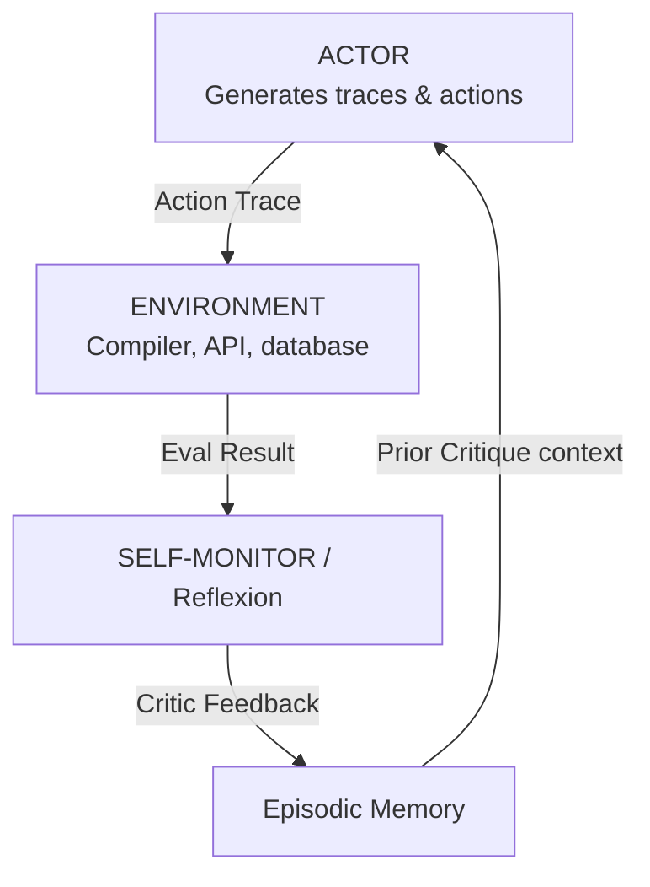

# Module 04: Advanced Reasoning

This module explores advanced cognitive search paradigms that exceed simple sequential loops: Reflexion (actor-critic correction), Tree of Thoughts (ToT), Graph of Thoughts (GoT), and Language Agent Tree Search (LATS).

> **Notebook Companion**: `04_advanced_reasoning.ipynb`

---

## 1. Reflexion (Self-Correction Loop)

**Reflexion** introduces an explicit self-correction loop where the agent evaluates its performance using a Critic/Evaluator node, stores error diagnostics in a memory buffer, and updates its strategy for subsequent attempts.

---

## 2. Tree of Thoughts (ToT) & Graph of Thoughts (GoT)

### Tree of Thoughts (ToT)
- **Concept**: Models problem solving as searching over a tree, where each node represents a "thought" (a coherent text step).
- **Mechanism**: Generates multiple candidate thoughts at each node, evaluates their value/heuristics ($v \in [0, 1]$ or class classifications `[Keep, Stop, Solved]`), and executes search algorithms (Breadth-First Search or Depth-First Search) to navigate paths.

#### Mathematical Intuition: Thought Value Evaluation
Let $s = [x, z_1, \dots, z_i]$ represent the current state of a thought path. The model generates candidate next thought steps $z_{i+1} \sim p_{\theta}(z_{i+1} | s)$ and evaluates each candidate using a value function $V(s)$ evaluated by a Critic model:

$$V(s) \in [0, 1] \quad \text{or} \quad V(s) \in \{\text{sure}, \text{maybe}, \text{impossible}\}$$

#### Step-by-Step Hand Calculation (ToT DFS Backtracking)
- **Scenario**: Solve a 3-step puzzle. Branching factor $b = 2$, value threshold for pruning is $V < 0.4$.
- **Calculation**:
  - From Root, generate child nodes $A$ and $B$:
    - Critic grades $V(A) = 0.8$ (`sure`), $V(B) = 0.2$ (`impossible`).
    - Node $B$ is immediately pruned (backtracked).
  - Traverse down Node $A$, generating grandchildren $A_1$ and $A_2$:
    - Critic grades $V(A_1) = 0.1$ (`impossible`), $V(A_2) = 0.75$ (`sure`).
    - Node $A_1$ is pruned. The agent pursues path $A \to A_2$, successfully avoiding branch $B$ and branch $A_1$ early.

### Graph of Thoughts (GoT)
- **Concept**: Extends ToT by structuring thoughts as a Directed Acyclic Graph (DAG).
- **Advantage**: Allows thoughts to be merged (e.g. summarizing multiple solutions into a consensus), split (decomposing a step), and aggregated, matching the human cognitive process of synthesis.

---

## 3. Language Agent Tree Search (LATS)

- **Concept**: Combines Monte Carlo Tree Search (MCTS) with external environment observations.
- **Phases**:
  1. **Selection**: Navigate the tree using Upper Confidence bounds for Trees (UCT).
  2. **Expansion**: Generate candidate steps.
  3. **Evaluation**: Assess steps using internal heuristics and external tool feedback.
  4. **Backpropagation**: Propagate values up the tree to update parent node confidence states.

#### Mathematical Intuition: UCT Node Selection
LATS selects branches to explore by maximizing the Upper Confidence bounds applied to Trees (UCT) formula:

$$UCT(s, a) = \frac{Q(s, a)}{N(s, a)} + c \cdot \sqrt{\frac{\ln N(s)}{N(s, a)}}$$

- **Step-by-Step Hand Calculation**:
  - Let Parent visits $N(s) = 10$.
  - Child node $A$ has value sum $Q(s, A) = 4.0$, visits $N(s, A) = 8$. Mean score: $\frac{4}{8} = 0.50$.
  - Child node $B$ has value sum $Q(s, B) = 1.0$, visits $N(s, B) = 2$. Mean score: $\frac{1}{2} = 0.50$.
  - Let exploration constant $c = 1.0$.
  - Calculate UCT scores:
    $$UCT(s, A) = 0.50 + 1.0 \cdot \sqrt{\frac{\ln 10}{8}} = 0.50 + \sqrt{\frac{2.3026}{8}} \approx 0.50 + 0.536 = 1.036$$
    $$UCT(s, B) = 0.50 + 1.0 \cdot \sqrt{\frac{\ln 10}{2}} = 0.50 + \sqrt{\frac{2.3026}{2}} \approx 0.50 + 1.073 = 1.573$$
  - **Decision**: The agent selects node $B$ because its high uncertainty (fewer visits) results in a larger exploration bound ($1.073$ vs $0.536$).

---

## 4. Comparison of Advanced Reasoning Systems

| Strategy | Structure | Search Algorithm | External Feedback Integration | Primary Failure Mode |
|---|---|---|---|---|
| **Reflexion** | Loop | Single-path iterations | High (evaluates output logs) | Local minima (repeats same mistake) |
| **Tree of Thoughts** | Tree | DFS / BFS | None or Low | Tree state explosion ($O(K^d)$) |
| **Graph of Thoughts**| DAG | Graph traversals | Moderate | Complex state graph management |
| **LATS** | Tree/MCTS | UCT + Backpropagation | Very High | High latency and token cost |

### Comparison: Pros & Cons of Advanced Search Systems

| Strategy | Pros | Cons |
|---|---|---|
| **Reflexion** | - Low complexity to implement. - Builds a direct, concise episodic memory of past mistakes. | - Prone to getting stuck in local loops. - Does not systematically explore alternatives. |
| **Tree of Thoughts (ToT)** | - Systematically explores alternative reasoning tracks. - DFS/BFS backtracking saves the run from failure. | - Exponential token explosion ($O(b^d)$). - Requires designing custom value heuristics. |
| **Language Agent Tree Search (LATS)** | - Integrates real-world tool feedback into search nodes. - Updates path values dynamically via backpropagation. | - Extremely high latency (unsuitable for UI interactions). - High API cost per run. |

### When to Consider:
- **Tree of Thoughts**: Best for offline, symbolic tasks (e.g. theorem proving, crosswords, structural text synthesis) where a critic model can rate intermediate text nodes.
- **LATS**: Best for software engineering patch generation or automated devops pipelines where a real-world compiler or test sandbox (external tool) provides objective feedback to guide MCTS expansion.
- **Production Tip**: To mitigate the latency of LATS in production, generate candidate nodes in parallel batches, and restrict search depth ($d \le 2$) and branching ($b \le 2$).

---

## 5. Detailed Computational Complexity (Time & Memory)

- **ToT Search Time Complexity**: $O(b^d \cdot N_{\text{tokens}})$ where $b$ is branching factor and $d$ is depth.
- **Tree Activation VRAM / RAM**: $O(b^d)$ node state summaries stored in memory.
- **Component Denotations**:
  - $b$: Branching factor (number of child thoughts generated per node).
  - $d$: Tree search depth.
  - $N_{\text{tokens}}$: Average token evaluation size per node.

---

## 6. Interview Questions & Production Trade-offs

### What problem does this solve?
Linear generation models (ReAct/CoT) cannot backtrack when they make a logical error. If they hit a dead end, they continue down the incorrect path. Advanced search structures enable backtracking and path evaluations.

### Why was it introduced?
To handle complex problems (e.g., writing code with nested dependencies, solving mathematical theorems, structural planning) where initial steps must be iteratively verified and pruned.

### What are its limitations?
- **High Token Consumption**: Querying an evaluator for every branch scales token usage exponentially.
- **Latency**: Searching a tree of depth 3 with branching factor 3 requires 27 LLM evaluations, taking minutes in production.

### Production Use Cases:
- Automated codebase refactoring agents running compile checks, backtracking edits when unit tests fail, and trying alternative paths.
- Logistics planning agents scheduling multi-stop routes with dynamic obstacle constraints.

### Follow-up Questions Interviewers Ask:
1. *When should you choose LATS/ToT over standard ReAct in a production system?*
   - **Answer**: Choose ToT/LATS when task execution is highly non-linear, unit tests/compilers provide clear objective heuristics for backtracking, and latency is not a critical constraint (e.g. offline coding agents, automated scientific research).
2. *How do you limit the exponential state explosion in Tree of Thoughts?*
   - **Answer**: Enforce strict beam search pruning (keeping only the top $K$ scoring branches at each layer), set maximum tree depth limits ($d \le 3$), and run evaluations using faster, cheaper model endpoints (e.g., fine-tuned small models) rather than flagship models.
