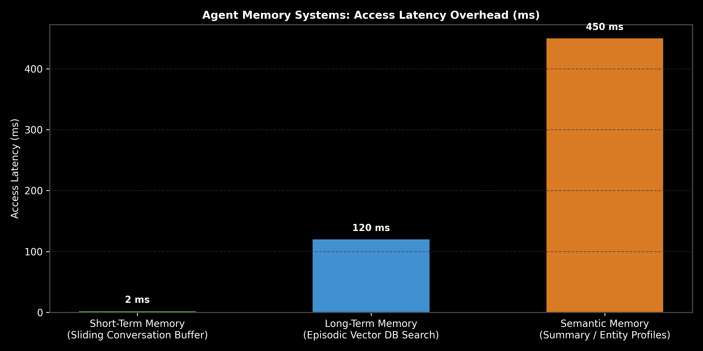

# Agent Memory Systems: Short-Term, Episodic & Summary Truncation

This guide details Agent Memory Architectures, comparing Short-Term Working Memory (Sliding Buffer), Long-Term Memory (Episodic Vector DB Search), and Semantic Memory (Summary Truncation), complete with memory capacity math, Python code, and production trade-offs.

> **Notebook Companion**: [04_agent_memory_short_long_term_episodic.ipynb](file:///d:/Study/Prep/machine-learning-prep/generative-ai-and-agentic-ai/04_agentic_ai_and_multi_agent_frameworks/04_agent_memory_short_long_term_episodic.ipynb)

---

## 1. Agent Memory Hierarchy Architecture

Human cognitive architectures maintain distinct memory subsystems (Working, Episodic, Semantic). Long-running AI agents require identical memory stratification to maintain context across multi-session interactions without overflowing LLM context windows.

```text
Memory Subsystem     Implementation Storage               Access Latency      Primary Purpose
----------------------------------------------------------------------------------------------------------------------
Short-Term Working   Sliding Message Buffer (RAM)         Ultra-Fast (~2ms)   Immediate conversational context
Episodic Memory      Vector DB Search (Qdrant/Pinecone)   Fast (~120ms)       Recall of specific past agent experiences
Semantic Memory      Summary LLM Truncation / Knowledge   Medium (~450ms)     Persistent user entity profiles & facts
```



> [!NOTE]
> **Plot Interpretation & Interview Takeaways:**
> - **What is shown:** Access latency overhead (ms) comparing Short-Term Memory ($2\text{ms}$ RAM buffer) vs. Episodic Long-Term Memory ($120\text{ms}$ Vector DB search) vs. Semantic Memory ($450\text{ms}$ LLM summary truncation).
> - **Key Systems Insight:** Retaining every conversation turn in short-term buffer memory eventually causes context window blowup and inflates inference costs ($O(N^2)$ attention costs). A hybrid memory architecture maintains a sliding 4-turn working buffer, periodically compresses old turns into a running summary, and archives past interaction episodes into a Vector DB.
> - **Interview Application:** When asked *"How do you design a long-running customer support agent that remembers user preferences from 6 months ago?"*, explain Episodic Vector Memory and Semantic Summary Truncation.

---

## 2. Mathematical Memory Compression & Token Budget Calculation

Let max prompt context token budget be $B = 4096$ tokens. System prompt and tool schemas consume $B_{\text{sys}} = 1000$ tokens.

Each conversation turn consumes an average of $T_{\text{turn}} = 250$ tokens.
- **Max Uncompressed Buffer Capacity (Turns):**
  $$N_{\text{max}} = \frac{B - B_{\text{sys}}}{T_{\text{turn}}} = \frac{4096 - 1000}{250} = \frac{3096}{250} = \mathbf{12.38 \approx 12 \text{ turns}}$$

By applying **Summary Memory Truncation** (compressing 10 old turns into a 100-token summary):
- **Compressed Memory Token Consumption:**
  $$B_{\text{compressed}} = B_{\text{summary}} + (N_{\text{recent}} \times T_{\text{turn}}) = 100 + (4 \times 250) = \mathbf{1100 \text{ tokens}}$$
  Token savings: $3096 - 1100 = \mathbf{1996 \text{ tokens saved per prompt}} \ (64.4\% \text{ reduction})$.

---

## 3. Production Python Agent Memory Implementation

```python
class HybridAgentMemory:
    def __init__(self, max_buffer_turns: int = 2):
        self.max_turns = max_buffer_turns
        self.recent_buffer = []
        self.summary = ""

    def add_interaction(self, user_msg: str, assistant_msg: str):
        self.recent_buffer.append(("User", user_msg))
        self.recent_buffer.append(("Assistant", assistant_msg))
        
        # Evict oldest turn to summary memory if buffer exceeds limit
        if len(self.recent_buffer) > (self.max_turns * 2):
            evicted_u = self.recent_buffer.pop(0)
            evicted_a = self.recent_buffer.pop(0)
            self.summary += f" [Summary Fact: {evicted_u[1]} -> {evicted_a[1]}]"

    def render_prompt_context(self) -> str:
        buffer_str = "\n".join([f"{role}: {text}" for role, text in self.recent_buffer])
        return f"Persistent Summary Memory: {self.summary.strip()}\n\nRecent Buffer:\n{buffer_str}"

# Execution
mem = HybridAgentMemory(max_buffer_turns=1)
mem.add_interaction("My favorite model is FlashAttention", "Got it!")
mem.add_interaction("How does it save memory?", "It tiles Q, K, V in SRAM.")

print("Rendered Hybrid Prompt Memory Context:\n")
print(mem.render_prompt_context())
```

---

## 4. Production Failure Modes & Trade-offs

- **Summary Memory Information Drift**: Repeatedly summarizing summaries causes key numbers, specific dates, and precise entities to get lost over long conversations. Maintain raw episodic vectors alongside summaries.
- **Episodic Search Latency Impact**: Querying a vector DB on every single conversation turn adds $100\text{ms} - 200\text{ms}$ latency overhead. Execute episodic retrieval asynchronously or only when short-term buffer context is insufficient.
