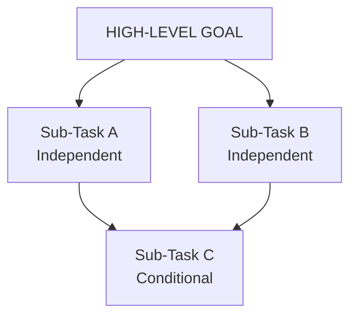

# Module 05: Planning & Task Decomposition

This module covers how autonomous agents plan complex execution paths: from high-level goal formulation and task decomposition (sequential vs. hierarchical graphs) to execution monitoring and dynamic replanning under real-world failures.

> **Notebook Companion**: `05_planning_task_decomposition.ipynb`

---

## 1. Goal Formulation & Task Decomposition

### Goal Formulation
Before an agent begins planning, it must establish a clear target state and boundary criteria (e.g. defining when the goal is met and what resources are allowed).

### Task Decomposition
Decomposition is the cognitive process of breaking a complex goal into smaller, executable sub-tasks.
1. **Sequential Planning**: The model generates a linear list of steps (e.g. `Step 1 -> Step 2 -> Step 3`). If Step 2 fails, the entire sequence halts.
2. **Hierarchical Planning**: The model organizes tasks as a tree or Directed Acyclic Graph (DAG). Sub-tasks run in parallel or conditional branches, permitting sophisticated execution flow.

---

## 2. Dynamic Planning & Replanning

In real-world environments, plans rarely execute without error. **Dynamic Replanning** is the agent's capability to modify its remaining task list based on feedback from intermediate steps.

### Replanning Trigger States:
- **API Error / Tool Failure**: The target service is down or returns a 500 error. The agent must catch the exception and insert a fallback task (e.g., using a backup tool or retrying with modified parameters).
- **Goal Shift / Context Change**: Intermediate observations reveal new constraints (e.g., discovering a document is password-protected, requiring a task insert for decryption lookup).

---

## 3. Comparison of Planning Approaches

| Approach | Representation | Path Flexibility | Latency Profile | Best Use Case |
|---|---|---|---|---|
| **Sequential Planning** | Flat list / queue | Low (linear path) | Low | Simple file modifications, sequential lookups |
| **Hierarchical Planning** | DAG / Tree | High (parallel tracks) | Moderate | Large scale codebase refactoring, parallel scraping |
| **Dynamic Replanning** | Self-correcting queue | Maximum (rewrites plan) | High (adds planning calls) | Live API environments with intermittent error rates |

---

## 4. Detailed Computational Complexity (Time & Memory)

- **Planning Overhead Time**: $O(T \cdot d^2)$ per plan-generation call.
- **DAG Traversal Time**: $O(V + E)$ where $V$ is tasks count and $E$ is conditional dependency edges.
- **Memory Footprint**: $O(V + E)$ RAM to store task objects and dependency dictionaries in memory.
- **Component Denotations**:
  - $T$: Length in tokens of the generated task list description.
  - $d$: Underlying model embedding dimension.
  - $V$: Number of vertex nodes (sub-tasks) in the planning graph.
  - $E$: Number of directed edges (dependencies) in the planning graph.

---

## 5. Interview Questions & Production Trade-offs

### What problem does this solve?
Allows agents to tackle massive, open-ended user requests (e.g., "build a web app") by breaking them down into small, concrete actions that can be validated individually.

### Why was it introduced?
Single-prompt generation models struggle with long-horizon tasks due to reasoning decay. Splitting tasks into a DAG allows isolating contexts and handling failures granularly.

### What are its limitations?
- **Cascading Delays**: If a root task fails or takes longer to execute, all child tasks in the dependency graph are blocked.
- **Over-planning Loops**: The model may spend significant time rewriting plans rather than executing them (called the "planning loop trap").

### Production Use Cases:
- Software engineering agents breaking down code refactoring into: Checkout → Parse → Edit → Compile → Test → Commit.
- Automated report generators searching multiple sub-topics in parallel before consolidating results.

### Follow-up Questions Interviewers Ask:
1. *How do you implement execution monitoring and plan tracking in production without vendor frameworks?*
   - **Answer**: Model the plan as a stateful Directed Acyclic Graph (DAG) using a database table (e.g. tracking `task_id`, `status` `[PENDING, RUNNING, COMPLETED, FAILED]`, and `dependencies: list[id]`). Use a topological sort algorithm to find tasks with no outstanding dependencies, execute them, and update their state upon tool termination.
2. *What is the "planning loop trap" and how do you mitigate it?*
   - **Answer**: The planning loop trap occurs when an agent repeatedly edits its plan when a step fails, without attempting alternative executions. Mitigate this by capping maximum plan edits to a fixed count (e.g., $\le 3$), forcing a hard halt, and escalating to the user.
