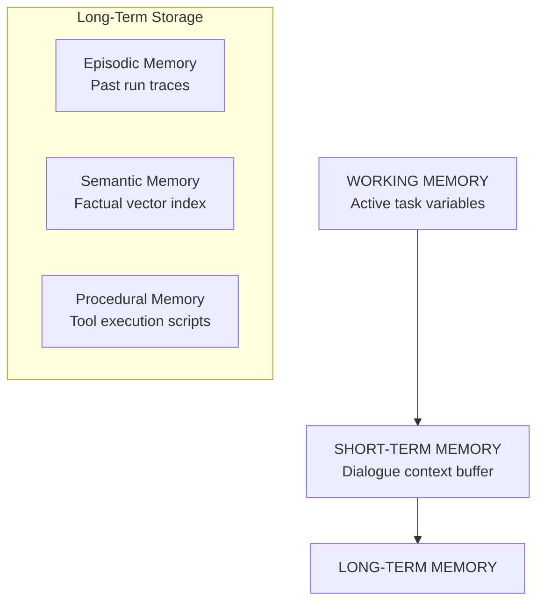

# Module 06: Memory Systems

This module details the design of agent memory systems: working, short-term (buffer), and long-term structures (episodic, semantic, procedural), and practical engineering strategies for memory retrieval, compression, persistence, and forgetting.

> **Notebook Companion**: `06_memory_systems.ipynb`

---

## 1. Architectural Memory Taxonomy

Agents emulate human cognitive memory through three distinct structural layers:

1. **Working Memory**: Fast local variables. Holds active sub-task values during single-turn loops.
2. **Short-Term Memory**: The context buffer. Tracks conversation turns and observation logs in the active LLM context window.
3. **Long-Term Memory**: Scalable external storage. Includes:
   - **Episodic Memory**: Log of past runs and user intents (retrieved via vector search to repeat successful patterns).
   - **Semantic Memory**: Static knowledge bases, vector embeddings, and documentation schemas.
   - **Procedural Memory**: System instructions, prompt templates, and codes on *how* to execute tools.

---

## 2. Memory Compression & Forgetting

As conversation history grows, raw context buffers exceed the LLM's limit, leading to high latency and context degradation.

### Compression Strategies:
- **Summarization**: Triggered when conversation history length exceeds threshold $N_{\text{threshold}}$. An LLM summarizes the oldest $M$ turns, replacing them with a single summary block.
- **Entity Graph Mapping (Semantic Memory)**: Extracts entities and relations from dialogue turns (e.g. `User -> lives in -> New York`) and stores them in a queryable graph database, discarding raw text logs.

### Memory Management & Forgetting:
- **Least Recently Used (LRU) Eviction**: Purges episodic memories that have not been retrieved in recent runs.
- **Variable Expiration / TTL**: Sets Time-To-Live (TTL) parameters on session state memory keys.

### Vector Search & Retrieval: Similarity Calculations
To retrieve long-term semantic context, agents query Vector databases using embeddings.

#### Mathematical Intuition: Cosine Similarity & Distance
Embeddings are normalized high-dimensional vectors. The similarity between query vector $\mathbf{q}$ and document vector $\mathbf{d}$ is computed as:

$$\text{Sim}(\mathbf{q}, \mathbf{d}) = \frac{\mathbf{q} \cdot \mathbf{d}}{\|\mathbf{q}\| \|\mathbf{d}\|} = \frac{\sum_i q_i d_i}{\sqrt{\sum_i q_i^2} \sqrt{\sum_i d_i^2}}$$

$$D(\mathbf{q}, \mathbf{d}) = 1 - \text{Sim}(\mathbf{q}, \mathbf{d})$$

#### Step-by-Step Hand Calculation
- **Scenario**: Let query vector $\mathbf{q} = [1.0, 0.0]$ and document vector $\mathbf{d} = [0.8, 0.6]$.
- **Calculation**:
  - Dot product:
    $$\mathbf{q} \cdot \mathbf{d} = (1.0 \times 0.8) + (0.0 \times 0.6) = 0.80$$
  - Vector magnitudes (norms):
    $$\|\mathbf{q}\| = \sqrt{1.0^2 + 0.0^2} = 1.0$$
    $$\|\mathbf{d}\| = \sqrt{0.8^2 + 0.6^2} = \sqrt{0.64 + 0.36} = 1.0$$
  - Cosine Similarity:
    $$\text{Sim}(\mathbf{q}, \mathbf{d}) = \frac{0.80}{1.0 \times 1.0} = 0.80$$
  - Cosine Distance:
    $$D(\mathbf{q}, \mathbf{d}) = 1.0 - 0.80 = 0.20$$
  - **Result**: The similarity score of 0.80 triggers memory retrieval if the threshold is set to $\ge 0.75$.

---

## 3. Comparison of Memory Systems

| System | Storage Medium | Retrieval Mechanism | Context Lifetime | Primary Constraint |
|---|---|---|---|---|
| **Working Memory** | Local RAM | Key-value lookup | Single execution cycle | Volatile |
| **Short-Term Memory** | Context window | Text concat concatenation | Single active session | Token limit ceiling |
| **Long-Term Memory** | Vector database / DBMS | Cosine Similarity search | Multi-session (infinite) | Latency of network lookup |

### Comparison: Pros & Cons of Memory Categories

| Memory Class | Pros | Cons |
|---|---|---|
| **Working Memory** | - Near-zero lookup latency. - Precise type safety. | - Completely lost when single tool execution exits. |
| **Short-Term Memory** | - Perfect chronological context preservation. - High attention focus. | - High token usage. - Limited by context window ceiling ($128\text{k}$ tokens). |
| **Long-Term Memory** | - Retains knowledge indefinitely across sessions. - Scales to millions of records. | - Subject to semantic retrieval noise (irrelevant matches). - High vector database query latency. |

### Memory Drift Scenario
- **Problem**: During a multi-step web research task, the agent makes multiple search tool calls. The short-term dialogue context fills up with pages of raw search observations. Due to this context bloating, the model's self-attention layers lose track of the initial user query ("find only framework release dates"), causing it to focus on random search keywords and drift into unrelated execution loops.
- **Result**: The agent is locked in a loop collecting secondary data without ever outputting the final answer.

### Production Tip: Tiered Memory Architectures
To prevent memory drift in enterprise systems, implement a **Tiered Memory Architecture**:
1. **Dialogue Buffer (STM)**: Keep a sliding window of only the last 3-5 user-agent turns to preserve dialogue state.
2. **Entity Store (Working Memory)**: Extract and track variables (e.g. `user_id = 102`, `balance = 15.50`) in a state database.
3. **Vector Cache (LTM)**: Write all dialogue logs to a background vector database (HNSW). Query this database using RAG only when the agent specifically requests historical facts, preventing context window bloat.

---

## 4. Detailed Computational Complexity (Time & Memory)

- **Vector Memory Retrieval Time**: $O(d \cdot M)$ for raw search, or $O(d \cdot \log M)$ using HNSW index search.
- **Consolidation Summarization Time**: $O(K \cdot d^2)$ per consolidation trigger.
- **VRAM / Context Overhead Space**: $O(N)$ linear memory scaling.
- **Component Denotations**:
  - $d$: Embedding vector dimensions.
  - $M$: Number of documents/vectors stored in the long-term memory database.
  - $K$: Length in tokens of the conversation slice being summarized.
  - $N$: Active context length of short-term memory.

---

## 5. Interview Questions & Production Trade-offs

### What problem does this solve?
Prevents agents from repeating mistakes across runs, enables multi-session memory, and prevents context window exhaustion on long-running tasks.

### Why was it introduced?
To allow systems to maintain context over long conversations and reference documentation databases without hardcoding factual rules in prompts.

### What are its limitations?
- **Retrieval Noise**: Vector search can retrieve irrelevant episodic memories due to query semantic drift, confusing the model.
- **State Inconsistencies**: Dynamic summaries can omit crucial numeric values (e.g. key account numbers), leading to reasoning errors.

### Production Use Cases:
- Enterprise knowledge assistants storing personal user details and documents in long-term memory.
- Coding assistants remembering past compilation errors and code structures.

### Follow-up Questions Interviewers Ask:
1. *How do you implement procedural memory in production without frameworks?*
   - **Answer**: Procedural memory (how tools work) is stored as JSON schema documentation in a document store (like PostgreSQL). At the start of the loop, query only the tool schemas relevant to the user query (using keyword routing or semantic embedding retrieval), dynamically appending them to the system prompt to minimize context window consumption.
2. *Describe the trade-offs of storing dialogue history in Redis vs. PostgreSQL.*
   - **Answer**: Redis provides sub-millisecond read/write latency, ideal for short-term working buffers. PostgreSQL provides rich ACID transactions, relational structures, and relational queries, which are essential for long-term episodic/semantic graph mapping and multi-session trace analysis.
