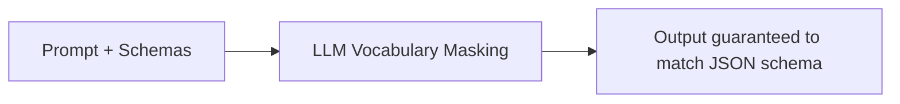

# Module 07: Tool Calling & Environment Interaction

This module covers the core mechanics of how agents interact with external systems: tool selection and routing, structured JSON schema validation, parallel tool execution, idempotency, and cognitive error recovery strategies.

> **Notebook Companion**: `07_tool_calling_environment_interaction.ipynb`

---

## 1. Tool Selection & Structured Outputs

### Tool Selection & Routing
Agents choose external functions by matching user requests against tool documentation.
- **Semantic Matching**: Embedding the user query and retrieving tool descriptions using vector databases.
- **Parametric Routing**: The LLM compiles parameters matching the selected function schema.

### Structured Outputs (Function Calling)
Modern API gateways enforce schema constraints at the token level by restricting model vocabulary outputs to validate against a target JSON schema. This ensures the output can be parsed cleanly by runtime engines.



#### Mathematical Intuition: Vocabulary Logits Masking
Let $\mathbf{z}$ represent the raw next-token logit vector generated by the model. The grammar schema engine defines a binary mask vector $\mathbf{m} \in \{0, -\infty\}^{|V|}$, where $m_i = -\infty$ if token $w_i$ violates schema grammar rules. The masked probability distribution is:

$$\tilde{P}(w_t) = \text{Softmax}(\mathbf{z} + \mathbf{m})_t = \frac{e^{z_t + m_t}}{\sum_j e^{z_j + m_j}}$$

#### Step-by-Step Hand Calculation
- **Scenario**: Vocabulary $V = \{\text{'"'}, \text{'a'}, \text{'1'}\}$. Logits $\mathbf{z} = [2.0, 4.0, 1.0]$. The schema demands the next token must be a quote `"` to open a JSON string parameter.
- **Calculation**:
  - Mask vector: $\mathbf{m} = [0.0, -\infty, -\infty]$.
  - Masked logits: $\mathbf{z} + \mathbf{m} = [2.0, -\infty, -\infty]$.
  - Softmax calculation:
    $$e^{2.0} = 7.389, \quad e^{-\infty} = 0.0, \quad e^{-\infty} = 0.0$$
    $$\tilde{P}(\text{'"'}) = \frac{7.389}{7.389 + 0.0 + 0.0} = 1.00 \text{ (100\%)} $$
  - **Result**: Even though token `'a'` had a higher raw logit score ($4.0$), grammar masking completely eliminates it, guaranteeing syntax compliance.

---

## 2. Environment Interaction & Robustness

### Parallel Tool Execution
If the model determines that multiple actions are independent (e.g. querying weather in three cities), it generates a list of tool calls in a single turn, enabling concurrent asynchronous execution to reduce total latency.

### State Side Effects & Idempotency
- **Idempotency**: A critical production requirement. An operation must yield the same result when executed repeatedly (e.g. creating a ticket). If a network timeout occurs, executing the call again must not result in duplicate records.
- **Mitigation**: Generate a unique `idempotency_key` (typically a UUID based on session/turn parameters) and pass it to downstream APIs.

---

## 3. Cognitive Error Recovery & Retries

When a tool call returns an error, the agent should not immediately halt. It can attempt self-correction:

```text

```

### Self-Correction Strategy:
Feed the traceback or error message directly back to the LLM as an `Observation`, prompts: `"The tool returned: Invalid integer argument 'abc'. Please correct your parameters."` The model uses the feedback to output corrected arguments.

---

## 4. Comparison of Environment Interaction Models

| Dimension | Native Function Calling | Text-Delimited Parser (ReAct) | JSON Output Mode |
|---|---|---|---|
| **Constraint Method** | Token vocabulary constraint masks | Free-text generation with prompt templates | Structured parser enforcement |
| **Parsing Reliability**| Near 100% | High (subject to prompt deviation) | Very High |
| **Model Requirements** | Requires custom model fine-tuning | Works with any standard model | Works with most open-weights models |
| **Complexity** | Complex local gateway engine | Simple regex/string parsing | Moderate |

### Comparison: Pros & Cons of Tool Calling Approaches

| Approach                          | Pros                                                                                       | Cons                                                                                                                            |
| -----------------------------------| --------------------------------------------------------------------------------------------| ---------------------------------------------------------------------------------------------------------------------------------|
| **Native Function Calling**       | - Near-zero parameter format errors.<br>- Automatically masked at the logit level.         | - Requires specialized instruction-tuned models.<br>- Vendor lock-in on custom APIs.                                            |
| **Text-Delimited Parser (ReAct)** | - Works on any base text model.<br>- Extremely simple to modify using prompt instructions. | - Highly fragile: small punctuation changes break regex parsers.<br>- Higher latency due to verbose thought logs.               |
| **JSON Output Mode**              | - Guarantees structured format parsing.<br>- Easy to map to Pydantic object validation.    | - Prone to schema hallucinations (inventing non-existent parameters).<br>- High latency when generating structured schema keys. |

### Idempotency Gating Case Study (Avoiding Double Charging)
- **Scenario**: An agent is executing a payment tool: `ChargeCreditCard(user_id=102, amount=15.50)`.
- **Failure Mode**: The agent issues the call, the gateway executes the charge, but a network socket timeout occurs. The agent receives a `504 Timeout` instead of success. Without idempotency, a standard retry loop will charge the customer's card a second time.
- **Production Solution**: Every write-based action must incorporate a unique **Idempotency Key** derived from the session ID and turn sequence number:
  $$\text{Idempotency Key} = \text{UUID}(session\_id + turn\_k)$$
- The payment gateway registers this key. On retry, the gateway recognizes the duplicate key and returns the cached transaction success token instead of executing a new charge.

### Production Tip: Parallel Execution Rollback
When invoking independent tools in parallel (e.g. reserving a flight and booking a hotel concurrently), the executor must implement a **Saga Pattern** or rollback script. If flight reservation succeeds but hotel booking fails, the executor must explicitly trigger a compensating cancel transaction (`CancelFlightReservation`) to prevent state corruption.

---

## 5. Detailed Computational Complexity (Time & Memory)

- **JSON Validation Time**: $O(P)$ constant time verification.
- **Parallel Latency Cost**: $\max(L_1, L_2, \dots, L_k)$ concurrent execution time instead of cumulative $\sum L_i$.
- **State Footprint**: $O(P \cdot d)$ parameter metadata memory space.
- **Component Denotations**:
  - $P$: Count of parameters defined in the JSON target schema.
  - $L_i$: Latency of individual API tool call $i$.
  - $d$: Underlying model embedding dimension.

---

## 6. Interview Questions & Production Trade-offs

### What problem does this solve?
Converts LLMs from conversational systems into active transaction executors that run code, fetch databases, and coordinate real-world services securely.

### Why was it introduced?
Raw text generation is too unstructured for programmatic interfaces. Tool calling bridges the gap by enforcing strict JSON parameters.

### What are its limitations?
- **Argument Hallucination**: Models frequently generate parameters that match the correct types but refer to non-existent resources.
- **Security Risks**: Letting an agent execute un-sandboxed code or write arbitrary database queries can lead to SQL injections or system compromise.

### Production Use Cases:
- Enterprise support agents executing payment refunds, updating transactional logs, and verifying account credentials.
- Coding agents running local compilers and package installers.

### Follow-up Questions Interviewers Ask:
1. *How do you guarantee that a local LLM outputs valid JSON parameters without using external libraries?*
   - **Answer**: Implement structured output validation. Write a validation loop in Python. Parse the LLM output with `json.loads()`. If it throws a `JSONDecodeError`, catch the error string, append it back to the history context (e.g. `Observation: JSON Parsing failed at line X with error Y`), and prompt the model to correct the JSON formatting. Capping attempts at $\le 3$ avoids infinite execution loops.
2. *Why is parallel tool execution critical in low-latency systems?*
   - **Answer**: Sequential tool calling introduces cumulative network latency bottlenecks. For example, making 3 API calls that take $1\text{s}$ each sequentially adds $3\text{s}$ of latency. Parallel tool execution allows firing all 3 asynchronously (e.g., using Python `asyncio.gather`), reducing the execution time to the maximum of the individual call latencies (i.e. $\sim 1\text{s}$).
