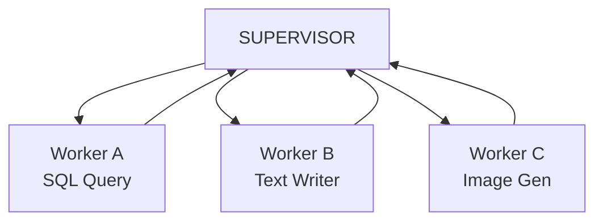

# Module 08: Multi-Agent Architectures

This module covers multi-agent design patterns: Supervisor, Hierarchical, Sequential, Parallel, Debate, Planner-Executor, and Blackboard, explaining how tasks are delegated, coordinated, and communicated across multiple specialized model entities.

> **Notebook Companion**: `08_multi_agent_architectures.ipynb`

---

## 1. Why Multi-Agent Systems?

Single-agent loops decay in performance as task range, prompt instruction density, and context history scale. **Multi-Agent Systems (MAS)** address this bottleneck by applying **division of labor** and **context isolation**:

- **Context Isolation**: Each agent only receives prompts, system rules, and history logs relevant to its narrow sub-domain, preventing vocabulary decay and attention dilution.
- **Specialization**: Specialized agents use optimized system prompts or fine-tuned parameters (e.g. a Writer agent focused on prose, an Editor agent focused on syntactic rules).

---

## 2. Multi-Agent Architectural Patterns

### A. Supervisor Pattern
A central **Supervisor Agent** acts as a dispatcher. It receives user prompts, decomposes tasks, dynamically routes sub-tasks to specialized worker nodes, collects their outputs, and manages state progression.

### B. Hierarchical Pattern
Extends the Supervisor pattern recursively. Nested supervisors delegate tasks down a organizational chart tree. Useful for enterprise software engineering or document generation pipelines.

### C. Sequential / Chain Pattern
State is passed sequentially from one agent to another (`Agent A -> Agent B -> Agent C`). For example: Researcher Agent → Writer Agent → Reviewer Agent.

### D. Debate Architectures
Opposing agents are given conflicting prompts (e.g., Optimistic Developer vs. Skeptical Security Auditor) and argue their perspectives. A Judge agent reads the debate transcripts to output the final balanced decision.

### E. Planner-Executor Pattern
One specialized agent compiles a task DAG (Planner), and a separate agent consumes the plan queue to invoke tools and run tests (Executor).

### F. Blackboard Pattern
Specialized agents read from and write to a shared global space (the "Blackboard") asynchronously. Agents self-trigger when they detect data in the blackboard that matches their capabilities.

---

## 3. Comparison of Multi-Agent Architectural Patterns

| Pattern | Control Flow | Communication Complexity | State Management | Production Latency |
|---|---|---|---|---|
| **Supervisor** | Centralized | Low (star topology) | Star supervisor node | Moderate ($5 - 15\text{s}$) |
| **Sequential** | Decentralized | Very Low (linear pipe) | Shared sequential dict | Moderate |
| **Debate** | Iterative | High (round-robin) | Shared dialogue logs | High ($15 - 45\text{s}$) |
| **Blackboard** | Asynchronous | Very High (publish-subscribe)| Shared central memory table | Very High |

### Comparison: Pros & Cons of Multi-Agent Patterns

| Pattern | Pros | Cons |
|---|---|---|
| **Supervisor** | - Simple star communication topology. - Easy to orchestrate and log centrally. | - Supervisor prompt becomes an execution bottleneck. - Gating agent prompt grows too large with worker descriptions. |
| **Sequential** | - Low token footprint. - Predictable latency and clean debugging traces. | - Inflexible: cannot backtrack or branch dynamically. - Failures cascade downstream directly. |
| **Debate** | - High critical accuracy and bias reduction. - Evaluates edge cases thoroughly. | - Rounds of debate multiply latency and costs exponentially. - Can lead to logical deadlocks if consensus is not reached. |
| **Blackboard** | - Decoupled workers scale horizontally independently. - High event-driven adaptability. | - Extremely difficult to debug execution graph loops. - Highly non-deterministic execution order. |

### When to Consider Multi-Agent Systems:
- **Best Use Case**: Complex, multi-domain software applications (e.g., writing a complete codebase, managing supply chain logistics, conducting cross-disciplinary medical research) where tasks are too large to fit in a single model prompt.
- **Avoid When**: Tasks require simple transactional logic or linear workflows (single-agent routers are significantly faster and cheaper).

### Production Tip: Message Token Filtering
In a Supervisor-Worker graph, **never** pass the full raw communication history of Worker A to Worker B. Instead, implement a **Message Filter**:
- Worker A generates raw logs and thoughts locally.
- The system summarizes Worker A's final answer, strips out the thought traces, and publishes only the summarized JSON payload back to the Supervisor, who forwards it to Worker B. This keeps downstream context windows clean and minimizes $O(N^2)$ message token inflation.

---

## 4. Detailed Computational Complexity (Time & Memory)

- **Execution Routing Overhead**: $O(C \cdot T \cdot d^2)$ total tokens spent across routing checks.
- **Dialogue Context Memory**: $O(\sum N_i)$ where $N_i$ is context window size of specialized agent $i$.
- **Component Denotations**:
  - $C$: Number of active specialized worker agents controlled by the coordination loop.
  - $T$: Total routing turns executed.
  - $d$: Underlying model embedding dimension.
  - $N_i$: Context window token length of agent $i$ (strictly bound to prevent state overflow).

---

## 5. Interview Questions & Production Trade-offs

### What problem does this solve?
Context window degradation and task confusion in single-agent architectures trying to execute dozens of heterogeneous task scopes.

### Why was it introduced?
To enable large scale, multi-domain automation (e.g., full software project generation) by nesting specialized models with localized contexts.

### What are its limitations?
- **High Token Costs**: Multiple LLMs querying each other leads to high token consumption.
- **Coordination Deadlocks**: Agent A waits for Agent B's output while Agent B waits for Agent A (circular dependency).

### Production Use Cases:
- Automated codebase updates: Planner agent edits → Linter agent checks syntax → Critic reviews design → Git commit agent logs modifications.
- Dynamic customer triage: Router routes user → Specialist resolves query → Supervisor evaluates ticket status.

### Follow-up Questions Interviewers Ask:
1. *How do you prevent context window explosion in multi-agent communication loops?*
   - **Answer**: Implement message isolation. Instead of passing the full dialogue transcript of all agents to every worker node, workers should only receive the specific sub-task string and a summarized payload of outputs from dependency nodes, discarding intermediate thought steps of other agents.
2. *Describe the Blackboard architectural pattern and its advantages.*
   - **Answer**: The Blackboard pattern features a central, shared database where all agents write progress and read tasks. There is no central supervisor routing calls; instead, agents continuously poll the blackboard for conditions matching their activation criteria (e.g., a "Code Reviewer" agent triggers whenever the blackboard status of a file changes to "COMPILED"). This decouples the worker nodes, allowing easy horizontal scaling.
