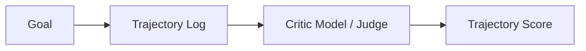

# Module 10: Agent Evaluation

This module details how to design evaluation frameworks for autonomous agent systems: task and tool success rates, reasoning quality checks, trajectory-level evaluation, cost/latency optimization, and LLM-as-a-Judge benchmarking methodologies.

> **Notebook Companion**: `10_agent_evaluation.ipynb`

---

## 1. Core Agent Performance Metrics

Traditional NLP metrics (ROUGE, BLEU) are insufficient for evaluating agents because intermediate tool sequences and logic execution paths are highly variable. Instead, we track:

1. **Task Success Rate (TSR)**: The percentage of user requests resolved correctly (validated against target state databases or assertions).
2. **Tool Invocation Accuracy (TIA)**: The proportion of tool calls executed with syntactically valid parameters, divided by total tool calls.
3. **Reasoning Quality**: The relevance and logical consistency of generated `Thought` trace outputs.
4. **Trajectory Length Efficiency**: The average number of steps taken to complete a goal vs. the optimal DAG step count.
5. **Hallucination Rate**: The count of hallucinated tool arguments or non-existent file path references.

---

## 2. Trajectory-Level Evaluation & LLM-as-a-Judge

### Trajectory Evaluation
Instead of evaluating only the final text output, developers inspect the **execution trajectory** (the ordered history log of `Thought -> Action -> Observation` steps).

```text

```

### LLM-as-a-Judge
- **Mechanism**: A larger, instruction-tuned evaluator model (e.g. GPT-4/Llama-3-70B) reads the full execution trajectory logs and rates them based on a rubric (e.g. 1–5 scale grading reasoning, choice of tools, and parameter safety).

#### Mathematical Intuition: Cohen's Kappa Coefficient (Judge Agreement)
When evaluating agents using LLM judges, we measure agreement rates between evaluator models or human graders using Cohen's Kappa ($\kappa$):

$$\kappa = \frac{p_o - p_e}{1 - p_e}$$

- $p_o$: Observed agreement rate (proportion of trajectories where judges agree on success/failure).
- $p_e$: Expected agreement by chance.

#### Step-by-Step Hand Calculation
- **Scenario**: Two evaluator judges rate $10$ agent trajectories.
  - Both agree on $6$ successes and $2$ failures.
  - Judge A says success on $2$ runs where Judge B says failure.
- **Calculation**:
  - **Observed Agreement**: $p_o = \frac{6 + 2}{10} = 0.80$.
  - **Marginal Probabilities**:
    - Judge A says success: $8/10 = 0.80$, failure: $2/10 = 0.20$.
    - Judge B says success: $6/10 = 0.60$, failure: $4/10 = 0.40$.
  - **Expected Chance Agreement**:
    $$p_e = (P(\text{Success}_A) \cdot P(\text{Success}_B)) + (P(\text{Failure}_A) \cdot P(\text{Failure}_B))$$
    $$p_e = (0.80 \times 0.60) + (0.20 \times 0.40) = 0.48 + 0.08 = 0.56$$
  - **Cohen's Kappa**:
    $$\kappa = \frac{0.80 - 0.56}{1 - 0.56} = \frac{0.24}{0.44} \approx 0.545$$
  - **Intuition**: A Kappa of $0.545$ indicates moderate agreement. Values $\ge 0.80$ are preferred for automated production pipelines.
- **Pairwise Win Rate**: Compares two agent configurations (e.g. temperature setting or prompt versions) to identify which trajectory completes the task more efficiently.

---

## 3. Cost & Latency Performance Constraints

In production, agents consume significant token counts due to repeated prompt formatting and context expansion.

$$\text{Total Cost} = \sum_{t=1}^{T} \left( (\text{Input Tokens}_t \cdot \text{Cost}_{\text{in}}) + (\text{Output Tokens}_t \cdot \text{Cost}_{\text{out}}) \right)$$

Optimization rules:
- Capping iteration steps ($T_{max} \le 5 - 10$).
- Discarding raw intermediate database results and logs from long-term memory buffers.

---

## 4. Comparison of Evaluation Methodologies

| Methodology | Metric Focus | Automation Level | Latency Profile | Primary Bias |
|---|---|---|---|---|
| **Assertions / Unit Tests** | Target environment state | 100% Automated | Extremely Low | Brittle (strict checks fail on styling updates) |
| **LLM-as-a-Judge** | Trajectory reasoning trace | 100% Automated | Moderate (extra LLM call) | Egocentric bias (prefers own generated output format) |
| **Human Review** | Real-world satisfaction | Manual / Crowdsourced | Extremely High | Subjective variance |

### Comparison: Pros & Cons of Evaluation Methodologies

| Method | Pros | Cons |
|---|---|---|
| **Deterministic Assertions** | - Executable in milliseconds.<br>- Zero API token cost.<br>- Deterministic result verification. | - Brittle: fails if text labels change styling.<br>- Cannot verify intermediate reasoning steps. |
| **LLM-as-a-Judge** | - Automates semantic evaluation at scale.<br>- Evaluates reasoning quality and safety. | - Prone to egocentric/length biases.<br>- High token cost per evaluation. |
| **Human Evaluation** | - Gold standard for real-world usability.<br>- Captures subjective user experience nuances. | - Extremely slow and expensive.<br>- Low inter-annotator agreement (high variance). |

### LLM-as-a-Judge Bias Mitigation Case Study
- **Problem**: Evaluator models (e.g. GPT-4) exhibit **Egocentric Bias** (preferring responses generated by their own model architecture due to vocabulary alignment) and **Length Bias** (giving higher scores to longer, wordy trajectory traces regardless of utility).
- **Production Solution**:
  1. **Strict Grading Rubric**: Provide the Judge model with a structured grading rubric. Ask it to evaluate specific criteria (e.g., "Goal Completion", "Tool Selection Count", "Safety Compliance") one by one before outputting the final score.
  2. **Anonymization**: Strip all agent model identifying tags from the trajectory logs before presenting them to the Judge.
  3. **Pairwise Shuffling**: When performing pairwise comparisons (Model A vs. Model B), shuffle the order of presentation and evaluate both `(A, B)` and `(B, A)` configurations, average the result to remove position biases.

### Production Tip: Staged Testing Pipelines
Implement a multi-tier CI/CD testing pipeline:
1. *Commit Gate (Unit Assertions)*: Fast assertions verifying that modifications to code do not break standard tool schemas or routing logic (zero cost, runs in seconds).
2. *Nightly Integration (LLM-as-a-Judge)*: Run 100 benchmark trajectories and query an evaluator model to score reasoning quality (low volume, moderate cost).
3. *Release Gate (Human Staging)*: Human developers run sandboxed evaluations of the release candidate before pushing to production.

---

## 5. Detailed Computational Complexity (Time & Memory)

- **Heuristic Assertion Time**: $O(1)$ constant time check.
- **Judge Token Evaluation Time**: $O(T \cdot N_{\text{tokens}})$ operations per trajectory.
- **Trajectory Storage Memory**: $O(T \cdot N_{\text{tokens}})$ bytes stored in logging DBs.
- **Component Denotations**:
  - $T$: Number of execution steps in the trajectory logs.
  - $N_{\text{tokens}}$: Average token count per step.

---

## 6. Interview Questions & Production Trade-offs

### What problem does this solve?
Fills the validation gap for non-deterministic agents, ensuring changes to system prompts or model upgrades improve task success rather than breaking tool calling pipelines.

### Why was it introduced?
Conventional text classification metrics (accuracy/F1) fail when evaluating systems that run multi-step actions on external databases.

### What are its limitations?
- **Judge Model Agreement**: Evaluator models can disagree with human experts, exhibiting length bias (favoring longer traces) or self-preference bias.
- **High cost**: Querying a judge model for every offline unit test trajectory doubles API token consumption.

### Production Use Cases:
- Offline CI/CD testing pipelines executing mock database updates and asserting state changes.
- A/B testing dashboards tracking average latency, token cost, and final task success rates.

### Follow-up Questions Interviewers Ask:
1. *How do you build a trajectory evaluation pipeline without paying for expensive evaluator model APIs?*
   - **Answer**: Implement functional assertions (state-based testing) in mock environments. Write tests that mock the target filesystem or database, run the agent autonomously, and programmatically assert the final state (e.g. verifying `db.select('users').where(id=102)` returns the modified status). This provides a deterministic, zero-cost task success rate metric.
2. *Describe the egocentric bias in LLM-as-a-Judge systems and how you mitigate it.*
   - **Answer**: Egocentric bias occurs when a model (e.g. Llama 3) grades its own generated trajectory traces higher than outputs from other models (e.g. Mistral) simply due to styling and vocabulary preference. Mitigate this by masking model source tags, shuffling the order of compared responses in pairwise tests, and using highly structured grading rubrics with step-by-step scoring prompts.
