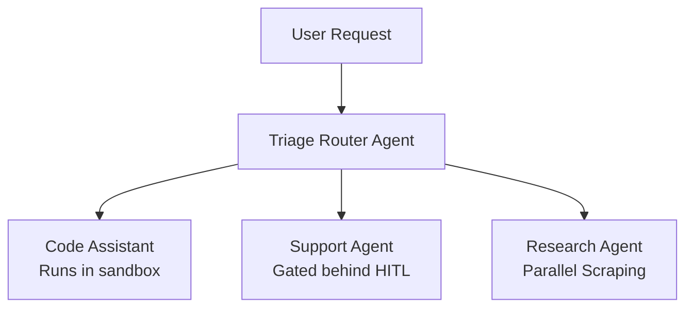

# Module 11: Production Agent Architectures

This module details production system design patterns for enterprise agents: Research Assistants, Coding Agents, Enterprise Knowledge Assistants, Customer Support Agents, and Autonomous Workflow Automation systems.

> **Notebook Companion**: `11_production_agent_architectures.ipynb`

---

## 1. Production System Considerations

Designing agent architectures for high-traffic enterprise environments requires balancing non-deterministic LLM loops with strict engineering SLAs:

- **State Management**: Persist execution context state in distributed datastores (e.g. PostgreSQL, Redis) instead of local node memory.
- **Reliability & Scaling**: Scale worker nodes horizontally to process asynchronous execution loops, using message queues (e.g. Celery, RabbitMQ) to distribute tasks.
- **Observability**: Implement trajectory-level tracing (logging input/output tokens, intermediate thoughts, and tool arguments) using custom instrumentation logs or standard distributed tracers.

---

## 2. Blueprints for 5 Enterprise Agent Architectures

### A. AI Coding Assistant
- **Objective**: Solve bug issues autonomously inside a repository workspace.
- **Components**: File System Parser, Sandboxed Test Runner, git client.
- **Data Flow**: Read issue → Trace local code files → Propose edit path → Write modifications to file → Run test compiler sandbox → **Backtrack / Replan if compiler fails** → Git commit.
- **State Management**: State tracks modified file buffers, test status, and remaining compiler errors.

### B. Customer Support Agent
- **Objective**: Resolve customer queries (e.g. ticket updates, refund approvals).
- **Components**: CRM database, Payment API, Human Approval Queue, Safety Guardrails.
- **Data Flow**: Ingest user query → Verify identity details → Query purchase logs → Check refund validity policies → **Gated Escalation if amount > USD 100** → Request human manager approval → Trigger Payment API → Notify customer.

### C. Research Assistant
- **Objective**: Collect and summarize information from multiple web sources.
- **Components**: Web Scraper, Search API router, Vector Summarizer.
- **Data Flow**: Parse query → Generate 3 sub-queries → Execute parallel searches → Clean scraped HTML → Vector search matches → Summarize findings → Format final report.

### D. Enterprise Knowledge Assistant
- **Objective**: Answer questions using private company data directories.
- **Components**: Dense/Sparse retrieval indexes, Vector database, Routing Classifier.

### E. Autonomous Workflow Automation Agent
- **Objective**: Periodically trigger API synchronizations and notify channels.
- **Components**: Cron trigger scheduler, Event listener, Blackboard task database.

---

## 3. Structural Synthesis of Blueprints

```text

```

---

## 4. Detailed Computational Complexity (Time & Memory)

- **Total Execution Time**: $O(T \cdot (t_{\text{api}} + t_{\text{inference}}))$ total latency.
- **Observability Logging Overhead**: $O(T \cdot N_{\text{tokens}})$ database storage capacity.
- **Component Denotations**:
  - $T$: Number of execution steps in the production loop.
  - $t_{\text{api}}$: Latency of external API dependencies (e.g., payment triggers, compilers).
  - $t_{\text{inference}}$: Latency of LLM query execution.
  - $N_{\text{tokens}}$: Token size of logs generated per step.

---

## 5. Interview Questions & Production Trade-offs

### What problem does this solve?
Applies software engineering patterns to non-deterministic agents, ensuring they scale horizontally, log execution logs, and run safely in corporate environments.

### Why was it introduced?
Single-agent prototypes built in notebooks fail in production due to lack of persistence, memory drift, lack of sandboxing, and high token costs.

### What are its limitations?
- **High Orchestration Latency**: Distributing agent state via databases and executing sandboxed containers adds latency overhead.
- **Security Exposure**: Integrating write-level API keys (payment gateways, code repositories) poses major security liabilities.

### Production Use Cases:
- Automated code maintenance assistants updating package versions and testing codebases autonomously.
- Enterprise document parsers classifying, extracting parameters, and validating invoices.

### Follow-up Questions Interviewers Ask:
1. *Design the state management database structure for a customer support agent in a multi-tenant enterprise system.*
   - **Answer**: The database schema must separate session states. Create a `sessions` table tracking `session_id`, `tenant_id`, `created_at`, and `state` (JSON storing task queues, user values, and execution parameters). Create a `trajectories` table tracking `step_id`, `session_id`, `thought`, `action_name`, `action_arguments` (encrypted to protect PII), and `observation`. Use Redis to cache the active context buffer for the live reasoning loop, committing final transaction outputs to PostgreSQL.
2. *How do you scale an agent codebase execution queue to process 10,000 parallel requests?*
   - **Answer**: Implement a stateless worker pattern. Standard web nodes receive incoming user queries, serialize them, and publish tasks to a RabbitMQ/Redis queue. Independent worker nodes (autoscaled using Kubernetes based on CPU/Queue length) pick up tasks, retrieve the session state from PostgreSQL, execute a single step in the reasoning loop, update the state, and publish the next step back to the queue if the loop is not completed. This keeps worker nodes completely stateless.
