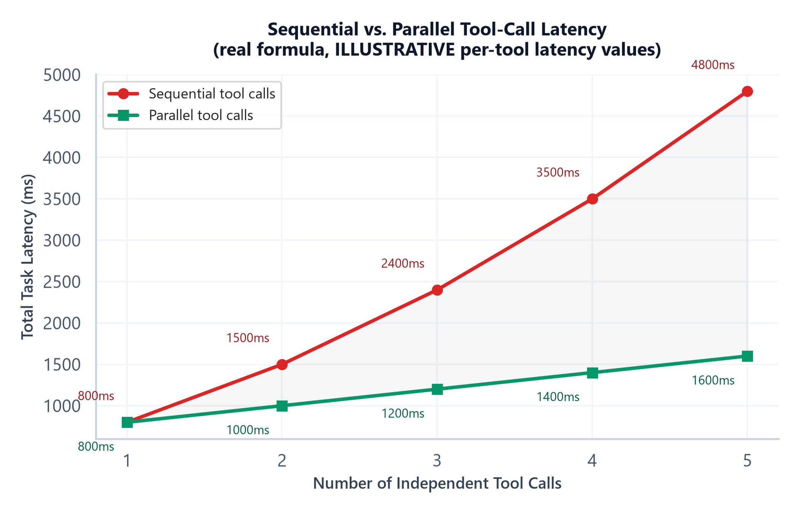

# Module 02: Tool Calling & Function Calling Internals

## 1. Introduction & Intuition

### The Core Bottleneck
An LLM's raw output is text. For an agent to actually *do* anything in the world — look something up, write a file, call an API, send a message — that text has to be turned into a structured, executable action, and the result of that action has to be turned back into something the model can reason about. Function calling (tool calling) is the mechanism that makes this round-trip possible: the model is given a set of tool definitions, decides which one (if any) to call and with what arguments, an external system actually executes the call, and the result is fed back into the model's context. Every part of that round-trip is a real engineering surface with its own failure modes — a badly-designed tool schema degrades which tool gets picked, unsafe execution order can corrupt state, and a tool with real side effects that gets called twice by accident can cause real, unrecoverable damage.

### High-Level Intuition
Think of tool schemas as a restaurant menu the model has to order from without ever having seen the kitchen. A menu with clear, distinct item names and precise descriptions makes it easy to order the right dish; a menu with ten dishes that all sound similar, vaguely worded, with unclear which toppings are required vs. optional, makes it easy to order the wrong thing even for a customer who knew exactly what they wanted. And once an order is placed, some dishes can be prepared in parallel (a salad and a soup don't depend on each other) while others genuinely can't (you can't plate the dish before it's cooked) — the kitchen's job is knowing which is which, not blindly parallelizing everything or blindly serializing everything.

---

## 2. Core Concepts & Mathematical Formulation

### Tool Schema Design & Its Effect on Selection Accuracy

#### Intuition & Practical Use
A tool schema is the model's *only* information about what a tool does and how to call it — it has no other way to know. Four schema-design factors directly, measurably affect how often the model picks the right tool and calls it correctly:
*   **Tool naming.** A name like `search` next to another tool named `search_v2` gives the model almost nothing to distinguish them by; `search_internal_wiki` vs. `search_public_web` is unambiguous.
*   **Description quality.** A one-line description that doesn't state *when* to use a tool (vs. just *what* it does) leaves the model guessing at applicability from the name alone.
*   **Required vs. optional parameter design.** Marking a parameter required when it's genuinely optional forces the model to either fabricate a value or fail the call; marking a genuinely-required parameter optional lets the model skip it and silently produce a malformed or underspecified call.
*   **Total number of available tools.** Beyond a moderate count, especially with several similarly-described tools, selection accuracy measurably degrades — the model has to discriminate among a larger, noisier set of options every single call, not just when the "right" tool happens to be among the ambiguous ones.

None of this is fixed by prompting harder after the fact — it's fixed by treating schema design itself as the primary lever for selection accuracy, the same way a well-designed API is easier for a human developer to use correctly than a poorly-documented one.

### Safe Parallel vs. Sequential Tool Execution

#### Intuition & Practical Use
Two tool calls are safe to run in parallel exactly when neither one's input depends on the other's output, and neither has a side effect the other's execution order matters for. Two independent read-only lookups (checking today's weather and checking a stock price) are safe to parallelize — nothing about one call changes what the other should do. A tool call whose argument is the *result* of a previous call must run sequentially, by definition — there's no value to pass it yet. And two tool calls with real side effects that touch the same resource (e.g., two calls that both modify the same record) need sequential execution even if neither's *input* technically depends on the other, specifically to avoid a race condition in what state the resource ends up in. The general principle — build a real dependency graph between planned actions, and only parallelize the parts of that graph with no edge between them — is the same principle Module 06 applies one level up, to whether independent *agents* (not just tool calls) can run concurrently.

### Idempotent Tool Execution for Side-Effecting Tools

#### Intuition & Practical Use
A read-only tool call (checking a price, searching a document) can be safely retried on failure — calling it twice does no harm, since it doesn't change anything. A tool call with a real side effect (charging a payment, sending an email, deleting a record) is a different problem entirely: if the call actually succeeded but the response was lost (a network timeout after the action completed), a naive retry executes the action *again* — a duplicate charge, a duplicate email. Three real mechanisms address this: an **idempotency key** — a unique identifier generated once per logical action and passed with every retry attempt, so the receiving system can recognize "I've already done this" and return the original result instead of repeating the action; a **confirmation gate** — requiring explicit approval (human or a separate policy check) before an irreversible action executes at all, catching a wrong decision *before* it becomes a real side effect rather than after; and **safe-retry design** — only auto-retrying calls that are provably safe to repeat (read-only, or genuinely idempotent by the key mechanism above), never blindly retrying an arbitrary failed side-effecting call.

---

### Hand Calculation: Sequential vs. Parallel Tool-Call Latency
Three independent, safe-to-parallelize tools with real, different execution latencies — 200ms, 400ms, and 600ms — plus a fixed 300ms LLM round-trip overhead per call the model makes.

*   **Step 1: Sequential total.** The model must make one LLM call to decide on *each* tool in turn (3 decision calls), plus one final synthesis call once all three results are in — 4 LLM round trips total — plus each tool's own execution time, since nothing overlaps:
    $$T_{\text{sequential}} = (n+1) \times t_{\text{LLM}} + \sum_{i=1}^{n} t_{\text{tool},i} = (3+1) \times 300\text{ms} + (200+400+600)\text{ms} = 1{,}200 + 1{,}200 = 2{,}400\text{ms}$$

*   **Step 2: Parallel total.** The model makes exactly one decision call that requests all three tool calls at once (modern function-calling APIs support this directly), the three tools execute concurrently — the slowest one determines when they're all done — then one final synthesis call:
    $$T_{\text{parallel}} = 2 \times t_{\text{LLM}} + \max_{i}(t_{\text{tool},i}) = 2 \times 300\text{ms} + 600\text{ms} = 600 + 600 = 1{,}200\text{ms}$$

*   **Step 3: Speedup.**
    $$\frac{T_{\text{sequential}}}{T_{\text{parallel}}} = \frac{2{,}400}{1{,}200} = 2.0\text{x}$$

Two compounding effects produce the 2x speedup here: fewer LLM round trips (2 instead of 4, since the model requests all three tools in one decision call) *and* the tool executions overlapping (600ms, the slowest one, instead of their 1,200ms sum). This is why "safe to parallelize" (the previous section) is the real gate — this speedup only exists because the three tools are genuinely independent; a data dependency between them would force the sequential path regardless of what the round-trip savings might otherwise offer.



*   **Plot Interpretation:** The gap between the two lines widens as more independent tools are added — sequential latency grows with both the tool count (more decision round trips) *and* the sum of tool latencies, while parallel latency grows only with the *slowest* individual tool, making the value of safe parallelization increasingly visible as tool count grows. The underlying formula is real; the specific per-tool latency values (200/400/600/800/1000ms) are illustrative example numbers, not measurements.

---

### Hand Calculation: Per-Task Cost Model
A small multi-turn tool-calling task: one initial decision turn requesting the 3 parallel tool calls above (800 input tokens, 150 output tokens), one final synthesis turn incorporating the tool results (1,200 input tokens, 200 output tokens), generation pricing of \$2.50 per million tokens, and a flat \$0.001 per-call cost for each of the 3 tool APIs.

$$\text{Cost}_{\text{task}} = \sum_{i=1}^{n_{\text{turns}}} (\text{tokens}_{\text{in},i} + \text{tokens}_{\text{out},i}) \times \text{price}_{\text{token}} + \sum_{j=1}^{n_{\text{tools}}} \text{cost}_{\text{tool},j}$$

*   **Step 1: Turn 1 (decision) cost.**
    $$(800 + 150) \times \$0.0000025 = 950 \times \$0.0000025 = \$0.002375$$

*   **Step 2: Turn 2 (synthesis) cost.**
    $$(1{,}200 + 200) \times \$0.0000025 = 1{,}400 \times \$0.0000025 = \$0.0035$$

*   **Step 3: Tool costs.**
    $$3 \times \$0.001 = \$0.003$$

*   **Step 4: Total task cost.**
    $$\$0.002375 + \$0.0035 + \$0.003 = \$0.008875 \approx \$0.0089$$

This single number — well under a cent for this task — is what Module 08's "cost per successful task" metric measures in aggregate across many real runs, and what Module 09's production cost budgets are set against; a per-task cost model like this one is the concrete building block both depend on.

<div align="center" style="margin: 20px 0; max-width: 100%; overflow-x: auto;">
<svg viewBox="0 0 760 260" width="100%" height="auto" xmlns="http://www.w3.org/2000/svg" style="background-color: #f8fafc; border: 1px solid #e2e8f0; border-radius: 8px; font-family: system-ui, -apple-system, sans-serif;">
  <text x="380" y="22" text-anchor="middle" font-size="13" font-weight="bold" fill="#0f172a">Sequential vs. Parallel Tool-Call Timelines (matches the hand calc)</text>

  <text x="20" y="55" font-size="10.5" font-weight="600" fill="#991b1b">Sequential: 4 LLM round trips, tools run one after another -- 2,400ms total</text>
  <g font-size="8.5">
    <rect x="20" y="65" width="55" height="26" fill="#f1f5f9" stroke="#64748b" stroke-width="1"/>
    <text x="47" y="82" text-anchor="middle" fill="#334155">LLM 300</text>
    <rect x="75" y="65" width="36" height="26" fill="#fee2e2" stroke="#dc2626" stroke-width="1"/>
    <text x="93" y="82" text-anchor="middle" fill="#991b1b">T1 200</text>
    <rect x="111" y="65" width="55" height="26" fill="#f1f5f9" stroke="#64748b" stroke-width="1"/>
    <text x="138" y="82" text-anchor="middle" fill="#334155">LLM 300</text>
    <rect x="166" y="65" width="72" height="26" fill="#fee2e2" stroke="#dc2626" stroke-width="1"/>
    <text x="202" y="82" text-anchor="middle" fill="#991b1b">T2 400</text>
    <rect x="238" y="65" width="55" height="26" fill="#f1f5f9" stroke="#64748b" stroke-width="1"/>
    <text x="265" y="82" text-anchor="middle" fill="#334155">LLM 300</text>
    <rect x="293" y="65" width="108" height="26" fill="#fee2e2" stroke="#dc2626" stroke-width="1"/>
    <text x="347" y="82" text-anchor="middle" fill="#991b1b">T3 600</text>
    <rect x="401" y="65" width="55" height="26" fill="#f1f5f9" stroke="#64748b" stroke-width="1"/>
    <text x="428" y="82" text-anchor="middle" fill="#334155">LLM 300</text>
  </g>
  <text x="470" y="82" font-size="9.5" fill="#991b1b" font-weight="600">= 2,400ms</text>

  <text x="20" y="130" font-size="10.5" font-weight="600" fill="#065f46">Parallel: 2 LLM round trips, tools run concurrently -- 1,200ms total</text>
  <g font-size="8.5">
    <rect x="20" y="140" width="55" height="26" fill="#f1f5f9" stroke="#64748b" stroke-width="1"/>
    <text x="47" y="157" text-anchor="middle" fill="#334155">LLM 300</text>
    <rect x="75" y="140" width="36" height="20" fill="#d1fae5" stroke="#059669" stroke-width="1"/>
    <text x="93" y="154" text-anchor="middle" fill="#065f46" font-size="7.5">T1 200</text>
    <rect x="75" y="163" width="72" height="20" fill="#d1fae5" stroke="#059669" stroke-width="1"/>
    <text x="111" y="177" text-anchor="middle" fill="#065f46" font-size="7.5">T2 400</text>
    <rect x="75" y="186" width="108" height="20" fill="#d1fae5" stroke="#059669" stroke-width="1"/>
    <text x="129" y="200" text-anchor="middle" fill="#065f46" font-size="7.5">T3 600 (slowest -- sets the pace)</text>
    <rect x="183" y="140" width="55" height="26" fill="#f1f5f9" stroke="#64748b" stroke-width="1"/>
    <text x="210" y="157" text-anchor="middle" fill="#334155">LLM 300</text>
  </g>
  <text x="260" y="157" font-size="9.5" fill="#065f46" font-weight="600">= 1,200ms</text>

  <text x="380" y="238" text-anchor="middle" font-size="9" fill="#64748b">Same 3 tools, same total tool work -- concurrency and fewer round trips are what change, not the work itself.</text>
</svg>
</div>

---

## 3. Implementation & Reference Code

Below is a self-contained implementation of the latency/cost hand calculations above, plus a dependency-based safe-parallelization check and an idempotency-key wrapper for side-effecting tool calls.

```python
from dataclasses import dataclass, field


@dataclass
class ToolCall:
    name: str
    latency_ms: float
    depends_on: list[str] = field(default_factory=list)  # names of tool calls this one needs results from
    has_side_effect: bool = False


def sequential_latency_ms(tool_calls: list[ToolCall], llm_overhead_ms: float) -> float:
    """T_sequential = (n+1) * llm_overhead + sum(tool_latencies). Matches the hand calc."""
    n = len(tool_calls)
    return (n + 1) * llm_overhead_ms + sum(t.latency_ms for t in tool_calls)


def parallel_latency_ms(tool_calls: list[ToolCall], llm_overhead_ms: float) -> float:
    """T_parallel = 2 * llm_overhead + max(tool_latencies). Only valid if every call is
    actually safe to parallelize -- callers must check is_safe_to_parallelize first."""
    return 2 * llm_overhead_ms + max(t.latency_ms for t in tool_calls)


def is_safe_to_parallelize(tool_calls: list[ToolCall]) -> bool:
    """Real dependency check: safe only if no call depends on another's output, and no
    two calls with side effects touch (by name convention here) the same resource."""
    names = {t.name for t in tool_calls}
    for t in tool_calls:
        if any(dep in names for dep in t.depends_on):
            return False  # a real data dependency exists within this batch
    side_effecting = [t.name for t in tool_calls if t.has_side_effect]
    return len(side_effecting) == len(set(side_effecting))  # no duplicate-resource side effects


@dataclass
class TaskCostModel:
    """Per-task cost model matching the hand calc: sum of (turn tokens * price) + sum of tool costs."""
    price_per_token: float
    turns: list[tuple[int, int]] = field(default_factory=list)  # (tokens_in, tokens_out) per turn
    tool_costs: list[float] = field(default_factory=list)

    def total_cost(self) -> float:
        llm_cost = sum((tin + tout) * self.price_per_token for tin, tout in self.turns)
        tool_cost = sum(self.tool_costs)
        return llm_cost + tool_cost


class IdempotencyStore:
    """Minimal idempotency-key store: a side-effecting call is only actually executed
    once per key; a retry with the same key returns the original result."""
    def __init__(self):
        self._results: dict[str, str] = {}

    def execute(self, idempotency_key: str, side_effecting_fn) -> str:
        if idempotency_key in self._results:
            return self._results[idempotency_key]  # already executed -- return original result, don't repeat it
        result = side_effecting_fn()
        self._results[idempotency_key] = result
        return result


if __name__ == "__main__":
    # Hand calc verification: 3 independent tools, 200/400/600ms, 300ms LLM overhead
    tools = [ToolCall("tool1", 200), ToolCall("tool2", 400), ToolCall("tool3", 600)]
    assert is_safe_to_parallelize(tools)

    seq = sequential_latency_ms(tools, llm_overhead_ms=300)
    par = parallel_latency_ms(tools, llm_overhead_ms=300)
    print(f"Sequential: {seq:.0f}ms, Parallel: {par:.0f}ms, Speedup: {seq / par:.1f}x")
    assert seq == 2400.0
    assert par == 1200.0
    assert abs(seq / par - 2.0) < 1e-9

    # A dependent tool call forces sequential execution regardless of latency savings
    dependent_tools = [ToolCall("lookup", 200), ToolCall("act_on_result", 300, depends_on=["lookup"])]
    assert not is_safe_to_parallelize(dependent_tools)
    print("Dependency check verified: a real data dependency correctly blocks parallelization")

    # Cost hand calc verification
    cost_model = TaskCostModel(
        price_per_token=2.50 / 1_000_000,
        turns=[(800, 150), (1200, 200)],
        tool_costs=[0.001, 0.001, 0.001],
    )
    total = cost_model.total_cost()
    print(f"\nTotal task cost: ${total:.6f}")
    assert abs(total - 0.008875) < 1e-9

    # Idempotency verification: a "retried" side-effecting call executes only once
    store = IdempotencyStore()
    call_count = {"n": 0}

    def charge_payment():
        call_count["n"] += 1
        return f"charged (execution #{call_count['n']})"

    first = store.execute("payment-key-abc123", charge_payment)
    retried = store.execute("payment-key-abc123", charge_payment)  # simulates a retry after a lost response
    print(f"\nFirst call result: {first}")
    print(f"Retried call result: {retried}")
    assert first == retried == "charged (execution #1)"
    assert call_count["n"] == 1, "The side-effecting function must execute exactly once, not once per retry"
    print("Idempotency verified: retry returned the original result without duplicating the side effect")
```

---

## 4. Interview Deep-Dive & System Trade-offs

### 1. Architectural & Production Trade-offs
* **Core Problem Solved:** Turning a model's text output into a structured, executable action, and getting that action's real-world result back into the model's reasoning — the mechanism that lets an agent do anything beyond generating text.
* **Why Introduced over Legacy Approaches:** Free-text instructions parsed with regex/heuristics are brittle and don't scale past a handful of simple, rigidly-formatted actions; structured function-calling gives the model a machine-checkable schema to conform to, and lets tool-selection accuracy be measured and improved as its own concern.
* **Key Failure Modes & Limitations:** Poor schema design (ambiguous names/descriptions, wrong required/optional design, too many similar tools) directly degrades tool-selection accuracy; unsafe parallelization of dependent calls corrupts execution order; naive retries of side-effecting calls without idempotency protection cause real, sometimes irreversible duplicate actions.

### 2. System Complexity & Scaling
* **Time Complexity (FLOPs):** Sequential tool-call latency is $O(n)$ in both LLM round trips and summed tool latency; parallel execution reduces the tool-latency term to $O(1)$ relative to $n$ (bounded by the slowest single call) when the dependency graph allows it.
* **Space/Memory Footprint:** Every tool call's result typically needs to stay in context for subsequent reasoning, so context size grows with the number of tool round trips in a task — directly connecting to Module 04's context-budget concerns.
* **Primary Bottleneck Type:** Latency-bound on the LLM round-trip count and the critical-path tool latency (the slowest parallel branch, or the full sequential sum); cost-bound on cumulative token usage across turns plus per-call tool API costs.
* **Variable Legend:** $n$ = number of tool calls in a batch, $t_{\text{LLM}}$ = LLM round-trip overhead, $t_{\text{tool},i}$ = individual tool execution latency, $\text{price}_{\text{token}}$ = generation token price.

### 3. Production & Scalability
* **Deployment Considerations:** Treat tool schema design as a first-class, testable artifact — measure tool-selection accuracy on a held-out set of real queries whenever a schema changes, the same discipline as testing any other API contract; require idempotency keys on every side-effecting tool by default, not as an opt-in added after an incident.
*   **Common Interviewer Follow-Up Questions:**
    1.  *Q:* How would you decide whether two tool calls are safe to parallelize?
        *   *A:* Build the real dependency graph — does either call's input come from the other's output, and do any two side-effecting calls touch the same resource — and only parallelize the parts of the graph with no such edge; when in doubt, sequential is the safe default.
    2.  *Q:* A payment tool call times out — the request may or may not have actually gone through. How do you handle the retry safely?
        *   *A:* Never blindly retry a side-effecting call on ambiguous failure; use an idempotency key generated once for that logical action, so the receiving system can recognize a retry and return the original result instead of executing the charge a second time.
