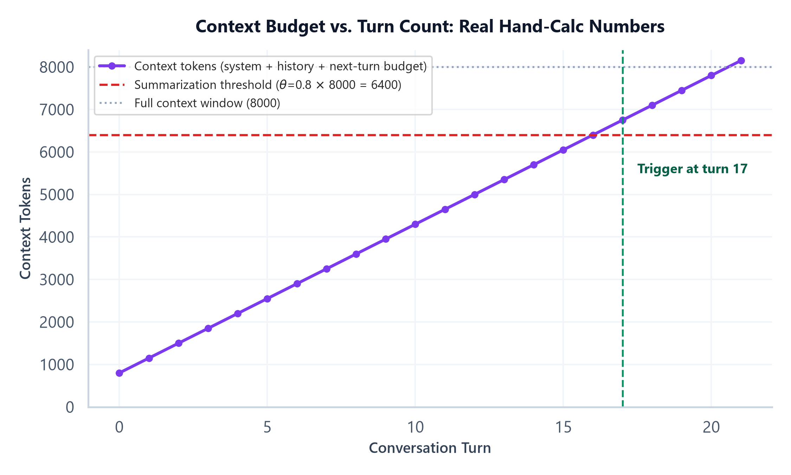

# Module 04: Context, State & Memory for Agents

## 1. Introduction & Intuition

### The Core Bottleneck
"Context," "state," and "memory" are the single most commonly conflated set of terms in agent system design — used interchangeably in casual conversation, but they answer three genuinely different questions, and conflating them produces real design mistakes: storing something as ephemeral state when it needed to survive across sessions (it's lost the moment the run ends), or storing everything as persistent memory when most of it was only ever needed for the current run (bloating a memory store with noise nobody will ever retrieve). Getting this distinction precise is a prerequisite for the rest of this module, not a pedantic warm-up.

### High-Level Intuition
Think of a single work session at a desk. **Context** is everything actually spread out on the desk in front of you right now — the documents you're looking at this exact moment. **State** is your current progress on the task at hand — which step of the process you're on, what you've already tried — the kind of thing you'd need a colleague to know if they had to take over from you mid-task without starting from scratch. **Memory** is what you deliberately write down in your notebook specifically because you know you'll need it again next week, after this session is long over and the desk has been cleared. All three matter, but they're not the same thing, and an agent system that doesn't distinguish them will confuse "what does the model see right now" with "what does the model need to resume this task" with "what should genuinely outlive this task."

---

## 2. Core Concepts & Mathematical Formulation

### The Three-Way Distinction: Context vs. State vs. Memory

#### Intuition & Practical Use
*   **Context** is the actual information sent to the model on a given call — the assembled prompt: system instructions, tool schemas, retrieved memory, and whatever state is relevant right now. Context is *what the model can literally see this turn*, nothing more.
*   **State** is the information required to execute or resume the current workflow — often ephemeral or checkpointed, scoped to one run, and owned by the orchestration layer (Module 05's subject). If the process crashes mid-task, state is what a checkpoint restores so the workflow can resume without starting over.
*   **Memory** is information *intentionally* persisted across interactions or sessions — deliberately written and deliberately retrieved, not automatically carried forward the way state is within a single run.

The three compose rather than sit as independent layers: on any given turn, **context is the projection point** where relevant state and retrieved memory both get assembled into what the model actually sees. Get this wrong and two distinct classes of bug appear: something stored only as ephemeral state silently vanishes the moment a run ends, even though it was actually needed next week (it should have been memory); or a memory store gets flooded with information that was only ever relevant to one specific run's internal progress and nobody will ever usefully retrieve later (it should have stayed state).

<div align="center" style="margin: 20px 0; max-width: 100%; overflow-x: auto;">
<svg viewBox="0 0 780 260" width="100%" height="auto" xmlns="http://www.w3.org/2000/svg" style="background-color: #f8fafc; border: 1px solid #e2e8f0; border-radius: 8px; font-family: system-ui, -apple-system, sans-serif;">
  <text x="390" y="22" text-anchor="middle" font-size="13" font-weight="bold" fill="#0f172a">Context vs. State vs. Memory: How They Compose</text>

  <rect x="30" y="55" width="200" height="70" rx="6" fill="#eff6ff" stroke="#3b82f6" stroke-width="1.5"/>
  <text x="130" y="80" text-anchor="middle" font-size="11.5" fill="#1e3a8a" font-weight="600">State</text>
  <text x="130" y="96" text-anchor="middle" font-size="8.5" fill="#1e3a8a">Needed to resume THIS run.</text>
  <text x="130" y="109" text-anchor="middle" font-size="8.5" fill="#1e3a8a">Owned by orchestration (Mod. 05).</text>

  <rect x="30" y="150" width="200" height="70" rx="6" fill="#f5f3ff" stroke="#7c3aed" stroke-width="1.5"/>
  <text x="130" y="175" text-anchor="middle" font-size="11.5" fill="#5b21b6" font-weight="600">Memory</text>
  <text x="130" y="191" text-anchor="middle" font-size="8.5" fill="#5b21b6">Intentionally persisted</text>
  <text x="130" y="204" text-anchor="middle" font-size="8.5" fill="#5b21b6">ACROSS sessions.</text>

  <g stroke="#94a3b8" stroke-width="1.6" fill="none" marker-end="url(#arrow04a)">
    <line x1="230" y1="90" x2="330" y2="115"/>
    <line x1="230" y1="185" x2="330" y2="140"/>
  </g>
  <defs>
    <marker id="arrow04a" markerWidth="8" markerHeight="8" refX="6" refY="4" orient="auto">
      <path d="M0,0 L8,4 L0,8 Z" fill="#94a3b8"/>
    </marker>
  </defs>

  <rect x="340" y="90" width="220" height="90" rx="6" fill="#ecfdf5" stroke="#059669" stroke-width="1.8"/>
  <text x="450" y="118" text-anchor="middle" font-size="12" fill="#065f46" font-weight="700">Context</text>
  <text x="450" y="136" text-anchor="middle" font-size="8.5" fill="#065f46">What the model actually SEES</text>
  <text x="450" y="149" text-anchor="middle" font-size="8.5" fill="#065f46">on THIS call -- the projection</text>
  <text x="450" y="162" text-anchor="middle" font-size="8.5" fill="#065f46">point where relevant state +</text>
  <text x="450" y="175" text-anchor="middle" font-size="8.5" fill="#065f46">retrieved memory both land.</text>

  <g stroke="#94a3b8" stroke-width="1.6" fill="none" marker-end="url(#arrow04a)">
    <line x1="560" y1="135" x2="640" y2="135"/>
  </g>
  <rect x="640" y="105" width="120" height="60" rx="6" fill="#fef9c3" stroke="#ca8a04" stroke-width="1.4"/>
  <text x="700" y="128" text-anchor="middle" font-size="10" fill="#854d0e" font-weight="600">Model's</text>
  <text x="700" y="142" text-anchor="middle" font-size="10" fill="#854d0e" font-weight="600">generation</text>
  <text x="700" y="156" text-anchor="middle" font-size="8" fill="#854d0e">this turn</text>

  <text x="390" y="240" text-anchor="middle" font-size="9" fill="#64748b">A crash loses unsaved state; a properly-scoped memory store survives it -- that's the real, practical test of which one something is.</text>
</svg>
</div>

### Short-Term vs. Long-Term Memory

#### Intuition & Practical Use
Short-term memory (a conversation buffer, a sliding window of recent turns) lives naturally within a single session and is usually just carried forward turn to turn with no separate storage system — it's really an implementation detail of how a run's context gets built up, sitting close to state in practice even though conceptually it's still memory (it's still deliberately retained information, just retained for the duration of one session). Long-term memory is explicitly persisted to outlive the session entirely — the next time a user starts a new conversation, long-term memory is what lets the agent recall something from weeks ago that a fresh session's empty conversation buffer never would.

### Episodic vs. Semantic Memory

#### Intuition & Practical Use
Episodic memory is memory of specific *events* — "the user asked about X on Tuesday and I told them Y." Semantic memory is memory of general *facts* extracted and generalized from those events — "this user prefers concise answers," a fact that might have been inferred from many episodes rather than stored as any one of them. Episodic memory answers "what happened"; semantic memory answers "what do I now know," having already generalized past the specific episode that taught it. Production memory systems often maintain both: raw episodic logs for traceability, plus a distilled semantic layer that's cheaper to retrieve from and doesn't require re-deriving the same generalization on every query.

### Vector-Store-Backed Long-Term Memory: A RAG-Adjacent Problem

#### Intuition & Practical Use
Retrieving the *relevant* slice of a large long-term memory store for the current context is structurally the same problem `03_advanced_rag` solves for document retrieval — embed memories, index them, retrieve the nearest ones to the current query/context. This module doesn't re-derive that mechanism; it's the same embeddings, vector indexing, and hybrid retrieval machinery, just applied to a memory store instead of a document corpus. What's specific to *agent* memory rather than generic RAG is the write side — deciding what's worth writing to memory in the first place (the next subsection) — which document-retrieval RAG doesn't need to solve, since its corpus is typically given, not accumulated by the system's own behavior.

### Memory Summarization & Compression

#### Intuition & Practical Use
Context windows are finite, and a long-running conversation's full history eventually won't fit. Memory summarization compresses older turns into a shorter summary that preserves the gist while discarding verbatim detail — trading recall completeness (the compressed version can't answer a question about an exact quote from ten turns ago) for staying within budget. *When* to trigger this compression is a real, quantifiable decision, not a vague "when it gets long" judgment call.

### Memory Write Policies

#### Intuition & Practical Use
Not everything that happens during a run is worth remembering — writing indiscriminately turns a memory store into noise that dilutes genuinely useful retrieval later. A write policy is the explicit rule for what gets persisted to long-term memory at all: a user's stated preference (durable, worth remembering), versus an incidental detail of one specific task's internal progress (state, not memory — it shouldn't outlive the run in the first place, tying directly back to this module's opening distinction).

---

### Hand Calculation: When to Trigger Memory Summarization
An agent with an 8,000-token context window, a fixed 500-token system-prompt-plus-tool-schema overhead, a 300-token reserved budget for the next turn's own content, a summarization threshold of 80% of the window, and conversation history growing by roughly 350 tokens per turn (user message plus assistant response, averaged).

*   **Step 1: Compute the absolute token threshold.**
    $$\theta \times \text{context\_window} = 0.8 \times 8{,}000 = 6{,}400 \text{ tokens}$$

*   **Step 2: Subtract the fixed overhead to find the history budget.**
    $$\text{history\_budget} = 6{,}400 - (\text{tokens}_{\text{system}} + \text{tokens}_{\text{next\_turn\_budget}}) = 6{,}400 - (500 + 300) = 5{,}600 \text{ tokens}$$

*   **Step 3: Solve for the triggering turn.**
    $$\text{turn}_{\text{trigger}} = \left\lceil \frac{\text{history\_budget}}{\text{tokens\_per\_turn}} \right\rceil + 1 = \left\lceil \frac{5{,}600}{350} \right\rceil + 1 = 16 + 1 = 17$$

At exactly turn 16, accumulated history is $350 \times 16 = 5{,}600$ tokens — precisely *at* the budget, not yet *over* it, so the trigger condition ($>$, strictly greater) doesn't fire yet. Turn 17 pushes history to 5,950 tokens, the first point that genuinely exceeds the threshold — summarization must trigger there to keep total context under the 6,400-token budget with room to spare before hitting the hard 8,000-token ceiling.



*   **Plot Interpretation:** The context-token line grows linearly with turn count until the trigger point, where summarization would compress the accumulated history and reset the growth — the plot shows the real, computed pre-summarization trajectory and exactly where it crosses the real threshold, not an illustrative shape.

---

## 3. Implementation & Reference Code

Below is a self-contained implementation of the summarization-trigger hand calculation, plus a minimal illustration of the Context/State/Memory distinction as three separate, explicitly-scoped stores.

```python
import math
from dataclasses import dataclass, field


def summarization_trigger_turn(context_window: int, theta: float, tokens_system: int,
                                 tokens_next_turn_budget: int, tokens_per_turn: int) -> int:
    """Solves for the first turn where accumulated history would push total context
    strictly over theta * context_window. Matches the hand calculation above."""
    threshold = theta * context_window
    history_budget = threshold - (tokens_system + tokens_next_turn_budget)
    assert history_budget > 0, "Fixed overhead alone already exceeds the summarization threshold"
    turns_to_reach_budget = history_budget / tokens_per_turn
    return math.ceil(turns_to_reach_budget) + 1  # first turn that strictly exceeds, not just reaches


@dataclass
class RunState:
    """STATE: scoped to one run, needed to resume it, NOT intended to outlive the run."""
    run_id: str
    current_step: int = 0
    scratch_data: dict = field(default_factory=dict)


@dataclass
class LongTermMemory:
    """MEMORY: intentionally persisted, explicitly written, survives across runs/sessions."""
    entries: list[str] = field(default_factory=list)

    def write(self, fact: str, write_policy) -> bool:
        """Only persist what the write policy actually judges durable -- never write
        indiscriminately, per the Memory Write Policies section above."""
        if write_policy(fact):
            self.entries.append(fact)
            return True
        return False


def assemble_context(system_prompt: str, run_state: RunState, memory: LongTermMemory,
                      current_turn_input: str, memory_query_fn) -> str:
    """CONTEXT: the actual assembled prompt sent to the model this turn -- the
    projection point where relevant state and retrieved memory both land."""
    relevant_memories = memory_query_fn(memory.entries, current_turn_input)
    return (
        f"[SYSTEM] {system_prompt}\n"
        f"[STATE] step={run_state.current_step}, scratch={run_state.scratch_data}\n"
        f"[RETRIEVED MEMORY] {relevant_memories}\n"
        f"[CURRENT TURN] {current_turn_input}"
    )


if __name__ == "__main__":
    # Hand calc verification
    trigger_turn = summarization_trigger_turn(
        context_window=8000, theta=0.8, tokens_system=500,
        tokens_next_turn_budget=300, tokens_per_turn=350,
    )
    print(f"Summarization must trigger at turn: {trigger_turn}")
    assert trigger_turn == 17

    # Context/State/Memory distinction, illustrated as three genuinely separate stores
    state = RunState(run_id="run-42", current_step=2, scratch_data={"partial_result": "draft v1"})
    memory = LongTermMemory()

    def write_policy(fact: str) -> bool:
        # Only durable, cross-session-relevant facts get persisted -- not run-internal scratch data
        return "preference" in fact or "policy" in fact

    memory.write("User prefers concise, bulleted answers (preference)", write_policy)
    memory.write("Draft v1 of this specific task's output (scratch, not durable)", write_policy)
    print(f"\nMemory entries written: {len(memory.entries)}")
    assert len(memory.entries) == 1  # only the durable preference was written, not the scratch note
    print(f"Kept: {memory.entries[0]}")

    def fake_memory_query(entries, query):
        return [e for e in entries if "preference" in e]

    context = assemble_context(
        system_prompt="You are a helpful assistant.",
        run_state=state,
        memory=memory,
        current_turn_input="What's the weather like?",
        memory_query_fn=fake_memory_query,
    )
    print(f"\nAssembled context:\n{context}")
    assert "[STATE]" in context and "[RETRIEVED MEMORY]" in context
    print("\nContext/State/Memory distinction verified: state and memory are separate stores that both project into one assembled context.")
```

---

## 4. Interview Deep-Dive & System Trade-offs

### 1. Architectural & Production Trade-offs
* **Core Problem Solved:** Giving an agent both the ability to resume a single run correctly after an interruption (state) and the ability to recall genuinely durable information across entirely separate runs (memory), without conflating the two or blowing the context budget assembling either into what the model sees (context).
* **Why Introduced over Legacy Approaches:** A single undifferentiated "conversation history" treats everything as equally durable and equally scoped, which either loses information that should have survived (treated as ephemeral state when it needed to be memory) or bloats retrieval with information that should never have outlived its run (treated as memory when it was really just state).
* **Key Failure Modes & Limitations:** Storing run-internal scratch data as long-term memory pollutes future retrieval with noise; storing genuinely durable facts only as ephemeral state loses them the moment a run ends; assembling too much state/memory into context blows the token budget (the direct subject of this module's hand calculation).

### 2. System Complexity & Scaling
* **Time Complexity (FLOPs):** Memory retrieval is a real, separate vector-search cost (Module 04's own vector-store-backed retrieval, borrowing `03_advanced_rag`'s ANN mechanics) paid on top of the model's own generation cost every turn that needs memory recall.
* **Space/Memory Footprint:** State is typically small and transient, cleared or archived once a run completes; long-term memory grows monotonically over a system's lifetime unless an explicit retention/pruning policy exists, making unbounded memory growth a real, separate operational concern from context-window budgeting.
* **Primary Bottleneck Type:** Context assembly is token-budget-bound (this module's hand calculation); memory retrieval at scale is the same latency/recall trade-off `03_advanced_rag` Module 04 covers for ANN search, just applied to a memory index instead of a document index.
* **Variable Legend:** $\theta$ = summarization-trigger threshold as a fraction of the context window, `tokens_system`/`tokens_next_turn_budget` = fixed per-turn overhead, `tokens_per_turn` = average history growth rate per turn.

### 3. Production & Scalability
* **Deployment Considerations:** Decide the Context/State/Memory classification of every piece of information explicitly at design time, not implicitly by whatever happens to be convenient to store where; instrument the real running token count against the summarization threshold rather than triggering compression on a fixed turn-count heuristic that ignores how verbose individual turns actually are.
*   **Common Interviewer Follow-Up Questions:**
    1.  *Q:* A user reports the agent "forgot" something they mentioned last week. How would you debug whether this is a state, memory, or context problem?
        *   *A:* First check whether the information was ever actually written to long-term memory at all (a write-policy gap) versus written but not retrieved into this turn's context (a retrieval gap) versus never intended to persist because it was only ever run-scoped state — each is a different root cause requiring a different fix.
    2.  *Q:* Why not just always include the full conversation history in context and skip summarization entirely?
        *   *A:* Context windows are finite, and even within budget, "lost in the middle" effects (the same phenomenon `03_advanced_rag` Module 01 covers for retrieved context) mean an ever-growing raw history doesn't just cost more tokens, it can genuinely degrade the model's ability to use the most relevant parts of it.
