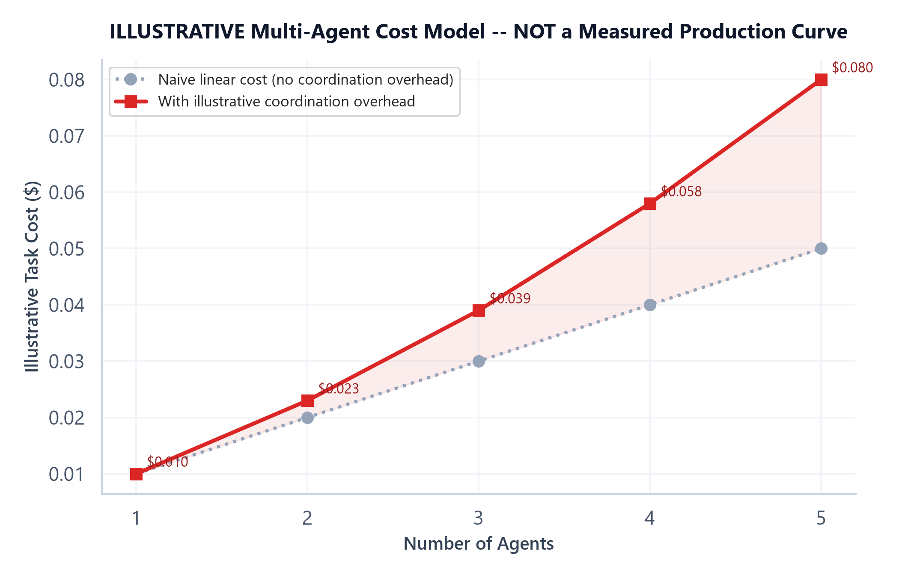

# Module 06: Multi-Agent Systems & Coordination Patterns

## 1. Introduction & Intuition

### The Core Bottleneck
A single agent, however well-designed, is still one line of reasoning trying to hold an entire task in its head at once. Some tasks genuinely benefit from splitting into specialized sub-problems — a research task and a writing task call for different skills, different tools, even different prompting strategies, and forcing one generalist agent to do both can produce worse results than two agents each focused on one job. But splitting into multiple agents is not automatically an improvement: it introduces coordination overhead, new cross-agent failure modes, and direct cost multiplication that a single well-designed agent simply doesn't have. This module is about the coordination *mechanisms* that make multi-agent systems work when they're actually the right choice — and Module 01's decision framework, not intuition, is what should decide whether they're the right choice at all.

### High-Level Intuition
A single skilled generalist can handle a moderately complex project alone. A team of specialists can handle a genuinely complex one *better* — if the team actually coordinates well. But a poorly-coordinated team of specialists, each doing their own piece without clear hand-offs, can easily produce worse results than the generalist working alone — redundant work, contradictory outputs, and time lost to miscommunication that never existed when it was just one person deciding everything themselves. Multi-agent systems inherit exactly this dynamic: the specialization can genuinely help, but only if the coordination mechanism connecting the specialists is actually sound.

---

## 2. Core Concepts & Mathematical Formulation

This module stays architectural throughout — coordination topology is a structural/comparative concept, consistent with how this topic treats orchestration patterns generally; the one quantitative artifact in this module (the cost-scaling plot below) is explicitly labeled illustrative, not a formula this module introduces as core.

### Orchestrator-Worker (Supervisor) Patterns

#### Intuition & Practical Use
One coordinating agent (the orchestrator/supervisor) breaks the overall task into sub-tasks, dispatches each to a specialized worker agent, and assembles their results into a final output. The orchestrator owns the overall plan and the hand-off logic; workers own their specific sub-task and don't need to know about each other at all. This is the more controllable of the two major topologies — there's one place (the orchestrator) where the overall task's progress and coordination logic lives, which makes debugging and reasoning about the system's behavior meaningfully easier than a topology with no single coordinating point.

### Peer-to-Peer Agent Communication

#### Intuition & Practical Use
Instead of one central coordinator, agents communicate directly with each other, negotiating and passing information peer to peer, with no single agent holding the full plan. This can be more flexible for genuinely decentralized problems where no single agent should (or sensibly could) hold the entire plan up front — but it trades away the orchestrator-worker pattern's single, inspectable coordination point, making the overall system's behavior meaningfully harder to trace and debug when something goes wrong, since there's no one place that ever had the full picture.

### Agent Specialization & Role Design

#### Intuition & Practical Use
Splitting responsibilities across specialized agents (a researcher, a writer, a critic) can genuinely outperform one generalist agent when each role benefits from a distinct prompt, tool set, or even model choice tuned to that specific sub-task — the same reason a human team of specialists can outperform one generalist on a sufficiently complex project. It sometimes doesn't help: if the sub-tasks aren't actually distinct enough to benefit from separate specialization, splitting them just adds coordination overhead without unlocking any real quality gain a well-prompted single agent couldn't already achieve.

### Coordination & Hand-Off Mechanics

#### Intuition & Practical Use
The concrete mechanics of getting one agent's output correctly into another agent's input — what format the hand-off takes, whether the receiving agent gets the full context or just a summary, and what happens if the receiving agent decides it needs something the sending agent didn't provide. A hand-off that loses critical context (passing only a final answer with none of the reasoning that produced it) can force the receiving agent to redo work the first agent already did, silently reintroducing the cost/latency the specialization was supposed to save.

### Safe Parallel vs. Sequential Agent Execution

#### Intuition & Practical Use
The exact same dependency-analysis principle Module 02 establishes for individual tool calls applies one level up, to whole agents: independent sub-agents whose tasks don't depend on each other's output — a researcher gathering background facts and a separate agent checking a document's formatting — can genuinely run concurrently, cutting wall-clock time the same way Module 02's parallel tool calls do. Agents in a genuine hand-off relationship — a writer that needs the researcher's findings as its actual input — must run sequentially, for the same reason a tool call needing another tool's result must wait for it. Building the real dependency graph between planned agent invocations, not assuming everything can run at once, is what determines which parts of a multi-agent system can actually be parallelized safely.

<div align="center" style="margin: 20px 0; max-width: 100%; overflow-x: auto;">
<svg viewBox="0 0 780 280" width="100%" height="auto" xmlns="http://www.w3.org/2000/svg" style="background-color: #f8fafc; border: 1px solid #e2e8f0; border-radius: 8px; font-family: system-ui, -apple-system, sans-serif;">
  <text x="390" y="22" text-anchor="middle" font-size="13" font-weight="bold" fill="#0f172a">Orchestrator-Worker vs. Peer-to-Peer Topology</text>

  <text x="180" y="48" text-anchor="middle" font-size="11" font-weight="600" fill="#1e3a8a">Orchestrator-Worker</text>
  <rect x="130" y="60" width="100" height="42" rx="6" fill="#eff6ff" stroke="#3b82f6" stroke-width="1.6"/>
  <text x="180" y="85" text-anchor="middle" font-size="10" fill="#1e3a8a" font-weight="600">Orchestrator</text>

  <rect x="30" y="150" width="90" height="40" rx="5" fill="#f5f3ff" stroke="#7c3aed" stroke-width="1.4"/>
  <text x="75" y="174" text-anchor="middle" font-size="9" fill="#5b21b6">Worker A</text>
  <rect x="140" y="150" width="90" height="40" rx="5" fill="#f5f3ff" stroke="#7c3aed" stroke-width="1.4"/>
  <text x="185" y="174" text-anchor="middle" font-size="9" fill="#5b21b6">Worker B</text>
  <rect x="250" y="150" width="90" height="40" rx="5" fill="#f5f3ff" stroke="#7c3aed" stroke-width="1.4"/>
  <text x="295" y="174" text-anchor="middle" font-size="9" fill="#5b21b6">Worker C</text>

  <g stroke="#94a3b8" stroke-width="1.4" fill="none" marker-end="url(#arrow06a)">
    <line x1="165" y1="102" x2="90" y2="148"/>
    <line x1="180" y1="102" x2="185" y2="148"/>
    <line x1="195" y1="102" x2="285" y2="148"/>
  </g>
  <defs>
    <marker id="arrow06a" markerWidth="8" markerHeight="8" refX="6" refY="4" orient="auto">
      <path d="M0,0 L8,4 L0,8 Z" fill="#94a3b8"/>
    </marker>
  </defs>
  <text x="185" y="215" text-anchor="middle" font-size="8.5" fill="#334155">One coordination point --</text>
  <text x="185" y="228" text-anchor="middle" font-size="8.5" fill="#334155">easier to trace and debug.</text>
  <text x="185" y="245" text-anchor="middle" font-size="8.5" fill="#065f46" font-weight="600">Workers A &amp; B independent -&gt; parallel-safe</text>

  <line x1="415" y1="140" x2="415" y2="140" stroke="#cbd5e1" stroke-width="1"/>
  <line x1="415" y1="45" x2="415" y2="260" stroke="#cbd5e1" stroke-width="1" stroke-dasharray="3,3"/>

  <text x="595" y="48" text-anchor="middle" font-size="11" font-weight="600" fill="#7c2d12">Peer-to-Peer</text>
  <rect x="500" y="90" width="90" height="40" rx="5" fill="#fed7aa" stroke="#c2410c" stroke-width="1.4"/>
  <text x="545" y="114" text-anchor="middle" font-size="9" fill="#7c2d12">Agent X</text>
  <rect x="650" y="90" width="90" height="40" rx="5" fill="#fed7aa" stroke="#c2410c" stroke-width="1.4"/>
  <text x="695" y="114" text-anchor="middle" font-size="9" fill="#7c2d12">Agent Y</text>
  <rect x="575" y="180" width="90" height="40" rx="5" fill="#fed7aa" stroke="#c2410c" stroke-width="1.4"/>
  <text x="620" y="204" text-anchor="middle" font-size="9" fill="#7c2d12">Agent Z</text>

  <g stroke="#c2410c" stroke-width="1.3" fill="none">
    <line x1="590" y1="110" x2="650" y2="110"/>
    <line x1="545" y1="130" x2="620" y2="180"/>
    <line x1="695" y1="130" x2="620" y2="180"/>
  </g>
  <text x="620" y="245" text-anchor="middle" font-size="8.5" fill="#334155">No single agent holds the full plan --</text>
  <text x="620" y="258" text-anchor="middle" font-size="8.5" fill="#334155">more flexible, harder to trace when something fails.</text>
</svg>
</div>

### When NOT to Use Multi-Agent (Applying Module 01's Framework)

#### Intuition & Practical Use
Rather than re-deriving a separate argument here, this is Module 01's formal decision framework applied specifically to the single-agent-vs-multi-agent boundary: multi-agent is the highest-complexity, highest-cost, least-controllable option on that table, and it's justified only when the task genuinely decomposes into specialized sub-problems that benefit from separate, focused agents — not merely because splitting the work "sounds" more sophisticated. A single well-designed agent handling a task that doesn't actually decompose cleanly will usually outperform a poorly-decomposed multi-agent system on cost, latency, and reliability all at once, exactly as the decision table predicts.

---

## 3. Implementation & Reference Code

Below is a minimal orchestrator-worker coordinator with an explicit dependency graph — determining which workers can run in parallel and which must wait for another worker's output, applying Module 02's dependency-analysis principle at the agent level.

```python
from dataclasses import dataclass, field


@dataclass
class WorkerTask:
    name: str
    depends_on: list[str] = field(default_factory=list)


def topological_batches(tasks: list[WorkerTask]) -> list[list[str]]:
    """Groups tasks into sequential batches, where every task within a batch has no
    dependency on any other task in that same batch -- i.e. everything in one batch
    is safe to run in parallel; batches themselves must run in order."""
    remaining = {t.name: set(t.depends_on) for t in tasks}
    completed: set[str] = set()
    batches: list[list[str]] = []

    while remaining:
        ready = [name for name, deps in remaining.items() if deps <= completed]
        if not ready:
            raise ValueError(f"Circular or unresolvable dependency among: {list(remaining)}")
        batches.append(sorted(ready))
        completed.update(ready)
        for name in ready:
            del remaining[name]
    return batches


@dataclass
class Orchestrator:
    """Minimal orchestrator-worker coordinator: dispatches each batch's workers
    (conceptually in parallel), then assembles results before the next batch."""

    def run(self, tasks: list[WorkerTask], worker_fn) -> dict:
        batches = topological_batches(tasks)
        results: dict = {}
        for batch in batches:
            print(f"  Dispatching batch (parallel-safe): {batch}")
            for name in batch:
                results[name] = worker_fn(name, results)
        return results


if __name__ == "__main__":
    # Researcher and formatter are independent (no shared dependency);
    # Writer needs Researcher's output; Critic needs Writer's output.
    tasks = [
        WorkerTask("researcher"),
        WorkerTask("formatter"),  # independent of researcher -- safe to run in the same batch
        WorkerTask("writer", depends_on=["researcher"]),
        WorkerTask("critic", depends_on=["writer"]),
    ]

    batches = topological_batches(tasks)
    print(f"Execution batches: {batches}")
    assert batches[0] == ["formatter", "researcher"]  # both independent, same (first) batch
    assert batches[1] == ["writer"]                    # depends on researcher -- next batch
    assert batches[2] == ["critic"]                     # depends on writer -- final batch

    def fake_worker(name: str, prior_results: dict) -> str:
        if name == "researcher":
            return "findings: X causes Y"
        if name == "formatter":
            return "format: markdown"
        if name == "writer":
            return f"draft based on [{prior_results['researcher']}]"
        if name == "critic":
            return f"review of [{prior_results['writer']}]"
        raise ValueError(name)

    orchestrator = Orchestrator()
    results = orchestrator.run(tasks, fake_worker)
    print(f"\nFinal results: {results}")
    assert "findings" in results["researcher"]
    assert results["researcher"] in results["writer"]  # writer's output genuinely used researcher's result
    print("\nDependency-aware orchestration verified: independent tasks batched together, dependent tasks sequenced correctly.")

    # A circular dependency is correctly rejected, not silently mishandled
    try:
        topological_batches([WorkerTask("a", depends_on=["b"]), WorkerTask("b", depends_on=["a"])])
        raise AssertionError("Should have raised on circular dependency")
    except ValueError as e:
        print(f"\nCircular dependency correctly rejected: {e}")
```

---

## 4. Interview Deep-Dive & System Trade-offs

### 1. Architectural & Production Trade-offs
* **Core Problem Solved:** Letting genuinely distinct sub-problems within a larger task be handled by separately-specialized agents, each tuned to its own sub-task, when a single generalist agent would underperform on the combination.
* **Why Introduced over Legacy Approaches:** A single agent forced to hold an entire complex, multi-faceted task in one line of reasoning can underperform specialized agents each focused on a narrower, better-tuned sub-task — the same reason specialized human teams often outperform one generalist on sufficiently complex work.
* **Key Failure Modes & Limitations:** Coordination overhead and cost multiplication scale with agent count; a lossy hand-off between agents can force redundant re-work; peer-to-peer topologies with no single coordination point are genuinely harder to trace and debug than orchestrator-worker's single inspectable coordination point.

### 2. System Complexity & Scaling
* **Time Complexity (FLOPs):** Cost and latency scale with the number of agents invoked, reduced by however much genuine independence allows safe parallel execution (this module's dependency-batching mechanism) — worst case is fully sequential (no independence), best case is bounded by the critical path through the real dependency graph.
* **Space/Memory Footprint:** Each agent typically maintains its own context/state (Module 04), so total system memory scales with agent count, not just task complexity.
* **Primary Bottleneck Type:** Coordination-latency-bound when agents must run sequentially due to real dependencies; cost-bound from the direct multiplication of per-agent LLM costs, independent of whether execution is parallelized (parallelizing saves wall-clock time, not total cost).
* **Variable Legend:** No closed-form formula variables, per this module's prose/procedural scope; the illustrative cost-scaling plot below uses invented constants, not a derived formula.

### 3. Production & Scalability
* **Deployment Considerations:** Build the real dependency graph between planned agent invocations explicitly before assuming anything can run in parallel; prefer orchestrator-worker over peer-to-peer when debuggability and traceability matter more than maximal decentralization flexibility, since the single coordination point is a real operational asset when something goes wrong in production.



*   **Plot Interpretation:** This is an **illustrative cost model, not a measured production curve** — no notebook in this topic measures a real multi-agent system's cost scaling. The qualitative shape (cost growing faster than linearly with agent count, from an invented coordination-overhead factor) is the point being illustrated: coordination overhead is a real, structural reason multi-agent cost doesn't scale as cheaply as "just add more agents" might naively suggest, even though the specific curve shown here uses invented, not measured, numbers.

*   **Common Interviewer Follow-Up Questions:**
    1.  *Q:* How would you decide between orchestrator-worker and peer-to-peer for a new multi-agent system?
        *   *A:* Default to orchestrator-worker for its single, inspectable coordination point and easier debuggability; reach for peer-to-peer specifically when the problem is genuinely decentralized enough that no single agent should sensibly hold the entire plan — not as a default architecture choice.
    2.  *Q:* Two agents both need to read the same shared document as part of their task. Is that a dependency that forces sequential execution?
        *   *A:* Not by itself — reading the same input is not a dependency in the sense that matters here; the real question is whether either agent's *output* is needed as the *other's input*. Two agents independently reading the same document and producing independent outputs are still safe to parallelize.
