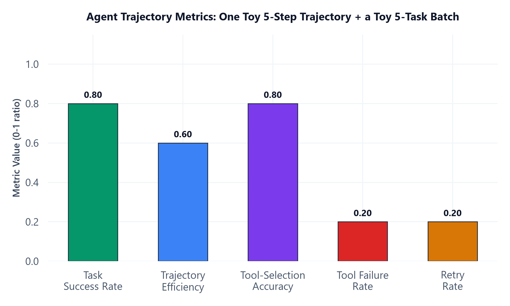

# Module 08: Agent Evaluation & Debugging

## 1. Introduction & Intuition

### The Core Bottleneck
Evaluating a single-turn LLM call is comparatively simple: one input, one output, score it. Evaluating an agent is a fundamentally different problem — the *final answer* might be correct even though the path that produced it was wasteful, or worse, correct by luck despite a genuinely wrong tool call along the way that happened not to matter this time. Judging only the final output misses exactly the information needed to actually improve the system: which step, if any, went wrong, and whether it went wrong in a way that's likely to recur. Agent evaluation has to look at the whole trajectory, not just where it ended up.

### High-Level Intuition
Grading a student only on their final exam answer tells you whether they got the right number, but not whether they used the right method and got lucky with rounding, or used a genuinely sound method and made one recoverable arithmetic slip. Grading their full worked solution — every step — tells you which one actually happened, and that distinction is exactly what determines whether you'd trust them to get the next, slightly different problem right too. Agent trajectory evaluation is grading the full worked solution, not just the final number.

---

## 2. Core Concepts & Mathematical Formulation

### Full Trajectory Evaluation vs. Final-Output-Only Evaluation

#### Intuition & Practical Use
An agent's full trajectory is every Thought/Action/Observation step (Module 01) it actually took, not just the answer it eventually returned. Evaluating only the final output can't distinguish "the agent reasoned soundly and got the right answer" from "the agent made an error that happened not to matter this time" — and that distinction matters enormously for predicting whether the *next*, slightly different query will also come out right. Full trajectory evaluation looks at every step, which is exactly what makes the seven metrics below possible to compute in the first place.

### LLM-as-Judge for Agent Trajectories, and Its Pitfalls

#### Intuition & Practical Use
An LLM can be prompted to review a full trajectory and judge whether each step was reasonable, whether the tool choices were correct, and whether the final answer is genuinely supported by what was actually found along the way — a scalable alternative to exhaustive human review. The pitfalls are the same ones any LLM-as-judge approach carries (prompt sensitivity, judge bias) plus one specific to agents: a judge reviewing a long, multi-step trajectory has more surface area to be inconsistent across than a judge reviewing one single-turn response, so trajectory-level LLM-as-judge scoring needs the same discipline as any LLM-based evaluation — a fixed, stable judging rubric, tracked as a trend over time, not compared across differently-worded judge prompts.

### Agent Observability & Tracing

#### Intuition & Practical Use
The practical infrastructure that makes trajectory evaluation and debugging possible in production at all: every Thought, Action, Observation, tool call (with arguments and results), and their timestamps/latencies logged for every run, queryable after the fact (Langfuse-style tracing is the concrete tool matching the production stack this candidate already uses). Without this, "why did this specific run go wrong" requires trying to reproduce the exact conditions after the fact — often impossible, since a live external tool's response or a model's own non-determinism may not reproduce the same way twice.

### Common Agent Failure Modes

#### Intuition & Practical Use
A short, recurring catalog worth recognizing by pattern, not just definition: **infinite/repeating loops** (the agent keeps taking the same or a functionally-equivalent action without making progress — exactly what Module 01's `max_steps` guard exists to bound, but bounding it doesn't diagnose *why* it happened); **tool misuse** (the right tool called with wrong arguments, or a tool called in a context it was never meant for); **planning failures** (a plan-and-execute agent, per Module 01, commits to a plan that turns out to be wrong and doesn't adequately recover); **premature termination** (the agent decides it has "enough information" to answer when it genuinely doesn't, a failure of the `is_sufficient` judgment from Module 01's own reference loop).

---

### Hand Calculation: Agent Trajectory Metrics for One Toy Task
One toy 5-step agent trajectory, plus a toy batch of 5 total tasks (4 succeeded, 1 failed) for the two batch-level metrics.

**The one toy trajectory (5 steps):**
1. Correct tool (`search`) chosen, executes successfully.
2. Correct tool (`fetch_details`) chosen, but the call itself **errors** (e.g., a timeout) — a tool failure, independent of tool selection.
3. **Retry** of step 2's tool call — succeeds this time.
4. **Wrong** tool chosen (`calculate` instead of `lookup`) — a tool-selection error; it executes without erroring, but returns an unhelpful result.
5. Correct tool (`lookup`) chosen after replanning, executes successfully — the agent now has enough information and produces its final answer.

<div align="center" style="margin: 20px 0; max-width: 100%; overflow-x: auto;">
<svg viewBox="0 0 760 220" width="100%" height="auto" xmlns="http://www.w3.org/2000/svg" style="background-color: #f8fafc; border: 1px solid #e2e8f0; border-radius: 8px; font-family: system-ui, -apple-system, sans-serif;">
  <text x="380" y="20" text-anchor="middle" font-size="13" font-weight="bold" fill="#0f172a">Minimal Path (3 steps) vs. Actual Trajectory (5 steps)</text>

  <text x="20" y="48" font-size="10.5" font-weight="600" fill="#065f46">Minimal (had every step gone right first try):</text>
  <g font-size="9">
    <rect x="20" y="55" width="90" height="34" rx="5" fill="#ecfdf5" stroke="#059669" stroke-width="1.4"/>
    <text x="65" y="76" text-anchor="middle" fill="#065f46">search</text>
    <rect x="130" y="55" width="90" height="34" rx="5" fill="#ecfdf5" stroke="#059669" stroke-width="1.4"/>
    <text x="175" y="76" text-anchor="middle" fill="#065f46">lookup</text>
    <rect x="240" y="55" width="110" height="34" rx="5" fill="#ecfdf5" stroke="#059669" stroke-width="1.4"/>
    <text x="295" y="76" text-anchor="middle" fill="#065f46">final answer</text>
  </g>
  <g stroke="#059669" stroke-width="1.4" fill="none" marker-end="url(#arrow08a)">
    <line x1="110" y1="72" x2="128" y2="72"/>
    <line x1="220" y1="72" x2="238" y2="72"/>
  </g>
  <defs>
    <marker id="arrow08a" markerWidth="8" markerHeight="8" refX="6" refY="4" orient="auto">
      <path d="M0,0 L8,4 L0,8 Z" fill="#059669"/>
    </marker>
    <marker id="arrow08b" markerWidth="8" markerHeight="8" refX="6" refY="4" orient="auto">
      <path d="M0,0 L8,4 L0,8 Z" fill="#94a3b8"/>
    </marker>
  </defs>

  <text x="20" y="120" font-size="10.5" font-weight="600" fill="#991b1b">Actual (this run -- 5 steps, real detours):</text>
  <g font-size="8.5">
    <rect x="20" y="128" width="80" height="32" rx="5" fill="#ecfdf5" stroke="#059669" stroke-width="1.3"/>
    <text x="60" y="148" text-anchor="middle" fill="#065f46">1. search OK</text>
    <rect x="112" y="128" width="90" height="32" rx="5" fill="#fef2f2" stroke="#dc2626" stroke-width="1.3"/>
    <text x="157" y="143" text-anchor="middle" fill="#991b1b" font-size="7.5">2. fetch_details</text>
    <text x="157" y="153" text-anchor="middle" fill="#991b1b" font-size="7.5">ERRORS</text>
    <rect x="214" y="128" width="80" height="32" rx="5" fill="#fef9c3" stroke="#ca8a04" stroke-width="1.3"/>
    <text x="254" y="148" text-anchor="middle" fill="#854d0e" font-size="7.5">3. RETRY -&gt; OK</text>
    <rect x="306" y="128" width="90" height="32" rx="5" fill="#fef2f2" stroke="#dc2626" stroke-width="1.3"/>
    <text x="351" y="143" text-anchor="middle" fill="#991b1b" font-size="7.5">4. calculate</text>
    <text x="351" y="153" text-anchor="middle" fill="#991b1b" font-size="7.5">WRONG TOOL</text>
    <rect x="408" y="128" width="90" height="32" rx="5" fill="#ecfdf5" stroke="#059669" stroke-width="1.3"/>
    <text x="453" y="143" text-anchor="middle" fill="#065f46" font-size="7.5">5. lookup OK</text>
    <text x="453" y="153" text-anchor="middle" fill="#065f46" font-size="7.5">-&gt; final answer</text>
  </g>
  <g stroke="#94a3b8" stroke-width="1.3" fill="none" marker-end="url(#arrow08b)">
    <line x1="100" y1="144" x2="110" y2="144"/>
    <line x1="202" y1="144" x2="212" y2="144"/>
    <line x1="294" y1="144" x2="304" y2="144"/>
    <line x1="396" y1="144" x2="406" y2="144"/>
  </g>

  <text x="380" y="195" text-anchor="middle" font-size="9" fill="#64748b">Trajectory Efficiency = 3 minimal / 5 actual = 0.6 -- the 2 extra steps are exactly the retry (step 3) and the wrong-tool detour (step 4).</text>
</svg>
</div>

*   **Trajectory Efficiency.** The minimal path (had the agent picked correctly on the first try at every step) would have been 3 steps — `search` → `lookup` → final answer:
    $$\text{Trajectory Efficiency} = \frac{\text{Steps}_{\text{minimal}}}{\text{Steps}_{\text{actual}}} = \frac{3}{5} = 0.6$$

*   **Tool-Selection Accuracy.** Of the 5 tool-call attempts, 4 chose the objectively correct tool for that step (steps 1, 2, 3, 5 — step 3's retry still chose the same, correct tool); only step 4 chose the wrong one:
    $$\text{Tool-Selection Accuracy} = \frac{4}{5} = 0.8$$

*   **Tool Failure Rate.** Of the 5 tool-call attempts, exactly 1 (step 2) errored on execution, independent of whether the tool choice itself was correct:
    $$\text{Tool Failure Rate} = \frac{1}{5} = 0.2$$

*   **Retry Rate.** Of the 5 total steps, exactly 1 (step 3) was a retry of a prior step:
    $$\text{Retry Rate} = \frac{1}{5} = 0.2$$

**The toy 5-task batch** (Task 1 is the trajectory above at 5 steps/succeeded; Task 2: 3 steps/succeeded; Task 3: 4 steps/succeeded; Task 4: 6 steps/**failed**; Task 5: 3 steps/succeeded):

*   **Task Success Rate.**
    $$\text{Task Success Rate} = \frac{N_{\text{successful}}}{N_{\text{total}}} = \frac{4}{5} = 0.8$$

*   **Steps per Successful Task** (Task 4 excluded — it failed):
    $$\text{Steps per Successful Task} = \frac{5+3+4+3}{4} = \frac{15}{4} = 3.75$$

*   **Cost per Successful Task** (illustrative per-task costs from Module 02's cost model — \$0.012, \$0.007, \$0.009, \$0.006 for the 4 successful tasks; Task 4's cost is excluded, the same way its steps were):
    $$\text{Cost per Successful Task} = \frac{0.012+0.007+0.009+0.006}{4} = \frac{\$0.034}{4} = \$0.0085$$

Seven metrics, from the same two toy examples, telling seven genuinely different — and here, deliberately non-redundant — stories: efficiency (0.6) says the agent took real, avoidable extra steps; tool-selection accuracy (0.8) and tool failure rate (0.2) together show that *most* of that inefficiency came from one genuine tool-selection mistake (step 4), not primarily from unreliable tools; retry rate (0.2) shows the one tool failure was successfully recovered from; and the batch-level success rate (0.8), steps-per-success (3.75), and cost-per-success (\$0.0085) show what all of this costs in aggregate once tasks that never succeeded at all are accounted for separately.



*   **Plot Interpretation:** The five 0-1 ratio metrics plotted together make the diagnosis visually immediate — a high tool-selection accuracy (0.8) next to a lower trajectory efficiency (0.6) is exactly the visual signature of "the agent mostly chose correctly, but paid a real efficiency cost from the one time it didn't, plus recovering from one tool failure." Steps-per-successful-task (3.75) and cost-per-successful-task (\$0.0085) are reported as text rather than on this chart, since they're absolute-unit metrics, not 0-1 ratios, and don't share a meaningful scale with the other five.

---

## 3. Implementation & Reference Code

Below is a self-contained implementation of all seven hand-calculated metrics, computing them directly from a structured trajectory log — matching the worked example above exactly.

```python
from dataclasses import dataclass, field
from enum import Enum


class StepOutcome(Enum):
    CORRECT_TOOL_SUCCESS = "correct_tool_success"
    CORRECT_TOOL_ERROR = "correct_tool_error"      # right tool, but the call itself failed
    RETRY_SUCCESS = "retry_success"                 # a retry of a prior failed step, succeeded
    WRONG_TOOL = "wrong_tool"                        # tool-selection error


@dataclass
class TrajectoryStep:
    outcome: StepOutcome


@dataclass
class TaskResult:
    steps: list[TrajectoryStep]
    succeeded: bool
    cost: float


def trajectory_efficiency(steps_minimal: int, steps_actual: int) -> float:
    return steps_minimal / steps_actual


def tool_selection_accuracy(steps: list[TrajectoryStep]) -> float:
    correct = sum(1 for s in steps if s.outcome != StepOutcome.WRONG_TOOL)
    return correct / len(steps)


def tool_failure_rate(steps: list[TrajectoryStep]) -> float:
    failed = sum(1 for s in steps if s.outcome == StepOutcome.CORRECT_TOOL_ERROR)
    return failed / len(steps)


def retry_rate(steps: list[TrajectoryStep]) -> float:
    retried = sum(1 for s in steps if s.outcome == StepOutcome.RETRY_SUCCESS)
    return retried / len(steps)


def task_success_rate(tasks: list[TaskResult]) -> float:
    return sum(1 for t in tasks if t.succeeded) / len(tasks)


def steps_per_successful_task(tasks: list[TaskResult]) -> float:
    successful = [t for t in tasks if t.succeeded]
    return sum(len(t.steps) for t in successful) / len(successful)


def cost_per_successful_task(tasks: list[TaskResult]) -> float:
    successful = [t for t in tasks if t.succeeded]
    return sum(t.cost for t in successful) / len(successful)


if __name__ == "__main__":
    # The one toy 5-step trajectory
    trajectory = [
        TrajectoryStep(StepOutcome.CORRECT_TOOL_SUCCESS),  # 1: search, correct, succeeds
        TrajectoryStep(StepOutcome.CORRECT_TOOL_ERROR),    # 2: fetch_details, correct tool, errors
        TrajectoryStep(StepOutcome.RETRY_SUCCESS),         # 3: retry of step 2, succeeds
        TrajectoryStep(StepOutcome.WRONG_TOOL),            # 4: calculate (wrong), should have been lookup
        TrajectoryStep(StepOutcome.CORRECT_TOOL_SUCCESS),  # 5: lookup, correct, succeeds -> final answer
    ]

    eff = trajectory_efficiency(steps_minimal=3, steps_actual=len(trajectory))
    tsa = tool_selection_accuracy(trajectory)
    tfr = tool_failure_rate(trajectory)
    rr = retry_rate(trajectory)

    print(f"Trajectory Efficiency: {eff:.2f}")
    print(f"Tool-Selection Accuracy: {tsa:.2f}")
    print(f"Tool Failure Rate: {tfr:.2f}")
    print(f"Retry Rate: {rr:.2f}")
    assert eff == 0.6 and tsa == 0.8 and tfr == 0.2 and rr == 0.2

    # The toy 5-task batch
    tasks = [
        TaskResult(steps=trajectory, succeeded=True, cost=0.012),          # Task 1 (the trajectory above)
        TaskResult(steps=[TrajectoryStep(StepOutcome.CORRECT_TOOL_SUCCESS)] * 3, succeeded=True, cost=0.007),
        TaskResult(steps=[TrajectoryStep(StepOutcome.CORRECT_TOOL_SUCCESS)] * 4, succeeded=True, cost=0.009),
        TaskResult(steps=[TrajectoryStep(StepOutcome.WRONG_TOOL)] * 6, succeeded=False, cost=0.011),  # Task 4: failed
        TaskResult(steps=[TrajectoryStep(StepOutcome.CORRECT_TOOL_SUCCESS)] * 3, succeeded=True, cost=0.006),
    ]

    tsr = task_success_rate(tasks)
    spst = steps_per_successful_task(tasks)
    cpst = cost_per_successful_task(tasks)

    print(f"\nTask Success Rate: {tsr:.2f}")
    print(f"Steps per Successful Task: {spst:.2f}")
    print(f"Cost per Successful Task: ${cpst:.4f}")
    assert tsr == 0.8
    assert spst == 3.75
    assert abs(cpst - 0.0085) < 1e-9
    print("\nAll seven trajectory/batch metrics verified against the hand calculation.")
```

---

## 4. Interview Deep-Dive & System Trade-offs

### 1. Architectural & Production Trade-offs
* **Core Problem Solved:** Measuring agent quality in a way that can actually distinguish *why* a run succeeded or failed — which step, and what kind of failure — rather than a single pass/fail judgment on the final output alone.
* **Why Introduced over Legacy Approaches:** Single-turn LLM evaluation metrics say nothing about multi-step trajectories at all; judging only an agent's final answer conflates "sound reasoning, correct answer" with "flawed reasoning that got lucky," which are very different signals for predicting future reliability.
* **Key Failure Modes & Limitations:** Full-trajectory evaluation costs proportionally more than final-output-only evaluation (every step needs review, not just the last one); LLM-as-judge trajectory scoring inherits the general prompt-sensitivity/judge-bias pitfalls, with more surface area for judge inconsistency across a long trajectory than a single-turn response.

### 2. System Complexity & Scaling
* **Time Complexity (FLOPs):** Evaluation cost scales with the number of steps actually taken across all evaluated trajectories, not just the number of tasks — a real, direct multiplier over single-turn evaluation cost.
* **Space/Memory Footprint:** Full trajectory logging (Module 08's own observability requirement) accumulates storage proportional to step count across all runs, the evaluation-side analog of Module 05's checkpoint-storage growth concern.
* **Primary Bottleneck Type:** Evaluation-cost-bound at full-trajectory granularity for offline evaluation runs; production observability logging itself must stay cheap enough per-step to not add meaningful latency to the live agent run it's tracing.
* **Variable Legend:** $N_{\text{successful}}$/$N_{\text{total}}$ = successful/total task counts, $\text{Steps}_{\text{minimal}}$/$\text{Steps}_{\text{actual}}$ = the ideal vs. actual step count for one trajectory, $\text{Cost}_{\text{task}}$ = Module 02's per-task cost model.

### 3. Production & Scalability
* **Deployment Considerations:** Log full trajectories (every Thought/Action/Observation, with tool arguments/results and timestamps) from day one, the agent-specific analog of `03_advanced_rag` Module 09's retrieval-observability discipline; track these seven metrics as trends over time on a fixed evaluation set, not one-off snapshots, so a regression is caught as a trend rather than discovered only after users notice.
*   **Common Interviewer Follow-Up Questions:**
    1.  *Q:* An agent's task success rate looks fine, but users are complaining about high latency and cost. Which of these seven metrics would you check first?
        *   *A:* Steps per successful task and trajectory efficiency — a fine success rate can coexist with agents taking far more steps than necessary to get there, which is exactly the signal these two metrics are designed to surface that success rate alone hides.
    2.  *Q:* How would you distinguish a tool-selection problem from a tool-reliability problem using these metrics?
        *   *A:* Tool-selection accuracy and tool failure rate are deliberately separate metrics for exactly this reason — a low tool-selection accuracy points at the model's decision-making (schema/prompt issue, Module 02), while a high tool failure rate with good selection accuracy points at the tool's own reliability (an infrastructure/API issue), and conflating the two into one "things went wrong" number would point engineering effort at the wrong fix.
