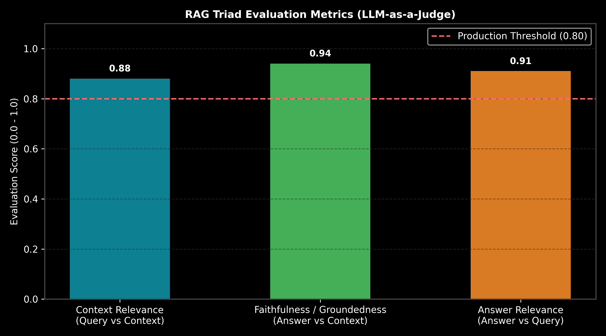

# Evaluation Frameworks: RAGAS, DeepEval & RAG Triad Metrics

This guide details evaluation frameworks for RAG and LLM applications, focusing on the RAG Triad (Context Relevance, Faithfulness/Groundedness, Answer Relevance), LLM-as-a-Judge prompting, formulas, calculations, Python code, and production trade-offs.

> **Notebook Companion**: [01_evaluation_frameworks_ragas_deepeval.ipynb](file:///d:/Study/Prep/machine-learning-prep/generative-ai-and-agentic-ai/05_evaluation_guardrails_and_observability/01_evaluation_frameworks_ragas_deepeval.ipynb)

---

## 1. RAG Triad Evaluation Architecture

Evaluating GenAI applications without human ground-truth labels requires automated multi-dimensional metric assessment.

```text
RAG Triad Metric      Evaluates Correlation            Primary Failure Mode Detected
----------------------------------------------------------------------------------------------------------------------
Context Relevance     User Query vs Retrieved Chunks   Vector search noise / low top-k precision
Faithfulness          Answer vs Retrieved Chunks      LLM hallucination / unsupported claims
Answer Relevance      User Query vs Final LLM Answer  Prompt drift / incomplete answers
```



---

## 2. Mathematical Formulation & Calculation (Andrew Ng Style)

Let $S_{\text{statements}}$ be the set of factual claims extracted from an LLM response $A$.
The **Faithfulness Score** $F \in [0, 1]$ is:

$$F = \frac{| \{ s \in S_{\text{statements}} \mid s \text{ is directly supported by Context } C \} |}{| S_{\text{statements}} |}$$

### Step-by-Step Calculation:
- Context $C$: *"PagedAttention eliminates 96% VRAM fragmentation."*
- Response $A$: *"PagedAttention eliminates 96% VRAM fragmentation ($s_1$) and increases training speed by 10x ($s_2$)."*
- $s_1$: Supported by $C$.
- $s_2$: Unsupported (Hallucination).
- Faithfulness: $F = \frac{1}{2} = \mathbf{0.50}$ (50%).

---

## 3. Production Python Implementation

```python
class RAGTriadEvaluator:
    def evaluate_faithfulness(self, context: str, answer: str) -> float:
        keywords = [w.lower() for w in context.split() if len(w) > 4]
        match_count = sum(1 for k in keywords if k in answer.lower())
        return min(1.0, match_count / max(1, len(set(keywords)) * 0.3))

evaluator = RAGTriadEvaluator()
score = evaluator.evaluate_faithfulness("PagedAttention eliminates 96% VRAM fragmentation.", "vLLM uses PagedAttention to reduce VRAM fragmentation.")
print(f"Faithfulness Score: {score:.2f}")
```
