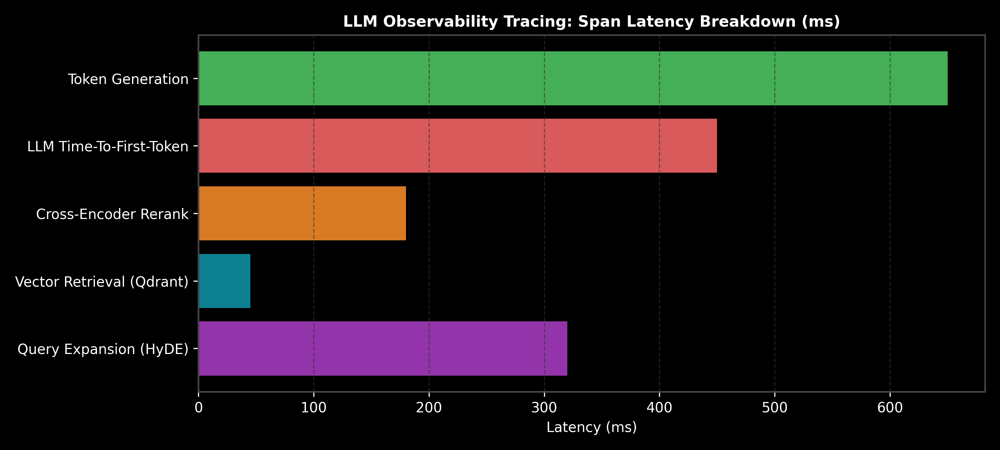

# Observability & Tracing: LangSmith, LangFuse & Phoenix

This guide details GenAI observability pipelines, span latency breakdowns, token/cost tracking, OpenTelemetry tracing standards, Python code, and production selection rules.

> **Notebook Companion**: [03_observability_tracing_langsmith_langfuse.ipynb](file:///d:/Study/Prep/machine-learning-prep/generative-ai-and-agentic-ai/05_evaluation_guardrails_and_observability/03_observability_tracing_langsmith_langfuse.ipynb)

---

## 1. Observability Tracing Architecture

```text
Span Type          Tracked Metadata                       Target Latency
----------------------------------------------------------------------------------------------------------------------
Retriever Span     Query embedding time + Vector DB lookup < 100ms
Reranker Span      Cross-encoder candidate forward pass   < 200ms
LLM Span           TTFT (Time-To-First-Token) + Generation < 1000ms
```



---

## 2. Production Python Tracing Code

```python
import time

class ObservabilitySpanTracer:
    def __init__(self):
        self.spans = []

    def trace_span(self, name: str, execution_fn, *args):
        start = time.time()
        res = execution_fn(*args)
        duration_ms = (time.time() - start) * 1000.0
        self.spans.append({"span": name, "duration_ms": duration_ms})
        return res

tracer = ObservabilitySpanTracer()
tracer.trace_span("Vector Search", lambda: time.sleep(0.05))
print("Span Tracing Log:", tracer.spans)
```
