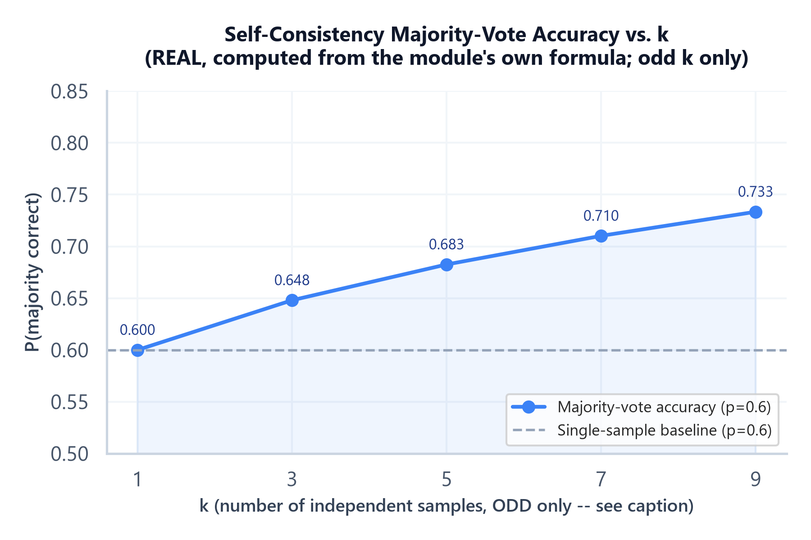

# Module 02: Reasoning-Elicitation Techniques

## 1. Introduction & Intuition

### The Core Bottleneck
Asked directly for a final answer, a model commits to a token distribution in one shot — no opportunity to catch its own arithmetic slip, no chance to reconsider a premise before it's baked into the output. Reasoning-elicitation techniques exist to give the model room to work through intermediate steps *before* committing to a final answer, the same reason a human is more reliable working a problem out on paper than blurting the first number that comes to mind. But that room isn't free: every additional reasoning token is a real token, and every additional sampled path is a real, separate LLM call — this module's central discipline is knowing *when* that cost buys a genuine accuracy improvement and when it's pure overhead on a task that didn't need it.

### High-Level Intuition
Think of the difference between asking someone to shout out an answer to a multi-step arithmetic problem instantly, versus asking them to show their work on paper first. Showing work doesn't make the person smarter — it gives their existing reasoning ability room to actually operate, catching an error mid-calculation that would otherwise have gone straight into a wrong final answer. Asking five different people to solve the same problem independently and taking the majority answer is a different, complementary strategy — it doesn't improve any one person's reasoning, it exploits the fact that independent errors are less likely to agree with each other than the correct answer is likely to recur.

---

## 2. Core Concepts & Mathematical Formulation

### Chain-of-Thought (Zero-Shot and Few-Shot)

#### Intuition & Practical Use
Chain-of-Thought (CoT) prompting elicits explicit intermediate reasoning steps before a final answer, within a single generation. **Zero-shot CoT** does this with a simple instruction appended to the prompt (the well-known "let's think step by step" pattern, or any explicit instruction to reason before answering) — no worked examples needed. **Few-shot CoT** goes further, providing worked examples that themselves *demonstrate* the reasoning steps, not just the final answer format, which tends to produce more reliably-structured reasoning than the zero-shot instruction alone on genuinely hard multi-step tasks. CoT's real value is concentrated on tasks that actually decompose into intermediate steps — arithmetic, multi-hop logical reasoning, multi-constraint planning; for a task answerable in one lookup or one simple transformation, CoT adds real generation cost/latency with no accuracy benefit to buy back, since there's no genuine intermediate reasoning to surface in the first place.

### Self-Consistency: Sampling + Majority Vote

#### Intuition & Practical Use
Self-consistency samples the *same* prompt multiple times at $T>0$ (Module 01's sampling mechanics), producing several independent reasoning paths and final answers, then takes the majority (or plurality) answer across samples instead of trusting any single sample. The intuition: a model's errors on a given hard problem are often not perfectly consistent across independent samples — different sampled reasoning paths can fail in different ways — while the *correct* answer, if the model genuinely has the capability to reach it, tends to be reached by more independent paths than any single specific wrong answer. This formalizes into a real, computable claim, stated here with its governing assumption made explicit:

$$P(\text{majority correct}) = \sum_{i=\lfloor k/2\rfloor+1}^{k} \binom{k}{i} p^i (1-p)^{k-i}$$

**This formula assumes independent samples with an identical, constant per-sample correctness probability $p$.** In reality, samples from one model on one prompt are *not* fully independent — they share the same underlying weights, the same prompt-induced biases, and the same blind spots, so a failure mode common to the model doesn't get "voted out" just because it's sampled five times. Treat this formula as an **idealized upper-bound intuition** for *why* majority voting can help, not as an exact predictor of the real-world accuracy gain self-consistency will produce on a specific task — the real gain has to be measured, not assumed from the formula alone.

**A second, sharper reason production self-consistency implementations use odd $k$ specifically:** the summation's lower bound, $\lfloor k/2\rfloor+1$, requires *strictly more than half* of the samples to agree — the correct definition of "majority." An even $k$ has no tie-breaking mechanism: at $k=2$, a majority requires *both* samples to agree (a much harder bar than a single sample), and a 1-1 split resolves to no answer at all. This isn't a minor technicality — it means an even $k$ can perform *worse* than $k-1$ (one fewer sample), since the extra sample only ever helps by potentially creating an unresolvable tie, never by lowering the agreement bar. Every worked calculation and the plot below therefore uses odd $k$ only, matching real self-consistency practice.

### Tree-of-Thought and Other Search-Augmented Prompting

#### Intuition & Practical Use
Where CoT commits to one linear reasoning path and self-consistency samples several *complete* independent paths and votes at the end, Tree-of-Thought (ToT) and similar search-augmented techniques explore and evaluate *partial* reasoning paths as they're built — branching at intermediate steps, scoring or pruning branches before they're fully complete, and backtracking from a branch that looks unpromising. This is a genuinely more powerful search strategy for problems with a large, structured solution space (certain planning/puzzle-style tasks) — and a genuinely more expensive one, since it requires multiple LLM calls just to *evaluate* candidate intermediate steps, on top of the calls needed to generate them. Covered here at the level of *when this class of technique is worth its cost*, not as a deep research-level search-algorithm treatment — the algorithmic depth of tree search itself belongs to a different, more academic discussion than this topic's production-engineering scope.

### When Reasoning Elicitation Helps vs. Adds Pure Cost

#### Intuition & Practical Use
The decision isn't "always use CoT" or "always sample multiple times" — it's task-dependent, and the real test is whether the task has genuine intermediate structure a model can get measurably better at by reasoning through explicitly. A single well-defined lookup, classification, or simple transformation task usually doesn't improve meaningfully from CoT — there's no real multi-step structure to expose — and burns real tokens/latency for no accuracy gain. A genuinely multi-step arithmetic, logical, or planning task is where CoT and self-consistency earn their cost. The practical discipline: measure accuracy with and without the technique on a real, representative eval set (Module 07's subject) before committing to the added cost in production, rather than assuming a "smarter-sounding" technique is automatically worth its overhead.

---

### Hand Calculation: Self-Consistency's Majority-Vote Reliability
A per-sample correctness probability $p = 0.6$ (i.e., the model gets this specific hard problem right 60% of the time on a single, independent sample — under the formula's stated independence assumption), evaluated at $k=5$ and $k=3$ samples.

*   **Step 1: $k=5$, majority means $i \geq 3$ correct out of 5.**
    $$P(3) = \binom{5}{3}(0.6)^3(0.4)^2 = 10 \times 0.216 \times 0.16 = 0.3456$$
    $$P(4) = \binom{5}{4}(0.6)^4(0.4)^1 = 5 \times 0.1296 \times 0.4 = 0.2592$$
    $$P(5) = \binom{5}{5}(0.6)^5(0.4)^0 = 1 \times 0.07776 \times 1 = 0.07776$$
    $$P(\text{majority}) = 0.3456 + 0.2592 + 0.07776 = 0.68256$$

*   **Step 2: $k=3$, majority means $i \geq 2$ correct out of 3.**
    $$P(2) = \binom{3}{2}(0.6)^2(0.4)^1 = 3 \times 0.36 \times 0.4 = 0.432$$
    $$P(3) = \binom{3}{3}(0.6)^3(0.4)^0 = 1 \times 0.216 \times 1 = 0.216$$
    $$P(\text{majority}) = 0.432 + 0.216 = 0.648$$

At $k=5$, majority-vote accuracy under this idealized model is $68.3\%$, a real improvement over the $60\%$ single-sample baseline. At $k=3$, it's $64.8\%$ — a smaller improvement, illustrating diminishing returns: going from 1 sample to 3 buys roughly 4.8 points under this idealized model, while going from 3 to 5 buys only another roughly 3.5 points, for twice the sampling cost of $k=3$ relative to $k=1$. Real-world gains will typically be *smaller* than this idealized calculation, per the independence caveat above — correlated failure modes mean the true improvement is usually less than what this formula predicts.



*   **Plot Interpretation:** This curve is computed directly from the module's own formula across **odd** $k=1,3,5,7,9$ at the fixed $p=0.6$ used in the hand calc above — a real, computed curve (not illustrative), restricted to odd $k$ for the tie-avoidance reason stated above. It shows the same diminishing-returns pattern visible in the two hand-calculated points: the marginal gain from each additional (odd-numbered) sample shrinks as $k$ grows — +4.8 points from $k{=}1\to3$, +3.5 points from $k{=}3\to5$, +2.8 points from $k{=}5\to7$ — which is the real, quantitative reason production systems don't default to arbitrarily large $k$.

### Hand Calculation: k-Sample Cost/Latency Multiplier
Reusing `04_ai_agents_and_protocols` Module 02's per-task cost model directly (no new formula): a single-sample call costing $0.003 in tokens, sampled $k=5$ times for self-consistency, plus one negligible-cost aggregation step (majority vote is a cheap, local computation, not a further LLM call).

$$\text{Cost}_{k=5} = 5 \times \$0.003 = \$0.015 \text{ (5x the single-sample cost)}$$

If the 5 samples are drawn as independent, parallel calls (safe, since each sample has no dependency on another's output — the same parallel-safety principle from `04_ai_agents_and_protocols` Module 02), wall-clock latency stays close to a single call's latency; if drawn sequentially, latency multiplies by roughly 5x as well. This is the concrete cost self-consistency's accuracy gain (Step 1 above) has to be weighed against in a real production decision.

---

## 3. Implementation & Reference Code

Below is a self-contained implementation of the majority-vote reliability formula, plus a minimal self-consistency simulation over independent samples matching the stated assumption, and the k-sample cost multiplier.

```python
import math
from dataclasses import dataclass, field


def majority_vote_probability(p: float, k: int) -> float:
    """P(majority correct) under the STATED assumption of k independent samples
    each with constant correctness probability p. See module text: real LLM
    samples are correlated, so this is an idealized upper-bound intuition,
    not an exact real-world predictor.

    threshold = k//2 + 1, i.e. STRICTLY more than half -- NOT math.ceil(k/2).
    For odd k these are identical, but for even k, ceil(k/2) == k/2, which
    would incorrectly count an exact tie as "majority correct." k//2 + 1 is
    the correct strict-majority threshold for both odd and even k."""
    threshold = k // 2 + 1
    total = 0.0
    for i in range(threshold, k + 1):
        total += math.comb(k, i) * (p ** i) * ((1 - p) ** (k - i))
    return total


@dataclass
class SelfConsistencyCostModel:
    """k-sample cost multiplier, reusing the per-task cost model directly
    (04_ai_agents_and_protocols Module 02) rather than deriving a new one."""
    single_sample_cost: float
    k: int

    def total_cost(self) -> float:
        return self.single_sample_cost * self.k

    def multiplier(self) -> float:
        return self.k  # cost scales linearly with k; wall-clock does not, if parallel-safe


if __name__ == "__main__":
    # Hand calc verification: p=0.6 at k=5 and k=3
    p5 = majority_vote_probability(0.6, 5)
    p3 = majority_vote_probability(0.6, 3)
    print(f"k=5: P(majority correct) = {p5:.5f}")
    print(f"k=3: P(majority correct) = {p3:.5f}")
    assert abs(p5 - 0.68256) < 1e-4
    assert abs(p3 - 0.648) < 1e-4
    assert p5 > p3 > 0.6, "Majority voting must improve over the single-sample baseline, and larger k must improve further"
    print("\nHand calc verified: both k=5 and k=3 exceed the p=0.6 single-sample baseline; k=5 exceeds k=3.")

    # Diminishing returns: the marginal gain from k=3->5 must be smaller than 1->3
    p1 = majority_vote_probability(0.6, 1)
    gain_1_to_3 = p3 - p1
    gain_3_to_5 = p5 - p3
    print(f"\nGain from k=1->3: {gain_1_to_3:.4f}")
    print(f"Gain from k=3->5: {gain_3_to_5:.4f}")
    assert gain_3_to_5 < gain_1_to_3, "Diminishing returns: later samples must buy less marginal accuracy than earlier ones"
    print("Diminishing returns verified.")

    # Even-k tie-avoidance property: an even k can be WORSE than k-1, since the extra
    # sample only ever risks creating an unresolvable tie, never lowers the agreement bar.
    p2 = majority_vote_probability(0.6, 2)
    print(f"\nk=1: {p1:.4f}, k=2: {p2:.4f} (even k)")
    assert p2 < p1, "k=2 must be WORSE than k=1 under the correct strict-majority threshold -- this is why production self-consistency always uses odd k"
    print("Even-k tie-avoidance property verified: k=2 underperforms k=1, confirming why odd k is used in practice.")

    # Cost multiplier hand calc verification
    cost_model = SelfConsistencyCostModel(single_sample_cost=0.003, k=5)
    total = cost_model.total_cost()
    print(f"\nk=5 total cost: ${total:.4f} ({cost_model.multiplier()}x single-sample cost)")
    assert abs(total - 0.015) < 1e-9
    assert cost_model.multiplier() == 5
    print("Cost multiplier verified: linear in k, exactly as expected.")

    # Real, non-idealized simulation: independent samples drawn from a Bernoulli(p)
    # process, majority vote taken empirically -- shows the formula's prediction
    # matches a genuine independent-sampling simulation (the assumption it depends on).
    import random
    random.seed(42)

    def simulate_majority_vote(p: float, k: int, trials: int = 20000) -> float:
        successes = 0
        for _ in range(trials):
            samples = [random.random() < p for _ in range(k)]
            if sum(samples) > k / 2:
                successes += 1
        return successes / trials

    simulated_p5 = simulate_majority_vote(0.6, 5)
    print(f"\nSimulated (k=5, {20000} trials, genuinely independent Bernoulli samples): {simulated_p5:.4f}")
    print(f"Formula prediction (k=5): {p5:.4f}")
    assert abs(simulated_p5 - p5) < 0.02, "Simulation must closely match the closed-form formula under the stated independence assumption"
    print("Simulation matches formula under genuine independence -- confirming the formula is correct FOR THAT ASSUMPTION, which real correlated LLM samples will not fully satisfy.")
```

---

## 4. Interview Deep-Dive & System Trade-offs

### 1. Architectural & Production Trade-offs
* **Core Problem Solved:** Giving a model room to work through intermediate reasoning steps before committing to a final answer (CoT), and exploiting independent-ish sampling variance to recover a more reliable answer than any single sample (self-consistency) — both address the same underlying limitation, that a single-shot generation has no mechanism to catch its own reasoning error mid-stream.
* **Why Introduced over Legacy Approaches:** Direct-answer prompting on genuinely multi-step problems forces the model to implicitly perform all reasoning in a single forward pass with no intermediate "scratch space"; explicit reasoning elicitation gives that scratch space real token budget to actually operate in.
* **Key Failure Modes & Limitations:** Applying CoT/self-consistency to tasks with no genuine multi-step structure, paying real cost for no accuracy gain; trusting the self-consistency formula's idealized independence assumption as a real-world accuracy prediction rather than a correlated-sample-adjusted expectation; ToT-style search techniques compounding LLM-call cost through evaluation steps on top of generation steps.

### 2. System Complexity & Scaling
* **Time Complexity (FLOPs):** CoT increases the token count of a single generation, a direct, linear addition to that one call's compute; self-consistency multiplies the *number* of full calls by $k$, a $k\times$ multiplier on total compute (parallelizable for latency, not for total cost); ToT-style search adds further evaluation-call overhead on top of generation-call overhead.
* **Space/Memory Footprint:** CoT's extra reasoning tokens occupy real context/KV-cache space within one call; self-consistency's $k$ samples are typically independent calls, not sharing memory footprint the way CoT's single longer call does.
* **Primary Bottleneck Type:** Latency-bound for CoT (a longer single generation); cost- and (if run sequentially) latency-bound for self-consistency and ToT, scaling with $k$ or with the search breadth respectively.
* **Variable Legend:** $p$ = per-sample correctness probability, $k$ = number of independent samples, $P(\text{majority correct})$ = majority-vote reliability under the stated independence assumption.

### 3. Production & Scalability
* **Deployment Considerations:** Measure real accuracy gain against a representative eval set (Module 07) before committing to CoT/self-consistency's added cost in production — don't assume a technique that "sounds" more rigorous automatically earns its overhead; default to CoT alone (single call, linear cost) before reaching for self-consistency's $k\times$ multiplier, and reach for ToT-style search only for tasks with a genuinely large, structured solution space that simpler techniques demonstrably underperform on.
*   **Common Interviewer Follow-Up Questions:**
    1.  *Q:* Would you expect self-consistency's real-world accuracy gain to match the closed-form majority-vote formula exactly?
        *   *A:* No — the formula assumes independent, identically-distributed correctness across samples, but real LLM samples from one model share the same weights and prompt-induced biases, so correlated failure modes mean the real gain is typically smaller than the formula predicts; treat it as an upper-bound intuition, and measure the real gain empirically.
    2.  *Q:* When would you choose plain CoT over self-consistency, given self-consistency's formula shows a real accuracy improvement?
        *   *A:* Whenever the $k\times$ cost/latency multiplier isn't justified by the task's actual accuracy requirement or error tolerance — self-consistency's real value is concentrated on tasks where a wrong answer is costly enough to justify sampling multiple times, not as a default upgrade over single-sample CoT.
