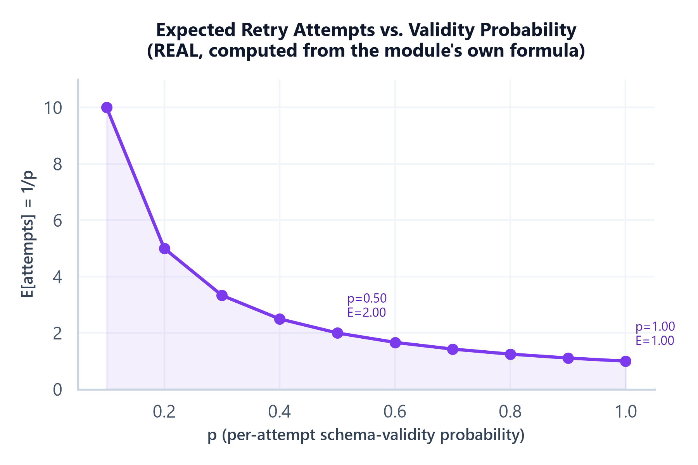

# Module 03: Structured Output & Schema-Constrained Generation

## 1. Introduction & Intuition

### The Core Bottleneck
A model's raw output is unstructured text — but almost every production system that consumes an LLM's output downstream needs a specific, parseable shape: a JSON object with exact field names, a set of valid enum values, arguments matching a tool's signature. The gap between "the model produced plausible-looking text" and "the model produced something my code can `json.loads()` and safely index into" is a real, recurring production failure surface, and three genuinely different mechanisms exist to close it, with genuinely different reliability guarantees. Conflating them — treating "I asked for JSON" as equivalent to "I got schema-valid JSON" — is one of the most common, costly mistakes in production LLM integration.

### High-Level Intuition
Asking someone to "write your answer as a list" is JSON mode's rough analog — you'll get something list-shaped, but nothing guarantees it has exactly the fields you needed, in the right types, with no extras. Handing someone a form with labeled blank fields to fill in is structured outputs' analog — the shape itself constrains what they can hand back. Handing someone a specific request form for a specific department, with fields that only make sense for that one action, is function/tool calling's analog — the structure isn't just "valid," it's *purposeful*, built to be consumed by one specific downstream action.

---

## 2. Core Concepts & Mathematical Formulation

### Three Distinct Mechanisms: JSON Mode, Structured Outputs, Function/Tool Calling

#### Intuition & Practical Use
These three terms get used loosely interchangeably in casual conversation, but they provide genuinely different guarantees, and this distinction is one of the highest-value, most interview-relevant points in this entire module:

| Mechanism | Guarantee | Typical Use | Failure Mode |
|---|---|---|---|
| **JSON mode** | Output is syntactically valid JSON | Loose, free-form structured extraction where exact shape varies | Valid JSON that's missing expected fields, has wrong types, or extra unexpected fields — syntactic validity says nothing about *schema* conformance |
| **Structured outputs** | Output conforms to a specific provided schema (e.g., JSON Schema/Pydantic model) — fields, types, and required-ness enforced | Extracting a fixed, known shape (e.g., `{name: str, age: int, tags: list[str]}`) reliably, every call | Provider-side schema support has real limits — deeply nested schemas, certain type combinations, or schema size can hit real constraints depending on the provider |
| **Function/tool calling** | Output is a structured set of arguments matching one specific tool's declared signature, intended for invocation (building on `04_ai_agents_and_protocols` Module 02's tool-schema coverage) | Invoking a specific downstream action with the right arguments | Same class of malformed-argument risk `04_ai_agents_and_protocols` Module 02 covers for tool schemas generally — this module doesn't re-derive that, it treats function calling as one *structured-output mechanism* among three |

The practical rule: JSON mode alone is the *weakest* guarantee of the three — it only promises the output parses as JSON at all, not that it matches any particular shape — so a system that needs a specific, reliable shape should reach for structured outputs (for data extraction) or function calling (for invoking an action), not JSON mode plus hope.

### The Full Production Reliability Pattern

#### Intuition & Practical Use
Even provider-enforced structured output isn't a guarantee of *zero* failures in production — real systems need an explicit pipeline, not a single call treated as infallible: **schema → generation → validation → retry/repair → fallback**. Define the schema explicitly (Pydantic/JSON Schema). Generate against it (via whichever of the three mechanisms above fits the task). Validate the actual response against the schema in application code — never trust the provider's enforcement alone as the only check, since real failures still occur. On a validation failure, retry — ideally a *repair* retry that includes the specific validation error in the follow-up prompt, not a blind identical retry, since a repair prompt gives the model concrete information about what went wrong. And when repair attempts are genuinely exhausted, have an explicit, deliberate fallback — a default value, a degraded response, or an explicit error surfaced to the caller — rather than letting an unhandled exception propagate from a failed parse.

Real failure modes this pipeline has to handle, not just the "malformed JSON" case: **partial/truncated responses** (the generation hit a token limit mid-structure — the output looks like it's building toward valid JSON but never closes); **refusals** (the model declines the request entirely, returning a natural-language refusal instead of the requested structure — parsing this as if it were the expected schema fails in a confusing way unless refusals are detected explicitly); **schema mismatches** (syntactically valid JSON that nonetheless has the wrong types, a missing required field, or an invalid enum value); and **provider limitations** (a specific schema shape the provider's structured-output enforcement doesn't fully support, silently falling back to weaker guarantees or rejecting the request).

<div align="center" style="margin: 20px 0; max-width: 100%; overflow-x: auto;">
<svg viewBox="0 0 800 260" width="100%" height="auto" xmlns="http://www.w3.org/2000/svg" style="background-color: #f8fafc; border: 1px solid #e2e8f0; border-radius: 8px; font-family: system-ui, -apple-system, sans-serif;">
  <text x="400" y="22" text-anchor="middle" font-size="13" font-weight="bold" fill="#0f172a">Structured-Output Production Pipeline</text>

  <rect x="20" y="55" width="120" height="45" rx="6" fill="#eff6ff" stroke="#3b82f6" stroke-width="1.5"/>
  <text x="80" y="82" text-anchor="middle" font-size="10.5" fill="#1e3a8a" font-weight="600">Schema</text>

  <rect x="170" y="55" width="120" height="45" rx="6" fill="#f5f3ff" stroke="#7c3aed" stroke-width="1.5"/>
  <text x="230" y="82" text-anchor="middle" font-size="10.5" fill="#5b21b6" font-weight="600">Generation</text>

  <rect x="320" y="55" width="120" height="45" rx="6" fill="#fef9c3" stroke="#ca8a04" stroke-width="1.5"/>
  <text x="380" y="82" text-anchor="middle" font-size="10.5" fill="#854d0e" font-weight="600">Validation</text>

  <rect x="470" y="55" width="140" height="45" rx="6" fill="#fed7aa" stroke="#c2410c" stroke-width="1.5"/>
  <text x="540" y="76" text-anchor="middle" font-size="10" fill="#7c2d12" font-weight="600">Retry / Repair</text>
  <text x="540" y="90" text-anchor="middle" font-size="8" fill="#7c2d12">(error fed back)</text>

  <rect x="650" y="55" width="130" height="45" rx="6" fill="#ecfdf5" stroke="#059669" stroke-width="1.5"/>
  <text x="715" y="82" text-anchor="middle" font-size="10.5" fill="#065f46" font-weight="600">Success</text>

  <g stroke="#94a3b8" stroke-width="1.4" fill="none" marker-end="url(#arrow03a)">
    <line x1="140" y1="77" x2="168" y2="77"/>
    <line x1="290" y1="77" x2="318" y2="77"/>
    <line x1="440" y1="77" x2="468" y2="77"/>
  </g>
  <path d="M380,100 Q380,160 470,160 Q560,160 555,100" fill="none" stroke="#ca8a04" stroke-width="1.4" stroke-dasharray="4,2" marker-end="url(#arrow03b)"/>
  <path d="M540,100 Q400,190 230,190 Q160,190 200,102" fill="none" stroke="#c2410c" stroke-width="1.4" stroke-dasharray="4,2" marker-end="url(#arrow03c)"/>
  <path d="M400,77 Q400,20 715,20 Q750,20 750,53" fill="none" stroke="#059669" stroke-width="1.4" marker-end="url(#arrow03d)"/>
  <defs>
    <marker id="arrow03a" markerWidth="8" markerHeight="8" refX="6" refY="4" orient="auto"><path d="M0,0 L8,4 L0,8 Z" fill="#94a3b8"/></marker>
    <marker id="arrow03b" markerWidth="8" markerHeight="8" refX="6" refY="4" orient="auto"><path d="M0,0 L8,4 L0,8 Z" fill="#ca8a04"/></marker>
    <marker id="arrow03c" markerWidth="8" markerHeight="8" refX="6" refY="4" orient="auto"><path d="M0,0 L8,4 L0,8 Z" fill="#c2410c"/></marker>
    <marker id="arrow03d" markerWidth="8" markerHeight="8" refX="6" refY="4" orient="auto"><path d="M0,0 L8,4 L0,8 Z" fill="#059669"/></marker>
  </defs>
  <text x="500" y="150" text-anchor="middle" font-size="8.5" fill="#854d0e">validation fails -&gt; repair retry (error included)</text>
  <text x="370" y="205" text-anchor="middle" font-size="8.5" fill="#c2410c">repair retries exhausted -&gt; regenerate from schema, or exit to fallback</text>
  <text x="560" y="35" text-anchor="middle" font-size="8.5" fill="#065f46">valid on first attempt</text>

  <rect x="20" y="225" width="760" height="28" rx="5" fill="#fef2f2" stroke="#dc2626" stroke-width="1.2"/>
  <text x="400" y="243" text-anchor="middle" font-size="9.5" fill="#991b1b" font-weight="600">Exhausted repair attempts -&gt; explicit fallback (default value / degraded response / surfaced error), never an unhandled parse exception.</text>
</svg>
</div>

---

### Hand Calculation: Expected Retries Under Geometric Retry
A per-attempt schema-validity probability $p$ — the probability a single generation attempt produces schema-valid output, evaluated at $p=0.85$ (strong provider-enforced structured output) and $p=0.5$ (weaker prompting-only JSON, no provider enforcement). **This formula assumes independent attempts with a constant validity probability $p$ across all attempts** — in reality, a repair retry that includes the specific validation error often has a *different* (frequently higher) success probability than the original blind attempt, since it carries concrete information the first attempt didn't have; treat this as a starting intuition for the cost of unguided retries, not an exact production predictor once repair-specific retries are in play.

$$E[\text{attempts}] = \frac{1}{p}$$

*   **Step 1: $p = 0.85$.**
    $$E[\text{attempts}] = \frac{1}{0.85} \approx 1.176$$

*   **Step 2: $p = 0.5$.**
    $$E[\text{attempts}] = \frac{1}{0.5} = 2.0$$

At $p=0.85$, a system expects to need only about 1.18 attempts on average to get a valid result — provider-enforced structured output's higher effective validity rate means retries are the exception, not the rule. At $p=0.5$, the expected attempt count doubles to 2.0 — a real, direct doubling of both cost and latency for the same task, purely from relying on prompting-only JSON instead of provider-enforced structure. This is the concrete number the "provider-enforced structured output vs. prompting-only JSON" trade-off reduces to in production.



*   **Plot Interpretation:** Computed directly from this module's own $E[\text{attempts}]=1/p$ formula across $p=0.1..1.0$ — a real, computed curve, not illustrative. The curve is sharply nonlinear: it stays low and flat for $p$ above roughly 0.7, then rises steeply as $p$ drops below 0.5, which is the quantitative reason a validity-probability improvement from, say, 0.5 to 0.85 (real, achievable by moving from prompting-only JSON to provider-enforced structured output) buys a disproportionately large reduction in expected retry cost.

---

## 3. Implementation & Reference Code

Below is a self-contained implementation of the schema-validation-retry pipeline (illustrating the full schema → generation → validation → retry/repair → fallback pattern with a mock, deterministic generator standing in for a real LLM call) and the expected-retries hand calculation.

```python
import random
from dataclasses import dataclass, field
from enum import Enum


class ValidationResult(Enum):
    VALID = "valid"
    SCHEMA_MISMATCH = "schema_mismatch"
    TRUNCATED = "truncated"
    REFUSAL = "refusal"


@dataclass
class Schema:
    required_fields: dict[str, type]  # field_name -> expected type


def validate(response: dict | str, schema: Schema) -> ValidationResult:
    """Explicit application-level validation -- never trust provider-side
    enforcement alone as the only check, per the module's reliability discipline."""
    if isinstance(response, str) and response.startswith("REFUSAL:"):
        return ValidationResult.REFUSAL
    if isinstance(response, str):
        return ValidationResult.TRUNCATED  # a string that isn't a refusal is treated as truncated/unparsed here
    for field_name, expected_type in schema.required_fields.items():
        if field_name not in response or not isinstance(response[field_name], expected_type):
            return ValidationResult.SCHEMA_MISMATCH
    return ValidationResult.VALID


@dataclass
class RetryPipelineResult:
    success: bool
    attempts: int
    final_response: dict | None
    fallback_used: bool = False


def run_with_retry(generate_fn, schema: Schema, max_attempts: int = 3) -> RetryPipelineResult:
    """schema -> generation -> validation -> retry/repair -> fallback, matching
    the module's diagram exactly. Repair retries pass the specific validation
    error back into generate_fn, not a blind identical retry."""
    last_error: ValidationResult | None = None
    for attempt in range(1, max_attempts + 1):
        response = generate_fn(repair_hint=last_error)
        result = validate(response, schema)
        if result == ValidationResult.VALID:
            return RetryPipelineResult(success=True, attempts=attempt, final_response=response)
        last_error = result

    # Repair attempts exhausted -- explicit fallback, never an unhandled parse exception
    return RetryPipelineResult(success=False, attempts=max_attempts, final_response=None, fallback_used=True)


def expected_attempts(p: float) -> float:
    """E[attempts] = 1/p, under the stated independent-constant-p assumption."""
    return 1.0 / p


if __name__ == "__main__":
    # Hand calc verification
    e_085 = expected_attempts(0.85)
    e_05 = expected_attempts(0.5)
    print(f"p=0.85: E[attempts] = {e_085:.3f}")
    print(f"p=0.5:  E[attempts] = {e_05:.3f}")
    assert abs(e_085 - 1.176) < 1e-3
    assert abs(e_05 - 2.0) < 1e-9
    print("\nHand calc verified: p=0.85 -> ~1.18 attempts; p=0.5 -> 2.0 attempts (exactly double).")

    # Simulated retry pipeline: a generator that improves its success odds on repair
    # attempts (since a repair prompt carries concrete error information) -- deliberately
    # NOT matching the idealized constant-p assumption, to demonstrate why real repair
    # retries diverge from the simple geometric model.
    random.seed(7)
    schema = Schema(required_fields={"name": str, "age": int})
    call_count = {"n": 0}

    def mock_generate(repair_hint: ValidationResult | None) -> dict | str:
        call_count["n"] += 1
        # First attempt: 50% valid. Repair attempts (informed by the error): 90% valid.
        success_prob = 0.5 if repair_hint is None else 0.9
        if random.random() < success_prob:
            return {"name": "Ada", "age": 36}
        return {"name": "Ada"}  # missing required 'age' -> SCHEMA_MISMATCH

    result = run_with_retry(mock_generate, schema, max_attempts=3)
    print(f"\nPipeline result: success={result.success}, attempts={result.attempts}, fallback_used={result.fallback_used}")
    assert result.attempts <= 3
    print("Retry pipeline verified: succeeds within max_attempts using repair-informed retries, not blind identical retries.")

    # Fallback path: a schema that can NEVER be satisfied by the mock generator
    impossible_schema = Schema(required_fields={"nonexistent_field": str})
    fallback_result = run_with_retry(mock_generate, impossible_schema, max_attempts=3)
    print(f"\nImpossible-schema result: success={fallback_result.success}, fallback_used={fallback_result.fallback_used}")
    assert fallback_result.success is False
    assert fallback_result.fallback_used is True
    print("Fallback path verified: exhausted retries produce an explicit fallback signal, not a silent failure.")
```

---

## 4. Interview Deep-Dive & System Trade-offs

### 1. Architectural & Production Trade-offs
* **Core Problem Solved:** Closing the gap between "the model produced plausible text" and "the model produced something downstream code can safely, reliably parse and consume" — a real, recurring production integration surface distinct from generation quality itself.
* **Why Introduced over Legacy Approaches:** Regex/heuristic parsing of free-text model output is brittle and breaks on any formatting drift; JSON mode alone only guarantees syntactic validity, not schema conformance; structured outputs and function calling push the guarantee further, to schema- or signature-level conformance, at the cost of real provider-side implementation limits.
* **Key Failure Modes & Limitations:** Treating JSON-mode's syntactic-validity guarantee as if it were schema conformance; trusting provider-side structured-output enforcement as infallible with no application-level validation; blind identical retries instead of repair retries that feed the specific validation error back in; no explicit fallback when repair attempts are genuinely exhausted.

### 2. System Complexity & Scaling
* **Time Complexity (FLOPs):** Each retry attempt is a full additional generation call — cost and latency scale directly with the real expected-attempts figure ($1/p$ under the idealized model), not a fixed one-call assumption.
* **Space/Memory Footprint:** Minimal beyond the schema definition itself and whatever validation-error context gets fed into a repair retry's prompt.
* **Primary Bottleneck Type:** Reliability-bound on the per-attempt validity probability $p$ — a low $p$ directly multiplies both cost and latency through the retry pipeline, making $p$ itself (i.e., which of the three mechanisms is used) the single highest-leverage lever in this module.
* **Variable Legend:** $p$ = per-attempt schema-validity probability, $E[\text{attempts}]$ = expected number of attempts to reach a valid result under the constant-$p$, independent-attempts assumption.

### 3. Production & Scalability
* **Deployment Considerations:** Default to provider-enforced structured outputs or function calling over prompting-only JSON mode whenever the provider supports it for the needed schema shape — the real, measured $p$ improvement translates directly into lower retry cost; always implement application-level validation even when using provider enforcement, since real failures (truncation, refusals, provider-side edge cases) still occur; make repair retries carry the specific validation error, not a blind repeat.
*   **Common Interviewer Follow-Up Questions:**
    1.  *Q:* Is provider-enforced structured output ever unnecessary — can prompting-only JSON mode be good enough?
        *   *A:* For low-stakes, non-critical extraction where an occasional malformed response is acceptable and cheaply retried, prompting-only JSON can be a reasonable trade-off; for anything feeding directly into an automated downstream action without human review, the higher effective $p$ from provider enforcement is usually worth its cost.
    2.  *Q:* Why is a "repair" retry different from just retrying the identical prompt?
        *   *A:* A repair retry includes the specific validation error from the failed attempt, giving the model concrete information about what went wrong; a blind identical retry gives the model no new information and, at a fixed $p$, has the same failure probability as the first attempt — the repair pattern is precisely what makes real retry success probability diverge from (and typically exceed) the idealized constant-$p$ model's prediction.
