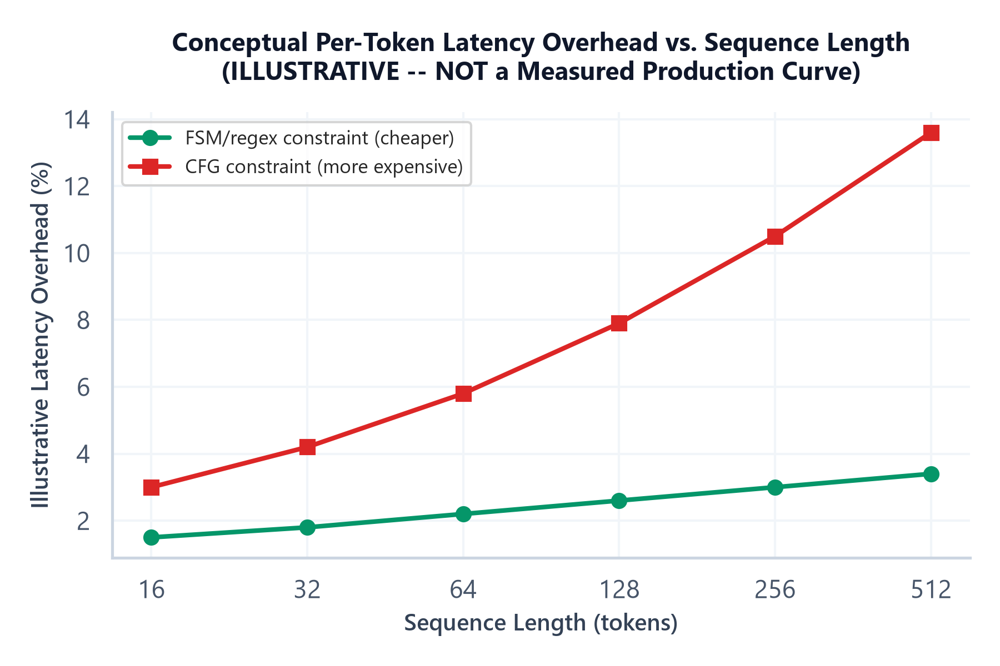

# Module 04: Constrained Decoding & Grammar-Based Generation

## 1. Introduction & Intuition

### The Core Bottleneck
Module 03's validation-retry pipeline is a real, workable production pattern — but it's fundamentally a *detect-and-recover* strategy: the model is free to generate anything, and the system catches invalid output after the fact. Constrained decoding takes a structurally different approach: it makes invalid output *impossible to sample in the first place*, by intervening at the token-generation step itself, not after it. This isn't a strictly better replacement for Module 03's pipeline — it's a different point on the reliability/cost trade-off curve, with its own real engineering cost, and this module's job is being precise about the actual mechanism, not just asserting "grammar-based generation" as a black-box feature.

### High-Level Intuition
Module 03's approach is like accepting any answer on a form, then checking it against the rules afterward and asking for a redo if it's wrong. Constrained decoding is like designing the form itself so that certain answers are physically impossible to write down — a dropdown menu instead of a blank text field. The dropdown genuinely can't produce an invalid selection; but building and maintaining that dropdown (the constraint machinery) is real, additional engineering work compared to a blank field with a rule-checker.

---

## 2. Core Concepts & Mathematical Formulation

### Why Prompting Alone Can't Guarantee Valid Structure

#### Intuition & Practical Use
No matter how precisely a prompt specifies the required output format, the model is still free — at the level of what tokens it's *physically capable* of sampling — to produce anything in its vocabulary at every single step. A prompt is a strong statistical influence on the logits (Module 01), but it is not a hard constraint on the sampling space itself; the model can still, with some nonzero probability, sample a token that breaks the format, no matter how well-instructed the prompt. This is the precise reason Module 03's validation-retry pattern exists as a *necessary* safety net for prompting-only or even provider-structured-output approaches — and it's exactly the gap constrained decoding closes by intervening one level below the prompt, at the sampling step itself.

### The Logit-Masking Mechanism

#### Intuition & Practical Use
Constrained decoding works by identifying, at each generation step, the set of tokens that are *grammatically valid* given everything generated so far and the target grammar/schema — then setting every other token's probability to exactly zero **before** sampling, not after. This is a direct, mechanical intervention on the sampling distribution, not a black-box "the model follows the grammar" claim:

$$P_i = \frac{\exp(z_i)\cdot \mathbb{1}[i \in V_{\text{valid}}]}{\sum_{j \in V_{\text{valid}}} \exp(z_j)}$$

Here $V_{\text{valid}}$ is the subset of the vocabulary that's grammatically valid at this specific generation step (e.g., if a JSON object's key is expected next, $V_{\text{valid}}$ might be exactly the tokens that could start a valid key string plus the closing brace); $\mathbb{1}[i \in V_{\text{valid}}]$ is an indicator that zeroes out every invalid token's contribution entirely, and the denominator renormalizes probability mass over *only* the valid tokens, so the result is still a real, well-formed probability distribution — just one with zero probability mass on anything that would break the grammar. Sampling from this renormalized distribution makes an invalid token structurally impossible to draw, not just statistically unlikely.

### Finite-State-Machine & Regex-Constrained Decoding

#### Intuition & Practical Use
For simpler structural constraints — a specific regex pattern, a fixed enum of allowed strings, a JSON object matching a flat schema — the set of valid next tokens at each step can be computed from a finite-state machine (FSM) tracking which "state" of the pattern generation is currently in (e.g., "inside a string value," "expecting a comma or closing brace"). At each step, the FSM's current state determines $V_{\text{valid}}$ directly — this is computationally cheap relative to more general grammar constraints, since an FSM's state space is typically small and its transitions are simple lookups.

### Context-Free-Grammar-Constrained Decoding

#### Intuition & Practical Use
For genuinely recursive/nested structures (arbitrarily nested JSON objects, a programming-language-like grammar), a simple FSM isn't expressive enough — a context-free grammar (CFG), tracked via a stack-based parser state rather than a flat FSM state, is needed to correctly compute $V_{\text{valid}}$ at each step while respecting arbitrary nesting depth. This is a genuinely more expensive computation per step than the FSM case, since the valid-token-set computation now depends on the full current parse stack, not just one flat state.

### Libraries Implementing This

#### Intuition & Practical Use
This mechanism is implemented in practice by libraries like **Outlines** (FSM/CFG-based constrained decoding, integrating directly with a local model's logit output) and **Guidance** (a broader templating + constrained-generation library), as well as increasingly by **provider-native grammar support** (some hosted-model APIs now expose grammar/schema constraints as a first-class request parameter, running the equivalent masking server-side). The practical choice between them depends on whether the deployment controls the model's raw logits directly (self-hosted/local models, where library-level masking is straightforward) or calls a hosted API (where the provider has to implement and expose this mechanism itself).

### Real Inference-Time Cost: What It Actually Depends On

#### Intuition & Practical Use
It's tempting to summarize constrained decoding's cost as a single fixed "per-token overhead" figure, but that overstates how uniform the real cost actually is — the true overhead depends on several genuinely distinct, real factors: the **grammar implementation's efficiency** (an FSM's per-step valid-token-set computation is cheap; a deeply-nested CFG's stack-aware computation is meaningfully more expensive); the **tokenizer/vocabulary size** (computing which of a 100K-token vocabulary are currently valid is a larger computation than for a small vocabulary); whether the **valid-token-set computation is cached** across steps where the grammar state hasn't meaningfully changed (a well-implemented library reuses prior computation rather than recomputing from scratch every step); and the **serving engine's own integration** (whether masking is fused efficiently into the existing generation loop or bolted on as a separate, slower post-processing pass). The honest summary: constrained decoding's overhead is real and worth measuring for a specific grammar/model/serving-stack combination — it is not a single universal number that transfers across setups.



*   **Plot Interpretation:** This is a **conceptual illustration, not a measured production curve** — no notebook in this topic measures real constrained-decoding latency overhead on a specific grammar/model/serving-stack combination. The qualitative shape (overhead generally growing with sequence length and being higher for CFG-style grammars than FSM-style ones) is the point being illustrated, consistent with the real, distinct cost factors discussed above — not a claim about any specific real-world per-token cost figure.

<div align="center" style="margin: 20px 0; max-width: 100%; overflow-x: auto;">
<svg viewBox="0 0 800 280" width="100%" height="auto" xmlns="http://www.w3.org/2000/svg" style="background-color: #f8fafc; border: 1px solid #e2e8f0; border-radius: 8px; font-family: system-ui, -apple-system, sans-serif;">
  <text x="400" y="22" text-anchor="middle" font-size="13" font-weight="bold" fill="#0f172a">Grammar-Constrained Decoding: Valid-Token-Set Narrowing, Step by Step</text>
  <text x="400" y="40" text-anchor="middle" font-size="9.5" fill="#64748b">Generating: {"ok": true</text>

  <rect x="30" y="60" width="220" height="70" rx="6" fill="#eff6ff" stroke="#3b82f6" stroke-width="1.5"/>
  <text x="140" y="80" text-anchor="middle" font-size="10.5" fill="#1e3a8a" font-weight="600">Step 1: start of value</text>
  <text x="140" y="98" text-anchor="middle" font-size="8.5" fill="#1e3a8a">FSM state: expect { </text>
  <text x="140" y="112" text-anchor="middle" font-size="8.5" fill="#1e3a8a">V_valid = { "{" }  (1 of 50k tokens)</text>

  <rect x="290" y="60" width="220" height="70" rx="6" fill="#f5f3ff" stroke="#7c3aed" stroke-width="1.5"/>
  <text x="400" y="80" text-anchor="middle" font-size="10.5" fill="#5b21b6" font-weight="600">Step 2: inside object</text>
  <text x="400" y="98" text-anchor="middle" font-size="8.5" fill="#5b21b6">FSM state: expect key</text>
  <text x="400" y="112" text-anchor="middle" font-size="8.5" fill="#5b21b6">V_valid = {'"ok"', '"..."'}  (schema keys only)</text>

  <rect x="550" y="60" width="220" height="70" rx="6" fill="#fef9c3" stroke="#ca8a04" stroke-width="1.5"/>
  <text x="660" y="80" text-anchor="middle" font-size="10.5" fill="#854d0e" font-weight="600">Step 3: value for "ok"</text>
  <text x="660" y="98" text-anchor="middle" font-size="8.5" fill="#854d0e">FSM state: expect bool</text>
  <text x="660" y="112" text-anchor="middle" font-size="8.5" fill="#854d0e">V_valid = {true, false}  (2 of 50k tokens)</text>

  <g stroke="#94a3b8" stroke-width="1.4" fill="none" marker-end="url(#arrow04a)">
    <line x1="250" y1="95" x2="288" y2="95"/>
    <line x1="510" y1="95" x2="548" y2="95"/>
  </g>
  <defs>
    <marker id="arrow04a" markerWidth="8" markerHeight="8" refX="6" refY="4" orient="auto">
      <path d="M0,0 L8,4 L0,8 Z" fill="#94a3b8"/>
    </marker>
  </defs>

  <rect x="30" y="165" width="740" height="55" rx="6" fill="#ecfdf5" stroke="#059669" stroke-width="1.3"/>
  <text x="400" y="188" text-anchor="middle" font-size="10" fill="#065f46" font-weight="600">Every step: invalid tokens get logit-masked to zero probability BEFORE sampling --</text>
  <text x="400" y="204" text-anchor="middle" font-size="10" fill="#065f46">an invalid token is structurally impossible to draw, not just statistically discouraged by the prompt.</text>

  <rect x="30" y="235" width="740" height="35" rx="6" fill="#fef2f2" stroke="#dc2626" stroke-width="1.2"/>
  <text x="400" y="257" text-anchor="middle" font-size="9.5" fill="#991b1b" font-weight="600">Real per-step cost depends on grammar complexity, tokenizer size, caching, and serving-engine integration -- not one fixed number.</text>
</svg>
</div>

---

### Hand Calculation: Masked Softmax on a Tiny Vocabulary
A 5-token vocabulary $\{$`the`, `cat`, `"`, `,`, `}`$\}$ with logits $z = [1.5, 0.8, 2.1, -0.3, 0.9]$ — at a point in generation where the grammar (a JSON string just opened) makes only the tokens `"` and `,` valid next (indices 2 and 3), the rest being grammatically impossible at this exact step.

*   **Step 1: Raw logits and their unmasked softmax (for contrast).**
    $$\exp(z) = [4.482, 2.226, 8.166, 0.741, 2.460], \quad \sum = 18.075$$
    $$P_{\text{unmasked}} = [0.2480, 0.1231, 0.4518, 0.0410, 0.1361]$$
    Unmasked, the model would place its *highest* probability (45.2%) on `"` — which happens to be valid here — but the three grammatically **invalid** tokens at this step (`the`, `cat`, `}` — indices 0, 1, 4) still carry $24.8\% + 12.3\% + 13.6\% = 50.7\%$ of the total probability mass between them, a real, substantial chance of breaking the structure if sampled without masking.

*   **Step 2: Apply the mask — zero out indices 0, 1, 4 (invalid); keep indices 2, 3 (valid).**
    $$\exp(z)_{\text{valid only}} = [8.166, 0.741], \quad \sum_{\text{valid}} = 8.907$$
    $$P_{\text{masked}} = [0.9168, 0.0832] \quad \text{(indices 2 and 3 only; all others exactly } 0\text{)}$$

The renormalized distribution places 100% of its probability mass on the two grammatically valid tokens — 91.7% on `"`, 8.3% on `,` — and *exactly* zero on the other three, regardless of how much raw logit weight they had. This is the concrete mechanism: masking doesn't just discourage invalid tokens, it removes them from the sampling space entirely.

---

## 3. Implementation & Reference Code

Below is a self-contained implementation of the masked-softmax mechanism, plus a minimal FSM tracking valid-token sets across a tiny grammar (a flat `{"ok": <bool>}` JSON schema), demonstrating the step-by-step narrowing shown in the diagram.

```python
import math
from dataclasses import dataclass, field
from enum import Enum, auto


def masked_softmax(logits: list[float], valid_indices: set[int]) -> list[float]:
    """P_i = exp(z_i) * 1[i in V_valid] / sum_{j in V_valid} exp(z_j).
    Invalid tokens get exactly zero probability, not just a lowered one."""
    exp_vals = [math.exp(z) if i in valid_indices else 0.0 for i, z in enumerate(logits)]
    total = sum(exp_vals)
    return [e / total for e in exp_vals]


class FSMState(Enum):
    EXPECT_OPEN_BRACE = auto()
    EXPECT_KEY = auto()
    EXPECT_BOOL_VALUE = auto()
    DONE = auto()


@dataclass
class TinyGrammarFSM:
    """Tracks valid-token-set narrowing for the flat schema {"ok": <bool>}.
    A real implementation (e.g. Outlines) generalizes this to arbitrary
    regex/CFG grammars; this illustrates the exact mechanism at small scale."""
    state: FSMState = FSMState.EXPECT_OPEN_BRACE

    def valid_tokens(self) -> set[str]:
        if self.state == FSMState.EXPECT_OPEN_BRACE:
            return {"{"}
        if self.state == FSMState.EXPECT_KEY:
            return {'"ok"'}
        if self.state == FSMState.EXPECT_BOOL_VALUE:
            return {"true", "false"}
        return set()

    def advance(self, token: str) -> None:
        if self.state == FSMState.EXPECT_OPEN_BRACE and token == "{":
            self.state = FSMState.EXPECT_KEY
        elif self.state == FSMState.EXPECT_KEY and token == '"ok"':
            self.state = FSMState.EXPECT_BOOL_VALUE
        elif self.state == FSMState.EXPECT_BOOL_VALUE and token in {"true", "false"}:
            self.state = FSMState.DONE


if __name__ == "__main__":
    # Hand calc verification: 5-token vocab, indices 2,3 valid
    logits = [1.5, 0.8, 2.1, -0.3, 0.9]

    unmasked = masked_softmax(logits, valid_indices={0, 1, 2, 3, 4})
    print(f"Unmasked P: {[round(p, 4) for p in unmasked]}")
    assert abs(unmasked[2] - 0.4519) < 1e-3

    masked = masked_softmax(logits, valid_indices={2, 3})
    print(f"Masked P (only indices 2,3 valid): {[round(p, 4) for p in masked]}")
    assert abs(masked[2] - 0.9168) < 1e-3
    assert abs(masked[3] - 0.0832) < 1e-3
    assert masked[0] == 0.0 and masked[1] == 0.0 and masked[4] == 0.0, "Invalid tokens must have EXACTLY zero probability"
    assert abs(sum(masked) - 1.0) < 1e-9
    print("\nHand calc verified: masked distribution sums to 1.0 over only the 2 valid tokens; all others exactly zero.")

    # FSM valid-token-set narrowing across the 3 generation steps in the diagram
    fsm = TinyGrammarFSM()
    print(f"\nStep 1 valid tokens: {fsm.valid_tokens()}")
    assert fsm.valid_tokens() == {"{"}
    fsm.advance("{")

    print(f"Step 2 valid tokens: {fsm.valid_tokens()}")
    assert fsm.valid_tokens() == {'"ok"'}
    fsm.advance('"ok"')

    print(f"Step 3 valid tokens: {fsm.valid_tokens()}")
    assert fsm.valid_tokens() == {"true", "false"}
    fsm.advance("true")

    assert fsm.state == FSMState.DONE
    print("\nFSM verified: valid-token-set narrows exactly as shown in the diagram, reaching DONE after a structurally valid sequence.")

    # A structurally invalid token is provably unsampleable: attempting to mask
    # with an index outside the FSM's current valid set yields zero probability.
    fsm2 = TinyGrammarFSM()  # back at EXPECT_OPEN_BRACE
    vocab = ["{", '"ok"', "true", "false", ","]
    logits2 = [1.0, 1.0, 1.0, 1.0, 1.0]  # uniform logits -- masking is the only thing narrowing this
    valid_idx = {vocab.index(t) for t in fsm2.valid_tokens()}  # only "{" is valid at this step
    probs2 = masked_softmax(logits2, valid_idx)
    invalid_mass = sum(p for i, p in enumerate(probs2) if vocab[i] != "{")
    assert invalid_mass == 0.0, "No probability mass may leak onto structurally invalid tokens, even with equal raw logits"
    print(f"\nInvalid-token probability mass at step 1 (uniform logits): {invalid_mass} -- confirmed zero regardless of raw logit values.")
```

---

## 4. Interview Deep-Dive & System Trade-offs

### 1. Architectural & Production Trade-offs
* **Core Problem Solved:** Making invalid structural output impossible to sample in the first place, rather than detecting and recovering from it after generation (Module 03's approach) — a structural guarantee, not a statistical one.
* **Why Introduced over Legacy Approaches:** Prompting alone, even paired with Module 03's validation-retry pipeline, always leaves a real, nonzero probability of an invalid token being sampled at every step; constrained decoding removes that probability entirely by intervening at the sampling distribution itself.
* **Key Failure Modes & Limitations:** A grammar/schema that's more restrictive than actually intended can force the model into an unnatural or lower-quality completion within the narrowed space; CFG-based constraints for deeply nested structures carry real, non-trivial per-step computation cost; the mechanism only guarantees *structural* validity, not semantic correctness — a syntactically perfect but factually wrong value is still fully valid under the grammar.

### 2. System Complexity & Scaling
* **Time Complexity (FLOPs):** Adds a real, per-step cost on top of the model's own forward pass — computing $V_{\text{valid}}$ and masking the logit vector — whose actual magnitude depends on grammar complexity (FSM vs. CFG), vocabulary size, and whether valid-token-set computation is cached across steps, not a single fixed figure.
* **Space/Memory Footprint:** An FSM's state is small and constant-size; a CFG's parser state (a stack) grows with nesting depth, a real, if usually small, additional memory cost per in-flight generation.
* **Primary Bottleneck Type:** Compute-bound on the per-step valid-token-set computation specifically, layered on top of whatever bottleneck (compute- or memory-bandwidth-bound) the underlying model's forward pass already has.
* **Variable Legend:** $z_i$ = raw logit for token $i$, $V_{\text{valid}}$ = the grammar-determined valid-token subset at the current step, $P_i$ = the renormalized, masked sampling probability for token $i$.

### 3. Production & Scalability
* **Deployment Considerations:** Measure actual per-token overhead for the specific grammar/model/serving-stack combination in use before assuming a general cost figure; prefer FSM/regex constraints over full CFG constraints whenever the target structure is genuinely flat/simple, since the cheaper computation directly reduces real per-step overhead; treat constrained decoding and Module 03's validation-retry pipeline as complementary, not exclusive — constrained decoding removes structural failures, but application-level validation of semantic correctness (Module 03's schema-mismatch and refusal handling) is still a separate, necessary layer.
*   **Common Interviewer Follow-Up Questions:**
    1.  *Q:* If constrained decoding structurally guarantees valid output, why would you still need Module 03's validation-retry pipeline?
        *   *A:* Constrained decoding guarantees *structural* validity (the output conforms to the grammar), not *semantic* correctness (the values are factually right, a refusal was appropriately detected, etc.) — application-level validation still has a real job to do even with structural guarantees in place.
    2.  *Q:* When would you choose FSM/regex constraints over full CFG-based constraints?
        *   *A:* Whenever the target structure is genuinely flat or has bounded, shallow nesting — the FSM's cheaper, constant-size per-step computation is preferable whenever it's expressive enough for the actual schema; reach for CFG-based constraints only when the structure genuinely requires tracking arbitrary nesting depth.
