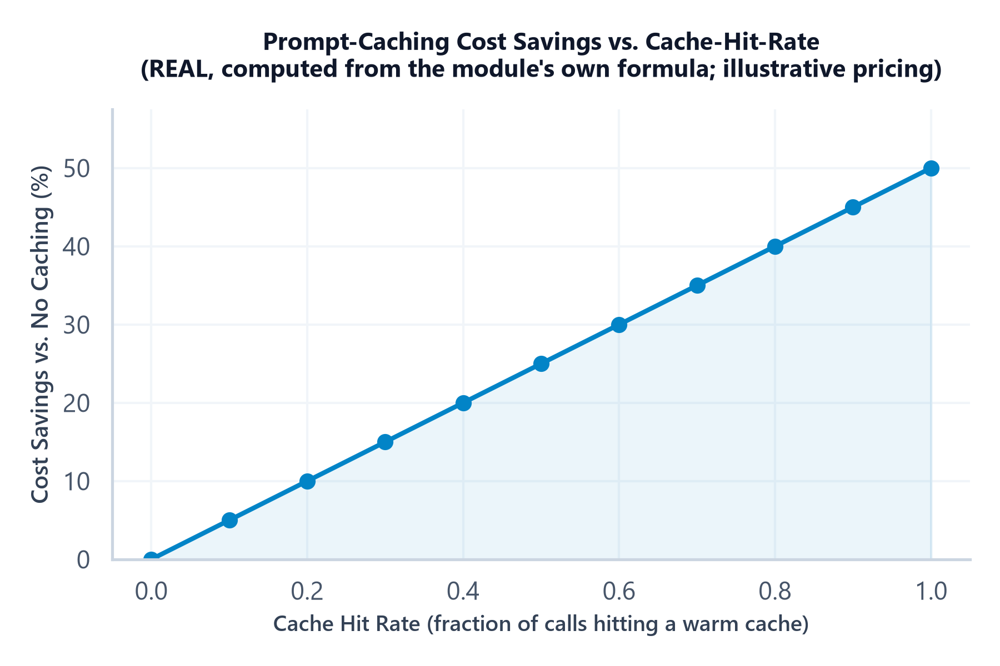

# Module 09: Production Prompt Engineering, Templating & Model Portability

## 1. Introduction & Intuition

### The Core Bottleneck
Every technique in this topic — instruction hierarchy, reasoning elicitation, structured output, constrained decoding, optimization, context assembly, evaluation, injection defense — eventually has to be deployed as real, running production code, not a one-off string tried in a playground. That deployment reality introduces its own distinct problems: prompts need to be templated and versioned like code (Module 07 established *why*; this module covers *how*), multi-turn conversations need real state management across calls, and — a problem specific to production at scale — a prompt tuned and validated against one model can silently behave differently, or outright break, against a different model or even a different version of the same model. This module closes the topic by making all of that concrete.

### High-Level Intuition
A prompt validated once in a notebook against one specific model is like a recipe tested once in one specific kitchen — it might genuinely work there. Deploying it to production, across many calls, potentially across model versions or even providers, is like scaling that recipe to a restaurant chain: the exact oven temperature, ingredient substitutions, and timing that worked in one kitchen don't automatically transfer, and assuming they do without checking is how a recipe that tested perfectly starts producing inconsistent results the moment it's actually deployed at scale.

---

## 2. Core Concepts & Mathematical Formulation

### Prompt Templating Systems

#### Intuition & Practical Use
A production prompt should be a template — parameterized text with explicit variable slots (via Jinja, Python f-strings/`.format()`, or a dedicated templating library), stored and versioned as a first-class artifact (Module 07's versioning discipline), not a string manually concatenated inline wherever it's used in application code. This isn't just tidiness: a templated, versioned prompt can be tested in isolation, diffed between versions to see exactly what changed, and rolled back independently of a full application deploy — none of which is practical when prompt text is scattered as inline literals across a codebase.

### Multi-Turn Prompt & Conversation-State Construction

#### Intuition & Practical Use
A multi-turn conversation's prompt isn't static — it has to be reconstructed on every call from the accumulated conversation state (Module 06's context-budget allocation directly applies here, with "conversation history" as one of the competing segments). Production systems need an explicit, consistent policy for what accumulates verbatim, what gets summarized (Module 06/`04_ai_agents_and_protocols` Module 04's memory-summarization discipline), and how tool-call/tool-result turns get represented in the reconstructed prompt — inconsistent turn representation across a conversation is a real, common source of confusing model behavior that's hard to debug because it only manifests several turns into a session.

### Model-Specific Prompt-Formatting Quirks & Portability

#### Intuition & Practical Use
A prompt that works well on one model is not guaranteed to transfer cleanly to another — this goes well beyond surface formatting. The concrete, multi-dimensional checklist for "will this prompt still work if we swap models":
*   **Instruction hierarchy support** (Module 01) — does the target model/API even expose a distinct system/developer role, or does it only have a flat user/assistant structure requiring the instruction to be folded into the user turn?
*   **Chat template differences** — the exact special tokens and structure wrapping each turn (which the API/tokenizer usually handles, but self-hosted deployments switching base models need to get right explicitly).
*   **Special/reserved tokens** — a token sequence that's meaningful (or forbidden) to one model may be inert or differently-interpreted by another.
*   **Tool-call syntax** — function/tool-calling request and response formats (Module 03) are not standardized across providers; a schema and calling convention tuned for one provider's API needs real adaptation, not just a find-and-replace, for another.
*   **Structured-output support** — which of Module 03's three mechanisms (JSON mode, structured outputs, function calling) a given model/provider actually supports, and to what depth of schema complexity, varies real and materially.
*   **Context-window limits** — a prompt template sized against Module 06's budget arithmetic for one model's window needs re-budgeting, not just hope, against a smaller window on another model.
*   **Sampling-behavior differences** — default temperature, whether top-p/top-k are exposed at all, and how strongly a given model's output actually responds to temperature changes (Module 01) can differ meaningfully between models, even at nominally "the same" parameter value.

Treating model portability as "mostly a formatting detail" understates the real risk — a prompt that silently degrades on a new model/version, evaluated only against the original model's behavior, is a real, easy-to-miss production failure mode; Module 07's regression-testing discipline, re-run against the new target model specifically, is the concrete defense.

### Prompt/Prefix Caching

#### Intuition & Practical Use
Many production prompts have a large, *stable* prefix — a lengthy system prompt, a fixed set of few-shot examples — that's identical across many separate calls, with only a small suffix (the actual user turn) varying. Prompt/prefix caching exploits this: a provider or serving stack can cache the computation for a stable prefix and charge (or compute) a reduced cost for those tokens on a repeat call that shares the same prefix, re-processing only the genuinely new suffix. The cost structure is general — cached tokens priced differently from uncached tokens — but the **actual cached-token discount ratio and cache-eligibility rules differ by provider and change over time**, so any specific price ratio used below is explicitly **illustrative**, not a claimed current rate for any real provider.

$$\text{Cost}_{\text{call}} = T_{\text{cached}} \times \text{price}_{\text{cached}} + T_{\text{uncached}} \times \text{price}_{\text{full}} + T_{\text{out}} \times \text{price}_{\text{out}}$$

---

### Hand Calculation: Prompt-Caching Savings (Illustrative Pricing)
A 1,000-token stable system prompt (cached after the first call) plus a 200-token variable user turn (never cached, always new), at an **illustrative** full price of \$2.50/million tokens and an **illustrative** cached-token price of \$0.25/million tokens (a 10x discount — illustrative only, not a specific provider's real current rate), with a 150-token output at \$10/million tokens, repeated across 100 calls.

*   **Step 1: Per-call cost WITHOUT caching (every call pays full price for all 1,200 input tokens).**
    $$\text{Cost}_{\text{no-cache}} = 1{,}200 \times \$0.0000025 + 150 \times \$0.00001 = \$0.0030 + \$0.0015 = \$0.0045$$

*   **Step 2: Per-call cost WITH caching, after the first call (1,000 cached + 200 uncached input tokens).**
    $$\text{Cost}_{\text{cached}} = (1{,}000 \times \$0.00000025) + (200 \times \$0.0000025) + (150 \times \$0.00001) = \$0.00025 + \$0.0005 + \$0.0015 = \$0.00225$$

*   **Step 3: Total cost across 100 calls (first call pays full price to populate the cache; remaining 99 get the cached rate).**
    $$\text{Total}_{\text{no-cache}} = 100 \times \$0.0045 = \$0.45$$
    $$\text{Total}_{\text{with-cache}} = \$0.0045 + 99 \times \$0.00225 = \$0.0045 + \$0.22275 = \$0.22725$$

At this illustrative pricing, caching roughly **halves** total cost across 100 repeated calls sharing the same stable prefix (\$0.227 vs. \$0.45) — and the break-even is immediate: caching costs strictly less than not caching from the very first repeat call onward, since the only "cost" of enabling caching here is the (illustrative, often free or near-free) act of the first call populating the cache. The real, general lesson independent of the specific illustrative numbers: the savings scale with how large the stable prefix is *relative to* the variable suffix, and how many repeat calls share that exact prefix — a system with a large system prompt and high call volume against the same prefix stands to gain the most.



*   **Plot Interpretation:** Computed directly from this module's own cost-model formula, sweeping the cache-hit-rate (the fraction of calls that hit an already-warm cache) from 0 to 1 at the illustrative pricing above — a real, computed curve given its stated illustrative price assumptions, not a claim about real provider economics. Savings grow linearly with hit rate, reaching the maximum illustrative discount as hit rate approaches 1, which is the direct, quantitative reason a stable, reusable prompt prefix is worth deliberately designing for in a high-volume production system.

---

## 3. Implementation & Reference Code

Below is a self-contained implementation of the prompt-caching cost model and hand calculation, plus a minimal illustration of a versioned prompt template store matching this module's templating discipline.

```python
from dataclasses import dataclass, field


@dataclass
class CachingCostModel:
    """Cost_call = T_cached*price_cached + T_uncached*price_full + T_out*price_out.
    All prices here are ILLUSTRATIVE, not a specific provider's real current rate."""
    price_full_per_token: float
    price_cached_per_token: float
    price_out_per_token: float

    def cost_no_cache(self, t_input: int, t_out: int) -> float:
        return t_input * self.price_full_per_token + t_out * self.price_out_per_token

    def cost_with_cache(self, t_cached: int, t_uncached: int, t_out: int) -> float:
        return (t_cached * self.price_cached_per_token +
                t_uncached * self.price_full_per_token +
                t_out * self.price_out_per_token)


@dataclass
class PromptTemplateVersion:
    """A versioned, storable prompt template artifact -- Module 07's versioning
    discipline made concrete, distinct from an inline string literal."""
    version: str
    template: str  # e.g. "{system}\n\n<<<INPUT>>>\n{user_input}\n<<<END>>>"

    def render(self, **kwargs) -> str:
        return self.template.format(**kwargs)


@dataclass
class PromptTemplateStore:
    versions: dict[str, PromptTemplateVersion] = field(default_factory=dict)
    current_version: str | None = None

    def publish(self, template_version: PromptTemplateVersion, make_current: bool = False) -> None:
        self.versions[template_version.version] = template_version
        if make_current:
            self.current_version = template_version.version

    def get(self, version: str | None = None) -> PromptTemplateVersion:
        v = version or self.current_version
        if v is None or v not in self.versions:
            raise ValueError(f"Unknown or unset prompt template version: {v}")
        return self.versions[v]

    def rollback(self, to_version: str) -> None:
        """Rollback is just repointing current_version -- fast, well-defined,
        matching Module 07's rollback requirement exactly."""
        if to_version not in self.versions:
            raise ValueError(f"Cannot roll back to unknown version: {to_version}")
        self.current_version = to_version


if __name__ == "__main__":
    # Hand calc verification
    model = CachingCostModel(
        price_full_per_token=2.50 / 1_000_000,
        price_cached_per_token=0.25 / 1_000_000,
        price_out_per_token=10.0 / 1_000_000,
    )

    no_cache_per_call = model.cost_no_cache(t_input=1200, t_out=150)
    cached_per_call = model.cost_with_cache(t_cached=1000, t_uncached=200, t_out=150)
    print(f"Per-call cost, no cache: ${no_cache_per_call:.5f}")
    print(f"Per-call cost, cached (after 1st call): ${cached_per_call:.5f}")
    assert abs(no_cache_per_call - 0.0045) < 1e-6
    assert abs(cached_per_call - 0.00225) < 1e-6

    total_no_cache = 100 * no_cache_per_call
    total_with_cache = no_cache_per_call + 99 * cached_per_call  # 1st call pays full price to populate cache
    print(f"\nTotal over 100 calls, no cache: ${total_no_cache:.5f}")
    print(f"Total over 100 calls, with cache: ${total_with_cache:.5f}")
    assert abs(total_no_cache - 0.45) < 1e-6
    assert abs(total_with_cache - 0.22725) < 1e-6
    assert total_with_cache < total_no_cache
    print(f"\nHand calc verified: caching cuts total cost by {(1 - total_with_cache/total_no_cache):.1%} over 100 calls at this illustrative pricing.")

    # Versioned template store: publish, render, rollback
    store = PromptTemplateStore()
    store.publish(PromptTemplateVersion(version="v1", template="{system}\n\nUser: {user_input}"), make_current=True)
    store.publish(PromptTemplateVersion(version="v2", template="{system}\n\n<<<INPUT>>>{user_input}<<<END>>>"), make_current=True)

    current = store.get()
    print(f"\nCurrent template version: {current.version}")
    rendered = current.render(system="You are a helpful assistant.", user_input="Hello!")
    print(f"Rendered (v2): {rendered}")
    assert current.version == "v2"
    assert "<<<INPUT>>>" in rendered

    # Rollback to v1 -- fast, well-defined, no manual reconstruction
    store.rollback("v1")
    rolled_back = store.get()
    print(f"\nAfter rollback, current version: {rolled_back.version}")
    assert rolled_back.version == "v1"
    print("Versioned template store verified: publish, render, and rollback all function correctly.")
```

---

## 4. Interview Deep-Dive & System Trade-offs

### 1. Architectural & Production Trade-offs
* **Core Problem Solved:** Turning a prompt that worked once, tested against one model, into a genuinely production-ready artifact — templated and versioned like code, correctly reconstructed across multi-turn conversations, and explicitly checked for portability rather than assumed to transfer across models.
* **Why Introduced over Legacy Approaches:** Inline prompt strings scattered across application code can't be diffed, versioned, or rolled back independently; assuming a prompt validated on one model transfers unchanged to another ignores real, material differences in instruction-hierarchy support, tool-call syntax, structured-output support, and sampling behavior.
* **Key Failure Modes & Limitations:** A prompt silently degrading after a model/version swap, caught only if Module 07's regression testing is re-run against the new target specifically; inconsistent multi-turn state reconstruction producing confusing, hard-to-debug behavior several turns into a session; assuming a specific cached-token discount ratio is universal across providers rather than illustrative and provider-specific.

### 2. System Complexity & Scaling
* **Time Complexity (FLOPs):** Prompt caching directly reduces the effective compute/cost of the cached-prefix portion of repeated calls; multi-turn reconstruction cost scales with conversation length the same way Module 06's context-budget concerns do.
* **Space/Memory Footprint:** A versioned template store's storage cost is negligible relative to LLM-call costs; a provider-side prompt cache has its own real storage/eviction policy, outside this system's direct control.
* **Primary Bottleneck Type:** Cost-bound for caching decisions (the real payoff is in reduced per-call spend at scale); portability failures are reliability-bound — a silent behavior change is a correctness risk, not a performance one.
* **Variable Legend:** $T_{\text{cached}}$/$T_{\text{uncached}}$/$T_{\text{out}}$ = cached input, uncached input, and output token counts; $\text{price}_{\text{cached}}$/$\text{price}_{\text{full}}$/$\text{price}_{\text{out}}$ = their respective (illustrative, provider-specific) per-token prices.

### 3. Production & Scalability
* **Deployment Considerations:** Design prompt templates with a genuinely stable, reusable prefix wherever call volume against a shared prefix is high, to actually earn caching's benefit; re-run Module 07's full regression suite against any new target model or model version before switching, never assuming portability; version every prompt template with a fast rollback path, exactly as Module 07 requires.
*   **Common Interviewer Follow-Up Questions:**
    1.  *Q:* You're migrating a prompt from one model provider to another. What's your validation process, beyond just checking it "looks right"?
        *   *A:* Re-run the full multi-dimensional regression suite from Module 07 against the new target model specifically, and explicitly check the portability checklist — instruction-hierarchy support, structured-output/tool-call-syntax differences, context-window limits, and sampling-behavior differences — since any of these can silently degrade behavior even when the prompt text itself is unchanged.
    2.  *Q:* When does prompt caching NOT provide a meaningful benefit?
        *   *A:* When the prompt has little to no stable, reusable prefix (highly variable prompts with almost nothing shared call-to-call), or when call volume against any single shared prefix is low — the cache-hit-rate stays near zero either way, and the real, computed savings curve (this module's plot) shows the benefit scales directly with hit rate, approaching zero as hit rate does.
