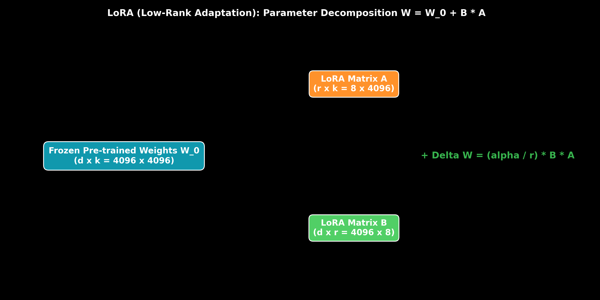

# Parameter-Efficient Fine-Tuning: LoRA, QLoRA & Rank Decomposition

This guide details Parameter-Efficient Fine-Tuning (PEFT), Low-Rank Adaptation (LoRA), QLoRA 4-bit NormalFloat quantization, rank decomposition math ($W = W_0 + \frac{\alpha}{r} B A$), hand calculations, PyTorch code, and production trade-offs.

> **Notebook Companion**: [01_peft_lora_qlora_parameter_efficient_finetuning.ipynb](file:///d:/Study/Prep/machine-learning-prep/generative-ai-and-agentic-ai/06_fine_tuning_and_model_alignment/01_peft_lora_qlora_parameter_efficient_finetuning.ipynb)

---

## 1. LoRA Architecture & Rank Decomposition

Full fine-tuning updates all $N$ parameters of a transformer ($O(N)$ VRAM optimizer state memory). LoRA freezes the original weight matrix $W_0 \in \mathbb{R}^{d \times k}$ and injects trainable rank decomposition matrices $A \in \mathbb{R}^{r \times k}$ and $B \in \mathbb{R}^{d \times r}$ where rank $r \ll \min(d, k)$.

```text
Fine-Tuning Method     Trainable Parameters (%)  VRAM Needed (7B Model)  Primary Benefit
----------------------------------------------------------------------------------------------------------------------
Full Fine-Tuning       100.0%                    112 GB VRAM (8x A100)   Maximal capacity adaptivity
LoRA (FP16)            0.1% - 0.5%               16 GB VRAM (1x RTX 4090) Fast training & modular adapters
QLoRA (NF4)            0.1% - 0.5%               7.8 GB VRAM (Consumer)  Fine-tune 70B models on single GPU
```



---

## 2. Mathematical Formulation & Hand Calculation (Andrew Ng Style)

$$\Delta W = \frac{\alpha}{r} (B \cdot A)$$
$$h = W_0 x + \Delta W x = W_0 x + \frac{\alpha}{r} (B (A x))$$

### Hand Calculation on Memory Reduction:
For $d = k = 4096$ and rank $r = 8$:
- **Original FP16 Weight Matrix $W_0$:** $4096 \times 4096 = \mathbf{16,777,216 \text{ parameters}}$.
- **LoRA Decomposition Matrices $A + B$:** $(8 \times 4096) + (4096 \times 8) = 32,768 + 32,768 = \mathbf{65,536 \text{ parameters}}$.
- **Parameter Savings:** $\frac{65,536}{16,777,216} = \mathbf{0.0039 \ (99.61\% \text{ reduction})}$.

---

## 3. Production PyTorch LoRA Implementation

```python
import torch
import torch.nn as nn

class LoRALinear(nn.Module):
    def __init__(self, in_features: int, out_features: int, rank: int = 8, alpha: float = 16.0):
        super().__init__()
        self.pretrained = nn.Linear(in_features, out_features, bias=False)
        self.pretrained.weight.requires_grad = False
        
        self.r = rank
        self.scaling = alpha / rank
        self.lora_A = nn.Parameter(torch.randn(rank, in_features) * 0.01)
        self.lora_B = nn.Parameter(torch.zeros(out_features, rank))

    def forward(self, x: torch.Tensor) -> torch.Tensor:
        return self.pretrained(x) + (x @ self.lora_A.T @ self.lora_B.T) * self.scaling

lora_layer = LoRALinear(1024, 1024, rank=8)
print("LoRA Output Shape:", lora_layer(torch.randn(2, 1024)).shape)
```
