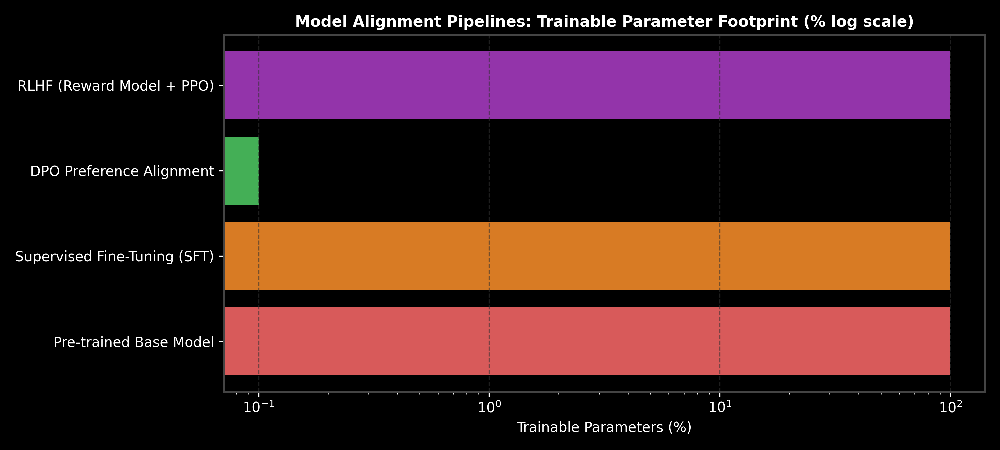

# Model Alignment: RLHF, Direct Preference Optimization (DPO) & ORPO

This guide details Model Alignment algorithms, comparing Reinforcement Learning from Human Feedback (RLHF with PPO) against Direct Preference Optimization (DPO) and ORPO, complete with DPO loss math, PyTorch code, and production trade-offs.

> **Notebook Companion**: [02_alignment_rlhf_dpo_direct_preference_optimization.ipynb](file:///d:/Study/Prep/machine-learning-prep/generative-ai-and-agentic-ai/06_fine_tuning_and_model_alignment/02_alignment_rlhf_dpo_direct_preference_optimization.ipynb)

---

## 1. Model Alignment Paradigms

```text
Alignment Method      Training Architecture                 Primary Benefit
----------------------------------------------------------------------------------------------------------------------
RLHF (PPO)            Policy + Value + Reward + Ref Model   Complex exploration & reward shaping
DPO                   Implicit Reward via Closed-Form Loss  No Reward Model needed / 3x faster & stable
ORPO                  Monolithic SFT + Odds Ratio Penalty   Single-stage SFT + Alignment combined
```



---

## 2. DPO Loss Formulation & PyTorch Implementation

$$\mathcal{L}_{\text{DPO}}(\pi_\theta; \pi_{\text{ref}}) = -\mathbb{E}_{(x, y_w, y_l)} \left[ \log \sigma \left( \beta \log \frac{\pi_\theta(y_w \mid x)}{\pi_{\text{ref}}(y_w \mid x)} - \beta \log \frac{\pi_\theta(y_l \mid x)}{\pi_{\text{ref}}(y_l \mid x)} \right) \right]$$

```python
import torch
import torch.nn.functional as F

def dpo_loss(policy_chosen_logps: torch.Tensor, policy_rejected_logps: torch.Tensor,
             ref_chosen_logps: torch.Tensor, ref_rejected_logps: torch.Tensor, beta: float = 0.1) -> torch.Tensor:
    pi_logratios = policy_chosen_logps - policy_rejected_logps
    ref_logratios = ref_chosen_logps - ref_rejected_logps
    logits = pi_logratios - ref_logratios
    return -F.logsigmoid(beta * logits).mean()

loss = dpo_loss(torch.tensor([-1.2]), torch.tensor([-2.8]), torch.tensor([-1.5]), torch.tensor([-2.2]))
print(f"DPO Loss Value: {loss.item():.4f}")
```
