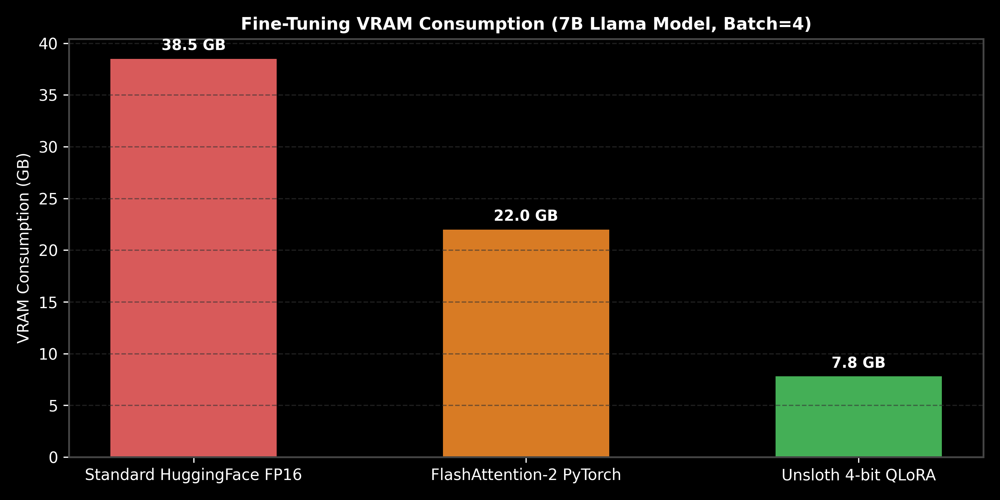

# Synthetic Dataset Curation, Model Distillation & Unsloth Optimizations

This guide details synthetic dataset generation, Teacher-Student Knowledge Distillation, and Unsloth GPU memory optimization kernels.

> **Notebook Companion**: [03_dataset_curation_distillation_unsloth.ipynb](file:///d:/Study/Prep/machine-learning-prep/generative-ai-and-agentic-ai/06_fine_tuning_and_model_alignment/03_dataset_curation_distillation_unsloth.ipynb)

---

## 1. Unsloth Optimization & Distillation Architecture

```text
Optimization Layer   Mechanism                              Memory / Speed Gain
----------------------------------------------------------------------------------------------------------------------
Unsloth Triton Kernel Custom C hand-written RoPE & CrossEntropy 80% VRAM reduction + 2x-5x faster speed
Knowledge Distil.     Teacher soft logit KL divergence matching Transfers 70B reasoning to 8B student model
```



---

## 2. PyTorch Distillation KL Divergence Code

```python
import torch
import torch.nn.functional as F

def teacher_student_kl_loss(student_logits: torch.Tensor, teacher_logits: torch.Tensor, temperature: float = 2.0) -> torch.Tensor:
    p_student = F.log_softmax(student_logits / temperature, dim=-1)
    p_teacher = F.softmax(teacher_logits / temperature, dim=-1)
    return F.kl_div(p_student, p_teacher, reduction='batchmean') * (temperature ** 2)

s_logits = torch.randn(2, 100); t_logits = s_logits + torch.randn(2, 100) * 0.2
print(f"KL Distillation Loss: {teacher_student_kl_loss(s_logits, t_logits):.4f}")
```
