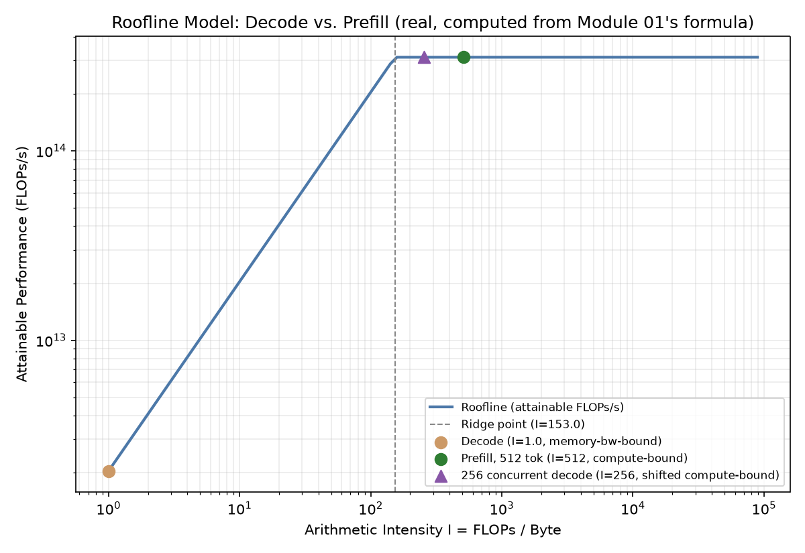

# Module 01: Inference Fundamentals & the Autoregressive Decoding Loop

## 1. Introduction & Intuition

### The Core Bottleneck
Training optimizes for throughput over a large, fixed dataset processed in big batches over hours or days — a slow individual step is fine as long as aggregate throughput is high. Inference is a fundamentally different problem: a single user is waiting, in real time, for tokens to appear, and the system has to serve many such real-time requests concurrently without any one of them waiting an unreasonable amount of time. That shift — from "maximize aggregate throughput over a known, fixed workload" to "minimize real, per-request latency under an unpredictable, live traffic pattern, while still keeping aggregate throughput high enough to be cost-effective" — is why inference has its own distinct system-engineering discipline, not just a smaller version of training. Every optimization technique in this topic exists because of that shift.

### High-Level Intuition
Training is like a factory running a fixed, known order for a bulk shipment — you care about total units per hour, and a slow start doesn't matter much if the line runs efficiently once warmed up. Inference is like a restaurant kitchen taking real, live orders from walk-in customers — each customer wants their food quickly, orders arrive unpredictably, and the kitchen has to be efficient *and* responsive at the same time, which is a genuinely different operational problem than bulk manufacturing.

---

## 2. Core Concepts & Mathematical Formulation

### Prefill vs. Decode Phases

#### Intuition & Practical Use
A request's generation splits into two phases with genuinely different computational character. **Prefill** processes the entire input prompt in one forward pass — every prompt token's attention keys and values get computed together, in parallel, since the full prompt is already known upfront. **Decode** generates output one token at a time — each new token depends on every token that came before it (including previously generated ones), so each decode step is a separate forward pass producing exactly one new token, which then becomes part of the input for the *next* step. This isn't an implementation detail; it's the direct reason prefill and decode have different real bottlenecks, covered precisely below.

### Why Decoding Is Inherently Sequential

#### Intuition & Practical Use
Autoregressive generation means token $t{+}1$'s probability distribution is conditioned on token $t$ actually having been sampled — you cannot compute what comes after a word before you know what that word is. This is a genuine, structural constraint, not a current implementation limitation: no amount of additional compute parallelizes *across* decode steps for a single sequence, since step $t{+}1$'s input literally doesn't exist until step $t$ completes. (Techniques like speculative decoding, Module 07, don't violate this — they *guess* likely future tokens and cheaply verify the guess, which is a different mechanism entirely, not a way to skip the real sequential dependency.)

### The Roofline Model: Compute-Bound vs. Memory-Bandwidth-Bound

#### Intuition & Practical Use
Every real computation on a GPU is bounded by one of two resources: how fast the GPU can do arithmetic (peak FLOPs/second) or how fast it can move data between memory and compute units (peak memory bandwidth, bytes/second). **Arithmetic intensity** — FLOPs performed per byte moved — determines which resource actually limits a given real workload. A workload with low arithmetic intensity spends most of its real time waiting on data movement (memory-bandwidth-bound); a workload with high arithmetic intensity spends most of its real time on actual computation (compute-bound), with data movement comfortably hidden behind it. This is the single most useful mental model for reasoning about *why* a given inference optimization technique works — every technique in this topic targets one side of this distinction specifically.

**Typical pattern, explicitly qualified:** decode steps — one new token, but still requiring a full read of the model's weights and the existing KV cache — tend to have low real arithmetic intensity, landing on the memory-bandwidth-bound side. Prefill — many prompt tokens processed together, amortizing that same weight read across all of them — tends to have higher real arithmetic intensity, landing on the compute-bound side. This is the **typical, common-configuration pattern**, not a universal rule: the real regime for a specific request depends on the real batch size, sequence length, and hardware in play — a large enough real batch of concurrent decode steps (Module 06's batching strategies) can shift decode's real arithmetic intensity meaningfully toward compute-bound too, which is exactly why batching is such a high-leverage real lever.

### Real Latency Components: TTFT and TPOT

#### Intuition & Practical Use
Two real, separately-measured latency figures matter in production, driven by genuinely different bottlenecks. **Time-to-first-token (TTFT)** is how long a user waits before seeing any output at all — dominated by real queueing time plus the prefill phase's real duration, which scales with real prompt length. **Time-per-output-token (TPOT)**, also called inter-token latency, is the real, steady-state time between each subsequently generated token — dominated by the real decode phase's per-step cost. A production system can have excellent TTFT and poor TPOT, or vice versa — they're genuinely separate metrics requiring separate optimization, exactly why Module 09 tracks them independently rather than collapsing them into one "latency" number.

<div align="center" style="margin: 20px 0; max-width: 100%; overflow-x: auto;">
<svg viewBox="0 0 780 260" width="100%" height="auto" xmlns="http://www.w3.org/2000/svg" style="background-color: #f8fafc; border: 1px solid #e2e8f0; border-radius: 8px; font-family: system-ui, -apple-system, sans-serif;">
  <text x="390" y="22" text-anchor="middle" font-size="13" font-weight="bold" fill="#0f172a">Prefill vs. Decode: Timeline &amp; Roofline Position</text>

  <rect x="30" y="50" width="220" height="60" rx="6" fill="#eff6ff" stroke="#3b82f6" stroke-width="1.6"/>
  <text x="140" y="72" text-anchor="middle" font-size="11.5" fill="#1e3a8a" font-weight="700">Prefill (1 parallel pass)</text>
  <text x="140" y="90" text-anchor="middle" font-size="9" fill="#1e3a8a">All prompt tokens processed together</text>
  <text x="140" y="103" text-anchor="middle" font-size="9" fill="#1e3a8a">Typically compute-bound (high I)</text>

  <rect x="280" y="50" width="470" height="60" rx="6" fill="#fef2f2" stroke="#dc2626" stroke-width="1.6"/>
  <text x="515" y="72" text-anchor="middle" font-size="11.5" fill="#991b1b" font-weight="700">Decode (sequential, one token at a time)</text>
  <text x="515" y="90" text-anchor="middle" font-size="9" fill="#991b1b">Each step depends on the prior token -- can't parallelize across steps</text>
  <text x="515" y="103" text-anchor="middle" font-size="9" fill="#991b1b">Typically memory-bandwidth-bound (low I)</text>

  <g stroke="#94a3b8" stroke-width="1.4" fill="none" marker-end="url(#arrow01a)">
    <line x1="250" y1="80" x2="278" y2="80"/>
  </g>
  <defs>
    <marker id="arrow01a" markerWidth="8" markerHeight="8" refX="6" refY="4" orient="auto">
      <path d="M0,0 L8,4 L0,8 Z" fill="#94a3b8"/>
    </marker>
  </defs>

  <rect x="30" y="130" width="720" height="45" rx="6" fill="#fef9c3" stroke="#ca8a04" stroke-width="1.3"/>
  <text x="390" y="150" text-anchor="middle" font-size="10" fill="#854d0e" font-weight="600">TTFT = queue wait + prefill duration (scales with prompt length)</text>
  <text x="390" y="165" text-anchor="middle" font-size="10" fill="#854d0e" font-weight="600">TPOT = steady-state per-token decode latency (the repeating cost of each token after the first)</text>

  <rect x="30" y="190" width="720" height="50" rx="6" fill="#f0f9ff" stroke="#0284c7" stroke-width="1.2"/>
  <text x="390" y="210" text-anchor="middle" font-size="9.5" fill="#0c4a6e" font-weight="600">"Decode = memory-bound, prefill = compute-bound" is the TYPICAL pattern for common configs --</text>
  <text x="390" y="225" text-anchor="middle" font-size="9.5" fill="#0c4a6e" font-weight="600">real batch size, sequence length, and hardware can shift which regime a specific request actually falls into.</text>
</svg>
</div>

---

### Hand Calculation: Arithmetic Intensity for Decode vs. Prefill
An illustrative 7B-parameter model ($N_{\text{params}} = 7\times10^9$) at FP16 (2 bytes/param), on hardware with roughly A100-class real, publicly documented specs (peak FP16 tensor throughput $\approx 312$ TFLOPs/s, peak HBM bandwidth $\approx 2{,}039$ GB/s — genuine, commonly-cited reference figures, used here as illustrative representative values, not a claim about every A100 SKU).

*   **Step 1: Ridge point.**
    $$I_{\text{ridge}} = \frac{312\times10^{12}}{2{,}039\times10^{9}} \approx 153 \text{ FLOPs/byte}$$

*   **Step 2: Decode step arithmetic intensity (1 new token).** Using the standard approximation $\text{FLOPs} \approx 2 \times N_{\text{params}}$ per token processed, and bytes moved $\approx$ weights read once (KV-cache read omitted here for simplicity — a real, secondary addition, not the dominant term at this scale):
    $$\text{FLOPs} = 2 \times 7\times10^9 = 1.4\times10^{10}, \qquad \text{Bytes} = 7\times10^9 \times 2 = 1.4\times10^{10}$$
    $$I_{\text{decode}} = \frac{1.4\times10^{10}}{1.4\times10^{10}} = 1.0 \text{ FLOPs/byte}$$

*   **Step 3: Prefill arithmetic intensity (512 prompt tokens processed together).** Weights are read once and amortized across all 512 tokens:
    $$\text{FLOPs} = 2 \times 7\times10^9 \times 512 \approx 7.17\times10^{12}, \qquad \text{Bytes} = 1.4\times10^{10} \text{ (same one-time weight read)}$$
    $$I_{\text{prefill}} = \frac{7.17\times10^{12}}{1.4\times10^{10}} \approx 512 \text{ FLOPs/byte}$$

Decode's real arithmetic intensity ($1.0$) sits far below the ridge point ($153$) — squarely memory-bandwidth-bound. Prefill's real arithmetic intensity ($\approx512$) sits above the ridge point — squarely compute-bound. This is the concrete, numeric confirmation of the typical pattern stated above, for this specific illustrative model size and batch of prompt tokens — a different real model size or prefill batch size would shift these specific numbers, though the qualitative decode-vs-prefill relationship tends to hold across common serving configurations.



*   **Plot Interpretation:** This is a real, computed roofline plot from the module's own formula — the ridge point at $I\approx153$, with decode ($I=1.0$) plotted deep in the memory-bandwidth-bound region and prefill ($I\approx512$) plotted well into the compute-bound region, using the exact hand-calc numbers above, not illustrative placeholder values.

---

## 3. Implementation & Reference Code

Below is a self-contained implementation of the arithmetic-intensity and roofline-position calculations above.

```python
from dataclasses import dataclass


@dataclass
class HardwareProfile:
    """Illustrative A100-class reference specs -- publicly documented, commonly-cited
    figures, used as representative values, not a claim about every specific SKU."""
    peak_flops_per_sec: float   # FLOPs/s
    peak_bandwidth_bytes_per_sec: float  # Bytes/s

    def ridge_point(self) -> float:
        return self.peak_flops_per_sec / self.peak_bandwidth_bytes_per_sec


def arithmetic_intensity(flops: float, bytes_moved: float) -> float:
    """I = FLOPs / Bytes moved. Matches the hand calculation above."""
    return flops / bytes_moved


def decode_step_profile(n_params: int, bytes_per_param: int = 2) -> tuple[float, float]:
    """Decode: 1 new token, weights read once. Returns (flops, bytes)."""
    flops = 2 * n_params
    bytes_moved = n_params * bytes_per_param
    return flops, bytes_moved


def prefill_profile(n_params: int, n_prompt_tokens: int, bytes_per_param: int = 2) -> tuple[float, float]:
    """Prefill: n_prompt_tokens processed together, weights read once and amortized."""
    flops = 2 * n_params * n_prompt_tokens
    bytes_moved = n_params * bytes_per_param
    return flops, bytes_moved


if __name__ == "__main__":
    hw = HardwareProfile(peak_flops_per_sec=312e12, peak_bandwidth_bytes_per_sec=2039e9)
    ridge = hw.ridge_point()
    print(f"Ridge point: {ridge:.1f} FLOPs/byte")
    assert abs(ridge - 153.0) < 1.0

    N_PARAMS = 7_000_000_000

    decode_flops, decode_bytes = decode_step_profile(N_PARAMS)
    i_decode = arithmetic_intensity(decode_flops, decode_bytes)
    print(f"Decode: I = {i_decode:.2f} FLOPs/byte")
    assert abs(i_decode - 1.0) < 1e-6

    prefill_flops, prefill_bytes = prefill_profile(N_PARAMS, n_prompt_tokens=512)
    i_prefill = arithmetic_intensity(prefill_flops, prefill_bytes)
    print(f"Prefill (512 tokens): I = {i_prefill:.1f} FLOPs/byte")
    assert abs(i_prefill - 512.0) < 1.0

    print(f"\nDecode I={i_decode:.2f} vs ridge={ridge:.1f}: {'memory-bandwidth-bound' if i_decode < ridge else 'compute-bound'}")
    print(f"Prefill I={i_prefill:.1f} vs ridge={ridge:.1f}: {'memory-bandwidth-bound' if i_prefill < ridge else 'compute-bound'}")
    assert i_decode < ridge
    assert i_prefill > ridge
    print("\nVerified: decode lands memory-bandwidth-bound, prefill lands compute-bound, at this illustrative model size and prefill batch.")

    # Verify the "typical, not universal" claim: a large enough real batch of concurrent
    # decode steps shifts arithmetic intensity toward prefill's regime.
    batched_decode_flops, batched_decode_bytes = prefill_profile(N_PARAMS, n_prompt_tokens=256)  # 256 concurrent decode steps, weights read once for the whole batch
    i_batched_decode = arithmetic_intensity(batched_decode_flops, batched_decode_bytes)
    print(f"\n256 CONCURRENT decode steps (batched): I = {i_batched_decode:.1f} FLOPs/byte")
    assert i_batched_decode > ridge, "A sufficiently large real decode batch should shift arithmetic intensity above the ridge point"
    print("Verified: batching concurrent decode steps shifts arithmetic intensity toward compute-bound -- confirming the 'typical pattern, not universal rule' framing.")
```

---

## 4. Interview Deep-Dive & System Trade-offs

### 1. Architectural & Production Trade-offs
* **Core Problem Solved:** Serving real-time, unpredictable user requests with acceptable per-request latency, distinct from training's throughput-over-a-fixed-batch optimization problem.
* **Why Introduced over Legacy Approaches:** Treating inference as "just smaller-batch training" misses that prefill and decode have genuinely different real bottlenecks, and that latency (not just throughput) is a first-class production metric users directly experience.
* **Key Failure Modes & Limitations:** Optimizing only for throughput while ignoring TTFT/TPOT can produce a system with excellent aggregate capacity and poor individual user experience; assuming "decode is always memory-bound" without checking real batch size can lead to optimizing the wrong resource.

### 2. System Complexity & Scaling
* **Time Complexity (FLOPs):** Prefill FLOPs scale with prompt length (amortized weight read); decode FLOPs per step are roughly constant per token, but total decode FLOPs scale with output length — the sequential nature means decode's real wall-clock cost scales with output length regardless of available parallel compute.
* **Space/Memory Footprint:** Both phases share the model's weight memory; decode additionally depends on the growing KV cache (Module 02), which prefill also populates but doesn't yet depend on for its own computation.
* **Primary Bottleneck Type:** Typically memory-bandwidth-bound for decode, compute-bound for prefill, at common configurations — the real regime depends on real batch size, sequence length, and hardware, per this module's explicit qualification.
* **Variable Legend:** $I$ = arithmetic intensity (FLOPs/byte), $I_{\text{ridge}}$ = hardware ridge point, $N_{\text{params}}$ = model parameter count, TTFT/TPOT = time-to-first-token / time-per-output-token.

### 3. Production & Scalability
* **Deployment Considerations:** Measure real TTFT and TPOT separately in production, never collapsed into one latency figure; validate the compute-bound/memory-bound assumption for the actual real batch sizes and sequence lengths in production traffic rather than assuming the typical pattern always holds.
*   **Common Interviewer Follow-Up Questions:**
    1.  *Q:* Why can't you just add more GPUs to make a single sequence's decode phase faster?
        *   *A:* The sequential dependency is structural — token $t{+}1$ doesn't exist until token $t$ is sampled — so more compute doesn't parallelize across decode steps for one sequence; more GPUs help serve more *concurrent* sequences (Module 06/08), not speed up one sequence's own decode chain.
    2.  *Q:* A production system shows good TTFT but poor TPOT — what would you investigate?
        *   *A:* TPOT is dominated by the real decode phase's per-step cost — check real GPU memory-bandwidth utilization during decode, real batch size (too small wastes compute-bound headroom), and whether KV-cache growth (Module 02) is degrading per-step performance as sequences lengthen.
