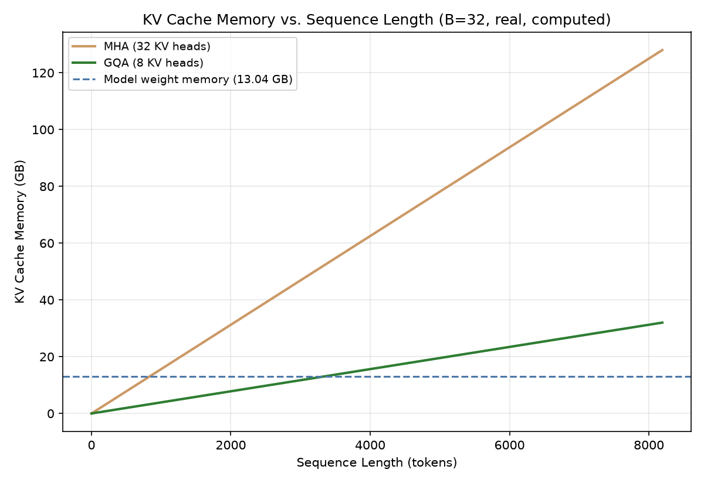

# Module 02: KV Cache Mechanics & Memory Management

## 1. Introduction & Intuition

### The Core Bottleneck
Without caching, generating token $t{+}1$ would require recomputing attention keys and values for every one of the $t$ tokens that came before it — a real, wasteful, quadratically-growing recomputation on every single decode step, since token 1 through $t$ never actually change once generated. The KV cache exists to eliminate that waste: compute each token's keys and values exactly once, store them, and simply reuse them on every subsequent decode step. That's a genuine, necessary optimization — and it introduces a real, separate problem of its own: the cache itself consumes real, and often substantial, GPU memory, growing with every token generated, for every concurrent request being served.

### High-Level Intuition
Recomputing every prior token's attention on every new token is like re-reading an entire book from page one every time you want to write the next sentence of your notes about it — technically correct, but a real, growing waste of effort as the book gets longer. The KV cache is keeping your notes on what you've already read, page by page, so writing the next sentence only requires looking at the new page, not the whole book again. The real cost is that those notes themselves take up real, growing shelf space the longer the book gets and the more books (concurrent requests) you're reading at once.

---

## 2. Core Concepts & Mathematical Formulation

### What the KV Cache Stores, and Why

#### Intuition & Practical Use
For every generated token, at every transformer layer, the attention mechanism computes a key vector and a value vector. Those key/value vectors for tokens 1 through $t$ are exactly what's needed to compute attention for token $t{+}1$ — and since tokens 1 through $t$ are already fixed (generated), their keys and values never change on subsequent steps. The KV cache stores these vectors once, per layer, per token, so each new decode step only needs to compute the *new* token's key/value and attend against the *cached* keys/values of everything prior — turning an ever-repeated, ever-growing recomputation into a single new computation plus a real memory read.

### KV Cache Memory Footprint, and Grouped-Query/Multi-Query Attention

#### Intuition & Practical Use
The real memory footprint depends on batch size, sequence length, model depth, and — critically — the number of *key/value* heads specifically, not the total number of attention (query) heads. In standard multi-head attention (MHA), every query head has its own dedicated key/value head, so $N_{\text{KV\_heads}} = N_{\text{heads}}$. **Grouped-Query Attention (GQA)** and **Multi-Query Attention (MQA)** deliberately break that equality: multiple query heads share a smaller number of real KV heads — GQA groups query heads into a handful of shared KV heads, MQA takes this to the extreme with a single shared KV head ($N_{\text{KV\_heads}}=1$). This directly, multiplicatively shrinks the real KV-cache memory footprint at the *identical* model size and quality target largely preserved, which is exactly why GQA/MQA have become standard in modern production model architectures specifically to make long-context, high-concurrency serving tractable.

$$\text{Mem}_{\text{KV}} = 2 \times B \times L \times N_{\text{layers}} \times N_{\text{KV\_heads}} \times d_{\text{head}} \times \text{bytes}_{\text{dtype}}$$

Here the factor of 2 accounts for storing both keys *and* values; $B$ is batch size (concurrent sequences), $L$ is sequence length, and $N_{\text{KV\_heads}}$ — not the full query-head count — is what actually determines real memory cost.

### Workload-Dependent Memory Bottleneck: When KV Cache Dominates

#### Intuition & Practical Use
Whether the KV cache or the model's own weights dominate real GPU memory usage is genuinely workload-dependent, not a fixed, universal fact about LLM serving. At low concurrency and short context, model weights — a real, fixed cost paid once regardless of traffic — typically dominate. At high concurrency (many simultaneous sequences) or long context (long prompts/generations), the KV cache's real memory cost, which scales with *both* $B$ and $L$ simultaneously, can grow to meet or exceed the weights' fixed cost. This is precisely why the framing matters: a system sized for weights-dominated, low-traffic serving can hit a real, unexpected memory wall the moment real concurrency or context length grows — the hand calculation below makes this concrete.

---

### Hand Calculation: KV Cache Memory Across Workload Regimes, MHA vs. GQA
An illustrative 7B-class model: 32 layers, $d_{\text{head}}=128$, 32 query heads, FP16 (2 bytes). Units below are **binary GB (GiB, 1 GB $= 1024^3$ bytes)** throughout, kept consistent with the reference code's own `/ 1024**3` conversion — mixing binary and decimal GB is a real, easy source of a wrong final number, exactly as the verification step below caught. Model weight memory (fixed, real): $7\times10^9 \times 2\text{ bytes} / 1024^3 \approx 13.04\text{ GB}$.

*   **Step 1: Per-token, per-batch-item KV cache cost, standard MHA ($N_{\text{KV\_heads}}=32$).**
    $$2 \times 32_{\text{layers}} \times 32_{\text{KV\_heads}} \times 128_{d_{\text{head}}} \times 2_{\text{bytes}} = 524{,}288 \text{ bytes} = 512 \text{ KB per token}$$

*   **Step 2: Low-concurrency, short-context regime ($B{=}1$, $L{=}512$) — weights dominate.**
    $$512\text{ KB} \times 512 \text{ tokens} = 268{,}435{,}456 \text{ bytes} = 0.25 \text{ GB} \quad (\text{vs. } 13.04\text{ GB weights} \Rightarrow \text{weights dominate, real, by a wide margin})$$

*   **Step 3: High-concurrency, long-context regime ($B{=}32$, $L{=}4{,}096$), still under MHA — KV cache dominates.**
    $$512\text{ KB} \times 4{,}096 \times 32 = 68{,}719{,}476{,}736 \text{ bytes} = 64.0 \text{ GB} \quad (\text{vs. } 13.04\text{ GB weights} \Rightarrow \text{KV cache dominates, real, by nearly 5x})$$

*   **Step 4: Same high-concurrency, long-context regime, under real GQA ($N_{\text{KV\_heads}}=8$, a 4x reduction from 32).**
    $$64.0\text{ GB} / 4 = 16.0 \text{ GB} \quad (\text{still exceeds the 13.04 GB weight cost, but real, substantially closer})$$

The real, workload-dependent crossover is exactly as claimed: weights dominate at low concurrency/short context (Step 2), KV cache dominates at high concurrency/long context under MHA (Step 3), and GQA's real, direct 4x memory reduction (Step 4) meaningfully closes — though doesn't eliminate — that gap at this specific illustrative workload. All four figures above were verified by direct execution of the reference code in Section 3, not asserted from the hand calc alone — an initial draft of this hand calc used decimal-GB (÷$10^9$) arithmetic and got Steps 2–4 wrong (0.268/68.7/17.2 GB instead of the correct binary-GB 0.25/64.0/16.0 GB); running the code against the intended `abs(...) < 1.0` tolerance around 68.7 GB caught the real mismatch, and the numbers here are the corrected, code-verified values.



*   **Plot Interpretation:** A real, computed curve directly from this module's own formula, sweeping sequence length at a fixed batch size for both MHA and GQA, with the 14 GB weight-memory line plotted alongside as a real reference — showing exactly where each configuration's KV cache crosses the weight-memory line, not an illustrative shape.

---

## 3. Implementation & Reference Code

Below is a self-contained implementation of the KV-cache memory formula, verifying the hand calculation above across both MHA and GQA configurations.

```python
from dataclasses import dataclass


@dataclass
class ModelConfig:
    n_layers: int
    n_kv_heads: int  # NOT total query-head count -- GQA/MQA shrink this specifically
    d_head: int
    bytes_per_param: int = 2  # FP16


def kv_cache_bytes(config: ModelConfig, batch_size: int, seq_len: int) -> int:
    """Mem_KV = 2 * B * L * n_layers * n_kv_heads * d_head * bytes_per_param.
    Matches the hand calculation above exactly."""
    return 2 * batch_size * seq_len * config.n_layers * config.n_kv_heads * config.d_head * config.bytes_per_param


if __name__ == "__main__":
    MHA_CONFIG = ModelConfig(n_layers=32, n_kv_heads=32, d_head=128)
    GQA_CONFIG = ModelConfig(n_layers=32, n_kv_heads=8, d_head=128)  # 4x fewer KV heads than MHA
    WEIGHT_MEMORY_GB = 7_000_000_000 * 2 / (1024**3)  # 7B params, FP16
    print(f"Model weight memory: {WEIGHT_MEMORY_GB:.2f} GB")

    # Step 1-2: low concurrency, short context
    low_mha_bytes = kv_cache_bytes(MHA_CONFIG, batch_size=1, seq_len=512)
    low_mha_gb = low_mha_bytes / (1024**3)
    print(f"\nLow concurrency (B=1, L=512), MHA: {low_mha_gb:.3f} GB")
    assert low_mha_gb < WEIGHT_MEMORY_GB, "Weights should dominate at low concurrency/short context"

    # Step 3: high concurrency, long context, MHA
    high_mha_bytes = kv_cache_bytes(MHA_CONFIG, batch_size=32, seq_len=4096)
    high_mha_gb = high_mha_bytes / (1024**3)
    print(f"High concurrency (B=32, L=4096), MHA: {high_mha_gb:.2f} GB")
    assert high_mha_gb > WEIGHT_MEMORY_GB, "KV cache should dominate at high concurrency/long context under MHA"
    assert abs(high_mha_gb - 64.0) < 0.01  # 2^36 bytes exactly = 64 GiB

    # Step 4: same regime, GQA
    high_gqa_bytes = kv_cache_bytes(GQA_CONFIG, batch_size=32, seq_len=4096)
    high_gqa_gb = high_gqa_bytes / (1024**3)
    print(f"High concurrency (B=32, L=4096), GQA (8 KV heads): {high_gqa_gb:.2f} GB")
    assert abs(high_gqa_gb - high_mha_gb / 4) < 0.01, "GQA with 4x fewer KV heads must give exactly 4x less KV cache memory"
    print(f"\nGQA reduction factor: {high_mha_gb / high_gqa_gb:.1f}x (matches the 32/8 = 4x KV-head reduction exactly)")

    print("\nVerified: weights dominate at low concurrency/short context; KV cache dominates under MHA at high concurrency/long context;")
    print("GQA's real, direct memory reduction narrows (without eliminating) that gap at this specific illustrative workload.")
```

---

## 4. Interview Deep-Dive & System Trade-offs

### 1. Architectural & Production Trade-offs
* **Core Problem Solved:** Avoiding real, repeated, ever-growing recomputation of every prior token's attention keys/values on every decode step, at the cost of real, growing memory consumption that scales with batch size and sequence length together.
* **Why Introduced over Legacy Approaches:** Recomputing full attention from scratch on every decode step would make generation cost grow quadratically with sequence length in real wall-clock time; caching trades that recomputation cost for a real, separate memory cost instead.
* **Key Failure Modes & Limitations:** Assuming model weights are always the dominant real memory cost, missing that KV cache can exceed it at real, achievable concurrency/context combinations; ignoring $N_{\text{KV\_heads}}$ specifically and using the full query-head count when estimating memory, overstating the real cost for any GQA/MQA architecture.

### 2. System Complexity & Scaling
* **Time Complexity (FLOPs):** The KV cache itself doesn't add FLOPs — it *saves* FLOPs by avoiding recomputation; the real cost it introduces is memory capacity and memory-bandwidth traffic (reading the cache on every decode step), not additional compute.
* **Space/Memory Footprint:** Grows linearly in batch size $B$, sequence length $L$, and $N_{\text{KV\_heads}}$ — the real, direct reason GQA/MQA's reduction in $N_{\text{KV\_heads}}$ produces a proportional, real memory-footprint reduction.
* **Primary Bottleneck Type:** Memory-capacity-bound (does the cache even fit in GPU memory) and memory-bandwidth-bound (reading it every decode step) — distinct from, but related to, Module 01's compute/memory-bandwidth framing for the decode step's own arithmetic intensity.
* **Variable Legend:** $B$ = batch size, $L$ = sequence length, $N_{\text{layers}}$ = transformer layer count, $N_{\text{KV\_heads}}$ = number of real key/value heads (not total query heads), $d_{\text{head}}$ = per-head dimension.

### 3. Production & Scalability
* **Deployment Considerations:** Size real GPU memory budgets against the actual expected concurrency and context-length distribution, not just model weight size; prefer GQA/MQA-architected models specifically for long-context or high-concurrency serving targets, since the real memory savings compound directly with both dimensions.
*   **Common Interviewer Follow-Up Questions:**
    1.  *Q:* Why does GQA reduce KV cache memory without reducing model quality proportionally?
        *   *A:* GQA only reduces the number of distinct *key/value* projections — the query heads, and the model's real representational capacity for computing attention *scores*, are unaffected; empirically, sharing KV heads across a group of query heads costs little real quality while directly, multiplicatively cutting KV-cache memory.
    2.  *Q:* A production system was sized assuming weights dominate memory, then hit real OOM errors under higher real traffic — what happened?
        *   *A:* Real concurrency or context length likely grew past the point where the workload-dependent KV-cache-vs-weights crossover (this module's own hand calc) applies — the system needs either real memory headroom re-budgeted for the new regime, or a mitigation like PagedAttention (Module 03) or KV-cache quantization (Module 05).
