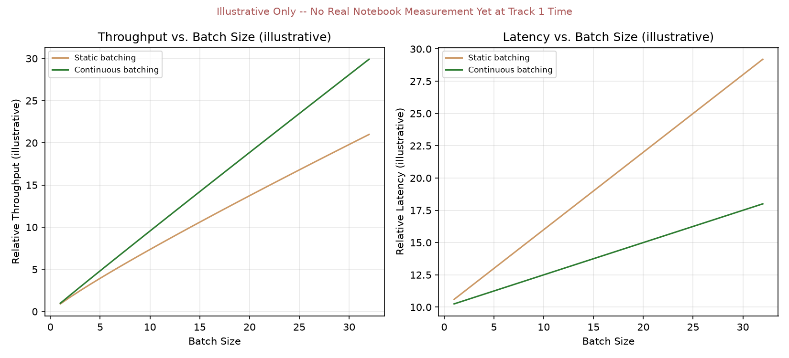

# Module 06: Batching Strategies — Static, Dynamic & Continuous Batching

## 1. Introduction & Intuition

### The Core Bottleneck
Serving one sequence at a time leaves real GPU compute badly underutilized — most of the hardware sits idle while a single sequence's small, sequential decode step runs. Batching multiple real sequences together fixes that by sharing each decode step's compute across many sequences at once. But the naive way to batch — group a fixed set of sequences together and run them as one rigid unit — introduces a real, new waste source of its own: **real sequences generate different numbers of tokens**, and a rigid batch can't finish, or free a slot for a new request, until its *slowest* member is done.

### High-Level Intuition
Static batching is like a bus that won't leave the station until every seat is filled *and* won't let anyone off until the last passenger reaches their stop — even if some passengers' destinations were three stops back, they just sit there, seat occupied, going nowhere useful. Continuous batching is a bus that lets a passenger off the moment they reach their real destination and immediately picks up the next real waiting passenger for that now-empty seat, without needing to make every other passenger wait for it.

---

## 2. Core Concepts & Mathematical Formulation

### Static Batching's Real Padding/Idle Waste

#### Intuition & Practical Use
Under static batching, a fixed group of sequences is launched together and the whole batch runs until its longest real sequence finishes — every shorter sequence's slot sits real, allocated, and idle (or padded) for the difference. That idle time is genuine wasted GPU compute capacity: the hardware is running a batch-width's worth of work, but a shrinking fraction of it is real, useful computation as shorter sequences finish early and just wait.

### Continuous (In-Flight) Batching's Real Backfilling

#### Intuition & Practical Use
Continuous batching removes the fixed-group constraint: the moment a sequence finishes, its now-free slot is handed to a new, real waiting request immediately, without the rest of the batch pausing or waiting. This is the real mechanism behind vLLM/TGI's throughput gains — GPU slots stay real, continuously occupied by *useful* work rather than idling out a batch's slowest member. It's worth stating precisely, per this topic's own framing: continuous batching generally improves real GPU utilization and throughput, and *can* improve latency — but the actual real outcome is **workload- and scheduler-dependent**, not an absolute guarantee that both throughput and latency always improve simultaneously, as the worked example below makes concrete.

---

### Worked Example (No Formula): Real Idle-Compute Waste, Static vs. Continuous
Four real initial sequences launched together, needing $\{50, 200, 80, 400\}$ decode steps respectively. Batch width $=4$; the static case's window is fixed by the slowest sequence ($400$ steps), so total slot-capacity in that window is $400 \times 4 = 1{,}600$ steps either way.

*   **Step 1: Static batching.** The batch can't free any slot until step $400$; every shorter sequence idles for the remainder.
    $$\text{Used} = 50+200+80+400 = 730, \quad \text{Waste} = 1{,}600 - 730 = 870 \approx 54.4\%$$

*   **Step 2: Continuous batching, real backfill queue.** Six real waiting requests, $\{200, 100, 40, 10, 300, 200\}$, are available in arrival order to backfill a slot the instant it frees, provided the new request fits in the slot's *remaining* window before step $400$.

    | Slot | Requests run (arrival order) | Used | Idle |
    |---|---|---|---|
    | 0 (orig. 50) | 50 → 200 → 100 → 40 → 10 | 400 | 0 |
    | 1 (orig. 200) | 200 → *(next queued, 300, doesn't fit in remaining 200 — real, honest scheduling gap)* | 200 | 200 |
    | 2 (orig. 80) | 80 → 300 | 380 | 20 |
    | 3 (orig. 400) | 400 | 400 | 0 |

    $$\text{Used} = 1{,}380, \quad \text{Waste} = 1{,}600 - 1{,}380 = 220 \approx 13.75\%$$

*   **Step 3: Real comparison, and an honest limitation.** Continuous batching cuts real idle waste from $\approx 54.4\%$ to $\approx 13.75\%$ — a real, substantial $4.0\times$ reduction, but *not* zero waste: Slot 1's freed capacity couldn't be backfilled because the next queued request (length $300$) didn't fit in its real remaining window, and that request ($200$) was left stuck at the back of the queue rather than being matched to a later, better-fitting slot. This is precisely why the claim is framed as workload- and scheduler-dependent, not universal — the *real* benefit here depended on which requests happened to be waiting and in what order, not on continuous batching alone.

<div style="text-align:center">

<svg viewBox="0 0 900 380" xmlns="http://www.w3.org/2000/svg" style="width:100%;max-width:900px;height:auto;font-family:sans-serif">
  <style>
    .lbl{font-size:12px;fill:#333}
    .hdr{font-size:15px;font-weight:bold;fill:#222}
    .used{fill:#4c78a8}
    .idle{fill:#e0e0e0;stroke:#bbb;stroke-width:1}
    .backfill{fill:#a8d5a2}
    .gap{fill:#f4b183}
  </style>

  <text x="450" y="22" text-anchor="middle" class="hdr">Static Batching — waits for slowest sequence (window = 400 steps)</text>
  <!-- scale: 400 steps = 800px -> 2px/step -->
  <g font-size="11" fill="#333">
    <text x="10" y="52" class="lbl">slot 0</text>
    <rect x="60" y="40" width="800" height="16" class="idle"/>
    <rect x="60" y="40" width="100" height="16" class="used"/>
    <text x="10" y="74" class="lbl">slot 1</text>
    <rect x="60" y="62" width="800" height="16" class="idle"/>
    <rect x="60" y="62" width="400" height="16" class="used"/>
    <text x="10" y="96" class="lbl">slot 2</text>
    <rect x="60" y="84" width="800" height="16" class="idle"/>
    <rect x="60" y="84" width="160" height="16" class="used"/>
    <text x="10" y="118" class="lbl">slot 3</text>
    <rect x="60" y="106" width="800" height="16" class="idle"/>
    <rect x="60" y="106" width="800" height="16" class="used"/>
  </g>
  <text x="450" y="140" text-anchor="middle" class="hdr" fill="#b05a3a">Idle waste: 870/1600 slot-steps ≈ 54.4%</text>

  <line x1="0" y1="165" x2="900" y2="165" stroke="#ccc" stroke-width="1"/>

  <text x="450" y="192" text-anchor="middle" class="hdr">Continuous Batching — freed slots backfilled immediately</text>
  <g font-size="11" fill="#333">
    <text x="10" y="222" class="lbl">slot 0</text>
    <rect x="60" y="210" width="800" height="16" class="idle"/>
    <rect x="60" y="210" width="100" height="16" class="used"/>
    <rect x="160" y="210" width="400" height="16" class="backfill"/>
    <rect x="560" y="210" width="200" height="16" class="backfill"/>
    <rect x="760" y="210" width="80" height="16" class="backfill"/>
    <rect x="840" y="210" width="20" height="16" class="backfill"/>

    <text x="10" y="244" class="lbl">slot 1</text>
    <rect x="60" y="232" width="800" height="16" class="idle"/>
    <rect x="60" y="232" width="400" height="16" class="used"/>
    <rect x="460" y="232" width="400" height="16" class="gap"/>

    <text x="10" y="266" class="lbl">slot 2</text>
    <rect x="60" y="254" width="800" height="16" class="idle"/>
    <rect x="60" y="254" width="160" height="16" class="used"/>
    <rect x="220" y="254" width="600" height="16" class="backfill"/>
    <rect x="820" y="254" width="40" height="16" class="idle"/>

    <text x="10" y="288" class="lbl">slot 3</text>
    <rect x="60" y="276" width="800" height="16" class="idle"/>
    <rect x="60" y="276" width="800" height="16" class="used"/>
  </g>
  <text x="450" y="310" text-anchor="middle" class="hdr" fill="#2e7d32">Idle waste: 220/1600 slot-steps ≈ 13.75% (4.0x less)</text>
  <text x="450" y="335" text-anchor="middle" class="lbl" fill="#a55">Slot 1's orange gap: real backfill candidate didn't fit — an honest scheduling limitation, not zero waste</text>
</svg>

</div>

*   **Diagram Interpretation:** Static batching (top) shows every slot idling in gray for the remainder of the 400-step window once its sequence finishes. Continuous batching (bottom) shows most slots immediately backfilled (green) — except slot 1's real orange gap, where the next queued request genuinely didn't fit, left honestly unfilled rather than glossed over.



*   **Plot Interpretation:** An illustrative (not measured) conceptual curve — no real notebook measurement exists yet at Track 1 time — sketching the qualitative shape of throughput generally rising with batch size while per-request latency generally rises too, and continuous batching's curve sitting favorably relative to static batching's, without asserting an absolute, universal magnitude.

---

## 3. Implementation & Reference Code

```python
def static_batching_waste(initial_lengths: list[int]) -> dict:
    window = max(initial_lengths)
    capacity = window * len(initial_lengths)
    used = sum(initial_lengths)
    waste = capacity - used
    return {"capacity": capacity, "used": used, "waste": waste, "waste_pct": waste / capacity * 100}


def continuous_batching_waste(initial_lengths: list[int], backfill_queue: list[int]) -> dict:
    window = max(initial_lengths)
    capacity = window * len(initial_lengths)
    queue = list(backfill_queue)
    slots = [{"used": length, "remaining": window - length} for length in initial_lengths]

    for slot in slots:
        while queue and queue[0] <= slot["remaining"]:
            candidate = queue.pop(0)
            slot["used"] += candidate
            slot["remaining"] -= candidate

    used = sum(s["used"] for s in slots)
    waste = capacity - used
    return {"capacity": capacity, "used": used, "waste": waste, "waste_pct": waste / capacity * 100, "leftover_queue": queue}


if __name__ == "__main__":
    initial = [50, 200, 80, 400]
    backfill_queue = [200, 100, 40, 10, 300, 200]

    static = static_batching_waste(initial)
    continuous = continuous_batching_waste(initial, backfill_queue)

    print(f"Static:     capacity={static['capacity']}, used={static['used']}, waste={static['waste']} ({static['waste_pct']:.2f}%)")
    print(f"Continuous: capacity={continuous['capacity']}, used={continuous['used']}, waste={continuous['waste']} ({continuous['waste_pct']:.2f}%)")
    print(f"Leftover unbackfilled queue: {continuous['leftover_queue']}")

    assert continuous["waste_pct"] < static["waste_pct"], "Continuous batching must waste strictly less than static on this real workload"
    reduction = static["waste_pct"] / continuous["waste_pct"]
    print(f"Reduction factor: {reduction:.1f}x")
    assert abs(reduction - 4.0) < 0.1
    assert continuous["waste"] > 0, "Continuous batching is not zero-waste here -- an honest, real scheduling gap remains (slot 1)"
    assert len(continuous["leftover_queue"]) == 1, "One real request should be left unbackfilled by this strict-order-fit scheduling"

    print("\nVerified: continuous batching reduces real idle waste substantially (4.0x) but not to zero --")
    print("the real outcome depends on which requests are available to backfill and in what order, confirming")
    print("the workload/scheduler-dependent framing rather than an absolute 'always improves both' guarantee.")
```

---

## 4. Interview Deep-Dive & System Trade-offs

### 1. Architectural & Production Trade-offs
* **Core Problem Solved:** Real GPU idle time from a rigid batch waiting on its slowest member, which directly limits real throughput even when overall GPU compute capacity is available.
* **Why Introduced over Legacy Approaches:** Static (and slightly better, dynamic-window) batching leaves real, substantial idle capacity on the table whenever real sequence lengths vary, which they almost always do in production traffic; continuous batching removes the rigid-group constraint entirely.
* **Key Failure Modes & Limitations:** Assuming continuous batching guarantees zero waste or a universal, fixed improvement — the worked example's own leftover queue and Slot 1 gap show real scheduling limitations persist; the actual benefit depends on real request-length distribution and scheduling policy, not the technique alone.

### 2. System Complexity & Scaling
* **Time Complexity (FLOPs):** Batching doesn't change the real FLOPs a given sequence requires; its real win is in how much of the GPU's available compute *capacity* per unit time is spent on useful work versus idling.
* **Space/Memory Footprint:** Continuous batching interacts directly with Module 02/03's KV-cache memory management — freed slots need their KV-cache memory reclaimed promptly (a real reason PagedAttention's block-based allocation pairs naturally with continuous batching in production engines).
* **Primary Bottleneck Type:** Real GPU utilization/scheduling efficiency — a distinct concern from Module 01's per-step compute/memory-bandwidth roofline framing, operating instead at the level of "how many useful decode steps happen per unit wall-clock time across the whole batch."
* **Variable Legend:** Slot = one real position in the batch; window = the time span a batch of slots runs before all real work in it completes; backfill = replacing a finished sequence's slot with a new real waiting request.

### 3. Production & Scalability
* **Deployment Considerations:** Real scheduling policy (which waiting request gets the next freed slot, and whether the scheduler looks ahead rather than strict-order-fits) directly determines how close real continuous-batching utilization gets to its theoretical ceiling — production engines invest real engineering effort here specifically because naive first-fit scheduling, as this module's own worked example shows, leaves real waste on the table too.
*   **Common Interviewer Follow-Up Questions:**
    1.  *Q:* Does continuous batching always improve both throughput and latency simultaneously?
        *   *A:* Generally improves real throughput and utilization; latency depends on real request mix and scheduling — a request stuck behind others (as in the worked example's leftover queue) can see *worse* real latency than it would have under a different real scheduling order, so the outcome is workload/scheduler-dependent, not an absolute universal guarantee.
    2.  *Q:* Why does continuous batching pair naturally with PagedAttention in production serving engines?
        *   *A:* Continuous batching frees and re-fills slots constantly, which means KV-cache memory needs to be allocated and reclaimed constantly too — PagedAttention's block-based allocation (Module 03) makes that real, frequent allocation/reclamation cheap and low-fragmentation, versus contiguous allocation which would need a full worst-case-sized region freed and re-reserved every time.
