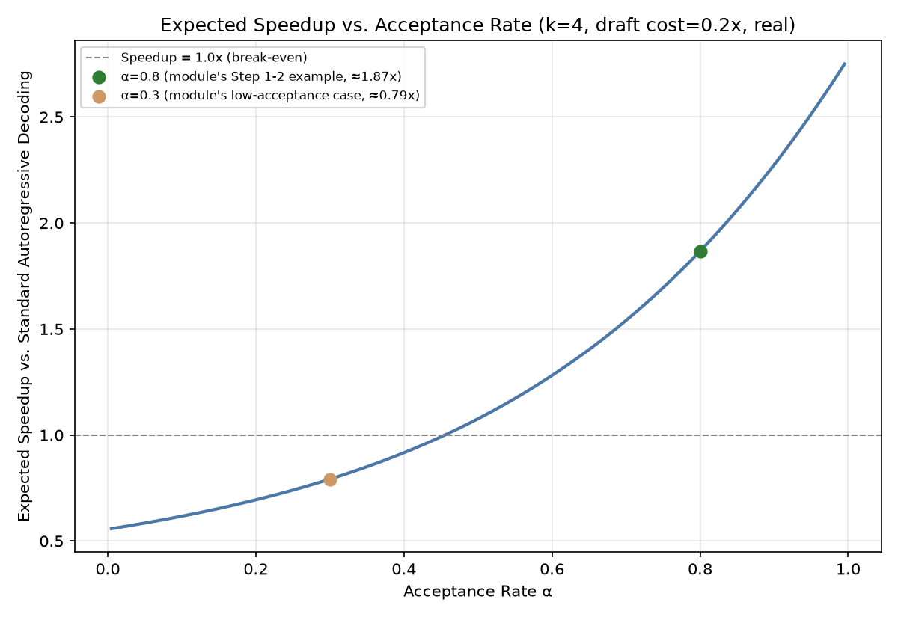

# Module 07: Speculative Decoding & Decoding-Time Optimizations

## 1. Introduction & Intuition

### The Core Bottleneck
Module 01 established that decode is typically memory-bandwidth-bound: each decode step reads the full real model weights and KV cache from HBM to produce just *one* new token, so a large share of that real memory traffic is spent regardless of how "hard" generating that one token actually was. Speculative decoding exploits this directly: since a single verification forward pass can check *several* candidate tokens at once for roughly the same real memory-traffic cost as generating just one, it pays to have a small, fast draft model *guess* several tokens ahead, then let the real target model verify them all in one pass.

### High-Level Intuition
Imagine dictating a letter to a fast, cheap assistant who drafts a few sentences ahead based on your style, while you — the real, authoritative writer — glance over each batch of drafted sentences at once and either accept them as-is or correct from the first mistake onward. Reading and approving several sentences at a glance is nearly as fast as reading one, so as long as the assistant's guesses are decent, you finish the letter in real, substantially fewer "your turn" passes than writing every single sentence yourself.

---

## 2. Core Concepts & Mathematical Formulation

### The Draft-Then-Verify Mechanism

#### Intuition & Practical Use
A small, fast draft model proposes $k$ candidate tokens autoregressively, one at a time. The real, larger target model then verifies all $k$ candidates in a *single* forward pass (since verification, unlike generation, can process all $k$ candidate positions in parallel) — accepting a real prefix of correct guesses and rejecting from the first mismatch onward, at which point the target model's own correct token is used instead. This is a real, exact-output-preserving technique — the real generated sequence is provably identical in distribution to what standard autoregressive decoding from the target model alone would have produced; speculative decoding only changes *how many real forward passes* it takes to get there.

### Expected Accepted Tokens Under a Simplified Acceptance Model

#### Intuition & Practical Use
Model each of the $k$ draft tokens as being accepted independently with a real, constant probability $\alpha$ (a simplification — real acceptance probability actually varies token-to-token and depends on how well the draft model matches the target model's real distribution at that specific point). Under this simplified model, the expected number of tokens produced per verification round — accepted draft tokens plus the one bonus/correction token always produced at the rejection point — is:

$$E[\text{accepted}] = \frac{1-\alpha^{k+1}}{1-\alpha}$$

This formula gives **expected accepted tokens under this simplified acceptance model — not the complete expected speedup**. Real speedup additionally depends on the real relative cost of a draft-model forward pass versus a verification forward pass, which this formula alone doesn't capture; that's a separate, explicit step below.

---

### Hand Calculation, Two Separate Steps: Expected Tokens, Then Expected Speedup

*   **Step 1: Expected accepted tokens per round**, at a real, concrete acceptance rate $\alpha=0.8$ and draft length $k=4$.
    $$E[\text{accepted}] = \frac{1-0.8^{5}}{1-0.8} = \frac{1-0.32768}{0.2} = \frac{0.67232}{0.2} \approx 3.362 \text{ tokens per round}$$

*   **Step 2: Expected speedup — only after stating explicit cost assumptions, kept as a clearly separate step.** Assume a draft-model forward pass costs $0.2\times$ a full verification forward pass (a real, plausible ratio for a genuinely small, fast draft model relative to the target model) — this is a stated real assumption, not derived from the formula above. One speculative round costs $k$ draft passes plus one verification pass; producing the same $E[\text{accepted}]$ tokens via standard autoregressive decoding would cost $E[\text{accepted}]$ full forward passes (one per token).
    $$\text{Cost}_{\text{round}} = k \times 0.2 + 1 = 4(0.2) + 1 = 1.8 \qquad \text{Cost}_{\text{standard}} = E[\text{accepted}] \times 1 \approx 3.362$$
    $$\text{Speedup} = \frac{\text{Cost}_{\text{standard}}}{\text{Cost}_{\text{round}}} = \frac{3.362}{1.8} \approx 1.87\times$$

*   **Step 3: Real interpretation.** At this specific, stated acceptance rate and cost ratio, speculative decoding yields a real $\approx 1.87\times$ speedup — genuinely positive, but well short of the $k{+}1=5\times$ theoretical ceiling a naive reading of "up to $k$ extra tokens per round" might suggest, precisely because Step 2's real draft-model cost isn't free. A low real acceptance rate or an expensive real draft model relative to the target model can shrink this speedup toward $1\times$ or even below it — speculative decoding is a real, conditional win, not an unconditional one.



*   **Plot Interpretation:** A real, computed curve sweeping $\alpha$ across a plausible range at the fixed $k=4$, $c_{\text{draft}}=0.2$ assumptions above — directly from this module's own two-step formula, showing how real speedup depends sharply on real acceptance rate, not an illustrative shape.

---

## 3. Implementation & Reference Code

```python
def expected_accepted_tokens(alpha: float, k: int) -> float:
    """Simplified acceptance model: E[accepted] under a constant per-token acceptance probability alpha."""
    if alpha == 1.0:
        return float(k + 1)
    return (1 - alpha ** (k + 1)) / (1 - alpha)


def expected_speedup(alpha: float, k: int, draft_cost_ratio: float) -> float:
    """Separate step: requires an explicit draft/verification cost assumption, not derivable from the acceptance formula alone."""
    accepted = expected_accepted_tokens(alpha, k)
    cost_round = k * draft_cost_ratio + 1.0
    cost_standard = accepted * 1.0
    return cost_standard / cost_round


if __name__ == "__main__":
    ALPHA, K, DRAFT_COST_RATIO = 0.8, 4, 0.2

    accepted = expected_accepted_tokens(ALPHA, K)
    print(f"E[accepted] (alpha={ALPHA}, k={K}): {accepted:.4f}")
    assert abs(accepted - 3.362) < 0.001

    speedup = expected_speedup(ALPHA, K, DRAFT_COST_RATIO)
    print(f"Expected speedup: {speedup:.3f}x")
    assert abs(speedup - 1.868) < 0.01
    assert speedup < K + 1, "Real speedup must fall short of the naive k+1 theoretical ceiling once real draft cost is accounted for"
    assert speedup > 1.0, "This specific real acceptance rate/cost ratio should still yield a genuine net win"

    # Demonstrate the "not unconditional" claim: a low acceptance rate can erase the win
    low_alpha_speedup = expected_speedup(alpha=0.3, k=K, draft_cost_ratio=DRAFT_COST_RATIO)
    print(f"\nAt a much lower acceptance rate (alpha=0.3): speedup={low_alpha_speedup:.3f}x")
    assert low_alpha_speedup < speedup, "Lower real acceptance rate must reduce real speedup, confirming the conditional-win framing"

    print("\nVerified: expected-accepted-tokens formula and expected-speedup are kept as genuinely separate steps;")
    print("real speedup falls short of the naive k+1 ceiling and degrades meaningfully at lower real acceptance rates.")
```

---

## 4. Interview Deep-Dive & System Trade-offs

### 1. Architectural & Production Trade-offs
* **Core Problem Solved:** Real decode-phase memory-bandwidth waste — Module 01 established that a single decode step's memory traffic is spent regardless of how "easy" the token was, so verifying several candidate tokens per pass amortizes that real fixed traffic cost across more real output tokens.
* **Why Introduced over Legacy Approaches:** Standard autoregressive decoding pays that real full memory-traffic cost separately for every single token; speculative decoding is the real, exact-output-preserving way to spend it less often per token produced.
* **Key Failure Modes & Limitations:** Treating $k{+}1$ as the real expected speedup (ignoring Step 2's real draft-model cost entirely); deploying speculative decoding with a real draft model whose acceptance rate against the specific target model and workload is too low to offset its own real forward-pass cost — genuinely possible to see *negative* real speedup in that regime.

### 2. System Complexity & Scaling
* **Time Complexity (FLOPs):** Adds real draft-model FLOPs on top of the target model's own; the real win is entirely in *reducing the number of expensive target-model forward passes* per output token, not reducing FLOPs overall — total real FLOPs can even increase while wall-clock time drops, if the draft model is cheap enough relative to the passes it saves.
* **Space/Memory Footprint:** Requires real, additional GPU memory for the draft model's own weights (and its own small KV cache) alongside the target model's — a genuine real memory cost this module's formula doesn't capture, additive to Module 02/05's per-model figures.
* **Primary Bottleneck Type:** Directly targets decode's real memory-bandwidth-bound nature from Module 01 — irrelevant to prefill, which is typically already compute-bound and has no equivalent "one token per expensive pass" inefficiency to amortize.
* **Variable Legend:** $\alpha$ = simplified constant per-token acceptance probability, $k$ = draft length (candidate tokens proposed per round), $c_{\text{draft}}$ = draft-model forward-pass cost relative to a verification pass (a stated real assumption, not derived).

### 3. Production & Scalability
* **Deployment Considerations:** Real acceptance rate is workload- and prompt-dependent (a draft model trained on similar-domain text as the target's typical output tends to see real higher $\alpha$); other real decoding-time techniques — Medusa-style multi-head prediction (extra prediction heads on the target model itself, avoiding a separate draft model's memory cost) and lookahead decoding (a training-free alternative) — target the same real memory-bandwidth amortization goal via different real mechanisms.
*   **Common Interviewer Follow-Up Questions:**
    1.  *Q:* Does speculative decoding ever make real generation slower than standard autoregressive decoding?
        *   *A:* Yes — if the real acceptance rate is too low relative to the real draft-model cost, the extra draft passes' cost can exceed the real savings from amortizing verification passes, as this module's own low-$\alpha$ code check demonstrates; it's a genuinely conditional win, not unconditional.
    2.  *Q:* Why doesn't speculative decoding help the real prefill phase?
        *   *A:* Prefill already processes many real tokens in one pass and is typically compute-bound (Module 01) rather than paying a "one token per expensive pass" memory-bandwidth tax — there's no equivalent real inefficiency for speculative decoding's verification-amortization mechanism to address there.
