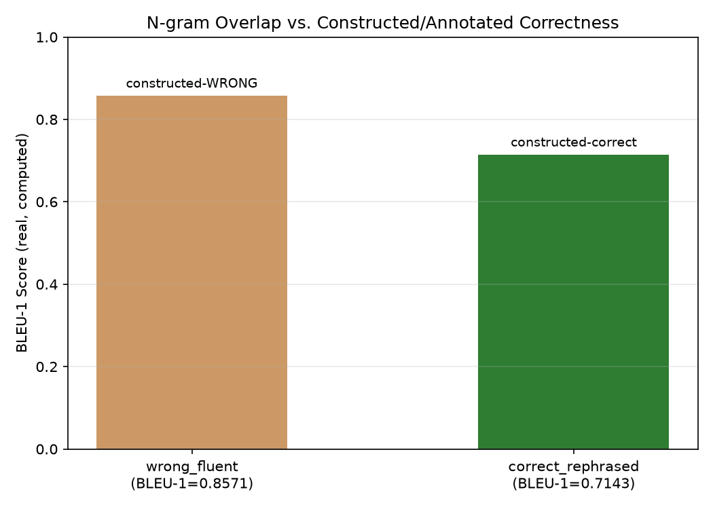

# Module 02: Automated Reference-Based & Reference-Free Metrics

## 1. Introduction & Intuition

### The Core Bottleneck
Module 01 established that exact-match scoring fails on genuinely correct paraphrases. Automated reference-based metrics — BLEU, ROUGE, and their relatives — exist to do *better* than exact match by measuring real, partial surface-level overlap instead of requiring an identical string. That's a genuine improvement, but it introduces its own real, distinct problem: a metric built on surface overlap rewards *similarity in wording*, which is not the same real property as *correctness*. A fluent, factually wrong answer can share most of its words with a correct reference; a correct but differently-worded answer can share very few. Reference-free signals — perplexity and self-consistency — sidestep the reference-comparison problem entirely, but each measures its own real, narrow property, not general correctness.

### High-Level Intuition
Grading an essay by counting how many words it shares with a model answer is better than requiring an exact match, but it still isn't grading for *content* — a student who copies most of the model answer's wording while swapping one key fact would score deceptively well, while a student who explains the same correct idea in entirely their own words could score deceptively poorly. Word-overlap metrics have exactly this blind spot, by construction.

---

## 2. Core Concepts & Mathematical Formulation

### Reference-Based Overlap: BLEU and ROUGE

#### Intuition & Practical Use
BLEU-style precision asks: of the words (or n-grams) the candidate produced, how many also appear in the reference? ROUGE-style recall asks the reverse: of the words in the reference, how many did the candidate actually reproduce? Both are simplified, intuition-level formulations here — real production BLEU/ROUGE implementations add smoothing, brevity penalties, and multi-n-gram weighting beyond this module's scope. What both share, at their core, is that they measure real *lexical overlap*, not real *semantic correctness* — a distinction this module's own worked example makes concrete.

$$\text{BLEU-1 precision} = \frac{\text{Clipped candidate unigram matches}}{\text{Total candidate unigrams}} \qquad \text{ROUGE-1 recall} = \frac{\text{Clipped candidate unigram matches}}{\text{Total reference unigrams}}$$

### Reference-Free Signals: Perplexity and Self-Consistency, Kept Distinct

#### Intuition & Practical Use
"Reference-free" is used carefully here, scoped per metric, not as one undifferentiated category. **Perplexity** measures how *fluent/predictable* a sequence is under a specific model's own probability distribution — it reflects a real property of how surprised the model is by the text, nothing about whether the text is factually correct. **Self-consistency** measures how *stable* a model's answer is across repeated real samples — it reflects real answer-agreement, not real factual accuracy (Module 06 covers this distinction in full, including the concrete case of a model consistently agreeing on a wrong answer). These two are never interchangeable, general-purpose quality metrics — each is tied to exactly the one real, narrow property it measures.

$$\text{PPL} = \exp\left(-\frac{1}{N}\sum_{i=1}^{N} \log p(x_i)\right)$$

---

### Hand Calculation, Two Real Worked Examples

*   **Example 1: Basic BLEU-1/ROUGE-1 on a real sentence pair.** Reference: *"The cat sat on the mat"*; candidate: *"The cat sat on the rug"* (6 words each, differing only in the last word).
    $$\text{BLEU-1} = \frac{5}{6} \approx 0.8333 \qquad \text{ROUGE-1 recall} = \frac{5}{6} \approx 0.8333$$
    Both real, computed scores agree here since the two sentences are the same length.

*   **Example 2: Fluent-but-wrong vs. correct-but-differently-phrased.** Reference (factually correct): *"The Eiffel Tower is located in Paris"*. Candidate A, `wrong_fluent` (factually **wrong**, changes only one word): *"The Eiffel Tower is located in Rome"*. Candidate B, `correct_rephrased` (factually **correct**, but reworded): *"Paris is home to the Eiffel Tower"*.
    $$\text{wrong\_fluent: BLEU-1} = \frac{6}{7} \approx 0.8571 \qquad \text{correct\_rephrased: BLEU-1} = \frac{5}{7} \approx 0.7143$$
    The factually **wrong** candidate scores **higher** (0.8571) than the factually **correct**, differently-worded candidate (0.7143) — a real, direct, computed counterexample to "higher n-gram overlap implies higher correctness."

*   **Example 3: Perplexity on a real toy probability sequence.** A 4-token sequence with assigned real per-token probabilities $[0.5, 0.25, 0.125, 0.5]$:
    $$\text{PPL} = \exp\left(-\frac{1}{4}(\ln 0.5 + \ln 0.25 + \ln 0.125 + \ln 0.5)\right) \approx 3.36$$
    This number reflects real average per-token surprise under this toy distribution alone — it says nothing about whether the underlying sequence's *content* is correct.



*   **Plot Interpretation:** A real, computed plot from this module's own Example 2 data, plotting each candidate's real BLEU-1 score against a **constructed/annotated correctness label** — a label manually stipulated for this small worked set, not an objectively measured semantic ground truth — visualizing the real, inverted relationship between overlap score and (stipulated) correctness for these two specific candidates.

---

## 3. Implementation & Reference Code

```python
from collections import Counter
import math


def tokenize(s: str) -> list[str]:
    return s.lower().rstrip(".").split()


def bleu1_precision(candidate: str, reference: str) -> tuple[int, int, float]:
    cand_tokens = tokenize(candidate)
    ref_counts = Counter(tokenize(reference))
    cand_counts = Counter(cand_tokens)
    clipped = sum(min(c, ref_counts[w]) for w, c in cand_counts.items())
    return clipped, len(cand_tokens), clipped / len(cand_tokens)


def rouge1_recall(candidate: str, reference: str) -> tuple[int, int, float]:
    ref_tokens = tokenize(reference)
    cand_counts = Counter(tokenize(candidate))
    ref_counts = Counter(ref_tokens)
    overlap = sum(min(c, cand_counts[w]) for w, c in ref_counts.items())
    return overlap, len(ref_tokens), overlap / len(ref_tokens)


def perplexity(token_probs: list[float]) -> float:
    n = len(token_probs)
    avg_neg_log = -sum(math.log(p) for p in token_probs) / n
    return math.exp(avg_neg_log)


if __name__ == "__main__":
    # Example 1: basic sentence pair
    ref1 = "The cat sat on the mat"
    cand1 = "The cat sat on the rug"
    clipped, total, bleu1 = bleu1_precision(cand1, ref1)
    print(f"Example 1 BLEU-1: {clipped}/{total} = {bleu1:.4f}")
    assert abs(bleu1 - 5 / 6) < 1e-9

    # Example 2: fluent-but-wrong vs. correct-but-rephrased
    correct_ref = "The Eiffel Tower is located in Paris"
    wrong_fluent = "The Eiffel Tower is located in Rome"
    correct_rephrased = "Paris is home to the Eiffel Tower"

    wf_clipped, wf_total, wf_bleu1 = bleu1_precision(wrong_fluent, correct_ref)
    cr_clipped, cr_total, cr_bleu1 = bleu1_precision(correct_rephrased, correct_ref)
    print(f"\nExample 2 (correct reference: {correct_ref!r})")
    print(f"  wrong_fluent:       BLEU-1 = {wf_clipped}/{wf_total} = {wf_bleu1:.4f}  (factually WRONG)")
    print(f"  correct_rephrased:  BLEU-1 = {cr_clipped}/{cr_total} = {cr_bleu1:.4f}  (factually CORRECT)")

    assert wf_bleu1 > cr_bleu1, "The factually wrong candidate must score higher n-gram overlap than the correct rephrased one"
    assert abs(wf_bleu1 - 6 / 7) < 1e-9
    assert abs(cr_bleu1 - 5 / 7) < 1e-9

    # Example 3: perplexity
    probs = [0.5, 0.25, 0.125, 0.5]
    ppl = perplexity(probs)
    print(f"\nExample 3 Perplexity: {ppl:.4f}")
    assert abs(ppl - 3.3636) < 0.001

    print("\nVerified: n-gram overlap scored a factually WRONG answer higher than a factually CORRECT,")
    print("differently-worded answer -- a real, computed counterexample to 'higher overlap implies more correct.'")
```

---

## 4. Interview Deep-Dive & System Trade-offs

### 1. Architectural & Production Trade-offs
* **Core Problem Solved:** Real, partial surface-level overlap against a reference is more forgiving of paraphrasing than exact match — a real, genuine improvement over Module 01's exact-match failure mode.
* **Why Introduced over Legacy Approaches:** Exact match's real, total intolerance for rewording made it unusable for open-ended generation; overlap-based metrics trade that rigidity for a real, partial-credit scoring scheme.
* **Key Failure Modes & Limitations:** Rewarding lexical similarity over real correctness (this module's own Example 2); treating perplexity or self-consistency as general quality signals rather than their one specific, narrow real property each actually measures.

### 2. System Complexity & Scaling
* **Time Complexity (FLOPs):** BLEU/ROUGE computation is real, cheap n-gram counting — negligible compared to the real cost of generating the text being scored; perplexity requires a real forward pass through a model to obtain token probabilities.
* **Space/Memory Footprint:** Minimal for BLEU/ROUGE; perplexity requires the scoring model's own real memory footprint (Module 05 of `06_llm_inference_and_optimization`'s own quantization/memory content applies if that model needs to run at scale, though re-derivation is out of this topic's scope).
* **Primary Bottleneck Type:** A real validity bottleneck, not a compute bottleneck — the central risk is trusting a metric that doesn't actually track what you care about, not the cost of computing it.
* **Variable Legend:** $p(x_i)$ = the scoring model's own real assigned probability to token $i$; $N$ = sequence length in tokens.

### 3. Production & Scalability
* **Deployment Considerations:** Automated overlap metrics are real, cheap, and useful for fast offline iteration and regression-catching (Module 09), but should never be the sole real quality gate for a production LLM feature, precisely because of Example 2's demonstrated blind spot.
*   **Common Interviewer Follow-Up Questions:**
    1.  *Q:* Why would a team still use BLEU/ROUGE in production despite their real, documented blind spots?
        *   *A:* Real speed and cost — they're cheap enough to run on every real request or every CI build, catching gross regressions fast, while slower/costlier techniques (LLM-as-judge, human eval) run less frequently as a real, complementary check.
    2.  *Q:* A team reports their system's perplexity dropped after a change and treats this as a real quality improvement. What would you push back on?
        *   *A:* Lower perplexity only means the model finds its own output more predictable under its own distribution — it says nothing about real factual correctness or task success, and treating it as a general quality signal is exactly the conflation this module warns against.
