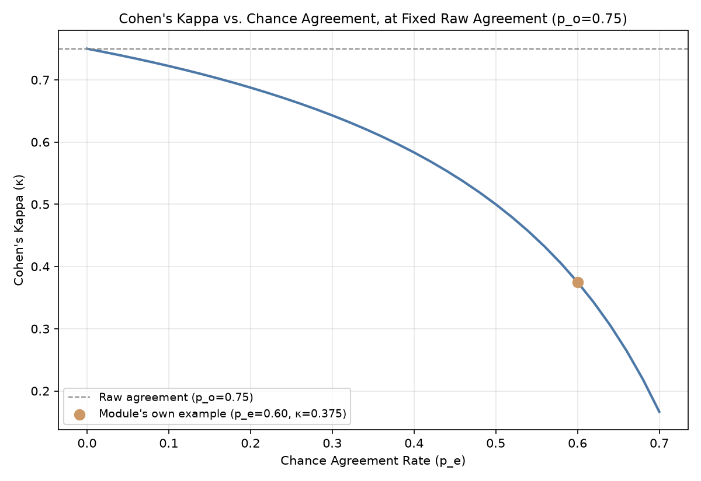

# Module 04: Human Evaluation & Preference Data Collection

## 1. Introduction & Intuition

### The Core Bottleneck
Module 03 established that LLM-judge calibration itself needs a real ground truth to be validated against — human evaluation is that real ground-truth anchor for both LLM-judges and automated metrics (Module 02). But human evaluation has its own real, distinct problem: two human annotators, given the same rubric and the same item, can genuinely disagree — and a rubric that produces low real inter-annotator agreement is itself unreliable as ground truth, independent of how careful any individual annotator was.

### High-Level Intuition
If two independent expert graders, given the same essay and the same grading rubric, land on meaningfully different grades, that's real evidence the rubric itself is ambiguous or the task is genuinely hard to grade consistently — not necessarily evidence either grader did a bad job. Measuring how often independent human annotators actually agree is what turns "we had humans label this" into a real, trustworthy signal rather than an unverified assumption.

---

## 2. Core Concepts & Mathematical Formulation

### Rubric Design and Inter-Annotator Agreement

#### Intuition & Practical Use
A real rubric's job is to make an otherwise-subjective judgment (is this response good?) into a real, repeatable decision process two independent annotators would reach the same way. Inter-annotator agreement is the real, direct measure of how well a given rubric achieves that — low agreement is real, actionable evidence the rubric (or the underlying task) needs to be revised, not merely evidence of annotator error.

### Cohen's Kappa, and Its Real, Explicit Scope

#### Intuition & Practical Use
Raw percentage agreement is a real, tempting but misleading statistic on its own — two annotators can agree on a large fraction of items purely by chance, especially when one label is far more common than the other. Cohen's kappa corrects for this by subtracting out the real *expected* agreement that chance alone would produce, leaving a real measure of *above-chance* agreement. **Its scope is explicit and important**: kappa is designed for **categorical** annotations — a discrete label set like pass/fail, or a small set of named categories. It is not the right tool for ordinal or continuous human judgments (e.g., a 1-10 quality scale) — a rank-correlation or weighted-agreement measure (closer to Module 03's own Spearman-based calibration approach) is the more appropriate real choice there instead.

$$\kappa = \frac{p_o - p_e}{1 - p_e}$$

where $p_o$ is real observed agreement and $p_e$ is real expected agreement by chance, computed from each annotator's real marginal label distribution.

### Collecting Preference Data for RLHF/DPO-Style Training

#### Intuition & Practical Use
Beyond scoring individual outputs, human evaluation is also used to collect real *pairwise preference* data — given two real candidate responses, which one is better? — the real training signal RLHF and DPO-style methods use directly. The same real inter-annotator-agreement discipline applies here too: a preference-collection task with low real annotator agreement produces a real, noisy training signal, regardless of how much of it gets collected.

---

### Hand Calculation: Cohen's Kappa on a Real 2-Annotator Confusion Table
A real, small pass/fail labeling task — a categorical annotation, matching kappa's real stated scope — with 20 real items labeled independently by two annotators.

| | Annotator 2: Pass | Annotator 2: Fail |
|---|---|---|
| **Annotator 1: Pass** | 12 | 2 |
| **Annotator 1: Fail** | 3 | 3 |

*   **Step 1: Real observed agreement.**
    $$p_o = \frac{12 + 3}{20} = 0.75 \quad (75\% \text{ raw agreement})$$

*   **Step 2: Real expected agreement by chance**, from each annotator's real marginal Pass/Fail rate — Annotator 1: Pass $=0.70$, Fail $=0.30$; Annotator 2: Pass $=0.75$, Fail $=0.25$.
    $$p_e = (0.70)(0.75) + (0.30)(0.25) = 0.525 + 0.075 = 0.60$$

*   **Step 3: Cohen's kappa.**
    $$\kappa = \frac{0.75 - 0.60}{1 - 0.60} = \frac{0.15}{0.40} = 0.375$$

*   **Step 4: Real interpretation.** A raw 75% agreement rate looks reasonably solid at first glance — but $\kappa = 0.375$ falls in the real, standard "fair agreement" range (well below "substantial" or "almost perfect"), because a real, substantial share of that 75% raw agreement (60 percentage points' worth) was already expected purely by chance, given how skewed both annotators' real label distributions were toward "Pass." This is a real, computed, concrete illustration of exactly why raw agreement alone can deceptively overstate real rubric/task reliability.



*   **Plot Interpretation:** A real, computed curve sweeping chance-agreement rate $p_e$ at a fixed real observed agreement $p_o = 0.75$, showing how sharply $\kappa$ drops as $p_e$ rises — directly visualizing why the same raw agreement percentage can correspond to a very different real reliability picture depending on the real underlying label distribution.

---

## 3. Implementation & Reference Code

```python
def cohens_kappa(pass_pass: int, pass_fail: int, fail_pass: int, fail_fail: int) -> dict:
    total = pass_pass + pass_fail + fail_pass + fail_fail
    p_o = (pass_pass + fail_fail) / total

    a1_pass = (pass_pass + pass_fail) / total
    a1_fail = (fail_pass + fail_fail) / total
    a2_pass = (pass_pass + fail_pass) / total
    a2_fail = (pass_fail + fail_fail) / total

    p_e = a1_pass * a2_pass + a1_fail * a2_fail
    kappa = (p_o - p_e) / (1 - p_e)

    return {"p_o": p_o, "p_e": p_e, "kappa": kappa}


if __name__ == "__main__":
    result = cohens_kappa(pass_pass=12, pass_fail=2, fail_pass=3, fail_fail=3)
    print(f"Observed agreement (p_o): {result['p_o']:.4f}")
    print(f"Expected agreement by chance (p_e): {result['p_e']:.4f}")
    print(f"Cohen's kappa: {result['kappa']:.4f}")

    assert abs(result["p_o"] - 0.75) < 1e-9
    assert abs(result["p_e"] - 0.60) < 1e-9
    assert abs(result["kappa"] - 0.375) < 1e-9
    assert result["kappa"] < result["p_o"], "Kappa should be lower than raw agreement once chance agreement is subtracted out"

    print("\nVerified: a real 75% raw agreement rate corresponds to only kappa=0.375 ('fair' agreement) --")
    print("a real, concrete demonstration of why raw agreement alone can overstate rubric/task reliability.")
```

---

## 4. Interview Deep-Dive & System Trade-offs

### 1. Architectural & Production Trade-offs
* **Core Problem Solved:** Turning "we collected human labels" into a real, quantified reliability claim — a rubric/task with low real inter-annotator agreement produces real, unreliable ground truth regardless of how much labeled data gets collected.
* **Why Introduced over Legacy Approaches:** Raw agreement percentages are real, easy to compute but real, systematically misleading whenever label distributions are skewed — kappa corrects for exactly that distortion.
* **Key Failure Modes & Limitations:** Applying kappa to ordinal/continuous human scores where it isn't the right real tool (its real scope is categorical annotation); treating a single kappa computation as permanently valid rather than re-checking it whenever the rubric or annotator pool changes.

### 2. System Complexity & Scaling
* **Time Complexity (FLOPs):** Not applicable — kappa computation is real, cheap arithmetic over label counts, independent of model inference cost.
* **Space/Memory Footprint:** Minimal — a real confusion table over the label set, growing with the number of real categories, not the number of items labeled.
* **Primary Bottleneck Type:** A real human-throughput and cost bottleneck — human evaluation's real, practical constraint is annotator time/cost, not compute, which is exactly why it's used selectively (as a ground-truth anchor) rather than for every real evaluation.
* **Variable Legend:** $p_o$ = real observed agreement, $p_e$ = real expected agreement by chance from annotator marginals, $\kappa$ = Cohen's kappa (chance-corrected agreement).

### 3. Production & Scalability
* **Deployment Considerations:** Real production human-evaluation pipelines should report kappa (or an appropriate ordinal/continuous alternative) alongside every real human-labeled dataset used to validate automated metrics (Module 02) or LLM judges (Module 03) — an unreported or unchecked agreement rate leaves the whole downstream validation chain resting on an unverified assumption.
*   **Common Interviewer Follow-Up Questions:**
    1.  *Q:* Two annotators show 90% raw agreement on a binary label task. Is that automatically strong evidence of a reliable rubric?
        *   *A:* Not by itself — if one label is real, heavily dominant (e.g., 95% of items are genuinely "Pass"), a large share of that 90% raw agreement could be expected purely by chance; kappa (Module 04's own hand calc) is the real, direct way to check before trusting the raw number.
    2.  *Q:* Why is Cohen's kappa the wrong tool for a 1-10 human quality rating task?
        *   *A:* Kappa's real, stated scope is categorical labels — a 1-10 scale is ordinal, where a rank-correlation-based measure (Module 03's own Spearman approach) captures real agreement on relative ordering far better than a category-match-based statistic designed for discrete, unordered labels.
