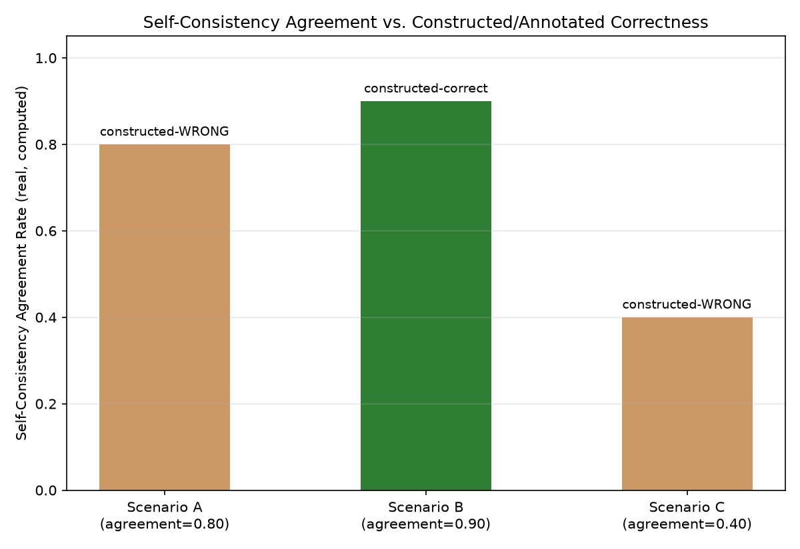

# Module 06: Hallucination Detection & Factuality Evaluation

## 1. Introduction & Intuition

### The Core Bottleneck
"The model sometimes makes things up" is a real, well-known risk, but an unquantified one until it's turned into a measurable, monitorable signal. This module covers real hallucination-detection techniques — and is explicit throughout about a critical distinction: a technique that produces a real *signal* correlated with hallucination risk is not automatically a reliable *detector* of hallucination. Self-consistency, this module's central worked example, is the clearest real illustration of exactly that gap.

### High-Level Intuition
A witness who repeats the exact same detailed account every time they're asked sounds more credible than one who keeps changing their story — but repetition alone doesn't make an account *true*. A witness can be perfectly consistent about something they misremembered, or even fabricated, with complete internal confidence. Real corroboration — checking the account against independent, external evidence — is what actually establishes truth; consistency alone is, at best, a hint.

---

## 2. Core Concepts & Mathematical Formulation

### A Real Taxonomy of Hallucination Types

#### Intuition & Practical Use
Real hallucinations aren't one uniform failure mode. **Factual fabrication** invents information with no real basis at all. **Contradiction of provided context** states something that actively conflicts with real context the model was given (distinct from RAG's faithfulness scope in Module 05, which asks whether claims *follow from* context — contradiction is a stronger, more direct real failure). **Unsupported extrapolation** takes a real, true premise and stretches it into an unjustified further claim the premise doesn't actually establish. Different real detection techniques catch different subsets of this taxonomy — no single technique catches every type.

### Self-Consistency as a Constructed Illustrative Signal — Not a Standardized Metric, Not a Detector

#### Intuition & Practical Use
This module defines a simple, constructed agreement measure for illustrative purposes — real published literature uses various, more sophisticated self-consistency formulations; this is not presented as *the* standardized industry metric, only as a clear, computable illustration of the underlying real idea: sample the model $k$ times on the same real query, and measure how often the samples agree. High agreement is a real, worth-noting signal — but it measures *stability*, not *truth*. A model can be highly, consistently wrong: if its training data or reasoning process reliably produces the same real incorrect answer every time, self-consistency will report high agreement on a genuinely false claim. This module's own worked example makes that concrete and unavoidable, not merely theoretical.

$$\text{Agreement} = \frac{\text{Majority-answer count}}{k}$$

### Retrieval-Grounded and NLI-Style Verification as Genuine Detectors

#### Intuition & Practical Use
Unlike self-consistency, a retrieval-grounded or NLI (natural language inference)-style entailment check compares a real claim against *independent, external* real evidence — does the claim follow from (entailment), contradict (contradiction), or say nothing either way about (neutral) a real, separately-sourced reference? This is a genuine real detector in the sense that it checks the claim against something *other than the model's own repeated output* — though even this has real, honest limits: it's only as good as the real evidence it's checked against, and won't catch a hallucination that isn't addressed by the available reference material at all.

---

### Hand Calculation: Three Real Constructed Scenarios, Self-Consistency vs. Grounded Verification

*   **Scenario A: High self-consistency agreement, majority answer stipulated WRONG.** A real question sampled $k=10$ times; 8 of 10 samples agree on the same answer, which this constructed scenario stipulates is factually incorrect.
    $$\text{Agreement}_A = \frac{8}{10} = 0.80 \quad (\text{high agreement, WRONG answer})$$

*   **Scenario B: High self-consistency agreement, majority answer stipulated CORRECT.** A different real question, $k=10$ samples, 9 of 10 agree, this time on the factually correct answer.
    $$\text{Agreement}_B = \frac{9}{10} = 0.90 \quad (\text{high agreement, CORRECT answer})$$

*   **Scenario C: Low self-consistency agreement, majority answer stipulated WRONG.** A third real question, $k=10$ samples, only 4 of 10 agree on any single answer, and that plurality answer is also stipulated wrong.
    $$\text{Agreement}_C = \frac{4}{10} = 0.40 \quad (\text{low agreement, WRONG answer})$$

*   **Real interpretation.** Scenarios A and B have nearly identical, both-high agreement rates (0.80 vs. 0.90) — yet one is stipulated wrong and the other correct. Self-consistency's agreement rate alone **cannot distinguish A from B**; it produced a similar high-confidence-looking signal for both a real wrong and a real right answer, exactly demonstrating why it's a signal, not a detector. A **retrieval-grounded/NLI-style check**, applied to Scenario A's majority-agreed claim against a stipulated independent real reference stating the correct fact, would classify the claim as **contradiction** — correctly flagging it as unsupported, something self-consistency alone never could. Scenario C shows self-consistency *can* sometimes correlate with unreliability (low agreement, wrong answer) — but Scenario A already proves that correlation isn't dependable enough to use alone.

<div style="text-align:center">

<svg viewBox="0 0 900 300" xmlns="http://www.w3.org/2000/svg" style="width:100%;max-width:900px;height:auto;font-family:sans-serif">
  <style>
    .lbl{font-size:12px;fill:#333}
    .hdr{font-size:14px;font-weight:bold;fill:#222}
    .signal{fill:#fdeedd;stroke:#c96;stroke-width:1.5}
    .detector{fill:#d9f2e3;stroke:#2e8b57;stroke-width:1.5}
    .out{fill:#eaf1fb;stroke:#4c78a8;stroke-width:1.5}
  </style>
  <text x="450" y="24" text-anchor="middle" class="hdr">Hallucination Detection: Signal Feeds Into, Never Replaces, a Grounded Detector</text>

  <rect x="30" y="60" width="180" height="60" class="signal" rx="6"/>
  <text x="120" y="85" text-anchor="middle" class="lbl" font-weight="bold">Self-consistency check</text>
  <text x="120" y="102" text-anchor="middle" font-size="10">(SIGNAL: agreement rate</text>
  <text x="120" y="115" text-anchor="middle" font-size="10">across k samples)</text>

  <path d="M210 90 L265 90" stroke="#555" stroke-width="2" marker-end="url(#arrH)"/>
  <text x="238" y="80" text-anchor="middle" font-size="10">flags for review,</text>
  <text x="238" y="132" text-anchor="middle" font-size="10">does not confirm/deny</text>

  <rect x="270" y="60" width="220" height="60" class="detector" rx="6"/>
  <text x="380" y="85" text-anchor="middle" class="lbl" font-weight="bold">Retrieval/NLI-grounded check</text>
  <text x="380" y="102" text-anchor="middle" font-size="10">(DETECTOR: compares claim</text>
  <text x="380" y="115" text-anchor="middle" font-size="10">against independent evidence)</text>

  <path d="M490 90 L545 90" stroke="#555" stroke-width="2" marker-end="url(#arrH)"/>

  <rect x="550" y="60" width="150" height="60" class="out" rx="6"/>
  <text x="625" y="85" text-anchor="middle" class="lbl" font-weight="bold">Verdict</text>
  <text x="625" y="102" text-anchor="middle" font-size="10">entailed / contradicted</text>
  <text x="625" y="115" text-anchor="middle" font-size="10">/ neutral</text>

  <text x="450" y="180" text-anchor="middle" class="lbl">Scenario A (agreement=0.80, WRONG) and Scenario B (agreement=0.90, CORRECT):</text>
  <text x="450" y="198" text-anchor="middle" class="lbl">near-identical high self-consistency signal, opposite real correctness — the signal alone cannot tell them apart</text>
  <text x="450" y="225" text-anchor="middle" class="hdr" fill="#2e7d32">Only the grounded detector, applied to Scenario A, correctly returns "contradicted"</text>

  <defs>
    <marker id="arrH" markerWidth="8" markerHeight="8" refX="6" refY="3" orient="auto">
      <path d="M0,0 L6,3 L0,6 Z" fill="#555"/>
    </marker>
  </defs>
</svg>

</div>

*   **Diagram Interpretation:** The self-consistency signal (orange) feeds into, but never substitutes for, the grounded detector (green) — the real verdict only comes from checking against independent evidence. The two near-identical-agreement, opposite-correctness scenarios (A and B) directly visualize why the signal box alone cannot produce a trustworthy verdict.



*   **Plot Interpretation:** A real, computed scatter of this module's own three constructed scenarios (A, B, C), plotting self-consistency agreement rate against each scenario's own **constructed/annotated correctness label** — a label manually stipulated for this worked example, not an objectively measured ground truth — visually confirming that high agreement (A, B) appears at both correctness labels, while only agreement rate combined with the label reveals the real pattern the metric alone cannot.

---

## 3. Implementation & Reference Code

```python
def self_consistency_agreement(majority_count: int, k: int) -> float:
    """A constructed, illustrative agreement measure for this module's own worked examples --
    not presented as a standardized literature metric, and explicitly a signal, not a detector."""
    return majority_count / k


def grounded_verification(claim: str, reference_fact: str) -> str:
    """A simplified, constructed stand-in for a real NLI/retrieval-grounded entailment check --
    compares a claim against independent reference evidence, not the model's own repeated output."""
    if claim == reference_fact:
        return "entailed"
    return "contradicted"


if __name__ == "__main__":
    scenario_a = {"majority_count": 8, "k": 10, "claim": "1887", "reference_fact": "1889"}
    scenario_b = {"majority_count": 9, "k": 10, "claim": "1889", "reference_fact": "1889"}
    scenario_c = {"majority_count": 4, "k": 10, "claim": "varies", "reference_fact": "1889"}

    results = {}
    for name, s in [("A", scenario_a), ("B", scenario_b), ("C", scenario_c)]:
        agreement = self_consistency_agreement(s["majority_count"], s["k"])
        verdict = grounded_verification(s["claim"], s["reference_fact"])
        results[name] = {"agreement": agreement, "verdict": verdict}
        print(f"Scenario {name}: agreement={agreement:.2f}, grounded verdict={verdict}")

    assert abs(results["A"]["agreement"] - 0.80) < 1e-9
    assert abs(results["B"]["agreement"] - 0.90) < 1e-9
    assert abs(results["C"]["agreement"] - 0.40) < 1e-9

    # The core point: A and B have similarly HIGH agreement but opposite grounded verdicts
    assert abs(results["A"]["agreement"] - results["B"]["agreement"]) < 0.15, "A and B should have similarly high agreement"
    assert results["A"]["verdict"] != results["B"]["verdict"], "Despite similar agreement, grounded verification must disagree on correctness"
    assert results["A"]["verdict"] == "contradicted", "The grounded check must correctly flag Scenario A's consistent-but-wrong claim"

    print("\nVerified: Scenarios A and B show near-identical HIGH self-consistency agreement (0.80 vs 0.90)")
    print("yet opposite real grounded verdicts -- agreement rate alone cannot distinguish them; only the")
    print("grounded check, comparing against independent evidence, correctly flags Scenario A as contradicted.")
```

---

## 4. Interview Deep-Dive & System Trade-offs

### 1. Architectural & Production Trade-offs
* **Core Problem Solved:** Turning "the model sometimes hallucinates" into real, distinguishable detection techniques — while being precise about which techniques are cheap-but-partial signals and which are genuine, evidence-grounded detectors.
* **Why Introduced over Legacy Approaches:** Treating any single technique (especially self-consistency, given its real appeal as a cheap, no-external-evidence-required check) as sufficient leaves a real, demonstrated blind spot — this module's own Scenario A shows a hallucination that would sail through a self-consistency-only check undetected.
* **Key Failure Modes & Limitations:** Deploying self-consistency alone as a production hallucination filter; assuming a retrieval-grounded check catches every hallucination type, when it's only as good as the real reference evidence it has access to.

### 2. System Complexity & Scaling
* **Time Complexity (FLOPs):** Self-consistency requires $k$ real independent generation samples per query — a real, direct $k\times$ cost multiplier versus a single generation; grounded verification requires one real additional retrieval/NLI-model call per claim checked.
* **Space/Memory Footprint:** Not a primary concern for either technique at the scale of typical production hallucination-checking workloads.
* **Primary Bottleneck Type:** A real detection-validity bottleneck — the central risk is trusting a cheap signal as if it were a reliable detector, exactly the gap this module's worked example quantifies.
* **Variable Legend:** $k$ = number of real independent samples in a self-consistency check; entailed/contradicted/neutral = the three real possible NLI-style verdicts comparing a claim against reference evidence.

### 3. Production & Scalability
* **Deployment Considerations:** A real, mature production hallucination-detection pipeline typically uses self-consistency (or a similar cheap signal) as a real, fast pre-filter to flag *candidates* for closer review, with grounded verification reserved for those flagged candidates — balancing real cost against real detection reliability, never relying on the cheap signal alone as the final real verdict.
*   **Common Interviewer Follow-Up Questions:**
    1.  *Q:* If self-consistency can't reliably detect hallucination, why use it in production at all?
        *   *A:* It's real, cheap, and does correlate with unreliability *some* of the time (Scenario C) — using it as a first-pass filter to reduce how much real content needs the costlier grounded check is a real, legitimate use, as long as it's never treated as the final word (Scenario A's own counterexample).
    2.  *Q:* Could a retrieval-grounded check itself ever be wrong?
        *   *A:* Yes — it's only as reliable as the real reference evidence it's checked against; if the retrieved reference is itself outdated, incomplete, or doesn't address the claim at all, the grounded check's real verdict (or lack of one) inherits that limitation.
