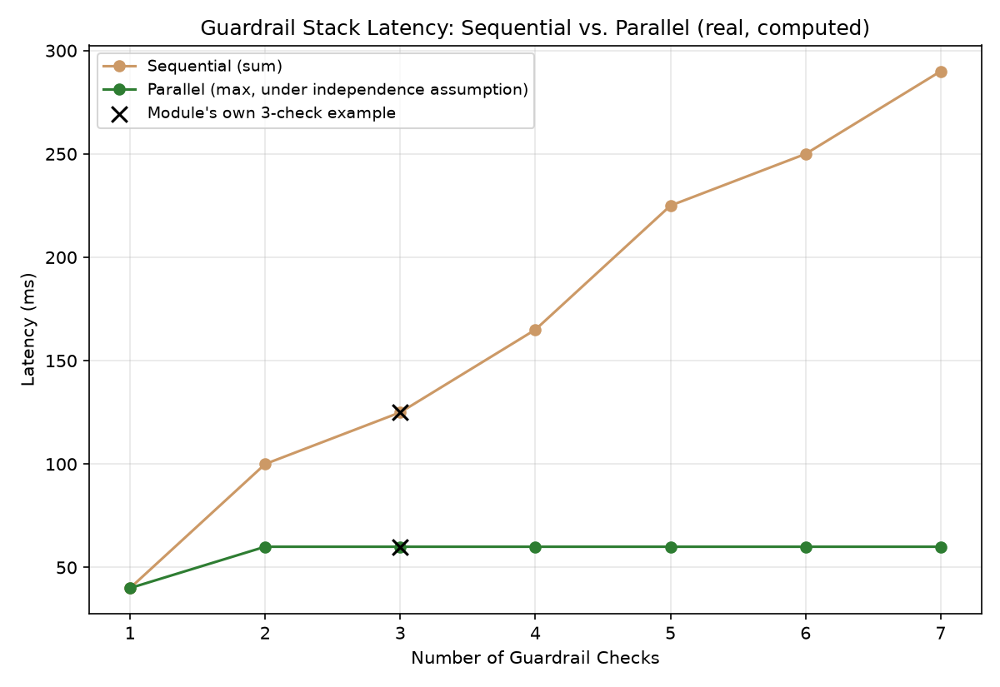

# Module 08: Guardrails & Content Safety Classification

## 1. Introduction & Intuition

### The Core Bottleneck
Every prior module in this topic evaluates output quality. Guardrails address a real, distinct concern: preventing and catching real, harmful or policy-violating output before or after it reaches a user, regardless of whether it would otherwise score well on quality metrics. A production guardrail is a real, three-stage pipeline — **detection** (a classifier flags a real risk), **decision** (a real policy maps that flag to an action, often with a confidence threshold), and **enforcement** (the action actually happens: allow, block, rewrite, or fall back). Treating "guardrails" as classification alone — detection without a real decision/enforcement layer — leaves the real, hard part (what actually happens next) undesigned.

### High-Level Intuition
A building's fire-safety system isn't just a smoke detector — a detector alone doesn't stop a fire. It's the *combination* of the detector (detection), the logic deciding whether the signal is strong enough to act on and what action to take (decision), and the sprinklers/alarms/evacuation actually triggering (enforcement) that makes the whole system real and functional. A guardrail without a real decision-and-enforcement layer is exactly a smoke detector with the alarm disconnected.

---

## 2. Core Concepts & Mathematical Formulation

### The Real Three-Stage Guardrail Pipeline

#### Intuition & Practical Use
**Detection** is a real classifier — toxicity, PII, bias, unsafe-content detection — producing a real score or label per input/output. **Decision** is a real policy: given that score (often against a real, tunable confidence threshold), what should happen? **Enforcement** is where the real, distinct remediation strategies diverge — *allow* (let it through), *block* (refuse the request/response entirely), *rewrite* (real, automated sanitization of the flagged content), or *fallback* (substitute a safe, canned real response). These are genuinely different real user-experience and safety trade-offs, not interchangeable outcomes of "the guardrail triggered."

### Classifier Precision, Recall, and the Real Threshold Trade-off

#### Intuition & Practical Use
A real safety classifier's precision/recall trade-off is directly tunable via its real decision threshold. A stricter, more conservative threshold flags more content — raising real recall (catching more true positives) at the real cost of more false positives (lower precision). A looser threshold does the reverse. Neither setting is universally correct — the real, appropriate choice depends on the real cost asymmetry of the specific deployment (is a missed unsafe output or a wrongly-blocked safe output worse for this use case?).

$$\text{Precision} = \frac{TP}{TP+FP} \qquad \text{Recall} = \frac{TP}{TP+FN} \qquad F_1 = \frac{2 \cdot \text{Precision} \cdot \text{Recall}}{\text{Precision}+\text{Recall}}$$

### Real Guardrail Latency/Cost Trade-offs

#### Intuition & Practical Use
Every additional safety check — especially a real, separate classifier model call — adds real, measurable latency and cost to every request. A stack of $n$ checks run sequentially pays the real *sum* of each check's latency; run in parallel, it pays only the real *maximum*. **The parallel formulation's assumption is stated explicitly**: $\max_i(\text{Latency}_{\text{check}_i})$ holds only when the checks genuinely execute independently and concurrently — no real data dependency between them — *and* downstream generation/response genuinely waits for every required check to complete before proceeding. Real orchestration overhead, a genuine dependency between checks (one check's real output gating another), or a partial-wait policy would all change the real result; this is a simplification, not a universal guarantee.

$$\text{Latency}_{\text{sequential}} = \sum_i \text{Latency}_{\text{check}_i} \qquad \text{Latency}_{\text{parallel}} = \max_i(\text{Latency}_{\text{check}_i}) \quad \text{(under the independence assumption above)}$$

---

### Hand Calculation, Two Real Worked Examples

*   **Example 1: Precision/recall/F1 at two real decision thresholds**, on a real 50-message confusion matrix.

    | Threshold | TP | FP | FN | TN | Precision | Recall | F1 |
    |---|---|---|---|---|---|---|---|
    | A (conservative — flags more) | 20 | 8 | 1 | 21 | 0.7143 | 0.9524 | 0.8163 |
    | B (permissive — flags less) | 15 | 2 | 6 | 27 | 0.8824 | 0.7143 | 0.7895 |

    Threshold A catches nearly all real unsafe content (recall $\approx 0.95$) at the real cost of more false positives (precision $\approx 0.71$); Threshold B is the reverse — a real, direct, computed illustration of the precision/recall trade-off's practical shape, not just an abstract claim.

*   **Example 2: Sequential vs. parallel guardrail-stack latency**, for 3 real illustrative checks (toxicity: 40ms, PII: 60ms, bias: 25ms), under the stated independence assumption.
    $$\text{Latency}_{\text{sequential}} = 40+60+25 = 125\text{ms} \qquad \text{Latency}_{\text{parallel}} = \max(40,60,25) = 60\text{ms}$$
    A real, computed $65\text{ms}$ ($52.0\%$) latency reduction from running these three checks in parallel instead of sequentially — real, substantial, and directly dependent on the independence assumption holding for this specific real check stack.

<div style="text-align:center">

<svg viewBox="0 0 900 280" xmlns="http://www.w3.org/2000/svg" style="width:100%;max-width:900px;height:auto;font-family:sans-serif">
  <style>
    .lbl{font-size:12px;fill:#333}
    .hdr{font-size:14px;font-weight:bold;fill:#222}
    .detect{fill:#fdeedd;stroke:#c96;stroke-width:1.5}
    .decide{fill:#eaf1fb;stroke:#4c78a8;stroke-width:1.5}
    .enforce{fill:#d9f2e3;stroke:#2e8b57;stroke-width:1.5}
  </style>
  <text x="450" y="22" text-anchor="middle" class="hdr">Guardrail Pipeline: Detection → Decision → Enforcement</text>

  <rect x="30" y="55" width="170" height="55" class="detect" rx="6"/>
  <text x="115" y="78" text-anchor="middle" class="lbl" font-weight="bold">Detection</text>
  <text x="115" y="95" text-anchor="middle" font-size="10">toxicity/PII/bias classifier</text>

  <path d="M200 82 L255 82" stroke="#555" stroke-width="2" marker-end="url(#arrG)"/>

  <rect x="260" y="55" width="170" height="55" class="decide" rx="6"/>
  <text x="345" y="78" text-anchor="middle" class="lbl" font-weight="bold">Decision</text>
  <text x="345" y="95" text-anchor="middle" font-size="10">score vs. real threshold policy</text>

  <path d="M430 82 L485 82" stroke="#555" stroke-width="2" marker-end="url(#arrG)"/>

  <rect x="490" y="55" width="380" height="55" class="enforce" rx="6"/>
  <text x="680" y="78" text-anchor="middle" class="lbl" font-weight="bold">Enforcement (4 distinct real branches)</text>
  <text x="680" y="95" text-anchor="middle" font-size="10">allow / block / rewrite / fallback</text>

  <g font-size="10">
    <rect x="500" y="140" width="80" height="30" fill="#d9f2e3" stroke="#2e8b57" rx="4"/>
    <text x="540" y="159" text-anchor="middle">allow</text>
    <rect x="590" y="140" width="80" height="30" fill="#f6c6c6" stroke="#b23" rx="4"/>
    <text x="630" y="159" text-anchor="middle">block</text>
    <rect x="680" y="140" width="90" height="30" fill="#fdeedd" stroke="#c96" rx="4"/>
    <text x="725" y="159" text-anchor="middle">rewrite</text>
    <rect x="780" y="140" width="90" height="30" fill="#eaf1fb" stroke="#4c78a8" rx="4"/>
    <text x="825" y="159" text-anchor="middle">fallback</text>
  </g>
  <path d="M540 110 L540 138" stroke="#555" stroke-width="1"/>
  <path d="M630 110 L630 138" stroke="#555" stroke-width="1"/>
  <path d="M725 110 L725 138" stroke="#555" stroke-width="1"/>
  <path d="M825 110 L825 138" stroke="#555" stroke-width="1"/>

  <text x="450" y="205" text-anchor="middle" class="lbl">Each branch is a genuinely different real user-experience/safety trade-off —</text>
  <text x="450" y="223" text-anchor="middle" class="lbl">"the guardrail triggered" alone does not specify which of these 4 real outcomes actually happens</text>
  <text x="450" y="255" text-anchor="middle" class="hdr" fill="#b05a3a">Detection alone (no decision/enforcement layer) leaves the real remediation strategy undesigned</text>

  <defs>
    <marker id="arrG" markerWidth="8" markerHeight="8" refX="6" refY="3" orient="auto">
      <path d="M0,0 L6,3 L0,6 Z" fill="#555"/>
    </marker>
  </defs>
</svg>

</div>

*   **Diagram Interpretation:** The three real stages flow left to right, with enforcement's four genuinely distinct branches shown explicitly beneath it — visualizing why "detection" alone is an incomplete real guardrail: the same detected signal can lead to four meaningfully different real outcomes depending on the decision/enforcement design.



*   **Plot Interpretation:** A real, computed comparison of sequential vs. parallel guardrail-stack latency as the number of checks grows, computed directly from this module's own latency formulas under the stated independence assumption — visualizing how the real gap between the two architectures widens as more checks are added.

---

## 3. Implementation & Reference Code

```python
def precision_recall_f1(tp: int, fp: int, fn: int) -> dict:
    precision = tp / (tp + fp)
    recall = tp / (tp + fn)
    f1 = 2 * precision * recall / (precision + recall)
    return {"precision": precision, "recall": recall, "f1": f1}


def guardrail_latency(check_latencies_ms: list[int]) -> dict:
    sequential = sum(check_latencies_ms)
    parallel = max(check_latencies_ms)  # assumes real independence + full-wait, stated explicitly
    return {"sequential_ms": sequential, "parallel_ms": parallel,
            "savings_ms": sequential - parallel, "savings_pct": (sequential - parallel) / sequential * 100}


if __name__ == "__main__":
    # Example 1: precision/recall/F1 at two thresholds
    threshold_a = precision_recall_f1(tp=20, fp=8, fn=1)
    threshold_b = precision_recall_f1(tp=15, fp=2, fn=6)
    print(f"Threshold A: precision={threshold_a['precision']:.4f}, recall={threshold_a['recall']:.4f}, f1={threshold_a['f1']:.4f}")
    print(f"Threshold B: precision={threshold_b['precision']:.4f}, recall={threshold_b['recall']:.4f}, f1={threshold_b['f1']:.4f}")

    assert threshold_a["recall"] > threshold_b["recall"], "Conservative threshold A should have higher real recall"
    assert threshold_b["precision"] > threshold_a["precision"], "Permissive threshold B should have higher real precision"

    # Example 2: sequential vs. parallel guardrail latency
    checks = [40, 60, 25]
    latency = guardrail_latency(checks)
    print(f"\nSequential: {latency['sequential_ms']}ms, Parallel: {latency['parallel_ms']}ms")
    print(f"Savings: {latency['savings_ms']}ms ({latency['savings_pct']:.1f}%)")

    assert latency["sequential_ms"] == 125
    assert latency["parallel_ms"] == 60
    assert abs(latency["savings_pct"] - 52.0) < 0.1

    print("\nVerified: the precision/recall trade-off shifts real, measurably across thresholds, and a real")
    print("52.0% latency reduction from parallelizing guardrail checks holds under the stated independence assumption.")
```

---

## 4. Interview Deep-Dive & System Trade-offs

### 1. Architectural & Production Trade-offs
* **Core Problem Solved:** Real, systematic prevention/detection of harmful or policy-violating output — a genuinely separate concern from Modules 02-06's output-*quality* evaluation.
* **Why Introduced over Legacy Approaches:** Treating safety as "the model should just behave" leaves no real, independent, auditable layer to catch failures — a real, explicit detection→decision→enforcement pipeline provides that independent layer.
* **Key Failure Modes & Limitations:** Real, unmanaged false-positive rate degrading user experience (over-blocking); real, unmanaged false-negative rate letting harmful content through (under-detecting); assuming detection alone constitutes "having guardrails" without a designed real decision/enforcement policy; assuming parallel guardrail latency without checking the real independence assumption actually holds for the specific check stack in question.

### 2. System Complexity & Scaling
* **Time Complexity (FLOPs):** Each real detection check typically requires its own real model forward pass (a classifier or a real LLM-based check) — a real, direct multiplier on total request cost proportional to the number of checks in the stack.
* **Space/Memory Footprint:** Each real classifier model in the detection stage carries its own real memory footprint, additive to the main generation model's own footprint (Module 05's quantization content in `06_llm_inference_and_optimization` applies if that classifier needs to run at scale, though re-derivation is out of this topic's scope).
* **Primary Bottleneck Type:** A real, dual bottleneck — detection accuracy (precision/recall trade-off) and real added latency/cost, which have to be jointly, explicitly managed rather than optimized in isolation.
* **Variable Legend:** $TP/FP/FN/TN$ = real true/false positive/negative counts from a classifier's confusion matrix at a given threshold; $\text{Latency}_{\text{check}_i}$ = the $i$-th real guardrail check's own latency.

### 3. Production & Scalability
* **Deployment Considerations:** Real production guardrail stacks should be explicitly designed across all three stages — a real, chosen threshold (Example 1's trade-off), a real decision policy per detected risk level, and a real enforcement strategy per branch (Example 2's latency-aware architecture choice between sequential and parallel checks) — not just "add a classifier and see what happens."
*   **Common Interviewer Follow-Up Questions:**
    1.  *Q:* Why might a production system choose a permissive (Threshold B) rather than conservative (Threshold A) classifier threshold despite lower recall?
        *   *A:* When the real cost of a false positive (wrongly blocking/frustrating a legitimate real user) outweighs the real cost of an occasional missed true positive for that specific use case — a real, deliberate trade-off, not a universal "always maximize recall" rule.
    2.  *Q:* When would running guardrail checks in parallel *not* actually reduce real latency as the formula predicts?
        *   *A:* When the real independence assumption fails — a genuine data dependency between checks (one check's output feeding another), real orchestration/scheduling overhead, or a policy that doesn't actually wait for every check before proceeding — all real, stated exceptions to the simplified $\max()$ formulation.
