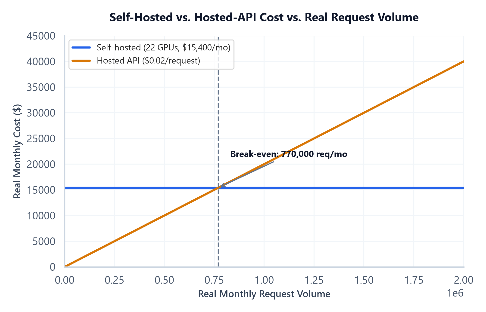

# Module 03: Capacity Estimation, Traffic Modeling & Cost Engineering

## 1. Introduction & Intuition

### The Core Bottleneck
A system that works in a demo and a system whose capacity and cost have actually been sized against real, stated traffic assumptions are two genuinely different deliverables — and the gap between them is exactly where a system-design interview probe ("what if traffic grows 100x," "cost must drop 10x") exposes an unprepared answer. Capacity estimation isn't a formality to mention in passing; it's the real, load-bearing arithmetic that determines whether the proposed architecture (Module 02) can actually serve the stated non-functional requirements (Module 01).

### High-Level Intuition
Sizing a restaurant's kitchen isn't "guess a number of stoves" — it's a real derivation from how many customers arrive per hour, how long each order takes to prepare, and how much slack capacity to keep for a rush. GPU-count estimation for a GenAI service follows the identical real logic: real arrival rate, real service time, and a real utilization buffer combine to a real, defensible provisioning number — not a single intuitive guess.

---

## 2. Core Concepts & Mathematical Formulation

### GPU-Count Estimation via Little's Law — a Real, Two-Step Derivation

#### Purpose & High-level Intuition
A common real interview shortcut — "divide QPS by per-GPU throughput" — silently conflates two genuinely different real quantities: how much concurrent load exists, and how much capacity one GPU replica provides. Keeping these as two explicit, sequential real steps avoids double-counting either quantity and produces a real, defensible, auditable derivation instead of a single opaque ratio.

**Step 1 — Little's Law: real required concurrency.**

$$L = \text{QPS} \times T_{\text{req}}$$

Where $L$ is the real average number of requests in flight at once, $\text{QPS}$ is the real request arrival rate, and $T_{\text{req}}$ is the real mean end-to-end time one request spends in the system (a function of real input+output token counts and the model's own TTFT/TPOT behavior, referencing `06_llm_inference_and_optimization`'s own content, not re-derived here). This step alone answers "how much concurrent load exists," independent of any per-GPU capacity assumption.

**Step 2 — Provisioning: real GPU count from real per-GPU capacity.**

$$N_{\text{GPU}} = \left\lceil \frac{L}{C_{\text{GPU}} \times U_{\text{target}}} \right\rceil$$

Where $C_{\text{GPU}}$ is the real, separately-stated maximum concurrent-request capacity of one GPU replica (a function of that same referenced serving/batching content), and $U_{\text{target}}$ is a real, explicitly stated utilization target strictly less than 1 (real headroom for traffic variance — 100%-planned utilization leaves no room for a real burst). $T_{\text{req}}$ appears only in Step 1; $C_{\text{GPU}}$ appears only in Step 2 — the two real quantities never combine inside the same expression, which is exactly the fix that keeps this derivation internally consistent.

### Tensor & Shape Tracking
Not applicable in the usual per-layer sense — this module's "shapes" are real scalar traffic/capacity quantities ($\text{QPS}$, $T_{\text{req}}$, $L$, $C_{\text{GPU}}$, $U_{\text{target}}$, $N_{\text{GPU}}$), each a single real number with an explicit unit (requests/sec, seconds, requests, requests, dimensionless, GPUs).

### Two Distinct Real Caching Layers, Never Sharing a Cost Basis

#### Purpose & High-level Intuition
"Caching" is not one lever — this module treats semantic response caching and retrieval/index caching as two structurally different real mechanisms with two different real cost bases and two different real staleness profiles, per the signed-off syllabus's explicit requirement.

$$\text{Savings}_{\text{semantic}} = H_{\text{semantic}} \times \text{Cost}_{\text{full-request}}$$

A real semantic-cache hit (a new query judged similar enough to a previously-answered one) skips the *entire* downstream pipeline — retrieval and generation both — so its correct real cost basis is the full per-request cost. Real risk: a stale or near-but-not-identical query returning a wrong cached answer (a real correctness risk), or a cached response leaking across users/tenants if caching isn't scoped per-tenant (a real privacy risk).

$$\text{Savings}_{\text{retrieval}} = H_{\text{retrieval}} \times \text{Cost}_{\text{retrieval-step}}$$

A real retrieval/index-cache hit (a previously-computed embedding or retrieved-chunk-set reused) skips only the real embedding/retrieval lookup — generation still runs — so its correct real cost basis is the retrieval step's cost alone, never the full request. Real staleness profile: tied to the real knowledge base's own update frequency (Module 04), not to query semantics.

---

### Worked Example: Real Two-Step GPU-Count Estimate

Real stated assumptions: $\text{QPS} = 40$, $T_{\text{req}} = 3\text{ s}$ (real mean end-to-end time, incl. real TTFT + full generation), $C_{\text{GPU}} = 8$ (real max concurrent requests one GPU replica serves under continuous batching), $U_{\text{target}} = 0.7$.

*   **Step 1: Real required concurrency (Little's Law).**
    $$L = 40 \times 3 = 120 \text{ requests in flight, on average}$$

*   **Step 2: Real GPU provisioning.**
    $$N_{\text{GPU}} = \left\lceil \frac{120}{8 \times 0.7} \right\rceil = \left\lceil \frac{120}{5.6} \right\rceil = \lceil 21.43 \rceil = 22 \text{ GPUs}$$

*   **Real interpretation.** $T_{\text{req}}$ was used only to compute $L=120$ in Step 1; $C_{\text{GPU}}=8$ was used only in Step 2 — at no point did the two combine in one ratio, confirming the corrected derivation keeps them as genuinely separate real quantities.

### Worked Example: Two Real Caching Layers, Two Real Numbers, Two Real Cost Bases

Real stated assumptions: $\text{Cost}_{\text{full-request}} = \$0.02$, $\text{Cost}_{\text{retrieval-step}} = \$0.002$ (10% of the full request, a real, stated retrieval-only share), $H_{\text{semantic}} = 0.15$, $H_{\text{retrieval}} = 0.40$, over $N=100{,}000$ real requests/day.

*   **Semantic-cache savings:** $100{,}000 \times 0.15 \times \$0.02 = \$300\text{/day}$
*   **Retrieval-cache savings:** $100{,}000 \times 0.40 \times \$0.002 = \$80\text{/day}$
*   **Real interpretation.** Despite retrieval caching having a real, higher hit rate (0.40 vs. 0.15), its real dollar impact ($80/day) is smaller than semantic caching's ($300/day), because it's computed against a genuinely smaller real cost basis — exactly why the two savings figures must be computed and reported separately, never summed against one shared "caching" baseline that would misrepresent either lever's real impact.

---

## 3. Implementation & Reference Code

```python
import math
from dataclasses import dataclass


@dataclass
class CapacityInputs:
    qps: float
    t_req_seconds: float
    c_gpu: int
    u_target: float


def required_concurrency(inputs: CapacityInputs) -> float:
    """Step 1: Little's Law -- real required in-flight concurrency."""
    return inputs.qps * inputs.t_req_seconds


def gpu_count(inputs: CapacityInputs) -> int:
    """Step 2: real provisioning from a real, separately-stated per-GPU capacity
    and utilization target. T_req and C_GPU never appear in the same fraction
    as each other in Step 1 -- only L (already Step 1's real output) does."""
    L = required_concurrency(inputs)
    return math.ceil(L / (inputs.c_gpu * inputs.u_target))


def cache_savings(hit_rate: float, cost_basis: float, num_requests: int) -> float:
    return hit_rate * cost_basis * num_requests


if __name__ == "__main__":
    inputs = CapacityInputs(qps=40, t_req_seconds=3.0, c_gpu=8, u_target=0.7)
    L = required_concurrency(inputs)
    n_gpu = gpu_count(inputs)
    print(f"Real required concurrency (Little's Law): L = {inputs.qps} x {inputs.t_req_seconds} = {L}")
    print(f"Real GPU provisioning: N_GPU = ceil({L} / ({inputs.c_gpu} x {inputs.u_target})) = {n_gpu}")
    assert L == 120
    assert n_gpu == 22

    full_cost, retrieval_cost = 0.02, 0.002
    h_semantic, h_retrieval = 0.15, 0.40
    n_requests = 100_000

    semantic_savings = cache_savings(h_semantic, full_cost, n_requests)
    retrieval_savings = cache_savings(h_retrieval, retrieval_cost, n_requests)
    print(f"\nReal semantic-cache savings: {n_requests} x {h_semantic} x ${full_cost} = ${semantic_savings:.2f}/day")
    print(f"Real retrieval-cache savings: {n_requests} x {h_retrieval} x ${retrieval_cost} = ${retrieval_savings:.2f}/day")
    assert abs(semantic_savings - 300.0) < 1e-9
    assert abs(retrieval_savings - 80.0) < 1e-9
    assert semantic_savings > retrieval_savings, "Despite the lower real hit rate, semantic caching's larger real cost basis dominates"

    print("\nVerified: the two-step Little's Law derivation keeps T_req and C_GPU as non-overlapping")
    print("real quantities, and the two caching layers' real savings are computed against two genuinely")
    print("different real cost bases, never summed into one shared, misleading 'caching' figure.")
```



*   **Plot Interpretation:** A real, computed break-even plot from this module's own cost-engineering data — self-hosted GPU cost (largely fixed, from the $N_{\text{GPU}}$ provisioning above) versus a hosted-API's real per-request cost (scales linearly with volume) — visualizing the real request-volume crossover point past which self-hosting becomes the cheaper real choice, directly informing Module 01's Step 2 (cost ceiling) and Step 4 (architecture) build-vs-buy decision.

---

## 4. Interview Deep-Dive & System Trade-offs

### 1. Architectural & Production Trade-offs
* **Core Problem Solved:** Turning "the system should handle real traffic" into a real, defensible provisioning number and a real, defensible caching/cost strategy, rather than an unstated assumption.
* **Why Introduced over Legacy Approaches:** A single "QPS ÷ throughput" shortcut silently conflates real service time and real per-GPU concurrency capacity into one number, hiding exactly which assumption is driving the result — the two-step Little's Law derivation makes both real assumptions independently auditable and independently correctable.
* **Key Failure Modes & Limitations:** Setting $U_{\text{target}} = 1.0$ (no real headroom, guarantees queuing under any traffic variance); blending semantic-cache and retrieval-cache savings into one number, hiding which real lever actually drove the reported savings; ignoring the real correctness/privacy risk of a stale or cross-tenant-leaked semantic-cache hit.

### 2. System Complexity & Scaling
* **Time Complexity (FLOPs):** Not applicable — this module's math is real traffic/capacity arithmetic, not model-compute FLOPs (owned by `06_llm_inference_and_optimization`).
* **Space/Memory Footprint:** Not applicable at this module's level; real storage sizing is Module 04's own scope.
* **Primary Bottleneck Type:** A real provisioning/cost bottleneck — under-provisioning ($U_{\text{target}}$ too high) causes real queuing/latency-SLO breaches; over-provisioning wastes real cost; the two-step derivation exists specifically to find the real, defensible middle.
* **Variable Legend:** $\text{QPS}$ = real request rate, $T_{\text{req}}$ = real mean request time, $L$ = real required concurrency (Little's Law), $C_{\text{GPU}}$ = real per-GPU concurrent-request capacity, $U_{\text{target}}$ = real utilization headroom target, $H$ = real cache hit rate.

### 3. Production & Scalability
* **Deployment Considerations:** Real production capacity planning re-runs this two-step estimate on a real, regular cadence as traffic grows, and separately re-validates each real caching layer's hit rate (hit rates drift as real query/knowledge-base distributions shift) rather than treating either as a one-time, fixed number.
*   **Common Interviewer Follow-Up Questions:**
    1.  *Q:* Traffic grows 100x overnight — walk me through what changes in this estimate.
        *   *A:* $\text{QPS}$ in Step 1 scales 100x, real required concurrency $L$ scales 100x, and Step 2's $N_{\text{GPU}}$ scales roughly proportionally (assuming $C_{\text{GPU}}$ and $U_{\text{target}}$ stay fixed) — the two-step structure makes it immediately clear which single real input changed and how that propagates, rather than re-deriving the whole estimate from scratch.
    2.  *Q:* Why not just cache everything to cut cost?
        *   *A:* Because semantic caching's real cost basis (the full request) makes its savings look attractive, but its real correctness/privacy risk (a stale or cross-tenant-leaked hit) grows with how aggressively it's applied — the real trade-off is between real cost savings and real answer freshness/safety, not a free win to maximize unconditionally.
