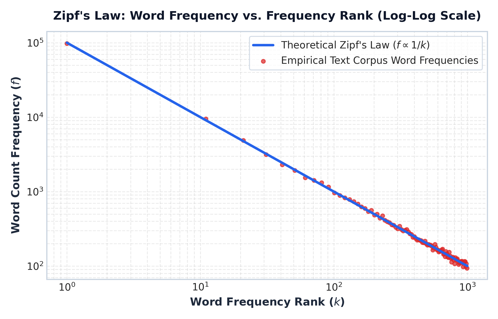

# Module 01: NLP Fundamentals & Enterprise Text Pipelines

This study guide covers the core principles of Natural Language Processing (NLP), the end-to-end enterprise NLP pipeline, evolution of NLP paradigms, core task taxonomy, Zipf's Law intuition, Type-Token Ratio (TTR), production Python text cleaning code, complexity analysis, and standardized interview Q&A.

> **Notebook Companion**: [01_nlp_fundamentals_and_text_pipelines.ipynb](file:///d:/Study/Prep/machine-learning-prep/nlp/01_nlp_fundamentals_and_text_pipelines.ipynb)

---

## 1. What is Natural Language Processing (NLP)?

Natural Language Processing (NLP) is a branch of Artificial Intelligence (AI) and Computational Linguistics that enables computers to understand, interpret, represent, manipulate, and generate human natural language text and speech.

Unlike tabular or structured data (which consists of continuous numerical features or categorical codes in fixed Euclidean dimensions), natural language text possesses distinct characteristics:
1. **Unstructured & Discrete**: Text consists of variable-length discrete symbols (words/subwords) requiring vector space projection $\mathbb{R}^d$.
2. **High-Cardinality & Sparse**: Vocabularies contain hundreds of thousands of words ($|V| \ge 100,000$).
3. **Context-Dependent & Ambiguous**: Token meaning depends on surrounding sequence context (e.g., *"bank"* in *"river bank"* vs. *"investment bank"*).

> **Pipeline Flow**: `Raw Unstructured Text` $\longrightarrow$ `Preprocessing & Normalization` $\longrightarrow$ `Vector Space Projection (R^d)` $\longrightarrow$ `Model Inference`

---

## 2. The End-to-End Enterprise NLP Pipeline

In production software systems, raw text passes through a deterministic multi-stage pipeline:

| Stage | Pipeline Operation | Technical Details |
|---|---|---|
| **1. Data Ingestion & Parsing** | Extraction | Parse raw text from PDFs, HTML pages, SQL DBs, OCR streams, Kafka logs. |
| **2. Text Cleaning & Normalization** | Standardization | Unicode NFKD normalization, lowercasing, HTML tag stripping, regex noise removal. |
| **3. Tokenization & Vocab Mapping** | Segmentation | Convert raw character stream into token IDs (Word, Subword: BPE/WordPiece). |
| **4. Feature Representation** | Vector Projection | Map token IDs to numerical vectors $\mathbb{R}^d$ (Sparse: TF-IDF; Dense: Word2Vec / BERT). |
| **5. Model Inference & Serving** | Execution | Pass embeddings to Linear Classifier, Sequence Model (LSTM), or Transformer LLM. |

---

## 3. Evolution of NLP Paradigms

| Dimension | Rule-Based NLP | Statistical ML NLP | Deep Learning NLP | Modern Transformer LLM |
|---|---|---|---|---|
| **Era** | 1960s – 1990s | 1990s – 2010s | 2014 – 2019 | 2019 – Present |
| **Primary Tech** | Regex, Grammar Rules | TF-IDF, Naive Bayes, SVM | RNN, LSTM, GRU, GloVe | BERT, GPT-4, Llama 3 |
| **Feature Matrix** | Hand-crafted rules | Bag-of-Words / N-Grams | Dense Static Vectors (Word2Vec) | Learned Contextual Self-Attention |
| **Context Horizon** | Rule clause bounded | Unigram / Bigram window | Sequential hidden state | Global Context (128k+ tokens) |
| **OOV Handling** | Fails on missing rules | Mapped to `<UNK>` token | Character / Subword | Subword Tokenization (0% OOV) |
| **Inference Latency** | Ultra-fast ($<1\text{ms}$) | Ultra-fast ($<2\text{ms}$) | Moderate ($10\text{ms} - 50\text{ms}$) | Heavy ($100\text{ms} - 1000\text{ms}+$) |

---

## 4. Core NLP Task Taxonomy

Enterprise NLP tasks are broadly categorized into four families:
1. **Text Classification**: Maps input text $X$ to discrete class $y \in \{1, \dots, C\}$ (e.g., Support Ticket Routing, Spam Detection).
2. **Named Entity Recognition (NER)**: Assigns token-level tags $y_1, \dots, y_T$ identifying entities (Person, Location, Org, Date).
3. **Sequence-to-Sequence & Translation**: Maps sequence $X_{1:T}$ in language A to sequence $Y_{1:S}$ in language B.
4. **Information Retrieval & RAG**: Retrieves relevant context passages and synthesizes grounded answers.

---

## 5. Zipf's Law & Vocabulary Explosion Intuition

Language vocabularies follow **Zipf's Law**: the frequency of any word is inversely proportional to its rank $k$ in the frequency table:

$$f(k) \propto \frac{1}{k}$$

A small fraction of common words account for $>80\%$ of text occurrences, while a massive "long tail" of rare words causes vocabulary explosion if words are treated as atomic units.



> **Plot Interpretation & Production Insight**:
> - **Log-Log Linear Relationship**: On a log-log scale, Zipf's law forms a straight line with slope $\approx -1.0$.
> - **The "Long Tail" Problem**: Failing to manage the long tail of rare words ($k > 1,000$) causes high Out-Of-Vocabulary (OOV) rates. Subword tokenization (BPE) handles this long tail without OOV errors.

---

## 6. Concept & Definition: Type-Token Ratio (TTR)

The **Type-Token Ratio (TTR)** measures lexical diversity in a text corpus:

$$\text{TTR} = \frac{|V|}{N_{\text{total}}}$$

Where:
- $|V|$ is the number of unique types (vocabulary size).
- $N_{\text{total}}$ is the total count of tokens in the corpus.

- **High TTR ($\approx 1.0$)**: High lexical richness (every word is unique).
- **Low TTR ($\approx 0.1$)**: Highly repetitive text (e.g., system logs repeating generic status codes).

---

## 7. Production Python Text Preprocessing Code

```python
import re
import unicodedata

class EnterpriseTextCleaner:
    """Production-grade deterministic text cleaning pipeline."""
    
    def __init__(self, lower: bool = True, strip_html: bool = True):
        self.lower = lower
        self.strip_html = strip_html
        self.html_regex = re.compile(r'<[^>]+>')
        self.whitespace_regex = re.compile(r'\s+')
        
    def clean(self, text: str) -> str:
        if not text:
            return ""
        # 1. Unicode NFKD normalization
        text = unicodedata.normalize("NFKD", text).encode("ASCII", "ignore").decode("utf-8")
        # 2. Strip HTML tags
        if self.strip_html:
            text = self.html_regex.sub(" ", text)
        # 3. Lowercasing
        if self.lower:
            text = text.lower()
        # 4. Collapse extra whitespace
        return self.whitespace_regex.sub(" ", text).strip()

cleaner = EnterpriseTextCleaner()
raw_sample = "  <p>ALERT: System <b>Server_01</b> error at 10:45&nbsp;AM! Connection refused. </p>  "
print("Cleaned Output:", repr(cleaner.clean(raw_sample)))
```

> [!NOTE]
> **Production Optimization Alert:**
> Compiling regular expressions (`re.compile`) at initialization avoids $100\text{x}$ regex recompilation overhead during high-throughput stream processing.

---

## 8. Interview Questions & Production Trade-offs

### What problem does text preprocessing solve?
Raw human text contains unstructured noise (HTML tags, non-standard unicode characters, irregular whitespace) and casing inconsistencies that inflate vocabulary size $|V|$ unnecessarily. Deterministic preprocessing normalizes text into a clean token stream.

### Why was it introduced?
Early NLP models suffered from extreme sparsity and out-of-vocabulary failures. Standardizing text representations improves model generalization across different data sources.

### What are its limitations?
Over-cleaning can destroy critical signals. Removing casing ruins Named Entity Recognition (e.g., converting country `"US"` to pronoun `"us"`), while removing punctuation destroys sentence boundaries.

### Computational Complexity:
- **Preprocessing Time Complexity**: $O(N)$ linear time where $N$ is text string character length.
- **Memory Complexity**: $O(N)$ temporary memory allocation.

### Production Use Cases:
- Web scraping text extraction (stripping HTML).
- Log parsing and incident ticket classification pipelines.
- Standardizing prompt inputs for LLM RAG pipelines.

### Follow-up Interview Questions:
1. *When should lowercasing NOT be applied?* (Answer: For NER, Part-of-Speech tagging, and models relying on capitalization to detect proper nouns).
2. *How do you prevent Regex catastrophic backtracking in user input cleaning?* (Answer: Avoid nested quantifiers like `(a+)+` and enforce regex timeouts).
