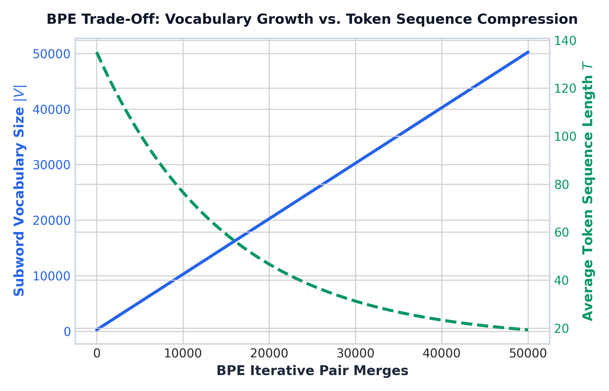

# Module 02: Text Preprocessing, Stemming vs. Lemmatization & Modern Tokenization Paradigms

This study guide covers Unicode normalization, stemming vs. lemmatization, modern subword tokenization paradigms (BPE, WordPiece, Unigram), a 3-step BPE hand calculation walkthrough, subword trade-off plots, production Python tokenization code, complexity analysis, and standardized interview Q&A.

> **Notebook Companion**: [02_text_preprocessing_and_tokenization.ipynb](file:///d:/Study/Prep/machine-learning-prep/nlp/02_text_preprocessing_and_tokenization.ipynb)

---

## 1. Cleaning & Unicode Normalization (NFKC / NFKD)

Text collected from web APIs or PDF logs often contains incompatible Unicode variants. Unicode normalization standardizes equivalent representations:
- **NFKD (Compatibility Decomposition)**: Separates characters into base glyphs + diacritics and converts compatibility characters (e.g., `fi` $\rightarrow$ `fi`).
- **NFKC (Compatibility Composition)**: Decomposes compatibility characters and re-composes into standard canonical forms.

---

## 2. Stemming vs. Lemmatization

| Dimension | Stemming (Porter / Snowball) | Lemmatization (WordNet / spaCy) |
|---|---|---|
| **Mechanism** | Heuristic rule-based suffix chopping | Morphological vocabulary & POS lookup |
| **Context Sensitivity** | Context-agnostic (chops suffixes blindly) | Uses Part-of-Speech (POS) context |
| **Output Form** | Often invalid words (`"comput"`, `"organi"`) | Valid dictionary canonical lemma (`"compute"`) |
| **Computational Cost** | Extremely fast ($O(N)$ regex chops) | Slower ($O(N)$ POS tagging & lexicon lookup) |
| **Production Role** | Legacy IR / Keyword search engines | Advanced Sentiment & NLP feature extraction |

---

## 3. Modern Subword Tokenization Paradigms

Subword tokenization bridges the gap between **Word-Level** (suffers from high OOV and massive $|V|$) and **Character-Level** (suffers from long sequence length $T$ and weak semantic density).

| Algorithm | Used In | Vocabulary Building Strategy |
|---|---|---|
| **Byte Pair Encoding** | GPT-2, GPT-4, Llama 3 | Bottom-up: Merges most frequent adjacent symbol pair iteratively. |
| **WordPiece** | BERT, DistilBERT | Bottom-up: Merges symbol pair maximizing likelihood score gain. |
| **Unigram LM** | T5, SentencePiece | Top-down: Starts with huge candidate set, prunes least loss-reducing subwords. |

---

## 4. Step-by-Step BPE Hand Calculation Example

Suppose we have a tiny corpus with target word frequencies:
- `"cost"`: 4 occurrences
- `"costs"`: 2 occurrences
- `"costing"`: 3 occurrences

### Initial Base Character State (Add End-Of-Word `</w>` token):
Corpus dictionary initialized at character level:
1. `'c o s t </w>'` (count: 4)
2. `'c o s t s </w>'` (count: 2)
3. `'c o s t i n g </w>'` (count: 3)

Base Vocabulary $V_0 = \{'c', 'o', 's', 't', 'i', 'n', 'g', 's', '</w>'\}$

### Iteration 1: Count Adjacent Symbol Pairs
- `('c', 'o')`: $4 + 2 + 3 = 9$
- `('o', 's')`: $4 + 2 + 3 = 9$
- `('s', 't')`: $4 + 2 + 3 = 9$

Most frequent pair = `('c', 'o')` (frequency: 9).
- **Action**: Merge `('c', 'o')` $\rightarrow$ `'co'`.
- **New Vocab**: $V_1 = V_0 \cup \{'co'\}$

### Iteration 2: Count New Pairs
- `('co', 's')`: 9 occurrences.
- **Action**: Merge `('co', 's')` $\rightarrow$ `'cos'`.
- **New Vocab**: $V_2 = V_1 \cup \{'cos'\}$

### Iteration 3: Count Next Pair
- `('cos', 't')`: 9 occurrences.
- **Action**: Merge `('cos', 't')` $\rightarrow$ `'cost'`.
- **New Vocab**: $V_3 = V_2 \cup \{'cost'\}$

> **Resulting Token Representation**: `"costing"` is tokenized as `['cost', 'i', 'n', 'g', '</w>']`.

---

## 5. BPE Vocabulary Growth & Sequence Compression



> **Plot Interpretation & Production Insight**:
> - **The Compression Trade-Off**: As iterative subword pair merges increase, vocabulary size $|V|$ grows linearly (blue solid curve), while average token sequence length $T$ shrinks exponentially (green dashed curve).
> - **Production Choice**: LLMs set $|V| \approx 32,000 - 100,000$ to achieve $4\text{x}$ sequence compression over characters while maintaining finite embedding memory footprint.

---

## 6. Production Python Subword Tokenization Code

```python
import tiktoken

# Demonstrate OpenAI cl100k_base BPE Tokenizer (GPT-4 / text-embedding-3)
enc = tiktoken.get_encoding("cl100k_base")

text_sample = "Unstructured enterprise database log: postgresql_replica_timeout"
tokens = enc.encode(text_sample)
decoded_subwords = [enc.decode([t]) for t in tokens]

print("Raw Input Text:", text_sample)
print("Token IDs:", tokens)
print("Decoded Subwords:", decoded_subwords)
```

---

## 7. Interview Questions & Production Trade-offs

### What problem does subword tokenization solve?
Word-level tokenization produces massive vocabularies ($|V| > 500,000$) with frequent Out-Of-Vocabulary (`<UNK>`) errors on rare/unseen words. Character-level tokenization eliminates `<UNK>` but expands sequence lengths $T$ by $5\text{x}$, destroying Transformer attention efficiency ($O(T^2)$). Subword tokenization balances $|V|$ and $T$.

### Why was it introduced over word/character tokenization?
BPE allows open-vocabulary processing where subwords adaptively decompose unknown complex words into known root stems (e.g., `"microservices"` $\rightarrow$ `["micro", "service", "s"]`).

### What are its limitations?
- Sensitive to spacing, casing, and trailing whitespace.
- Poor performance on numerical digits and arithmetic unless specialized byte-level fallbacks (BBPE) are implemented.

### Detailed Computational Complexity (Time & Memory)
- **Word-Level Tokenization Time**: $O(L)$
- **Byte Pair Encoding (BPE) Training Time**: $O(K \cdot N \cdot L)$
- **BPE Inference Tokenization Time**: $O(L \log |V|)$
- **Memory Footprint Complexity**: $O(|V| + S)$ RAM
- **Component Denotations**:
  - $N$: Total number of documents in the corpus.
  - $L$: Token length of the input document/sequence.
  - $|V|$: Final target subword vocabulary size.
  - $K$: Total number of merge iterations during training.
  - $S$: Total number of learned subword merge rules.

### Production Use Cases:
- Tokenizer engine for all modern LLM families (GPT-4, Llama 3, Claude 3, Mistral).
- Cross-lingual models (handling mixed English and code snippets).

### Follow-up Interview Questions:
1. *Why does GPT-4 use Byte-Level BPE (BBPE)?* (Answer: BBPE treats raw text as a sequence of UTF-8 bytes, enabling 100% coverage of any unicode character or emoji without needing `<UNK>`).
2. *How does tokenization impact LLM pricing?* (Answer: LLM APIs charge per token. Higher compression tokenizers lower cost per document page).
