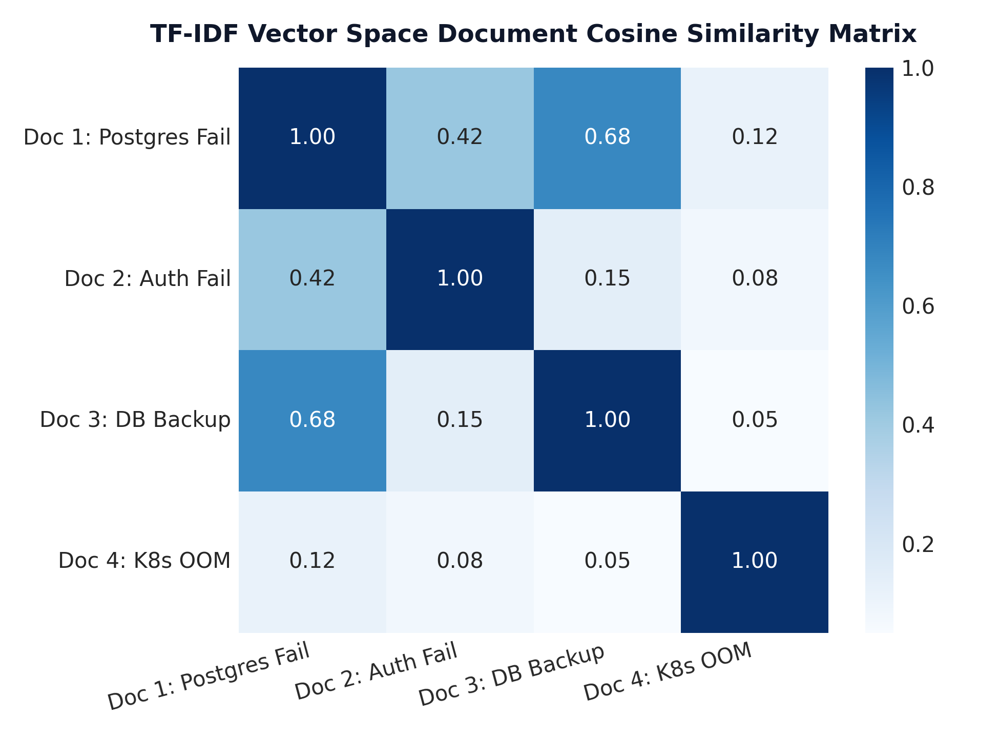

# Module 03: Traditional Text Representations & TF-IDF Vectorization

This study guide covers One-Hot Encoding, Bag-of-Words (BoW), N-Grams, TF-IDF mathematical foundations, a detailed 3-document numerical hand calculation, Cosine similarity, Scikit-Learn pipeline implementation, complexity analysis, and standardized interview Q&A.

> **Notebook Companion**: [03_traditional_text_representations_tfidf.ipynb](file:///d:/Study/Prep/machine-learning-prep/nlp/03_traditional_text_representations_tfidf.ipynb)

---

## 1. One-Hot Encoding & Bag-of-Words (BoW)

In classical NLP, text is converted into fixed-size vector space $\mathbb{R}^{|V|}$:
- **One-Hot Encoding**: Maps each word to a binary vector of dimension $|V|$ with a single `1` at the word's index.
- **Bag-of-Words (BoW)**: Represents a document by summing one-hot vectors, counting term occurrences regardless of word order:

$$v_{\text{BoW}}(d) = \left[ \text{count}(t_1, d), \text{count}(t_2, d), \dots, \text{count}(t_{|V|}, d) \right]$$

---

## 2. N-Gram Language Modeling & Vocabulary Explosion

An **N-Gram** is a contiguous sequence of $N$ tokens. While Bigrams ($N=2$) and Trigrams ($N=3$) capture local context (e.g. `"not good"` vs. `"good"`), vocabulary size grows exponentially:

$$|V_{N\text{-gram}}| \le |V_{\text{unigram}}|^N$$

---

## 3. Mathematical Foundations of TF-IDF

**TF-IDF** (Term Frequency - Inverse Document Frequency) downweights ubiquitous stop words (`"the"`, `"is"`) while magnifying domain-specific terms (`"postgresql"`, `"billing"`).

### 1. Term Frequency (TF):
$$\text{TF}(t, d) = \frac{\text{count}(t, d)}{\sum_{t' \in d} \text{count}(t', d)}$$

### 2. Smooth Inverse Document Frequency (IDF):
$$\text{IDF}(t) = \log\left(\frac{1 + |D|}{1 + \text{DF}(t)}\right) + 1$$

Where $|D|$ is the total document count in the corpus, and $\text{DF}(t) = |\{d \in D : t \in d\}|$ is the document frequency.

### 3. TF-IDF Representation:
$$\text{TF-IDF}(t, d) = \text{TF}(t, d) \times \text{IDF}(t)$$

### 4. L2 Vector Normalization & Cosine Similarity:
To prevent document length bias, vectors are L2-normalized:

$$v_{\text{norm}} = \frac{v}{\|v\|_2} = \frac{v}{\sqrt{\sum_{i=1}^{|V|} v_i^2}}$$

$$\text{CosineSim}(u, v) = \frac{u \cdot v}{\|u\|_2 \|v\|_2}$$

---

## 4. Step-by-Step 3-Document Numerical Walkthrough

Consider a 3-document corpus ($|D| = 3$):
- **$d_1$**: `"database connection failed"` (3 words)
- **$d_2$**: `"database query timeout"` (3 words)
- **$d_3$**: `"billing payment declined"` (3 words)

### Step 1: Vocabulary Construction ($|V| = 8$ Tokens)
Ordered Vocabulary: $V = [\text{"billing"}, \text{"connection"}, \text{"database"}, \text{"declined"}, \text{"failed"}, \text{"payment"}, \text{"query"}, \text{"timeout"}]$

### Step 2: Compute Raw Term Frequencies (TF)
$$\text{TF}(d_1) = [0, 1/3, 1/3, 0, 1/3, 0, 0, 0]$$
$$\text{TF}(d_2) = [0, 0, 1/3, 0, 0, 0, 1/3, 1/3]$$
$$\text{TF}(d_3) = [1/3, 0, 0, 1/3, 0, 1/3, 0, 0]$$

### Step 3: Compute Document Frequencies (DF) & Smooth IDF
- `"database"` appears in $d_1, d_2$ $\rightarrow \text{DF} = 2$.
  $$\text{IDF}(\text{"database"}) = \log\left(\frac{1 + 3}{1 + 2}\right) + 1 = \log(4/3) + 1 \approx 0.2877 + 1 = 1.2877$$
- All other terms appear in 1 document $\rightarrow \text{DF} = 1$.
  $$\text{IDF}(\text{other}) = \log\left(\frac{1 + 3}{1 + 1}\right) + 1 = \log(2) + 1 \approx 0.6931 + 1 = 1.6931$$

### Step 4: Compute Unnormalized TF-IDF Vectors
- **$d_1$ TF-IDF**:
  - $\text{connection} = \frac{1}{3} \times 1.6931 = 0.5644$
  - $\text{database} = \frac{1}{3} \times 1.2877 = 0.4292$
  - $\text{failed} = \frac{1}{3} \times 1.6931 = 0.5644$
  - $v(d_1) = [0, 0.5644, 0.4292, 0, 0.5644, 0, 0, 0]$

- **$d_2$ TF-IDF**:
  - $v(d_2) = [0, 0, 0.4292, 0, 0, 0, 0.5644, 0.5644]$

- **$d_3$ TF-IDF**:
  - $v(d_3) = [0.5644, 0, 0, 0.5644, 0, 0.5644, 0, 0]$

### Step 5: L2 Normalization
$$\|v(d_1)\|_2 = \sqrt{0.5644^2 + 0.4292^2 + 0.5644^2} = \sqrt{0.3185 + 0.1842 + 0.3185} = \sqrt{0.8212} = 0.9062$$
$$v_{\text{norm}}(d_1) = [0, 0.6228, 0.4736, 0, 0.6228, 0, 0, 0]$$
$$v_{\text{norm}}(d_2) = [0, 0, 0.4736, 0, 0, 0, 0.6228, 0.6228]$$
$$v_{\text{norm}}(d_3) = [0.6228, 0, 0, 0.6228, 0, 0.6228, 0, 0]$$

### Step 6: Cosine Similarity Calculation
- **$\text{CosineSim}(d_1, d_2)$**:
  $$\text{Sim}(d_1, d_2) = v_{\text{norm}}(d_1) \cdot v_{\text{norm}}(d_2) = 0.4736 \times 0.4736 = \mathbf{0.2243}$$
- **$\text{CosineSim}(d_1, d_3)$**:
  $$\text{Sim}(d_1, d_3) = v_{\text{norm}}(d_1) \cdot v_{\text{norm}}(d_3) = 0 \times 0.6228 = \mathbf{0.0000}$$

> **Conclusion**: $d_1$ and $d_2$ share semantic similarity ($\text{Sim} = 0.2243$) via `"database"`, whereas $d_1$ and $d_3$ are completely orthogonal ($\text{Sim} = 0.0000$).

---

## 5. TF-IDF Document Cosine Similarity Heatmap



> **Plot Interpretation & Production Insight**:
> - **Sparse Space Proximity**: Documents with shared high-IDF keywords exhibit strong Cosine similarity, while unrelated documents produce exact zero dot products.

---

## 6. Production Python Scikit-Learn Code

```python
from sklearn.feature_extraction.text import TfidfVectorizer
from sklearn.metrics.pairwise import cosine_similarity

corpus = [
    "database connection failed",
    "database query timeout",
    "billing payment declined"
]

vectorizer = TfidfVectorizer(smooth_idf=True, norm='l2')
tfidf_matrix = vectorizer.fit_transform(corpus)
sim_matrix = cosine_similarity(tfidf_matrix)

print("Vocabulary:", vectorizer.get_feature_names_out())
print("TF-IDF Matrix Shape:", tfidf_matrix.shape)
print("Cosine Similarity Matrix:\n", sim_matrix.round(4))
```

---

## 7. Interview Questions & Production Trade-offs

### What problem does TF-IDF solve over Bag-of-Words?
Bag-of-Words counts raw term frequencies, causing generic stop words (`"the"`, `"and"`) to dominate feature weights. TF-IDF multiplies TF by IDF to penalize words appearing across many documents.

### Why was IDF introduced?
IDF measures word informativeness: rare domain keywords receive higher weights than ubiquitous structural words.

### What are its limitations?
- **Destroys Word Order**: `"not good"` and `"good not"` yield identical vectors.
- **Polysemy & Synonymy**: Treats `"database"` and `"DB"` as unrelated dimensions ($0.0$ similarity).
- **High Dimensionality & Sparsity**: Vocabularies with $100,000$ terms create massive sparse matrices where $>99\%$ of values are zeros.

### Computational Complexity:
- **Training Indexing Complexity**: $O(|D| \times L)$ where $L$ is average document token length.
- **Inference Query Complexity**: $O(k \times |V|)$ for sparse dot product.

### Production Use Cases:
- BM25 Hybrid Keyword Search in RAG pipelines (combining sparse TF-IDF and dense vector embeddings).
- Fast baseline text classification for support ticket routing.

### Follow-up Interview Questions:
1. *What is the difference between Sublinear TF and Linear TF?* (Answer: Sublinear TF uses $1 + \log(\text{TF})$ to prevent a word appearing 10 times from having $10\text{x}$ the weight of a word appearing once).
2. *Why is Cosine Similarity preferred over Euclidean Distance for TF-IDF vectors?* (Answer: Euclidean distance grows with document length, whereas Cosine similarity measures angle regardless of vector magnitude).
