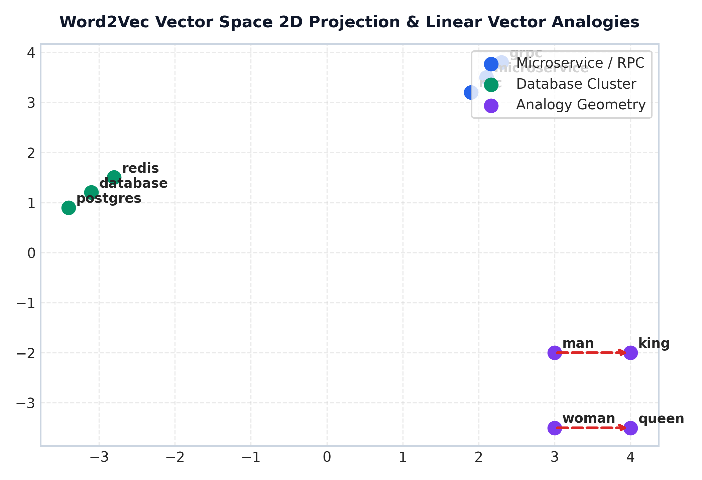

# Module 04: Word Embeddings (Word2Vec, GloVe, FastText & Vector Space Geometry)

This study guide covers static dense embeddings, Word2Vec architectures (CBOW vs. Skip-Gram), a step-by-step Skip-Gram intuition walkthrough, FastText subword n-grams, GloVe co-occurrence intuition, t-SNE vector geometry plots, Gensim code, complexity analysis, and standardized interview Q&A.

> **Notebook Companion**: [04_word_embeddings_word2vec_glove.ipynb](file:///d:/Study/Prep/machine-learning-prep/nlp/04_word_embeddings_word2vec_glove.ipynb)

---

## 1. Limitations of Sparse Representations

Sparse models (One-Hot, TF-IDF) suffer from two core limitations:
1. **Orthogonality & Zero Similarity**: $\text{CosineSim}(\text{"database"}, \text{"postgres"}) = 0.0$ despite high semantic equivalence.
2. **Curse of Dimensionality**: Vector length equals vocabulary size ($|V| \ge 100,000$).

Dense embeddings project words into a continuous lower-dimensional space $\mathbb{R}^d$ ($d \approx 100 - 300$), capturing distributional semantics (*"words that occur in similar contexts tend to have similar meanings"*).

---

## 2. Word2Vec Architectures: CBOW vs. Skip-Gram

| Dimension | Continuous Bag-of-Words (CBOW) | Skip-Gram |
|---|---|---|
| **Task Objective** | Predict target word $w_t$ given context | Predict context words $w_{t+k}$ given target $w_t$ |
| **Training Speed** | Faster ($O(d)$ per window update) | Slower ($O(m \cdot d)$ per window update) |
| **Infrequent Words** | Averages context; weaker on rare words | Produces high-quality vectors for rare words |
| **Best Use Case** | Large corpora, fast baseline training | Smaller datasets, rich semantic queries |

---

## 3. Word2Vec Skip-Gram Intuition & Training Step Walkthrough

### 1. Context Window Sliding:
For sentence `"microservice communicates via grpc protocol"` with center word $w_I = \text{"communicates"}$ and context window radius $m=1$:
- Target Center Word ($w_I$): `"communicates"`
- Context Words ($w_O$): `"microservice"`, `"via"`

### 2. Input Embedding Lookup:
Each word in $V$ has an **Input Vector Matrix** $W \in \mathbb{R}^{|V| \times d}$ and an **Output Vector Matrix** $W' \in \mathbb{R}^{|V| \times d}$.
Lookup extracts input vector $v_{w_I} = W[w_I, :] \in \mathbb{R}^d$.

### 3. Dot Product & Logit Computation:
The raw dot product measures vector alignment between center word $v_{w_I}$ and context candidate $v'_{w_O}$:

$$z = {v'_{w_O}}^\top v_{w_I}$$

### 4. Sigmoid Probability Output:
Applying sigmoid yields prediction probability $\hat{y} \in (0, 1)$:

$$\hat{y} = \sigma(z) = \frac{1}{1 + \exp(-z)}$$

### 5. Why Negative Sampling Helps (Intuition):
Full Softmax requires summing $\sum_{w=1}^{|V|} \exp({v'_w}^\top v_{w_I})$ over all $|V| \ge 100,000$ words ($O(|V| \cdot d)$ complexity).
**Negative Sampling** converts full Softmax into $K + 1$ binary logistic classifications:
- Predict `1` for the true positive context pair $(w_I, w_O)$.
- Predict `0` for $K$ ($K \approx 5 - 20$) randomly drawn noise words $(w_I, w_k) \sim P_n(w)$.
Complexity drops from $O(|V| \cdot d) \rightarrow O(K \cdot d)$, accelerating training by $1,000\text{x}$.

### 6. One Weight Update Intuition:
If prediction $\hat{y} = 0.70$ for positive pair, prediction error is $e = (1.0 - 0.70) = 0.30$.
- **Gradient Update**: Input vector $v_{w_I}$ shifts in direction of output vector $v'_{w_O}$:
  $$\Delta v_{w_I} = \eta \cdot (1 - \hat{y}) \cdot v'_{w_O}$$
Positive context words pull center vectors closer, while negative noise words push them apart.

---

## 4. Optional Topic: FastText (Subword Character N-Grams)

FastText represents each word as a bag of character n-grams bounded by `<` and `>`.
For word `"where"` with $n=3$:
- Character n-grams: `<wh`, `whe`, `her`, `ere`, `re>`
- Word vector: Sum of character n-gram vectors:
  $$v_{\text{"where"}} = v_{\text{<wh}} + v_{\text{whe}} + v_{\text{her}} + v_{\text{ere}} + v_{\text{re>}} + v_{\text{<where>}}$$

> **Key Advantage**: Handles Out-Of-Vocabulary (OOV) words by summing vectors of constituent character n-grams.

---

## 5. Optional Topic: GloVe (Global Vectors Co-Occurrence Objective)

GloVe combines global matrix factorization with local context windowing. It operates directly on global co-occurrence matrix $X_{ij}$:

$$\mathcal{L}_{\text{GloVe}} = \sum_{i,j=1}^{|V|} f(X_{ij}) \left( w_i^\top \tilde{w}_j + b_i + \tilde{b}_j - \log X_{ij} \right)^2$$

Where $f(X_{ij}) = \left(\frac{X_{ij}}{x_{\max}}\right)^\alpha$ caps the weighting of highly frequent stop word co-occurrences.

---

## 6. Word2Vec 2D t-SNE Projection & Vector Analogies



> **Plot Interpretation & Production Insight**:
> - **Dense Semantic Clustering**: Contextually similar words form tight clusters in vector space.
> - **Linear Vector Analogies**: Geometric offsets represent semantic relationships: $v_{\text{king}} - v_{\text{man}} + v_{\text{woman}} \approx v_{\text{queen}}$.

---

## 7. Production Gensim Word2Vec Python Code

```python
from gensim.models import Word2Vec

corpus = [
    ["microservice", "communicates", "via", "grpc", "protocol"],
    ["database", "failover", "replica", "executed", "automatically"],
    ["grpc", "protocol", "ensures", "low", "latency", "rpc"],
    ["kubernetes", "deploys", "microservice", "container", "pods"]
]

model = Word2Vec(
    sentences=corpus,
    vector_size=50,
    window=2,
    min_count=1,
    sg=1,         # Skip-Gram
    negative=5,
    epochs=100
)

sim = model.wv.similarity("microservice", "grpc")
print("Similarity ('microservice', 'grpc'):", round(sim, 4))
```

---

## 8. Interview Questions & Production Trade-offs

### What problem do dense word embeddings solve over sparse TF-IDF?
Dense embeddings project discrete tokens into continuous $\mathbb{R}^d$ space, resolving orthogonality and capturing semantic similarity ($\text{Sim} > 0.70$ for synonyms).

### Why was Negative Sampling introduced?
Standard Skip-Gram Softmax requires computing partition function $\sum_{w=1}^{|V|} \exp(v'_w^\top v_{w_I})$ over all $|V|$ words. Negative Sampling approximates this with $K+1$ binary logistic classifications, reducing time complexity from $O(|V|)$ to $O(K)$.

### What are the primary limitations of Word2Vec?
- **Static Embeddings**: Assigns a single static vector per word, failing to handle polysemy (e.g. `"bank"` in river bank vs. investment bank gets identical vector).
- **Context Window Limit**: Only captures local co-occurrences within radius $m$, ignoring global document context.

### Detailed Computational Complexity (Time & Memory)
- **Full Softmax Training Time**: $O(N \cdot m \cdot |V| \cdot d)$ per epoch
- **Skip-Gram Negative Sampling (SGNS) Training Time**: $O(N \cdot m \cdot (K + 1) \cdot d)$ per epoch
- **Inference Embedding Lookup Time**: $O(1)$ constant time
- **FastText OOV Inference Time**: $O(G \cdot d)$
- **Memory Footprint Complexity**: $O(|V| \cdot d)$ RAM
- **Component Denotations**:
  - $N$: Total number of tokens in the training corpus.
  - $m$: Context window size (number of sliding tokens on each side).
  - $|V|$: Size of the vocabulary.
  - $K$: Number of negative samples drawn per positive sample ($K = 5 - 20$).
  - $d$: Vector embedding dimension (typically $d = 300$).
  - $G$: Number of character n-grams generated for an Out-Of-Vocabulary (OOV) word.

### Production Use Cases:
- Pre-trained embedding lookup table for classification architectures.
- Semantic query expansion in vector search engines.

### Follow-up Interview Questions:
1. *How does FastText handle Out-Of-Vocabulary (OOV) terms during inference?* (Answer: It breaks the unseen OOV word into character n-grams, looks up their subword vectors, and averages them).
2. *What is the difference between Word2Vec and GloVe?* (Answer: Word2Vec trains online via local window SGD updates, whereas GloVe trains offline on global co-occurrence matrix log-counts).
