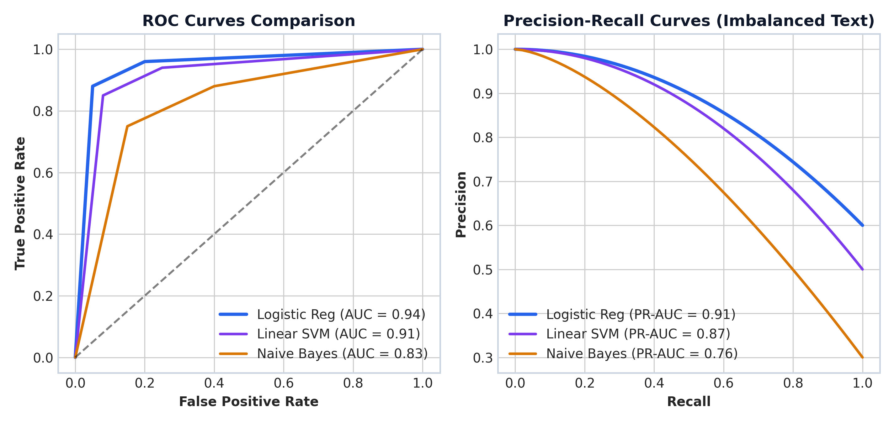

# Module 05: Classical NLP Models & Baseline Classifiers

This study guide covers Multinomial Naive Bayes, Laplace Add-1 smoothing, a step-by-step document classification numerical walkthrough, Logistic Regression, Linear SVM, Conditional Random Fields (CRF), ROC & Precision-Recall curves, Scikit-Learn pipeline code, complexity analysis, and standardized interview Q&A.

> **Notebook Companion**: [05_classical_nlp_models_and_baselines.ipynb](file:///d:/Study/Prep/machine-learning-prep/nlp/05_classical_nlp_models_and_baselines.ipynb)

---

## 1. Multinomial Naive Bayes & Laplace Add-1 Smoothing

Bayes' Theorem decomposes the posterior probability $P(c \mid d)$ of document $d = (w_1, w_2, \dots, w_T)$ belonging to class $c$:

$$P(c \mid d) = \frac{P(c) P(d \mid c)}{P(d)}$$

Applying the **Naive Independence Assumption** (features are conditionally independent given class $c$):

$$P(c \mid d) \propto P(c) \prod_{i=1}^T P(w_i \mid c)$$

### The Zero-Probability Problem & Laplace Add-1 Smoothing:
If a test document contains a word $w_{\text{new}}$ that never appeared in training class $c$, raw maximum likelihood yields $P(w_{\text{new}} \mid c) = 0$, causing the entire posterior product to collapse to zero: $\prod P(w_i \mid c) = 0$.

**Laplace Add-1 Smoothing** adds a pseudo-count of $1$ to every vocabulary word:

$$P(w_i \mid c) = \frac{N_{c,i} + 1}{N_c + |V|}$$

Where:
- $N_{c,i}$ is the count of word $w_i$ in training class $c$.
- $N_c$ is the total token count across all documents in class $c$.
- $|V|$ is the total unique vocabulary size.

---

## 2. Step-by-Step Document Classification Numerical Walkthrough

Suppose we have a binary classification task (**Spam** vs. **Ham**) with equal priors:
- $P(\text{Spam}) = 0.5$
- $P(\text{Ham}) = 0.5$

### Vocabulary & Training Token Counts ($|V| = 5$ Unique Words):
Vocabulary: $V = [\text{"password"}, \text{"reset"}, \text{"invoice"}, \text{"urgent"}, \text{"account"}]$

- **Spam Training Token Counts**:
  - `password`: 4, `reset`: 3, `urgent`: 3 ($N_{\text{Spam}} = 4 + 3 + 3 = 10$ total tokens)
- **Ham Training Token Counts**:
  - `invoice`: 5, `account`: 3, `reset`: 2 ($N_{\text{Ham}} = 5 + 3 + 2 = 10$ total tokens)

### Test Document: `"password reset"` (2 tokens)

### Step 1: Compute Laplace Smoothed Likelihoods ($|V| = 5$)
- **For Class Spam** ($N_{\text{Spam}} = 10, N_{\text{Spam}} + |V| = 15$):
  - $P(\text{"password"} \mid \text{Spam}) = \frac{4 + 1}{10 + 5} = \frac{5}{15} \approx 0.3333$
  - $P(\text{"reset"} \mid \text{Spam}) = \frac{3 + 1}{10 + 5} = \frac{4}{15} \approx 0.2667$

- **For Class Ham** ($N_{\text{Ham}} = 10, N_{\text{Ham}} + |V| = 15$):
  - $P(\text{"password"} \mid \text{Ham}) = \frac{0 + 1}{10 + 5} = \frac{1}{15} \approx 0.0667$  *(Notice: Laplace smoothing prevents zero probability!)*
  - $P(\text{"reset"} \mid \text{Ham}) = \frac{2 + 1}{10 + 5} = \frac{3}{15} \approx 0.2000$

### Step 2: Compute Unnormalized Posterior Probabilities
- $\text{Score}(\text{Spam}) = P(\text{Spam}) \times P(\text{"password"} \mid \text{Spam}) \times P(\text{"reset"} \mid \text{Spam})$
  $$\text{Score}(\text{Spam}) = 0.5 \times \frac{5}{15} \times \frac{4}{15} = \frac{20}{450} \approx \mathbf{0.0444}$$

- $\text{Score}(\text{Ham}) = P(\text{Ham}) \times P(\text{"password"} \mid \text{Ham}) \times P(\text{"reset"} \mid \text{Ham})$
  $$\text{Score}(\text{Ham}) = 0.5 \times \frac{1}{15} \times \frac{3}{15} = \frac{3}{450} \approx \mathbf{0.0067}$$

### Step 3: Argmax Decision & Normalized Posterior Probability
- **Argmax Decision**: $\text{Score}(\text{Spam}) = 0.0444 > \text{Score}(\text{Ham}) = 0.0067 \implies \mathbf{\text{Spam}}$
- **Normalized Confidence**:
  $$P(\text{Spam} \mid \text{"password reset"}) = \frac{20}{20 + 3} = \frac{20}{23} \approx \mathbf{86.96\%}$$

---

## 3. Linear Classifiers: Logistic Regression & Linear SVM

For high-dimensional sparse TF-IDF vectors, linear baselines offer strong execution performance:
- **Logistic Regression**: Minimizes Log Loss $\mathcal{L}_{\text{CE}} = -y \log \hat{y} - (1-y)\log(1-\hat{y})$, returning calibrated posterior probabilities.
- **Linear SVM (LinearSVC)**: Minimizes Hinge Loss $\mathcal{L}_{\text{Hinge}} = \max(0, 1 - y \cdot (w^\top x + b))$, maximizing boundary margin.

---

## 4. Classifier ROC & Precision-Recall Curves



> **Plot Interpretation & Production Insight**:
> - **Imbalanced Text Datasets**: On imbalanced corpora (e.g. 95% normal logs, 5% security incidents), Precision-Recall curves provide a more realistic assessment than ROC curves.

---

## 5. Production Python Scikit-Learn Pipeline Code

```python
from sklearn.feature_extraction.text import TfidfVectorizer
from sklearn.linear_model import LogisticRegression
from sklearn.pipeline import Pipeline

X_train = [
    "database connection timeout on port 5432 postgresql replica",
    "billing credit card payment authorization declined error",
    "SQL query execution failed due to lock contention",
    "monthly invoice statement shows unexpected overage charge"
]
y_train = ["Infrastructure", "Billing", "Infrastructure", "Billing"]

pipeline = Pipeline([
    ("tfidf", TfidfVectorizer(ngram_range=(1, 2))),
    ("clf", LogisticRegression(C=1.0))
])

pipeline.fit(X_train, y_train)

test_ticket = ["postgresql database primary server timeout failure"]
pred = pipeline.predict(test_ticket)[0]
proba = max(pipeline.predict_proba(test_ticket)[0])

print(f"Predicted Category: {pred} (Confidence: {proba*100:.1f}%)")
```

---

## 6. Interview Questions & Production Trade-offs

### What problem does Naive Bayes solve?
Provides an ultra-fast probabilistic baseline for text classification with $O(N)$ linear training time and minimal memory requirements.

### Why is Laplace Smoothing required?
Without smoothing, any unseen vocabulary term in a class yields a zero probability likelihood $P(w_{\text{new}} \mid c) = 0$, causing the entire posterior product to collapse to zero regardless of other strong evidence.

### What is the primary limitation of Naive Bayes?
The **Conditional Independence Assumption**: Naive Bayes assumes word occurrences are completely independent given the class label. In reality, text features are heavily correlated (e.g., `"credit"` and `"card"` co-occur together).

### Computational Complexity:
- **Training Time Complexity**: $O(|D| \times L)$ single-pass vocabulary accumulation.
- **Inference Time Complexity**: $O(C \times L)$ per text query where $C$ is class count and $L$ is token length.

### Production Use Cases:
- Real-time spam filtering and email routing engines.
- Initial baseline model in enterprise classification benchmark suites.

### Follow-up Interview Questions:
1. *Why do we compute Naive Bayes using Log-Probabilities $\sum \log P(w_i \mid c)$ in code?* (Answer: Multiplying hundreds of small floating point probabilities leads to numerical underflow. Summing log-probabilities maintains numerical stability).
2. *When should you prefer Logistic Regression over Naive Bayes?* (Answer: When text features have strong correlations or when calibrated probability scores are required for confidence thresholding).
