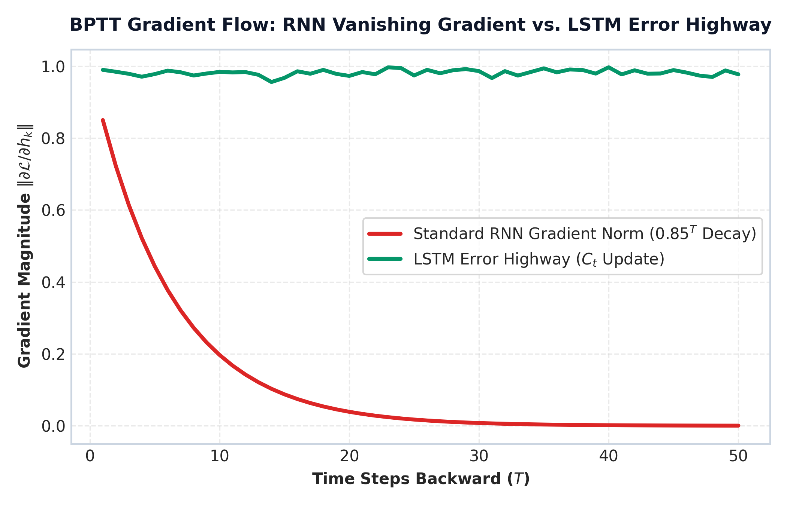

# Module 06: Sequence Models: RNN, LSTM, GRU & Seq2Seq

This study guide details Recurrent Neural Networks (RNN), Backpropagation Through Time (BPTT), Vanishing & Exploding Gradients, Long Short-Term Memory (LSTM) cell gating mechanics, Gated Recurrent Units (GRU), Sequence-to-Sequence (Seq2Seq) Encoder-Decoder architecture, step-by-step LSTM gate hand-calculations, PyTorch implementation, production bottlenecks, and interview flashcards.

> **Notebook Companion**: [06_sequence_models_rnn_lstm_gru.ipynb](file:///d:/Study/Prep/machine-learning-prep/nlp/06_sequence_models_rnn_lstm_gru.ipynb)

---

## 1. Why Sequence Order Matters

Unlike Bag-of-Words or TF-IDF models (which treat text as unordered frequency counts), natural language is fundamentally sequential:
- Changing token position flips semantic logic: `"dog bites man"` vs `"man bites dog"`.
- Negation positioning alters classification targets: `"service was good, not bad"` vs `"service was bad, not good"`.

Sequence models maintain an internal temporal hidden state $h_t$ that is recursively updated as each word vector $x_t$ is processed step-by-step.

---

## 2. Recurrent Neural Networks (RNN) Mechanics

An RNN processes input sequence $X = (x_1, x_2, \dots, x_T)$ step-by-step, maintaining recurrent hidden state $h_t \in \mathbb{R}^h$:

```text
       x_1               x_2               x_t               x_T
        │                 │                 │                 │
        ▼                 ▼                 ▼                 ▼
   ┌─────────┐  h_1  ┌─────────┐  h_2  ┌─────────┐  h_t  ┌─────────┐
──►│  RNN    │──────►│  RNN    │──────►│  RNN    │──────►│  RNN    │──► Output
   └─────────┘       └─────────┘       └─────────┘       └─────────┘
```

### 1. Mathematical Forward Pass:
$$h_t = \tanh(W_{hh} h_{t-1} + W_{xh} x_t + b_h)$$

$$\hat{y}_t = \text{softmax}(W_{hy} h_t + b_y)$$

Where:
- $W_{xh} \in \mathbb{R}^{h \times d}$ is the input-to-hidden weight matrix.
- $W_{hh} \in \mathbb{R}^{h \times h}$ is the recurrent hidden-to-hidden weight matrix (shared across all time steps).
- $W_{hy} \in \mathbb{R}^{C \times h}$ is the hidden-to-output weight matrix.

### 2. Vanishing & Exploding Gradient Problem
Training RNNs uses **Backpropagation Through Time (BPTT)**. Calculating the gradient of loss $\mathcal{L}_T$ at time $T$ with respect to hidden state $h_k$ at time step $k \ll T$ requires multiplying weight matrix $W_{hh}^\top$ repeatedly:

$$\frac{\partial \mathcal{L}_T}{\partial h_k} = \frac{\partial \mathcal{L}_T}{\partial h_T} \prod_{j=k+1}^T \frac{\partial h_j}{\partial h_{j-1}} = \frac{\partial \mathcal{L}_T}{\partial h_T} \prod_{j=k+1}^T W_{hh}^\top \text{diag}(1 - \tanh^2(\dots))$$

- **Vanishing Gradients**: If the largest eigenvalue of $W_{hh}$ is $< 1$, the gradient norm shrinks exponentially toward zero ($0.9^{100} \approx 0.000026$), causing the network to completely forget early tokens (inability to model long-range dependencies).
- **Exploding Gradients**: If the largest eigenvalue of $W_{hh}$ is $> 1$, the gradient norm grows exponentially toward infinity ($1.2^{100} \approx 82,817,974$), causing numerical instability (`NaN` loss values).
  - *Remediation for Exploding Gradients*: Apply **Gradient Clipping** ($\text{if } \|g\| > \tau \implies g \leftarrow \tau \frac{g}{\|g\|}$).

---

## 3. Long Short-Term Memory (LSTM) Architecture

Proposed by Hochreiter & Schmidhuber (1997), the **LSTM** solves vanishing gradients by introducing a dedicated **Cell State** $C_t$ (constant error carousel) regulated by three multiplicative gating mechanisms.

```text
┌────────────────────────────────────────────────────────────────────────────────────────┐
│                                 LSTM CELL ARCHITECTURE                                 │
│                                                                                        │
│   Cell State C_{t-1} ───────[ x ]──────────────────────(+)───────────────► Cell State C_t
│                              │                          ▲                              │
│                              │ (Forget Gate f_t)        │ (i_t * C~_t)                 │
│                              ▼                          │                              │
│   Hidden State h_{t-1} ──┬──►[ σ ] ──(f_t)              │                              │
│                          │                              │                              │
│   Input Vector x_t ──────┼──►[ σ ] ──(i_t) ───[ x ]─────┘                              │
│                          │                     ▲                                       │
│                          ├──►[tanh]──(C~_t)────┘                                       │
│                          │                                                             │
│                          └──►[ σ ] ──(o_t) ──────────────────────[ x ]──► Hidden h_t   │
│                                                                   ▲                    │
│                                                            tanh(C_t)                   │
└────────────────────────────────────────────────────────────────────────────────────────┘
```



> **Plot Interpretation & Production Insight**:
> - **Exponential Gradient Decay in RNNs**: In standard RNNs, backpropagating gradients over $T=50$ time steps causes gradient magnitude to decay exponentially to zero (red curve $0.85^T 
ightarrow 0$), preventing early sequence tokens from receiving weight updates.
> - **LSTM Constant Error Carousel**: The LSTM Cell State $C_t$ update ($C_t = f_t \odot C_{t-1} + i_t \odot 	ilde{C}_t$) acts as an additive linear highway (green curve), maintaining gradient norm $pprox 1.0$ across 50+ time steps.

### LSTM Mathematical Equations:

1. **Forget Gate $f_t$**: Decides what percentage of old cell memory $C_{t-1}$ to discard ($0 = \text{forget all}$, $1 = \text{keep all}$):

   $$f_t = \sigma(W_f [h_{t-1}, x_t] + b_f)$$

2. **Input Gate $i_t$ & Candidate Memory $\tilde{C}_t$**: Decides which new candidate values to store in cell state:

   $$i_t = \sigma(W_i [h_{t-1}, x_t] + b_i)$$

   $$\tilde{C}_t = \tanh(W_c [h_{t-1}, x_t] + b_c)$$

3. **Cell State Update $C_t$**: Additive linear highway (prevents vanishing gradients):

   $$C_t = f_t \odot C_{t-1} + i_t \odot \tilde{C}_t$$

4. **Output Gate $o_t$ & Hidden State Output $h_t$**: Filters updated cell state to produce final hidden state output:

   $$o_t = \sigma(W_o [h_{t-1}, x_t] + b_o)$$

   $$h_t = o_t \odot \tanh(C_t)$$

---

## 4. Gated Recurrent Unit (GRU)

Cho et al. (2014) proposed the **GRU**, a streamlined variant of LSTM that merges Cell State and Hidden State into a single vector $h_t$ using only 2 gates:

```text
Model Architecture  Gate Count  Vectors Maintained    Parameter Count  Computational Efficiency
------------------------------------------------------------------------------------------------
LSTM                3 Gates     Cell State C_t & h_t  4 * (h^2 + h*d)  Slower, high capacity
GRU                 2 Gates     Hidden State h_t only 3 * (h^2 + h*d)  Faster, ~25% fewer parameters
```

### GRU Mathematical Equations:
1. **Update Gate $z_t$**: Controls balance between previous hidden state $h_{t-1}$ and candidate state $\tilde{h}_t$:

   $$z_t = \sigma(W_z [h_{t-1}, x_t] + b_z)$$

2. **Reset Gate $r_t$**: Decides how much of previous memory $h_{t-1}$ to forget when computing candidate state:

   $$r_t = \sigma(W_r [h_{t-1}, x_t] + b_r)$$

3. **Candidate Hidden State $\tilde{h}_t$**:

   $$\tilde{h}_t = \tanh(W_h [r_t \odot h_{t-1}, x_t] + b_h)$$

4. **Hidden State Update $h_t$**:

   $$h_t = (1 - z_t) \odot h_{t-1} + z_t \odot \tilde{h}_t$$

---

## 5. Sequence-to-Sequence (Seq2Seq) Encoder-Decoder

Sutskever et al. (2014) introduced the **Seq2Seq Encoder-Decoder** framework for mapping variable-length input sequence $X_{1:T}$ to variable-length output sequence $Y_{1:S}$ (Machine Translation, Text Summarization).

```text
ENCODER                                     DECODER

 x_1 ──► [LSTM] ──► h_1                      [LSTM] ──► y_1
          │                                     ▲
 x_2 ──► [LSTM] ──► h_2                         │
          │                                  [LSTM] ──► y_2
 x_T ──► [LSTM] ──► h_T ──(Context Vector c)──► ▲
```

- **Encoder**: Processes input tokens $x_1, \dots, x_T$ sequentially, producing final hidden state $h_T$.
- **Information Bottleneck Defect**: $h_T$ serves as a single fixed-size context vector $c = h_T$ holding the entire semantic meaning of the sentence. For long sentences ($T > 30$), compressing all information into a single fixed vector causes dramatic recall degradation.

---

## 6. Step-by-Step LSTM Hand Calculation Example (Andrew Ng Style)

Suppose we have a single scalar feature $x_t = 1.0$ and previous scalar hidden state $h_{t-1} = 0.5$, previous scalar cell state $C_{t-1} = 2.0$.

Let scalar weights & biases be:
- Forget Gate: $W_f = 0.5, b_f = 0.0 \implies z_f = 0.5 \times (h_{t-1} + x_t) = 0.5 \times (0.5 + 1.0) = 0.75$
- Input Gate: $W_i = 0.8, b_i = 0.0 \implies z_i = 0.8 \times (0.5 + 1.0) = 1.20$
- Candidate Cell: $W_c = 0.6, b_c = 0.0 \implies z_c = 0.6 \times (0.5 + 1.0) = 0.90$
- Output Gate: $W_o = 0.4, b_o = 0.0 \implies z_o = 0.4 \times (0.5 + 1.0) = 0.60$

### 1. Compute Gate Activations:
- $f_t = \sigma(0.75) = \frac{1}{1 + \exp(-0.75)} \approx \mathbf{0.6792}$
- $i_t = \sigma(1.20) = \frac{1}{1 + \exp(-1.20)} \approx \mathbf{0.7685}$
- $\tilde{C}_t = \tanh(0.90) \approx \mathbf{0.7163}$
- $o_t = \sigma(0.60) = \frac{1}{1 + \exp(-0.60)} \approx \mathbf{0.6457}$

### 2. Compute Cell State Update $C_t$:
$$C_t = (f_t \times C_{t-1}) + (i_t \times \tilde{C}_t)$$

$$C_t = (0.6792 \times 2.0) + (0.7685 \times 0.7163) = 1.3584 + 0.5505 = \mathbf{1.9089}$$

### 3. Compute Hidden State Output $h_t$:
$$h_t = o_t \times \tanh(C_t) = 0.6457 \times \tanh(1.9089) = 0.6457 \times 0.9571 \approx \mathbf{0.6180}$$

$$\mathbf{C_t = 1.9089, \quad h_t = 0.6180}$$

---

## 7. Production PyTorch Implementation

```python
import torch
import torch.nn as nn

class LSTMTextClassifier(nn.Module):
    """Production PyTorch Bi-Directional LSTM Text Classifier."""
    
    def __init__(self, vocab_size: int, embed_dim: int, hidden_dim: int, num_classes: int):
        super().__init__()
        self.embedding = nn.Embedding(vocab_size, embed_dim, padding_idx=0)
        self.lstm = nn.LSTM(
            input_size=embed_dim,
            hidden_size=hidden_dim,
            num_layers=2,
            batch_first=True,
            bidirectional=True,
            dropout=0.2
        )
        self.fc = nn.Linear(hidden_dim * 2, num_classes)
        
    def forward(self, x: torch.Tensor) -> torch.Tensor:
        # x shape: [batch_size, seq_len]
        embedded = self.embedding(x) # [batch_size, seq_len, embed_dim]
        
        # lstm_out shape: [batch_size, seq_len, hidden_dim * 2]
        # h_n shape: [num_layers * 2, batch_size, hidden_dim]
        lstm_out, (h_n, c_n) = self.lstm(embedded)
        
        # Concatenate final forward and backward hidden states
        last_hidden = torch.cat((h_n[-2, :, :], h_n[-1, :, :]), dim=1) # [batch_size, hidden_dim * 2]
        logits = self.fc(last_hidden) # [batch_size, num_classes]
        return logits

# Demonstration Initialization
vocab_size = 5000
embed_dim = 128
hidden_dim = 64
num_classes = 3

model = LSTMTextClassifier(vocab_size, embed_dim, hidden_dim, num_classes)
dummy_input = torch.randint(low=1, high=1000, size=(4, 20)) # Batch=4, SeqLen=20
logits = model(dummy_input)

print("=== PyTorch Bi-LSTM Classifier Forward Pass ===")
print("Input Tensor Shape: ", dummy_input.shape)
print("Output Logits Shape:", logits.shape)
```

> [!NOTE]
> **Production Sequence Model Alert:**
> - `batch_first=True` ensures input tensors follow standard PyTorch convention `[batch_size, seq_len, embed_dim]`.
> - Bi-Directional LSTMs process sequences from left-to-right AND right-to-left, concatenating hidden states (`hidden_dim * 2`) to capture surrounding context on both sides of a word.

---

## 8. Production Failure Modes & Selection Rules

### Production Failure Modes:
1. **Sequential Latency Bottleneck ($O(T)$ Execution)**: RNNs and LSTMs must compute step $t$ before step $t+1$ can begin. They **cannot be parallelized across sequence length during training or inference**, making them vastly slower than Transformers on modern GPU hardware.
   - *Remediation*: Migrate sequence tasks to Transformer architectures (BERT / GPT).
2. **Seq2Seq Information Bottleneck**: Standard Seq2Seq models compress long inputs into a single fixed hidden vector $h_T$, causing machine translation accuracy to drop sharply for sentences longer than 30 tokens.
   - *Remediation*: Implement Attention mechanisms (Bahdanau / Luong) to allow dynamic context lookup.

---

## 9. Master Interview Flashcards & Questions

#### Q1: Why do standard RNNs suffer from vanishing gradients, and how does the LSTM cell structure solve this mathematically?
- **Answer:** Standard RNNs update hidden states via multiplicative matrix multiplications $h_t = \tanh(W_{hh} h_{t-1} + \dots)$. During BPTT, backpropagating gradients over $T$ steps requires multiplying by $W_{hh}^\top$ repeatedly, causing gradients to vanish exponentially if $W_{hh}$ eigenvalues are $<1$. LSTMs introduce a dedicated Cell State $C_t$ governed by additive updates ($C_t = f_t \odot C_{t-1} + i_t \odot \tilde{C}_t$). This additive linear connection acts as an "error highway," allowing gradients to flow back unchanged without exponential decay.

#### Q2: Compare LSTM vs. GRU. When would you prefer GRU over LSTM?
- **Answer:** LSTMs maintain separate Cell State $C_t$ and Hidden State $h_t$ using 3 gates (Forget, Input, Output). GRUs merge Cell and Hidden states using 2 gates (Reset, Update), reducing parameter count by $\approx 25\%$. GRUs train faster, require less memory, and perform comparably to LSTMs on smaller datasets. LSTMs are preferred when modeling very long sequences with high memory capacity requirements.

#### Q3: Explain the Information Bottleneck in standard Seq2Seq models.
- **Answer:** Standard Seq2Seq models process an entire input sentence of $T$ tokens through an Encoder LSTM and compress all information into the final hidden state vector $h_T$ (the context vector). Passing a single fixed-size vector to the Decoder forces it to memorize long input sequences, causing accuracy to degrade rapidly for long sentences ($T > 30$). Attention mechanisms solve this bottleneck.
