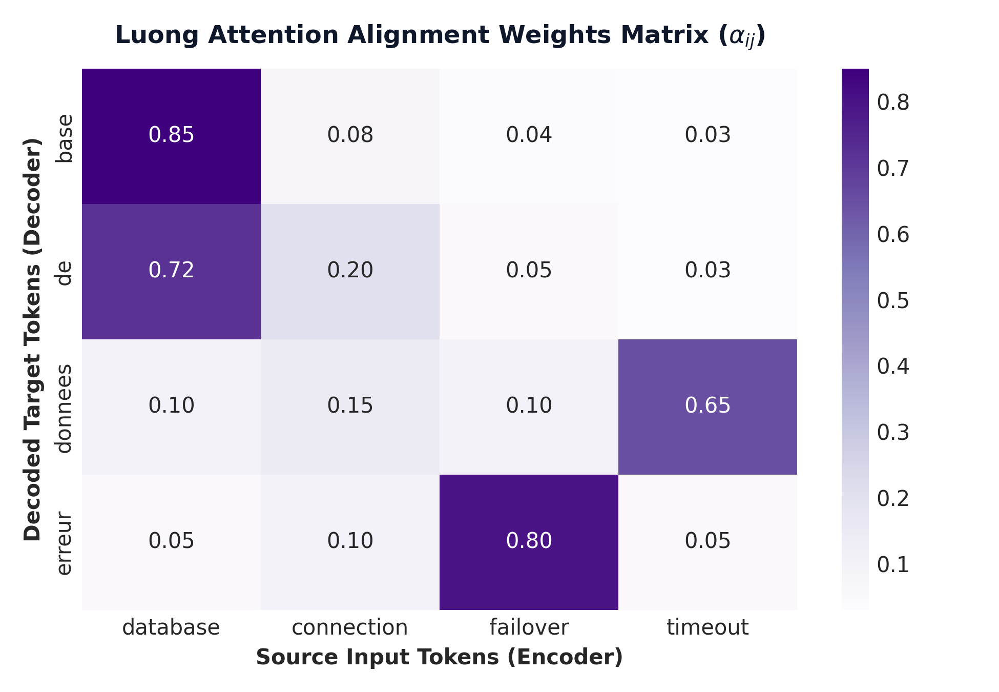

# Module 07: Attention Mechanisms (Bahdanau, Luong & Scaled Dot-Product Attention)

This study guide covers the Seq2Seq bottleneck, Bahdanau vs. Luong attention, Scaled Dot-Product Attention, an explicit mathematical breakdown of why $\sqrt{d_k}$ scaling is required, a 3-token numerical walkthrough, alignment heatmaps, PyTorch code, complexity analysis, and standardized interview Q&A.

> **Notebook Companion**: [07_attention_mechanisms_bahdanau_luong.ipynb](file:///d:/Study/Prep/machine-learning-prep/nlp/07_attention_mechanisms_bahdanau_luong.ipynb)

---

## 1. The Information Bottleneck in Seq2Seq Models

In standard Encoder-Decoder RNNs, the encoder compresses an arbitrary input sequence $X_{1:T}$ into a single static hidden vector $h_T$. For long input sequences ($T > 30$), forcing all semantic context into a fixed-length vector creates an information bottleneck, leading to translation degradation.

**Attention** resolves this bottleneck by allowing the decoder to dynamically query and weight all encoder hidden states $h_1, \dots, h_T$ at every decoding step.

---

## 2. Bahdanau (Additive) vs. Luong (Multiplicative) Attention

```text
Dimension          Bahdanau Attention (Additive)              Luong Attention (Multiplicative)
---------------------------------------------------------------------------------------------------------
Score Function     $e_{ij} = v_a^\top \tanh(W_a s_{i-1} + W_b h_j)$  $e_{ij} = s_i^\top W_a h_j$
Decoder State      Uses previous decoder state $s_{i-1}$      Uses current decoder state $s_i$
Computation        Slower (requires matrix addition & tanh)   Faster (matrix multiplication optimized for GPUs)
Alignment Vector   Concatenated before RNN step               Combined after RNN hidden state computation
```

---

## 3. Scaled Dot-Product Attention Formulation

Modern Transformer architectures utilize **Scaled Dot-Product Attention** over Query ($Q$), Key ($K$), and Value ($V$) matrices:

$$\text{Attention}(Q, K, V) = \text{softmax}\left(\frac{QK^\top}{\sqrt{d_k}}\right)V$$

Where:
- $Q \in \mathbb{R}^{T_q \times d_k}$ is the Query matrix.
- $K \in \mathbb{R}^{T_k \times d_k}$ is the Key matrix.
- $V \in \mathbb{R}^{T_k \times d_v}$ is the Value matrix.
- $d_k$ is the Key vector projection dimension.

---

## 4. Why Scaling by $\sqrt{d_k}$ is Required (Crucial Interview Topic)

> **Interview Core Question**: *Why do we divide $QK^\top$ by $\sqrt{d_k}$ in Attention?*

### Mathematical Proof & Intuition:
Suppose Query components $q_i$ and Key components $k_i$ are independent random variables with mean $0$ and variance $1$:

$$\mathbb{E}[q_i] = 0, \quad \text{Var}(q_i) = 1, \quad \mathbb{E}[k_i] = 0, \quad \text{Var}(k_i) = 1$$

Their dot product is the sum of $d_k$ products: $q \cdot k = \sum_{i=1}^{d_k} q_i k_i$.
1. **Expected Value**: $\mathbb{E}[q \cdot k] = \sum_{i=1}^{d_k} \mathbb{E}[q_i k_i] = 0$
2. **Variance**: Since variables are independent, variances add up:
   $$\text{Var}(q \cdot k) = \sum_{i=1}^{d_k} \text{Var}(q_i k_i) = \sum_{i=1}^{d_k} 1 = d_k$$

### The Softmax Saturation Problem:
As dimension $d_k$ grows large (e.g. $d_k = 64$ or $512$), the magnitude of dot products $|q \cdot k|$ grows to $\sqrt{d_k} \approx 8 - 22$.

When inputs to the Softmax function become extremely large, Softmax outputs saturate into extremely sharp peak distributions ($\approx 1.0$ for the max, $\approx 0.0$ for all others). In these saturated regions, Softmax gradients become virtually zero ($\text{softmax}'(z) \rightarrow 0$), causing **vanishing gradients during backpropagation**.

Dividing by $\sqrt{d_k}$ scales variance back to $1.0$:

$$\text{Var}\left( \frac{q \cdot k}{\sqrt{d_k}} \right) = \frac{\text{Var}(q \cdot k)}{d_k} = \frac{d_k}{d_k} = 1.0$$

This keeps Softmax inputs in a well-behaved range where gradients flow cleanly.

---

## 5. Step-by-Step 3-Token Numerical Walkthrough

Consider a 3-token sequence ($T=3$) with projection dimension $d_k = 2 \implies \sqrt{d_k} = \sqrt{2} \approx 1.4142$.

### Given Input Matrices ($Q, K \in \mathbb{R}^{3 \times 2}, V \in \mathbb{R}^{3 \times 2}$):
$$Q = \begin{bmatrix} 1 & 0 \\ 0 & 1 \\ 1 & 1 \end{bmatrix}, \quad K = \begin{bmatrix} 1 & 0 \\ 1 & 1 \\ 0 & 1 \end{bmatrix}, \quad V = \begin{bmatrix} 2 & 1 \\ 0 & 2 \\ 1 & 0 \end{bmatrix}$$

### Step 1: Compute Raw Dot Product Matrix $QK^\top$
$$QK^\top = \begin{bmatrix} 1 & 0 \\ 0 & 1 \\ 1 & 1 \end{bmatrix} \begin{bmatrix} 1 & 1 & 0 \\ 0 & 1 & 1 \end{bmatrix} = \begin{bmatrix} (1\cdot 1+0) & (1\cdot 1+0) & (0+0) \\ (0+0) & (0+1) & (0+1) \\ (1\cdot 1+0) & (1\cdot 1+1\cdot 1) & (0+1\cdot 1) \end{bmatrix} = \begin{bmatrix} 1 & 1 & 0 \\ 0 & 1 & 1 \\ 1 & 2 & 1 \end{bmatrix}$$

### Step 2: Scale by $\frac{1}{\sqrt{2}} \approx 0.7071$
$$S = \frac{QK^\top}{\sqrt{2}} = \begin{bmatrix} 0.7071 & 0.7071 & 0.0000 \\ 0.0000 & 0.7071 & 0.7071 \\ 0.7071 & 1.4142 & 0.7071 \end{bmatrix}$$

### Step 3: Compute Row-wise Softmax Probabilities ($\alpha = \text{softmax}(S)$)
- **Row 1**: Exponents: $[e^{0.7071}, e^{0.7071}, e^0] = [2.0281, 2.0281, 1.0000]$, Sum $= 5.0562$
  $$\alpha_1 = \left[ \frac{2.0281}{5.0562}, \frac{2.0281}{5.0562}, \frac{1.0000}{5.0562} \right] = \mathbf{[0.4011, 0.4011, 0.1978]}$$

- **Row 2**: Exponents: $[e^0, e^{0.7071}, e^{0.7071}] = [1.0000, 2.0281, 2.0281]$, Sum $= 5.0562$
  $$\alpha_2 = \mathbf{[0.1978, 0.4011, 0.4011]}$$

- **Row 3**: Exponents: $[e^{0.7071}, e^{1.4142}, e^{0.7071}] = [2.0281, 4.1132, 2.0281]$, Sum $= 8.1694$
  $$\alpha_3 = \left[ \frac{2.0281}{8.1694}, \frac{4.1132}{8.1694}, \frac{2.0281}{8.1694} \right] = \mathbf{[0.2483, 0.5035, 0.2483]}$$

$$\alpha = \begin{bmatrix} 0.4011 & 0.4011 & 0.1978 \\ 0.1978 & 0.4011 & 0.4011 \\ 0.2483 & 0.5035 & 0.2483 \end{bmatrix}$$

### Step 4: Multiply by Value Matrix $V$ ($O = \alpha V$)
- **Row 1 Output**:
  $$O_1 = 0.4011 \begin{bmatrix} 2 & 1 \end{bmatrix} + 0.4011 \begin{bmatrix} 0 & 2 \end{bmatrix} + 0.1978 \begin{bmatrix} 1 & 0 \end{bmatrix}$$
  $$O_1 = \begin{bmatrix} (0.8022 + 0 + 0.1978), & (0.4011 + 0.8022 + 0) \end{bmatrix} = \mathbf{\begin{bmatrix} 1.0000 & 1.2033 \end{bmatrix}}$$

---

## 6. Luong Attention Alignment Heatmap



> **Plot Interpretation & Production Insight**:
> - **Alignment Weights**: High attention values along diagonal tokens show dynamic focus allocation across tokens.

---

## 7. Production PyTorch Scaled Dot-Product Attention Code

```python
import torch
import torch.nn.functional as F

# Query, Key, Value Tensors: Batch size 1, 3 Tokens, Dimension 2
Q = torch.tensor([[[1.0, 0.0], [0.0, 1.0], [1.0, 1.0]]])
K = torch.tensor([[[1.0, 0.0], [1.0, 1.0], [0.0, 1.0]]])
V = torch.tensor([[[2.0, 1.0], [0.0, 2.0], [1.0, 0.0]]])

# Execute PyTorch optimized Scaled Dot-Product Attention
output = F.scaled_dot_product_attention(Q, K, V)

print("=== PyTorch Scaled Dot-Product Attention Output ===")
print("Output Matrix (Shape: 1x3x2):\n", output.numpy().round(4))
```

---

## 8. Interview Questions & Production Trade-offs

### What problem does Attention solve over standard Encoder-Decoder RNNs?
Standard Encoder-Decoder RNNs force all source tokens into a single static hidden vector $h_T$, creating a severe information bottleneck. Attention allows the decoder to dynamically inspect and weight all source token hidden states at every step.

### Why is scaling by $\sqrt{d_k}$ required?
Without $\sqrt{d_k}$ scaling, large projection dimensions $d_k$ cause dot products $q \cdot k$ to have high variance $d_k$. Large dot products push the Softmax function into saturated regions with near-zero gradients ($\text{softmax}'(z) \rightarrow 0$), causing vanishing gradients during backpropagation.

### What are the primary limitations of Self-Attention?
Quadratic Time & Memory Complexity $O(T^2)$ over sequence length $T$, making vanilla self-attention expensive for long contexts ($T > 8,000$).

### Computational Complexity:
- **Time Complexity**: $O(T^2 \cdot d)$ matrix multiplication over sequence length $T$.
- **Memory Complexity**: $O(T^2)$ for storing $T \times T$ attention matrix weights in RAM.

### Production Use Cases:
- Core building block of Transformer LLMs (GPT-4, Llama 3, Claude 3).
- Cross-attention in RAG contextual retrieval decoders.

### Follow-up Interview Questions:
1. *What is the difference between Self-Attention and Cross-Attention?* (Answer: In Self-Attention, $Q, K, V$ stem from the same sequence. In Cross-Attention, $Q$ comes from the decoder, while $K, V$ come from the encoder).
2. *How does Multi-Head Attention improve representation capacity?* (Answer: It splits $d$ into $h$ heads, allowing the model to attend to different representation subspaces simultaneously, such as syntactic relations in head 1 and positional offsets in head 2).
