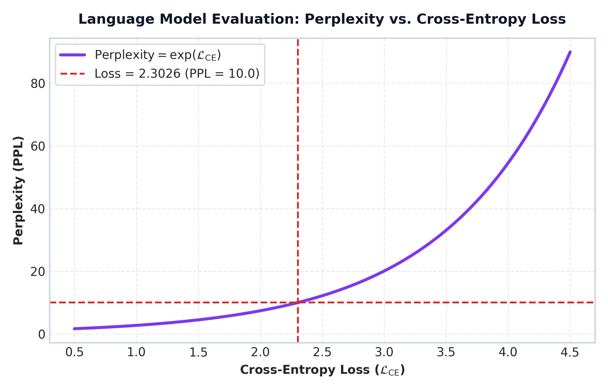

# Module 08: NLP Evaluation Metrics (BLEU, ROUGE & Perplexity)

This study guide covers BLEU (modified precision & brevity penalty), ROUGE-1 and ROUGE-L, Perplexity ($\text{PPL} = \exp(\mathcal{L})$), step-by-step numerical walkthroughs, metric plots, NLTK/Rouge-Score Python code, complexity analysis, and standardized interview Q&A.

> **Notebook Companion**: [08_nlp_evaluation_metrics_bleu_rouge.ipynb](file:///d:/Study/Prep/machine-learning-prep/nlp/08_nlp_evaluation_metrics_bleu_rouge.ipynb)

---

## 1. Overview of Generation Evaluation Metrics

Evaluating machine translation, summarization, and LLM text generation requires automated metrics that compare candidate generation $c$ against reference text $r$:

| Metric | Primary Orientation | Core Objective Equation | Key Focus Area |
|---|---|---|---|
| **BLEU** | Precision-Oriented | $\text{BP} \cdot \exp\left(\sum w_n \log p_n\right)$ | Machine Translation fidelity & adequacy |
| **ROUGE-1** | Recall-Oriented | $\frac{\text{Matching Unigrams}}{\text{Ref Unigram Count}}$ | Text Summarization reference coverage |
| **ROUGE-L** | Sequence Order Recall | $\frac{\text{LCS}(c, r)}{\text{Ref Token Length } r}$ | Longest Common Subsequence sentence structure |
| **Perplexity** | Model Uncertainty | $\text{PPL} = \exp(\mathcal{L}_{\text{CE}})$ | Language Model next-token prediction |

---

## 2. BLEU Score (Bilingual Evaluation Understudy)

### Why BLEU is Precision-Oriented:
Standard raw precision counts how many candidate words appear in the reference. If a flawed model outputs repeating high-confidence words (`"the the the the"`), raw precision yields $100\%$ ($4/4$).

BLEU introduces **Modified N-Gram Precision ($p_n$)**, which clips each candidate n-gram count to the maximum frequency it appears in any reference sentence.

### Brevity Penalty (BP):
To prevent candidate sentences from cheating by outputting extremely short high-precision phrases (e.g. `"the cat"`), BLEU multiplies precision by a **Brevity Penalty**:

$$\text{BP} = \begin{cases} 1 & \text{if } c > r \\ \exp\left(1 - \frac{r}{c}\right) & \text{if } c \le r \end{cases}$$

Where $c$ is candidate word length and $r$ is reference word length.

### BLEU-2 Formula:
$$\text{BLEU-2} = \text{BP} \cdot \exp\left(0.5 \log p_1 + 0.5 \log p_2\right)$$

### Common Limitations of BLEU:
- **Surface-Form Exact Match Rigidity**: Penalizes valid synonyms, morphological variations, and paraphrases (e.g. `"quick"` vs `"fast"` gets zero match).
- **Insensitive to Word Order Shifts**: Does not measure long-range semantic coherence.

---

## 3. Step-by-Step BLEU-2 Numerical Walkthrough

- **Candidate ($c=5$ words)**: `"the cat sat on mat"`
- **Reference ($r=6$ words)**: `"the cat sat on the mat"`

### Step 1: Compute Modified Unigram Precision ($p_1$)
- Candidate Unigrams ($c=5$): `["the", "cat", "sat", "on", "mat"]`
- Reference Unigram Counts: `the`: 2, `cat`: 1, `sat`: 1, `on`: 1, `mat`: 1
- All 5 candidate unigrams match reference counts $\implies \text{Clipped Count} = 5$.
$$p_1 = \frac{5}{5} = \mathbf{1.0000}$$

### Step 2: Compute Modified Bigram Precision ($p_2$)
- Candidate Bigrams ($c-1 = 4$): `["the cat", "cat sat", "sat on", "on mat"]`
- Reference Bigrams: `["the cat", "cat sat", "sat on", "on the", "the mat"]`
- Matching Bigrams: `"the cat"`, `"cat sat"`, `"sat on"` (3 matches).
$$p_2 = \frac{3}{4} = \mathbf{0.7500}$$

### Step 3: Compute Brevity Penalty (BP)
Since candidate length $c = 5 < r = 6$:
$$\text{BP} = \exp\left(1 - \frac{6}{5}\right) = \exp(-0.20) \approx \mathbf{0.8187}$$

### Step 4: Compute Final BLEU-2 Score
$$\text{BLEU-2} = 0.8187 \times \exp(0.5 \log 1.0 + 0.5 \log 0.7500)$$
$$\log 1.0 = 0, \quad \log 0.7500 \approx -0.2877$$
$$\text{BLEU-2} = 0.8187 \times \exp(-0.1438) = 0.8187 \times 0.8660 = \mathbf{0.7090}$$

---

## 4. ROUGE Metrics (ROUGE-1 & ROUGE-L)

### ROUGE-1 (Unigram Recall):
$$\text{ROUGE-1 Recall} = \frac{\text{Matching Unigrams}}{\text{Total Reference Unigrams}}$$

### ROUGE-L (Longest Common Subsequence):
$$\text{ROUGE-L Recall} = \frac{\text{LCS}(c, r)}{r}$$

Where $\text{LCS}(c, r)$ is the length of the longest common subsequence of tokens between candidate and reference.

### Step-by-Step ROUGE Numerical Walkthrough:
- Candidate: `"the cat sat on mat"` (5 words)
- Reference: `"the cat sat on the mat"` (6 words)

1. **ROUGE-1 Recall**:
   Matching unigrams = 5, Total reference unigrams = 6.
   $$\text{ROUGE-1 Recall} = \frac{5}{6} \approx \mathbf{0.8333}$$

2. **ROUGE-L Recall**:
   Longest Common Subsequence: `"the" -> "cat" -> "sat" -> "on" -> "mat"` (length = 5).
   $$\text{ROUGE-L Recall} = \frac{5}{6} \approx \mathbf{0.8333}$$

---

## 5. Perplexity (PPL)

Perplexity measures a language model's uncertainty when predicting the next token in a sequence $W = (w_1, w_2, \dots, w_N)$:

$$\text{PPL}(W) = \exp(\mathcal{L}_{\text{CrossEntropy}}) = \exp\left( -\frac{1}{N} \sum_{i=1}^N \log P(w_i \mid w_{<i}) \right)$$

> **Core Interpretation**: **Lower Perplexity $\implies$ Better Language Model**. A perplexity of $\text{PPL} = 10.0$ means the model is as uncertain at each token choice as if it were selecting uniformly at random from 10 candidate words.

### Step-by-Step PPL Calculation:
If an evaluation run yields Cross-Entropy Loss $\mathcal{L}_{\text{CE}} = 2.3026$:
$$\text{PPL} = \exp(2.3026) = \mathbf{10.0}$$

---

## 6. Perplexity vs. Cross-Entropy Loss Curve



> **Plot Interpretation & Production Insight**:
> - Exponential mapping: As evaluation loss decreases linearly, perplexity drops exponentially, providing a clear benchmark metric during LLM pre-training and fine-tuning.

---

## 7. Production Python NLTK & ROUGE Evaluation Code

```python
from nltk.translate.bleu_score import sentence_bleu, SmoothingFunction
from rouge_score import rouge_scorer

candidate = "the cat sat on mat"
reference = "the cat sat on the mat"

# BLEU Evaluation
weights = (0.5, 0.5)  # BLEU-2
bleu_2 = sentence_bleu([reference.split()], candidate.split(), weights=weights)

# ROUGE Evaluation
scorer = rouge_scorer.RougeScorer(['rouge1', 'rougeL'], use_stemmer=True)
rouge_scores = scorer.score(reference, candidate)

print(f"BLEU-2 Score: {bleu_2:.4f}")
print(f"ROUGE-1 Recall: {rouge_scores['rouge1'].recall:.4f}")
print(f"ROUGE-L Recall: {rouge_scores['rougeL'].recall:.4f}")
```

---

## 8. Interview Questions & Production Trade-offs

### What problem do BLEU, ROUGE, and Perplexity solve?
Provide automated, reproducible quantitative benchmarks for text generation without relying on expensive human annotations.

### Why is BLEU precision-oriented while ROUGE is recall-oriented?
BLEU checks what fraction of generated candidate n-grams are valid (preventing hallucinated ungrounded text in translation), whereas ROUGE checks what fraction of reference target information was captured in the summary (preventing key detail omission).

### What are their primary limitations?
Surface-form exact match rigidity. They penalize valid paraphrases and modern conversational outputs. In GenAI production pipelines, **LLM-as-a-Judge** (using GPT-4 / G-Eval to evaluate response quality) is heavily preferred over BLEU/ROUGE.

### Detailed Computational Complexity (Time & Memory)
- **BLEU Evaluation Time**: $O(N_{max} \cdot |c| \cdot |r|)$
- **ROUGE-L LCS Dynamic Programming Time**: $O(|c| \cdot |r|)$
- **Perplexity Evaluation Time**: $O(T \cdot d^2)$
- **Memory Footprint Complexity**: $O(|c| \cdot |r|)$ for ROUGE-L table, $O(|c| + |r|)$ for BLEU n-grams
- **Component Denotations**:
  - $|c|$: Token length of the generated candidate sequence.
  - $|r|$: Token length of the reference sequence.
  - $N_{max}$: Maximum n-gram order evaluated (typically $N_{max}=4$ for BLEU-4).
  - $T$: Evaluation sequence token length.
  - $d$: Language model vocabulary projection dimension.

### Production Use Cases:
- Automated regression testing during LLM fine-tuning runs (e.g. LoRA / QLoRA checkpoints).
- Translation engine quality assurance benchmarking.

### Follow-up Interview Questions:
1. *Why does lower perplexity guarantee better model probability estimation but NOT guaranteed fluent text generation?* (Answer: Perplexity measures next-token probability fit on validation data, but greedy or temperature decoding strategies can still suffer from repetitive loops during generation).
2. *What is G-Eval / LLM-as-a-Judge?* (Answer: A evaluation framework where an advanced LLM evaluates generated responses against rubrics like factual accuracy, relevance, and toxicity).
