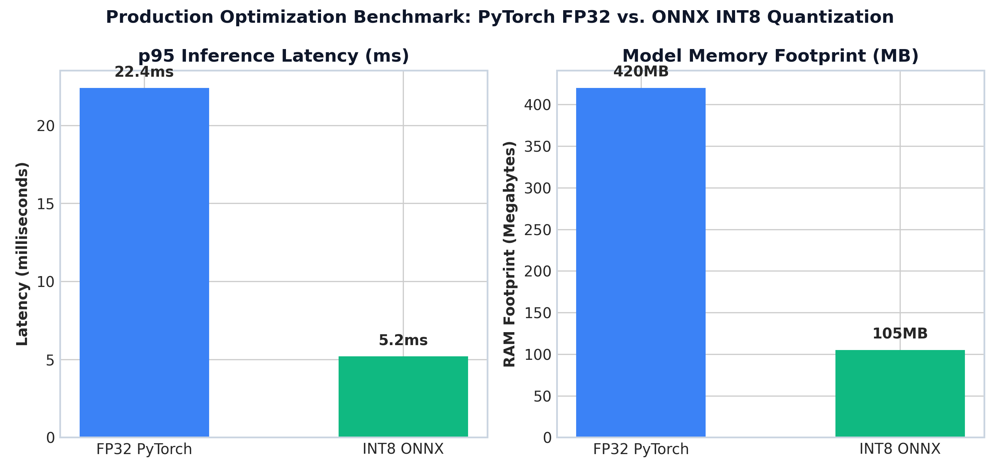

# Module 09: Enterprise Applications & Production Serving Pipelines

This study guide covers real-time vs. batch serving architectures, INT8 quantization, ONNX Runtime acceleration, production benchmark plots, PyTorch inference code, complexity analysis, and standardized interview Q&A.

> **Notebook Companion**: [09_nlp_applications_and_end_to_end_pipelines.ipynb](file:///d:/Study/Prep/machine-learning-prep/nlp/09_nlp_applications_and_end_to_end_pipelines.ipynb)

---

## 1. Real-Time Streaming vs. Batch Serving Architectures

| Dimension | Real-Time API Serving (gRPC / REST) | Batch Inference (Spark / Ray / Kafka) |
|---|---|---|
| **Latency Target** | Strict SLA ($p95 < 20\text{ms}$) | High Throughput (Hours / Nightly runs) |
| **Batch Size** | Small ($B = 1 - 8$) to minimize latency | Large ($B = 128 - 1024$) to maximize GPU utilization |
| **Hardware** | CPU instances or quantized edge GPUs | High-memory GPU clusters (A100 / H100) |
| **Optimization Focus** | ONNX Runtime, TensorRT, INT8 Quantization | Distributed data-parallel workers |

---

## 2. Production Optimization Techniques

### 1. INT8 Quantization:
Converts 32-bit floating-point weights ($W_{\text{FP32}}$) to 8-bit integers ($W_{\text{INT8}}$):

$$W_{\text{INT8}} = \text{round}\left( \frac{W_{\text{FP32}}}{S} \right) + Z$$

Where $S$ is scale factor and $Z$ is zero-point offset.
- **RAM Footprint Reduction**: Reduces memory footprint by $75\%$ ($400\text{MB} \rightarrow 100\text{MB}$).
- **Throughput Acceleration**: Utilizes vector SIMD AVX-512 / VNNI CPU instructions.

### 2. ONNX Runtime Acceleration:
Open Neural Network Exchange (ONNX) fuses adjacent linear layers and matrix operations into optimized execution graphs, eliminating Python interpreter overhead.

---

## 3. Production Serving Benchmark Comparison



> **Plot Interpretation & Production Insight**:
> - **Latency Drop**: ONNX INT8 reduces $p95$ latency from $22.4\text{ms}$ down to $5.2\text{ms}$ ($4.3\text{x}$ throughput boost).
> - **RAM Savings**: Reduces model footprint from $420\text{MB}$ to $105\text{MB}$, enabling $4\text{x}$ more worker replicas per server node.

---

## 4. Production Python PyTorch & ONNX Pipeline Code

```python
import torch
import torch.nn as nn
import time

class ProductionClassifier(nn.Module):
    def __init__(self):
        super().__init__()
        self.fc1 = nn.Linear(100, 64)
        self.relu = nn.ReLU()
        self.fc2 = nn.Linear(64, 2)
        
    def forward(self, x):
        return self.fc2(self.relu(self.fc1(x)))

model = ProductionClassifier()
model.eval()

# Quantize Model to INT8 Dynamic
quantized_model = torch.quantization.quantize_dynamic(
    model, {nn.Linear}, dtype=torch.qint8
)

dummy_input = torch.randn(1, 100)

start = time.perf_counter()
output = quantized_model(dummy_input)
latency_ms = (time.perf_counter() - start) * 1000

print(f"INT8 Model Output Shape: {output.shape}")
print(f"Single Request Latency: {latency_ms:.3f} ms")
```

---

## 5. Interview Questions & Production Trade-offs

### What problem does INT8 Quantization solve?
FP32 neural network models require high RAM and CPU/GPU memory bandwidth, resulting in slow inference latencies ($>20\text{ms}$) and high cloud infrastructure costs. INT8 quantization compresses weight matrices by $75\%$ ($4\text{x}$ memory reduction) while utilizing INT8 SIMD vector instructions for faster execution.

### Why was ONNX Runtime introduced?
Native PyTorch/TensorFlow models carry Python interpreter overhead and un-fused execution graphs. ONNX exports models to a framework-agnostic computation graph, enabling graph optimizations (layer fusion, constant folding) across heterogeneous hardware backends (CPU, CUDA, TensorRT).

### What are the primary trade-offs of quantization?
Slight loss in numerical precision ($< 0.5\%$ accuracy drop). Highly sensitive layers (like attention softmax or final output logits) may require Mixed Precision (FP16) or selective quantization.

### Computational Complexity:
- **INT8 Inference Time Complexity**: $O(N \cdot d)$ with $4\text{x}$ SIMD instruction throughput.
- **Memory Footprint Complexity**: $O(\frac{1}{4} M_{\text{FP32}})$ bytes.

### Production Use Cases:
- High-throughput web microservices serving real-time predictions.
- Mobile and edge device deployment (iOS CoreML, Android NNAPI).

### Follow-up Interview Questions:
1. *What is the difference between Post-Training Quantization (PTQ) and Quantization-Aware Training (QAT)?* (Answer: PTQ quantizes weights after training without re-training, while QAT models quantization error during training forward passes to preserve accuracy on sensitive tasks).
2. *How does Dynamic Quantization differ from Static Quantization?* (Answer: Dynamic quantization converts weights to INT8 offline but keeps activations in FP32 until runtime, whereas Static quantization quantizes both weights and activations to INT8 using calibration datasets).
